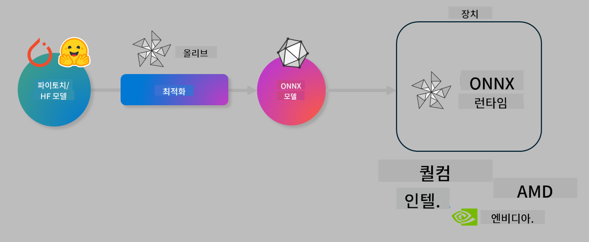

<!--
CO_OP_TRANSLATOR_METADATA:
{
  "original_hash": "6bbe47de3b974df7eea29dfeccf6032b",
  "translation_date": "2025-05-08T06:40:47+00:00",
  "source_file": "code/03.Finetuning/olive-lab/readme.md",
  "language_code": "ko"
}
-->
# Lab. 온디바이스 추론을 위한 AI 모델 최적화

## 소개

> [!IMPORTANT]  
> 이 랩에서는 **Nvidia A10 또는 A100 GPU**와 해당 드라이버 및 CUDA 툴킷(버전 12 이상)이 필요합니다.

> [!NOTE]  
> 이 랩은 **35분** 동안 진행되며 OLIVE를 사용하여 온디바이스 추론을 위한 모델 최적화의 핵심 개념을 직접 체험할 수 있습니다.

## 학습 목표

이 랩을 완료하면 OLIVE를 사용하여 다음을 수행할 수 있습니다:

- AWQ 양자화 방식을 사용해 AI 모델을 양자화합니다.  
- 특정 작업에 맞게 AI 모델을 미세 조정합니다.  
- ONNX Runtime에서 효율적인 온디바이스 추론을 위해 LoRA 어댑터(미세 조정된 모델)를 생성합니다.

### Olive란 무엇인가

Olive(*O*NNX *live*)는 CLI와 함께 제공되는 모델 최적화 툴킷으로, ONNX runtime +++https://onnxruntime.ai+++용 모델을 품질과 성능을 갖춰 배포할 수 있게 합니다.



Olive에 입력되는 모델은 주로 PyTorch 또는 Hugging Face 모델이며, 출력은 ONNX runtime이 실행되는 디바이스(배포 대상)에서 실행되는 최적화된 ONNX 모델입니다. Olive는 Qualcomm, AMD, Nvidia, Intel과 같은 하드웨어 벤더가 제공하는 AI 가속기(NPU, GPU, CPU)에 맞춰 모델을 최적화합니다.

Olive는 *workflow*를 실행하는데, 이는 *passes*라고 불리는 개별 모델 최적화 작업의 순차적 집합입니다. 예를 들어 모델 압축, 그래프 캡처, 양자화, 그래프 최적화 등이 있습니다. 각 pass는 정확도와 지연 시간 같은 평가 지표를 최적화하기 위한 파라미터 세트를 가지고 있습니다. Olive는 탐색 알고리즘을 사용해 각 pass를 하나씩 또는 여러 개를 동시에 자동으로 튜닝하는 탐색 전략을 적용합니다.

#### Olive의 장점

- 그래프 최적화, 압축, 양자화 등 다양한 기법을 수작업으로 시도하는 데서 오는 좌절감과 시간을 줄여줍니다. 품질과 성능 제약 조건을 정의하면 Olive가 최적의 모델을 자동으로 찾아줍니다.  
- 양자화, 압축, 그래프 최적화, 미세 조정 등 최첨단 기술을 아우르는 **40개 이상의 내장 모델 최적화 컴포넌트** 제공.  
- 일반적인 모델 최적화 작업을 위한 **간편한 CLI** 지원 (예: olive quantize, olive auto-opt, olive finetune).  
- 모델 패키징 및 배포 기능 내장.  
- **Multi LoRA 서빙**용 모델 생성 지원.  
- YAML/JSON을 사용해 모델 최적화 및 배포 작업을 조율하는 워크플로우 구성 가능.  
- **Hugging Face** 및 **Azure AI** 연동.  
- 비용 절감을 위한 내장 **캐싱** 메커니즘.

## 랩 지침  
> [!NOTE]  
> Azure AI Hub 및 프로젝트를 준비하고 Lab 1에 따라 A100 컴퓨트 설정을 완료했는지 확인하세요.

### 0단계: Azure AI 컴퓨트에 연결하기

**VS Code**의 원격 기능을 사용해 Azure AI 컴퓨트에 연결합니다.

1. **VS Code** 데스크톱 앱을 엽니다.  
2. **Shift+Ctrl+P**로 커맨드 팔레트를 엽니다.  
3. 커맨드 팔레트에서 **AzureML - remote: Connect to compute instance in New Window**를 검색합니다.  
4. 화면 안내에 따라 Azure 구독, 리소스 그룹, 프로젝트, Lab 1에서 설정한 컴퓨트 이름을 선택해 연결합니다.  
5. 연결되면 VS Code 왼쪽 하단에 연결된 Azure ML 컴퓨트 노드가 표시됩니다. `><Azure ML: Compute Name`

### 1단계: 저장소 클론하기

VS Code에서 **Ctrl+J**로 새 터미널을 열고 다음 명령어로 저장소를 클론합니다:

터미널에 다음 프롬프트가 표시됩니다:

```
azureuser@computername:~/cloudfiles/code$ 
```  
솔루션 클론

```bash
cd ~/localfiles
git clone https://github.com/microsoft/phi-3cookbook.git
```

### 2단계: VS Code에서 폴더 열기

터미널에서 다음 명령어를 실행하면 새 창으로 해당 폴더가 열립니다:

```bash
code phi-3cookbook/code/04.Finetuning/Olive-lab
```

또는 **파일** > **폴더 열기**를 선택해 폴더를 열 수 있습니다.

### 3단계: 의존성 설치

Azure AI 컴퓨트 인스턴스 내 VS Code 터미널(팁: **Ctrl+J**)에서 다음 명령어를 실행해 의존성을 설치하세요:

```bash
conda create -n olive-ai python=3.11 -y
conda activate olive-ai
pip install -r requirements.txt
az extension remove -n azure-cli-ml
az extension add -n ml
```

> [!NOTE]  
> 모든 의존성 설치에는 약 5분 정도 소요됩니다.

이 랩에서는 Azure AI 모델 카탈로그에 모델을 다운로드하고 업로드합니다. 모델 카탈로그에 접근하려면 다음 명령어로 Azure에 로그인해야 합니다:

```bash
az login
```

> [!NOTE]  
> 로그인 시 구독을 선택하라는 메시지가 표시됩니다. 이 랩에 제공된 구독을 선택했는지 확인하세요.

### 4단계: Olive 명령어 실행하기

Azure AI 컴퓨트 인스턴스 내 VS Code 터미널(팁: **Ctrl+J**)에서 `olive-ai` conda 환경이 활성화되어 있는지 확인합니다:

```bash
conda activate olive-ai
```

다음으로 명령줄에서 Olive 명령어를 실행합니다.

1. **데이터 확인:** 이 예제에서는 Phi-3.5-Mini 모델을 여행 관련 질문에 특화되도록 미세 조정할 예정입니다. 아래 코드는 JSON lines 형식의 데이터셋 처음 몇 개 레코드를 보여줍니다:

    ```bash
    head data/data_sample_travel.jsonl
    ```

2. **모델 양자화:** 모델 훈련 전에 AWQ(Active Aware Quantization) +++https://arxiv.org/abs/2306.00978+++ 기법을 사용해 다음 명령어로 양자화를 수행합니다. AWQ는 추론 중 생성되는 활성화 값을 고려해 모델 가중치를 양자화합니다. 이는 전통적인 가중치 양자화보다 실제 데이터 분포를 반영해 모델 정확도 손실을 줄여줍니다.

    ```bash
    olive quantize \
       --model_name_or_path microsoft/Phi-3.5-mini-instruct \
       --trust_remote_code \
       --algorithm awq \
       --output_path models/phi/awq \
       --log_level 1
    ```

    AWQ 양자화는 **약 8분** 걸리며, 모델 크기를 약 **7.5GB에서 2.5GB로 줄여줍니다**.

   이 랩에서는 Hugging Face에서 모델을 입력하는 방법을 보여줍니다 (예: `microsoft/Phi-3.5-mini-instruct`). However, Olive also allows you to input models from the Azure AI catalog by updating the `model_name_or_path` argument to an Azure AI asset ID (for example:  `azureml://registries/azureml/models/Phi-3.5-mini-instruct/versions/4`). 

1. **Train the model:** Next, the `olive finetune` 명령어는 양자화된 모델을 미세 조정합니다). 양자화 후 미세 조정하는 대신 미세 조정 전에 양자화하는 것이 더 나은 정확도를 제공합니다. 미세 조정 과정에서 양자화로 인한 손실 일부를 회복하기 때문입니다.

    ```bash
    olive finetune \
        --method lora \
        --model_name_or_path models/phi/awq \
        --data_files "data/data_sample_travel.jsonl" \
        --data_name "json" \
        --text_template "<|user|>\n{prompt}<|end|>\n<|assistant|>\n{response}<|end|>" \
        --max_steps 100 \
        --output_path ./models/phi/ft \
        --log_level 1
    ```

    미세 조정(100 스텝)은 **약 6분** 걸립니다.

3. **최적화:** 모델 훈련 후 Olive의 `auto-opt` command, which will capture the ONNX graph and automatically perform a number of optimizations to improve the model performance for CPU by compressing the model and doing fusions. It should be noted, that you can also optimize for other devices such as NPU or GPU by just updating the `--device` and `--provider` 인자를 사용해 모델을 최적화합니다. 이 랩에서는 CPU를 사용합니다.

    ```bash
    olive auto-opt \
       --model_name_or_path models/phi/ft/model \
       --adapter_path models/phi/ft/adapter \
       --device cpu \
       --provider CPUExecutionProvider \
       --use_ort_genai \
       --output_path models/phi/onnx-ao \
       --log_level 1
    ```

    최적화 완료까지 **약 5분** 소요됩니다.

### 5단계: 모델 추론 빠른 테스트

모델 추론을 테스트하려면 폴더에 **app.py**라는 파이썬 파일을 만들고 아래 코드를 복사해 붙여넣으세요:

```python
import onnxruntime_genai as og
import numpy as np

print("loading model and adapters...", end="", flush=True)
model = og.Model("models/phi/onnx-ao/model")
adapters = og.Adapters(model)
adapters.load("models/phi/onnx-ao/model/adapter_weights.onnx_adapter", "travel")
print("DONE!")

tokenizer = og.Tokenizer(model)
tokenizer_stream = tokenizer.create_stream()

params = og.GeneratorParams(model)
params.set_search_options(max_length=100, past_present_share_buffer=False)
user_input = "what is the best thing to see in chicago"
params.input_ids = tokenizer.encode(f"<|user|>\n{user_input}<|end|>\n<|assistant|>\n")

generator = og.Generator(model, params)

generator.set_active_adapter(adapters, "travel")

print(f"{user_input}")

while not generator.is_done():
    generator.compute_logits()
    generator.generate_next_token()

    new_token = generator.get_next_tokens()[0]
    print(tokenizer_stream.decode(new_token), end='', flush=True)

print("\n")
```

다음 명령어로 코드를 실행합니다:

```bash
python app.py
```

### 6단계: 모델을 Azure AI에 업로드

모델을 Azure AI 모델 저장소에 업로드하면 개발팀 내 다른 멤버와 모델을 공유할 수 있고 버전 관리도 할 수 있습니다. 모델을 업로드하려면 다음 명령어를 실행하세요:

> [!NOTE]  
> `{}` placeholders with the name of your resource group and Azure AI Project Name. 

To find your resource group `` 부분에 리소스 그룹과 Azure AI 프로젝트 이름을 업데이트한 후 명령어를 실행하세요.

```
az ml workspace show
```

또는 +++ai.azure.com+++에 접속해 **관리 센터** > **프로젝트** > **개요**를 선택할 수도 있습니다.

`{}` 플레이스홀더를 리소스 그룹 이름과 Azure AI 프로젝트 이름으로 바꾸세요.

```bash
az ml model create \
    --name ft-for-travel \
    --version 1 \
    --path ./models/phi/onnx-ao \
    --resource-group {RESOURCE_GROUP_NAME} \
    --workspace-name {PROJECT_NAME}
```

업로드한 모델은 https://ml.azure.com/model/list 에서 확인하고 배포할 수 있습니다.

**면책 조항**:  
이 문서는 AI 번역 서비스 [Co-op Translator](https://github.com/Azure/co-op-translator)를 사용하여 번역되었습니다. 정확성을 위해 노력하고 있으나, 자동 번역에는 오류나 부정확한 부분이 있을 수 있음을 양지해 주시기 바랍니다. 원본 문서의 원어 버전이 권위 있는 출처로 간주되어야 합니다. 중요한 정보의 경우, 전문적인 인간 번역을 권장합니다. 본 번역 사용으로 인해 발생하는 오해나 잘못된 해석에 대해서는 당사가 책임지지 않습니다.