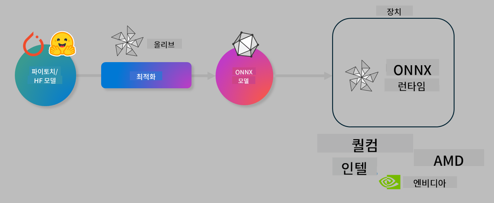

<!--
CO_OP_TRANSLATOR_METADATA:
{
  "original_hash": "6bbe47de3b974df7eea29dfeccf6032b",
  "translation_date": "2025-05-08T06:34:21+00:00",
  "source_file": "code/04.Finetuning/olive-lab/readme.md",
  "language_code": "ko"
}
-->
# Lab. 온디바이스 추론을 위한 AI 모델 최적화

## 소개

> [!IMPORTANT]  
> 이 랩에서는 **Nvidia A10 또는 A100 GPU**와 해당 드라이버 및 CUDA 툴킷(버전 12 이상)이 필요합니다.

> [!NOTE]  
> 이 랩은 **35분** 분량으로 OLIVE를 사용해 온디바이스 추론용 모델 최적화의 핵심 개념을 직접 경험할 수 있습니다.

## 학습 목표

이 랩을 마치면 OLIVE를 사용하여 다음을 할 수 있습니다:

- AWQ 양자화 방법을 사용해 AI 모델 양자화하기  
- 특정 작업에 맞게 AI 모델 미세 조정하기  
- ONNX Runtime에서 효율적인 온디바이스 추론을 위한 LoRA 어댑터(미세 조정된 모델) 생성하기  

### Olive란?

Olive(*O*NNX *live*)는 ONNX 런타임 +++https://onnxruntime.ai+++용 모델을 품질과 성능을 갖춰 배포할 수 있도록 돕는 모델 최적화 툴킷과 CLI입니다.



Olive의 입력은 보통 PyTorch나 Hugging Face 모델이고 출력은 ONNX 런타임이 실행되는 디바이스(배포 대상)에서 실행 가능한 최적화된 ONNX 모델입니다. Olive는 Qualcomm, AMD, Nvidia, Intel 등 하드웨어 벤더가 제공하는 AI 가속기(NPU, GPU, CPU)에 맞게 모델을 최적화합니다.

Olive는 *워크플로우*라 불리는 순서화된 모델 최적화 작업 시퀀스를 실행합니다. 각 작업은 *패스*라 하며, 예로는 모델 압축, 그래프 캡처, 양자화, 그래프 최적화 등이 있습니다. 각 패스는 정확도와 지연시간 같은 지표를 평가하는 평가자가 있고, 최적의 결과를 내기 위해 조정 가능한 매개변수를 가집니다. Olive는 검색 알고리즘을 활용해 각 패스를 하나씩 또는 여러 개를 동시에 자동 튜닝하는 검색 전략을 사용합니다.

#### Olive의 장점

- 그래프 최적화, 압축, 양자화 기법을 수동으로 실험하는 데 드는 시간과 번거로움을 줄여줍니다. 품질과 성능 제약 조건을 정의하면 Olive가 자동으로 최적 모델을 찾아줍니다.  
- 양자화, 압축, 그래프 최적화, 미세 조정 분야의 최신 기법을 포함한 **40개 이상의 내장 모델 최적화 컴포넌트** 제공  
- 일반적인 모델 최적화 작업을 위한 **사용하기 쉬운 CLI** (예: olive quantize, olive auto-opt, olive finetune)  
- 모델 패키징과 배포 기능 내장  
- **Multi LoRA 서빙**을 위한 모델 생성 지원  
- YAML/JSON으로 워크플로우를 구성해 모델 최적화 및 배포 작업을 조율 가능  
- **Hugging Face** 및 **Azure AI** 통합  
- 비용 절감을 위한 내장 **캐싱** 메커니즘  

## 랩 안내  
> [!NOTE]  
> Azure AI Hub와 프로젝트를 프로비저닝하고 Lab 1에 따라 A100 컴퓨트를 설정했는지 확인하세요.

### Step 0: Azure AI 컴퓨트에 연결하기

**VS Code**의 원격 기능을 사용해 Azure AI 컴퓨트에 연결합니다.

1. **VS Code** 데스크톱 앱을 엽니다.  
1. **Shift+Ctrl+P**를 눌러 **명령 팔레트**를 엽니다.  
1. 명령 팔레트에서 **AzureML - remote: Connect to compute instance in New Window**를 검색합니다.  
1. 화면 안내에 따라 Azure 구독, 리소스 그룹, 프로젝트, Lab 1에서 설정한 컴퓨트 이름을 선택해 연결합니다.  
1. 연결되면 VS Code 왼쪽 하단에 Azure ML 컴퓨트 노드가 표시됩니다. `><Azure ML: Compute Name`

### Step 1: 이 저장소 클론하기

VS Code에서 **Ctrl+J**로 터미널을 열고 저장소를 클론합니다.

터미널에 다음 프롬프트가 표시됩니다.

```
azureuser@computername:~/cloudfiles/code$ 
```  
솔루션 클론  

```bash
cd ~/localfiles
git clone https://github.com/microsoft/phi-3cookbook.git
```

### Step 2: VS Code에서 폴더 열기

터미널에 다음 명령어를 실행해 새 창에서 폴더를 엽니다:

```bash
code phi-3cookbook/code/04.Finetuning/Olive-lab
```

또는 **File > Open Folder**를 선택해 폴더를 열 수 있습니다.

### Step 3: 의존성 설치

VS Code에서 Azure AI 컴퓨트 인스턴스의 터미널(팁: **Ctrl+J**)을 열고 다음 명령어로 의존성을 설치합니다:

```bash
conda create -n olive-ai python=3.11 -y
conda activate olive-ai
pip install -r requirements.txt
az extension remove -n azure-cli-ml
az extension add -n ml
```

> [!NOTE]  
> 모든 의존성 설치에 약 5분 정도 소요됩니다.

이 랩에서는 모델을 Azure AI 모델 카탈로그에서 다운로드하고 업로드합니다. 모델 카탈로그에 접근하려면 다음 명령어로 Azure에 로그인해야 합니다:

```bash
az login
```

> [!NOTE]  
> 로그인 시 구독을 선택하라는 메시지가 뜹니다. 랩에 제공된 구독을 선택하세요.

### Step 4: Olive 명령어 실행

VS Code에서 Azure AI 컴퓨트 인스턴스 터미널(팁: **Ctrl+J**)을 열고 `olive-ai` conda 환경이 활성화되어 있는지 확인합니다:

```bash
conda activate olive-ai
```

이후 아래 Olive 명령어들을 실행합니다.

1. **데이터 확인:** 이 예제에서는 여행 관련 질문에 특화된 Phi-3.5-Mini 모델을 미세 조정할 예정입니다. 아래 코드는 JSON 라인 형식의 데이터셋 첫 몇 개 레코드를 보여줍니다:

   ```bash
    head data/data_sample_travel.jsonl
    ```

1. **모델 양자화:** 모델을 학습하기 전에 Active Aware Quantization (AWQ) +++https://arxiv.org/abs/2306.00978+++ 기법을 사용해 양자화합니다. AWQ는 추론 중 생성되는 활성화 값을 고려해 가중치를 양자화하기 때문에, 기존 가중치 양자화보다 정확도를 더 잘 유지합니다.

   ```bash
    olive quantize \
       --model_name_or_path microsoft/Phi-3.5-mini-instruct \
       --trust_remote_code \
       --algorithm awq \
       --output_path models/phi/awq \
       --log_level 1
    ```

   AWQ 양자화는 **약 8분** 걸리며, 모델 크기를 약 7.5GB에서 2.5GB로 줄입니다.

   이 랩에서는 Hugging Face에서 모델을 입력하는 방법도 보여줍니다 (예: `microsoft/Phi-3.5-mini-instruct`). However, Olive also allows you to input models from the Azure AI catalog by updating the `model_name_or_path` argument to an Azure AI asset ID (for example:  `azureml://registries/azureml/models/Phi-3.5-mini-instruct/versions/4`). 

1. **Train the model:** Next, the `olive finetune` 명령어는 양자화된 모델을 미세 조정합니다). 양자화 후 미세 조정하는 것보다 미세 조정 전에 양자화하는 것이 더 좋은 정확도를 냅니다. 미세 조정 과정에서 양자화로 인한 손실 일부를 회복하기 때문입니다.

   ```bash
    olive finetune \
        --method lora \
        --model_name_or_path models/phi/awq \
        --data_files "data/data_sample_travel.jsonl" \
        --data_name "json" \
        --text_template "<|user|>\n{prompt}<|end|>\n<|assistant|>\n{response}<|end|>" \
        --max_steps 100 \
        --output_path ./models/phi/ft \
        --log_level 1
    ```

   미세 조정(100 스텝)은 **약 6분** 소요됩니다.

1. **최적화:** 모델 학습이 완료되면 Olive의 `auto-opt` command, which will capture the ONNX graph and automatically perform a number of optimizations to improve the model performance for CPU by compressing the model and doing fusions. It should be noted, that you can also optimize for other devices such as NPU or GPU by just updating the `--device` and `--provider` 인자를 사용해 모델을 최적화합니다. 이 랩에서는 CPU를 사용합니다.

   ```bash
    olive auto-opt \
       --model_name_or_path models/phi/ft/model \
       --adapter_path models/phi/ft/adapter \
       --device cpu \
       --provider CPUExecutionProvider \
       --use_ort_genai \
       --output_path models/phi/onnx-ao \
       --log_level 1
    ```

   최적화는 **약 5분** 걸립니다.

### Step 5: 모델 추론 간단 테스트

모델 추론을 테스트하려면 폴더에 **app.py**라는 파이썬 파일을 만들고 아래 코드를 복사해 붙여넣으세요:

```python
import onnxruntime_genai as og
import numpy as np

print("loading model and adapters...", end="", flush=True)
model = og.Model("models/phi/onnx-ao/model")
adapters = og.Adapters(model)
adapters.load("models/phi/onnx-ao/model/adapter_weights.onnx_adapter", "travel")
print("DONE!")

tokenizer = og.Tokenizer(model)
tokenizer_stream = tokenizer.create_stream()

params = og.GeneratorParams(model)
params.set_search_options(max_length=100, past_present_share_buffer=False)
user_input = "what is the best thing to see in chicago"
params.input_ids = tokenizer.encode(f"<|user|>\n{user_input}<|end|>\n<|assistant|>\n")

generator = og.Generator(model, params)

generator.set_active_adapter(adapters, "travel")

print(f"{user_input}")

while not generator.is_done():
    generator.compute_logits()
    generator.generate_next_token()

    new_token = generator.get_next_tokens()[0]
    print(tokenizer_stream.decode(new_token), end='', flush=True)

print("\n")
```

다음 명령어로 코드를 실행합니다:

```bash
python app.py
```

### Step 6: 모델을 Azure AI에 업로드

모델을 Azure AI 모델 저장소에 업로드하면 개발팀 내 다른 멤버와 모델을 공유할 수 있고, 버전 관리도 가능합니다. 모델을 업로드하려면 다음 명령어를 실행하세요:

> [!NOTE]  
> `{}`` placeholders with the name of your resource group and Azure AI Project Name. 

To find your resource group `에 리소스 그룹과 Azure AI 프로젝트 이름을 업데이트한 후 명령어를 실행하세요.

```
az ml workspace show
```

또는 +++ai.azure.com+++에 접속해 **management center > project > overview**를 선택해도 됩니다.

`{}` 자리에는 리소스 그룹명과 Azure AI 프로젝트명을 입력하세요.

```bash
az ml model create \
    --name ft-for-travel \
    --version 1 \
    --path ./models/phi/onnx-ao \
    --resource-group {RESOURCE_GROUP_NAME} \
    --workspace-name {PROJECT_NAME}
```

업로드한 모델은 https://ml.azure.com/model/list 에서 확인하고 배포할 수 있습니다.

**면책 조항**:  
이 문서는 AI 번역 서비스 [Co-op Translator](https://github.com/Azure/co-op-translator)를 사용하여 번역되었습니다. 정확성을 위해 노력하고 있으나, 자동 번역에는 오류나 부정확한 내용이 포함될 수 있음을 유의하시기 바랍니다. 원본 문서의 원어 버전이 권위 있는 자료로 간주되어야 합니다. 중요한 정보의 경우, 전문적인 사람 번역을 권장합니다. 이 번역 사용으로 인해 발생하는 오해나 잘못된 해석에 대해 당사는 책임을 지지 않습니다.