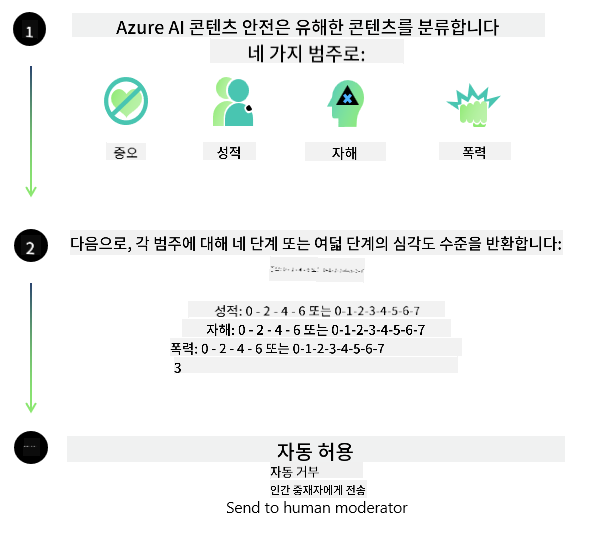

<!--
CO_OP_TRANSLATOR_METADATA:
{
  "original_hash": "839ccc4b3886ef10cfd4e64977f5792d",
  "translation_date": "2026-01-05T01:28:56+00:00",
  "source_file": "md/01.Introduction/01/01.AISafety.md",
  "language_code": "ko"
}
-->
# Phi 모델을 위한 AI 안전성
Phi 계열 모델은 [Microsoft Responsible AI Standard](https://www.microsoft.com/ai/principles-and-approach#responsible-ai-standard)에 따라 개발되었으며, 이는 책임성, 투명성, 공정성, 신뢰성 및 안전성, 프라이버시 및 보안, 포용성이라는 다음 여섯 가지 원칙을 기반으로 한 회사 전체의 요구사항 집합으로서 [Microsoft의 책임 있는 AI 원칙](https://www.microsoft.com/ai/responsible-ai)을 형성합니다. 

이전 Phi 모델들처럼 다면적 안전 평가 및 안전 사후 학습 접근 방식이 채택되었으며, 이번 릴리스의 다국어 능력을 고려하기 위한 추가 조치가 취해졌습니다. 여러 언어 및 위험 범주에 대한 테스트를 포함한 안전 교육 및 평가에 대한 접근 방식은 [Phi Safety Post-Training Paper](https://arxiv.org/abs/2407.13833)에 요약되어 있습니다. Phi 모델은 이러한 접근 방식의 이점을 누리지만, 개발자는 특정 사용 사례 및 문화적·언어적 맥락과 관련된 위험을 매핑하고 측정하며 완화하는 등 책임 있는 AI 모범 사례를 적용해야 합니다.

## 모범 사례

다른 모델들처럼 Phi 계열 모델도 불공정하거나 신뢰할 수 없거나 공격적인 방식으로 동작할 가능성이 있습니다.

SLM 및 LLM의 일부 제한적 동작으로 주의해야 할 점은 다음과 같습니다:

- **서비스 품질:** Phi 모델은 주로 영어 텍스트로 학습되었습니다. 영어가 아닌 언어는 더 낮은 성능을 경험할 수 있습니다. 학습 데이터에서의 대표성이 낮은 영어 변형은 표준 미국 영어보다 성능이 더 낮을 수 있습니다.
- **해악의 표현 및 고정관념의 영속화:** 이러한 모델은 특정 집단을 과도하게 또는 과소 대표하거나 일부 집단의 표현을 지우거나 모욕적이거나 부정적인 고정관념을 강화할 수 있습니다. 안전 사후 학습에도 불구하고 이러한 제한은 다양한 집단의 대표성 수준 차이나 학습 데이터에 존재하는 부정적 고정관념의 예시의 만연성 때문에 여전히 존재할 수 있습니다.
- **부적절하거나 공격적인 콘텐츠:** 이러한 모델은 다른 유형의 부적절하거나 공격적인 콘텐츠를 생성할 수 있으며, 이는 사용 사례에 특정한 추가 완화책 없이는 민감한 맥락에 배포하기 부적절할 수 있습니다.
정보 신뢰성: 언어 모델은 터무니없는 내용을 생성하거나 그럴듯하게 들리지만 부정확하거나 오래된 내용을 날조할 수 있습니다.
- **코드의 적용 범위 제한:** Phi-3 학습 데이터의 대다수는 Python 기반이며 "typing, math, random, collections, datetime, itertools"와 같은 일반적인 패키지를 사용합니다. 모델이 다른 패키지나 다른 언어의 스크립트를 사용하는 Python 스크립트를 생성하는 경우, 사용자는 모든 API 사용을 수동으로 검증할 것을 강력히 권장합니다.

개발자는 책임 있는 AI 모범 사례를 적용해야 하며, 특정 사용 사례가 관련 법률 및 규정을 준수하도록 보장할 책임이 있습니다(예: 개인정보 보호, 무역 등).

## 책임 있는 AI 고려 사항

다른 언어 모델과 마찬가지로 Phi 시리즈 모델도 불공정하거나 신뢰할 수 없거나 공격적으로 동작할 가능성이 있습니다. 주의해야 할 일부 제한적 동작은 다음과 같습니다:

**서비스 품질:** Phi 모델은 주로 영어 텍스트로 학습되었습니다. 영어가 아닌 언어는 더 낮은 성능을 경험할 수 있습니다. 학습 데이터에서의 대표성이 낮은 영어 변형은 표준 미국 영어보다 성능이 더 낮을 수 있습니다.

**해악의 표현 및 고정관념의 영속화:** 이러한 모델은 특정 집단을 과도하게 또는 과소 대표하거나 일부 집단의 표현을 지우거나 모욕적이거나 부정적인 고정관념을 강화할 수 있습니다. 안전 사후 학습에도 불구하고 이러한 제한은 다양한 집단의 대표성 수준 차이나 학습 데이터에 존재하는 부정적 고정관념의 예시의 만연성 때문에 여전히 존재할 수 있습니다.

**부적절하거나 공격적인 콘텐츠:** 이러한 모델은 다른 유형의 부적절하거나 공격적인 콘텐츠를 생성할 수 있으며, 이는 사용 사례에 특정한 추가 완화책 없이는 민감한 맥락에 배포하기 부적절할 수 있습니다.
정보 신뢰성: 언어 모델은 터무니없는 내용을 생성하거나 그럴듯하게 들리지만 부정확하거나 오래된 내용을 날조할 수 있습니다.

**코드의 적용 범위 제한:** Phi-3 학습 데이터의 대다수는 Python 기반이며 "typing, math, random, collections, datetime, itertools"와 같은 일반적인 패키지를 사용합니다. 모델이 다른 패키지나 다른 언어의 스크립트를 사용하는 Python 스크립트를 생성하는 경우, 사용자는 모든 API 사용을 수동으로 검증할 것을 강력히 권장합니다.

개발자는 책임 있는 AI 모범 사례를 적용해야 하며, 특정 사용 사례가 관련 법률 및 규정을 준수하도록 보장할 책임이 있습니다(예: 개인정보 보호, 무역 등). 고려해야 할 중요한 영역은 다음과 같습니다:

**할당:** 모델은 법적 지위나 자원 또는 삶의 기회(예: 주택, 고용, 신용 등)의 할당에 중대한 영향을 미칠 수 있는 시나리오에 추가 평가 및 편향 완화 기법 없이 적합하지 않을 수 있습니다.

**고위험 시나리오:** 개발자는 불공정하거나 신뢰할 수 없거나 공격적인 출력이 매우 큰 비용을 초래하거나 해를 유발할 수 있는 고위험 시나리오에서 모델 사용의 적합성을 평가해야 합니다. 여기에는 정확성과 신뢰성이 중요한 민감하거나 전문적인 분야(예: 법률 또는 건강 조언)에서의 조언 제공이 포함됩니다. 배포 맥락에 따라 애플리케이션 수준에서 추가적인 보호 장치를 구현해야 합니다.

**허위 정보:** 모델은 부정확한 정보를 생성할 수 있습니다. 개발자는 투명성 모범 사례를 따르고 최종 사용자에게 AI 시스템과 상호작용하고 있음을 알릴 필요가 있습니다. 애플리케이션 수준에서 개발자는 응답을 사용 사례별 맥락 정보에 기반하도록 하는 피드백 메커니즘과 파이프라인을 구축할 수 있습니다. 이는 Retrieval Augmented Generation (RAG)로 알려진 기법입니다.

**유해한 콘텐츠 생성:** 개발자는 출력물을 그 맥락에서 평가하고 사용 사례에 적합한 가용한 안전 분류기나 맞춤형 솔루션을 사용해야 합니다.

**오용:** 사기, 스팸 또는 맬웨어 제작과 같은 다른 형태의 오용이 가능할 수 있으며, 개발자는 자신의 애플리케이션이 해당 법률 및 규정을 위반하지 않도록 해야 합니다.

### 파인튜닝 및 AI 콘텐츠 안전성

모델을 파인튜닝한 후에는 모델이 생성하는 콘텐츠를 모니터링하고 잠재적 위험, 위협 및 품질 문제를 식별하고 차단하기 위해 [Azure AI Content Safety](https://learn.microsoft.com/azure/ai-services/content-safety/overview) 조치를 활용할 것을 적극 권장합니다.

[Azure AI Content Safety](https://learn.microsoft.com/azure/ai-services/content-safety/overview)는 텍스트 및 이미지 콘텐츠를 모두 지원합니다. 클라우드, 단절된 컨테이너 및 엣지/임베디드 장치에 배포할 수 있습니다.

## Azure AI Content Safety 개요

Azure AI Content Safety는 만능 솔루션이 아니며, 기업의 특정 정책에 맞게 맞춤화할 수 있습니다. 또한 다국어 모델을 통해 여러 언어를 동시에 이해할 수 있습니다.

- **Azure AI Content Safety**
- **Microsoft Developer**
- **동영상 5개**

Azure AI Content Safety 서비스는 애플리케이션 및 서비스에서 유해한 사용자 생성 및 AI 생성 콘텐츠를 감지합니다. 텍스트 및 이미지 API를 포함하여 유해하거나 부적절한 자료를 감지할 수 있습니다.

[AI Content Safety Playlist](https://www.youtube.com/playlist?list=PLlrxD0HtieHjaQ9bJjyp1T7FeCbmVcPkQ)

---

<!-- CO-OP TRANSLATOR DISCLAIMER START -->
면책 고지:
이 문서는 AI 번역 서비스 [Co-op Translator](https://github.com/Azure/co-op-translator)를 사용하여 번역되었습니다. 정확성을 위해 최선을 다하고 있으나, 자동 번역에는 오류나 부정확성이 포함될 수 있음을 알려드립니다. 원문(원어로 된 문서)을 권위 있는 출처로 간주하시기 바랍니다. 중요한 정보의 경우 전문 번역가에 의한 번역을 권장합니다. 이 번역의 사용으로 인해 발생하는 오해나 잘못된 해석에 대해서는 당사가 책임지지 않습니다.
<!-- CO-OP TRANSLATOR DISCLAIMER END -->