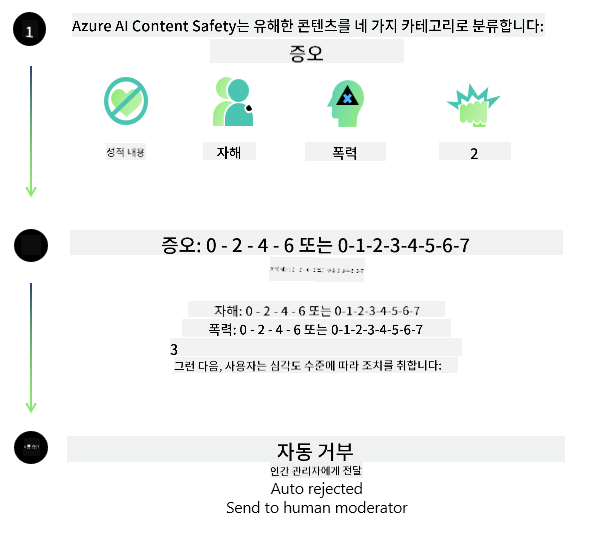
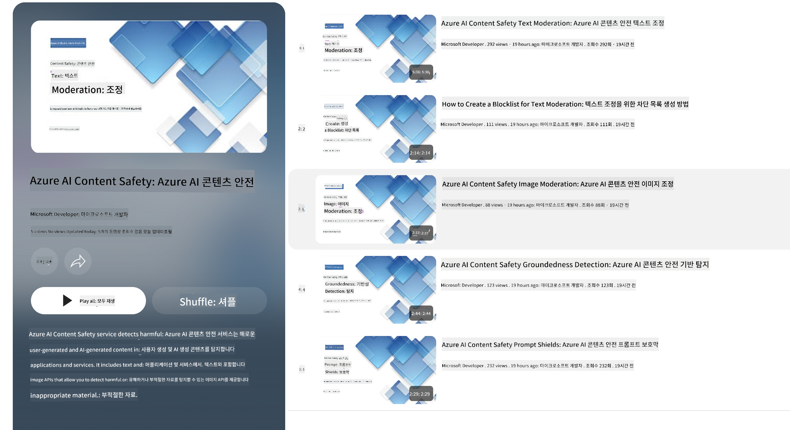

<!--
CO_OP_TRANSLATOR_METADATA:
{
  "original_hash": "1f6b561a224336bd4f413176ec40d994",
  "translation_date": "2025-04-04T05:38:12+00:00",
  "source_file": "md\\01.Introduction\\01\\01.AISafety.md",
  "language_code": "ko"
}
-->
# Phi 모델을 위한 AI 안전성

Phi 모델 군은 [Microsoft 책임 있는 AI 표준](https://query.prod.cms.rt.microsoft.com/cms/api/am/binary/RE5cmFl)에 따라 개발되었습니다. 이 표준은 책임, 투명성, 공정성, 신뢰성과 안전성, 개인정보 보호 및 보안, 포용성을 기반으로 하며, 이는 [Microsoft의 책임 있는 AI 원칙](https://www.microsoft.com/ai/responsible-ai)을 형성합니다.

이전 Phi 모델들과 마찬가지로 다각적인 안전성 평가 및 안전성 후학습 접근법을 채택하였으며, 이번 릴리스의 다국어 기능을 고려하여 추가적인 조치를 취했습니다. 우리의 안전성 학습 및 평가 접근법, 다국어 및 위험 범주를 포함한 테스트에 대한 자세한 내용은 [Phi Safety Post-Training Paper](https://arxiv.org/abs/2407.13833)에 명시되어 있습니다. Phi 모델은 이러한 접근법의 혜택을 받지만, 개발자는 특정 사용 사례와 문화적, 언어적 맥락에 따른 위험을 매핑, 측정 및 완화하는 책임 있는 AI 모범 사례를 적용해야 합니다.

## 모범 사례

다른 모델들과 마찬가지로, Phi 모델 군도 불공정하거나 신뢰할 수 없거나 불쾌감을 줄 수 있는 방식으로 작동할 가능성이 있습니다.

SLM 및 LLM의 제한적인 행동 중 주의해야 할 사항은 다음과 같습니다:

- **서비스 품질:** Phi 모델은 주로 영어 텍스트로 학습되었습니다. 영어 외의 언어는 성능이 떨어질 수 있으며, 학습 데이터에서 표현이 적은 영어 방언은 표준 미국 영어보다 성능이 떨어질 수 있습니다.
- **해악의 표현 및 고정관념 강화:** 이 모델은 특정 그룹을 과도하게 또는 과소 표현하거나, 일부 그룹의 표현을 지우거나, 비하하거나 부정적인 고정관념을 강화할 수 있습니다. 안전성 후학습에도 불구하고, 학습 데이터에서 다양한 그룹의 표현 수준 차이 또는 실제 세계 패턴 및 사회적 편견을 반영하는 부정적 고정관념 사례의 존재로 인해 이러한 한계가 여전히 존재할 수 있습니다.
- **부적절하거나 불쾌한 콘텐츠:** 이 모델은 다른 유형의 부적절하거나 불쾌한 콘텐츠를 생성할 수 있으며, 특정 사용 사례에 대한 추가적인 완화 조치 없이는 민감한 상황에서 배포하기 부적절할 수 있습니다.
- **정보 신뢰성:** 언어 모델은 비합리적인 내용을 생성하거나, 합리적으로 들리지만 부정확하거나 오래된 내용을 만들어낼 수 있습니다.
- **코드의 제한된 범위:** Phi-3 학습 데이터의 대부분은 Python을 기반으로 하며 "typing, math, random, collections, datetime, itertools"와 같은 일반적인 패키지를 사용합니다. 모델이 다른 패키지를 사용하는 Python 스크립트 또는 다른 언어의 스크립트를 생성하는 경우, 모든 API 사용을 수동으로 확인할 것을 강력히 권장합니다.

개발자는 책임 있는 AI 모범 사례를 적용하고, 특정 사용 사례가 관련 법률 및 규정을 준수하는지 (예: 개인정보 보호, 무역 등) 확인할 책임이 있습니다.

## 책임 있는 AI 고려사항

다른 언어 모델과 마찬가지로, Phi 시리즈 모델도 불공정하거나 신뢰할 수 없거나 불쾌감을 줄 수 있는 방식으로 작동할 가능성이 있습니다. 주의해야 할 제한적인 행동은 다음과 같습니다:

**서비스 품질:** Phi 모델은 주로 영어 텍스트로 학습되었습니다. 영어 외의 언어는 성능이 떨어질 수 있으며, 학습 데이터에서 표현이 적은 영어 방언은 표준 미국 영어보다 성능이 떨어질 수 있습니다.

**해악의 표현 및 고정관념 강화:** 이 모델은 특정 그룹을 과도하게 또는 과소 표현하거나, 일부 그룹의 표현을 지우거나, 비하하거나 부정적인 고정관념을 강화할 수 있습니다. 안전성 후학습에도 불구하고, 학습 데이터에서 다양한 그룹의 표현 수준 차이 또는 실제 세계 패턴 및 사회적 편견을 반영하는 부정적 고정관념 사례의 존재로 인해 이러한 한계가 여전히 존재할 수 있습니다.

**부적절하거나 불쾌한 콘텐츠:** 이 모델은 다른 유형의 부적절하거나 불쾌한 콘텐츠를 생성할 수 있으며, 특정 사용 사례에 대한 추가적인 완화 조치 없이는 민감한 상황에서 배포하기 부적절할 수 있습니다.  
**정보 신뢰성:** 언어 모델은 비합리적인 내용을 생성하거나, 합리적으로 들리지만 부정확하거나 오래된 내용을 만들어낼 수 있습니다.

**코드의 제한된 범위:** Phi-3 학습 데이터의 대부분은 Python을 기반으로 하며 "typing, math, random, collections, datetime, itertools"와 같은 일반적인 패키지를 사용합니다. 모델이 다른 패키지를 사용하는 Python 스크립트 또는 다른 언어의 스크립트를 생성하는 경우, 모든 API 사용을 수동으로 확인할 것을 강력히 권장합니다.

개발자는 책임 있는 AI 모범 사례를 적용하고, 특정 사용 사례가 관련 법률 및 규정을 준수하는지 (예: 개인정보 보호, 무역 등) 확인할 책임이 있습니다. 중요한 고려사항은 다음과 같습니다:

**배분:** 모델은 법적 상태나 자원 또는 생애 기회의 배분에 중대한 영향을 미칠 수 있는 시나리오(예: 주택, 고용, 신용 등)에 적합하지 않을 수 있으며, 추가 평가 및 디바이어싱 기술이 필요합니다.

**고위험 시나리오:** 개발자는 불공정하거나 신뢰할 수 없거나 불쾌한 출력이 매우 비용이 많이 들거나 해를 초래할 수 있는 고위험 시나리오에서 모델 사용의 적합성을 평가해야 합니다. 여기에는 정확성과 신뢰성이 중요한 민감하거나 전문적인 영역(예: 법률 또는 건강 상담)에서 조언을 제공하는 것이 포함됩니다. 배포 맥락에 따라 애플리케이션 수준에서 추가적인 보호 장치를 구현해야 합니다.

**허위 정보:** 모델은 부정확한 정보를 생성할 수 있습니다. 개발자는 투명성 모범 사례를 따르고, 최종 사용자에게 AI 시스템과 상호작용하고 있음을 알리는 것이 중요합니다. 애플리케이션 수준에서, 개발자는 피드백 메커니즘과 사용 사례별 맥락 정보를 기반으로 응답을 제공하는 파이프라인을 구축할 수 있으며, 이를 Retrieval Augmented Generation (RAG)이라고 합니다.

**유해 콘텐츠 생성:** 개발자는 출력이 사용 사례에 적합한지 평가하고, 사용 가능한 안전성 분류기 또는 특정 사용 사례에 적합한 맞춤형 솔루션을 활용해야 합니다.

**오용:** 사기, 스팸, 악성코드 제작과 같은 다른 형태의 오용 가능성이 있으며, 개발자는 애플리케이션이 관련 법률 및 규정을 위반하지 않도록 해야 합니다.

### 모델 미세조정 및 AI 콘텐츠 안전성

모델을 미세조정한 후에는 [Azure AI Content Safety](https://learn.microsoft.com/azure/ai-services/content-safety/overview)를 활용하여 모델이 생성한 콘텐츠를 모니터링하고, 잠재적인 위험, 위협 및 품질 문제를 식별 및 차단할 것을 강력히 권장합니다.

[Azure AI Content Safety](https://learn.microsoft.com/azure/ai-services/content-safety/overview)는 텍스트 및 이미지 콘텐츠를 지원합니다. 클라우드, 분리된 컨테이너, 엣지/임베디드 디바이스에서 배포할 수 있습니다.

## Azure AI Content Safety 개요

Azure AI Content Safety는 모든 상황에 맞는 솔루션이 아니며, 기업의 특정 정책에 맞게 맞춤화할 수 있습니다. 또한 다국어 모델을 통해 여러 언어를 동시에 이해할 수 있습니다.

- **Azure AI Content Safety**
- **Microsoft Developer**
- **5개 동영상**

Azure AI Content Safety 서비스는 애플리케이션 및 서비스에서 사용자 생성 및 AI 생성 콘텐츠의 유해성을 감지합니다. 텍스트 및 이미지 API를 포함하여 유해하거나 부적절한 자료를 감지할 수 있습니다.

[AI Content Safety Playlist](https://www.youtube.com/playlist?list=PLlrxD0HtieHjaQ9bJjyp1T7FeCbmVcPkQ)

**면책조항**:  
이 문서는 AI 번역 서비스 [Co-op Translator](https://github.com/Azure/co-op-translator)를 사용하여 번역되었습니다. 정확성을 위해 최선을 다하고 있지만, 자동 번역에는 오류나 부정확성이 포함될 수 있습니다. 원본 문서의 원어 버전이 권위 있는 출처로 간주되어야 합니다. 중요한 정보의 경우, 전문적인 인간 번역을 권장합니다. 이 번역 사용으로 인해 발생하는 오해나 잘못된 해석에 대해 책임을 지지 않습니다.