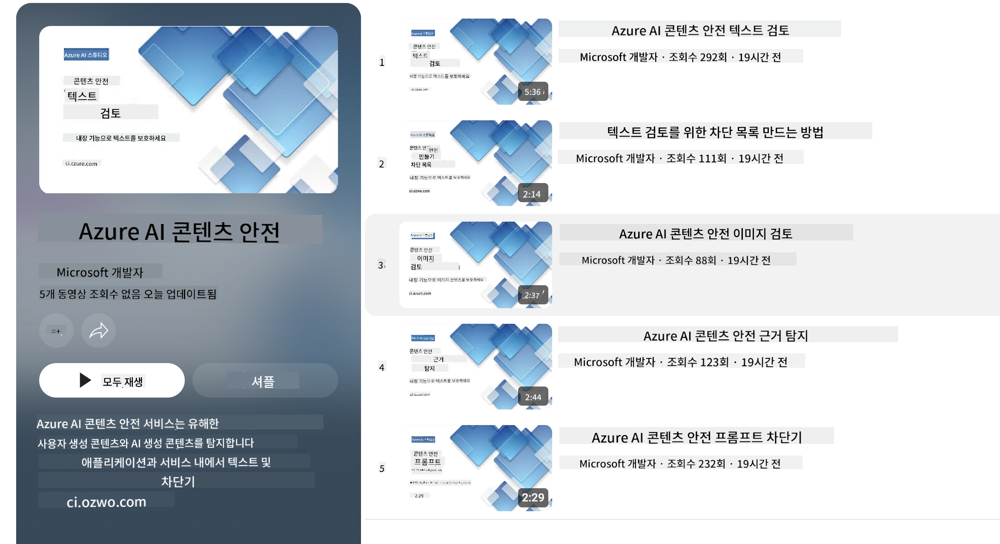

<!--
CO_OP_TRANSLATOR_METADATA:
{
  "original_hash": "c8273672cc57df2be675407a1383aaf0",
  "translation_date": "2025-05-08T06:13:53+00:00",
  "source_file": "md/01.Introduction/01/01.AISafety.md",
  "language_code": "ko"
}
-->
# Phi 모델을 위한 AI 안전성  
Phi 시리즈 모델은 [Microsoft Responsible AI Standard](https://query.prod.cms.rt.microsoft.com/cms/api/am/binary/RE5cmFl)에 따라 개발되었으며, 이는 책임성, 투명성, 공정성, 신뢰성 및 안전성, 프라이버시와 보안, 포용성 등 6가지 원칙을 기반으로 한 회사 전반의 요구사항입니다. 이 원칙들은 [Microsoft의 Responsible AI 원칙](https://www.microsoft.com/ai/responsible-ai)을 형성합니다.  

이전 Phi 모델들과 마찬가지로 다면적 안전 평가와 사후 안전 훈련 방식을 채택했으며, 이번 릴리스의 다국어 기능을 고려한 추가 조치도 포함되어 있습니다. 다국어 및 위험 범주에 걸친 테스트를 포함한 안전 훈련 및 평가 접근법은 [Phi Safety Post-Training Paper](https://arxiv.org/abs/2407.13833)에 자세히 설명되어 있습니다. Phi 모델은 이러한 접근법의 혜택을 받지만, 개발자는 특정 사용 사례 및 문화적, 언어적 맥락과 관련된 위험을 매핑, 측정, 완화하는 책임 있는 AI 모범 사례를 적용해야 합니다.  

## 모범 사례  

다른 모델들처럼 Phi 시리즈 모델도 불공정하거나 신뢰할 수 없거나 불쾌감을 줄 수 있는 방식으로 작동할 가능성이 있습니다.  

SLM과 LLM의 제한적 행동 중 주의할 점은 다음과 같습니다:  

- **서비스 품질:** Phi 모델은 주로 영어 텍스트로 훈련되었습니다. 영어 외 언어는 성능이 저하될 수 있으며, 훈련 데이터 내 표현이 적은 영어 변종은 표준 미국 영어보다 성능이 떨어질 수 있습니다.  
- **해악의 표현 및 고정관념 강화:** 이 모델들은 특정 집단을 과대 또는 과소 대표하거나 일부 집단의 표현을 지우거나, 모욕적이거나 부정적인 고정관념을 강화할 수 있습니다. 안전성 사후 훈련에도 불구하고, 서로 다른 집단의 표현 수준 차이나 훈련 데이터 내 부정적 고정관념 사례의 존재로 인해 이러한 한계는 여전히 남아 있을 수 있습니다.  
- **부적절하거나 불쾌한 콘텐츠:** 이 모델들은 다른 유형의 부적절하거나 불쾌한 콘텐츠를 생성할 수 있어, 특정 사용 사례에 맞는 추가 완화 조치 없이는 민감한 상황에 배포하기 부적절할 수 있습니다.  
- **정보 신뢰성:** 언어 모델은 의미 없는 내용을 생성하거나 그럴듯하지만 부정확하거나 오래된 내용을 만들어낼 수 있습니다.  
- **코드 범위 제한:** Phi-3의 훈련 데이터 대부분은 Python 기반이며, "typing, math, random, collections, datetime, itertools" 같은 일반적인 패키지를 사용합니다. 모델이 다른 패키지나 다른 언어의 스크립트를 생성하는 경우, 모든 API 사용을 수동으로 검증할 것을 강력히 권장합니다.  

개발자는 책임 있는 AI 모범 사례를 적용해야 하며, 특정 사용 사례가 관련 법률 및 규정을 준수하는지(예: 프라이버시, 무역 등) 확인할 책임이 있습니다.  

## 책임 있는 AI 고려사항  

다른 언어 모델과 마찬가지로 Phi 시리즈 모델도 불공정하거나 신뢰할 수 없거나 불쾌한 방식으로 작동할 가능성이 있습니다. 주의해야 할 제한적 행동은 다음과 같습니다:  

**서비스 품질:** Phi 모델은 주로 영어 텍스트로 훈련되었으며, 영어 외 언어는 성능이 저하될 수 있습니다. 훈련 데이터 내 표현이 적은 영어 변종은 표준 미국 영어보다 성능이 떨어질 수 있습니다.  

**해악의 표현 및 고정관념 강화:** 모델은 특정 집단을 과대 또는 과소 대표하거나 일부 집단의 표현을 지우거나, 모욕적이거나 부정적인 고정관념을 강화할 수 있습니다. 안전성 사후 훈련에도 불구하고, 이러한 한계는 서로 다른 집단의 표현 수준 차이나 훈련 데이터 내 부정적 고정관념 사례의 존재로 인해 여전히 존재할 수 있습니다.  

**부적절하거나 불쾌한 콘텐츠:** 모델은 부적절하거나 불쾌한 다른 유형의 콘텐츠를 생성할 수 있어, 특정 사용 사례에 맞는 추가 완화 조치 없이는 민감한 상황에 배포하기 부적절할 수 있습니다.  
정보 신뢰성: 언어 모델은 의미 없는 내용을 생성하거나 그럴듯하지만 부정확하거나 오래된 내용을 만들어낼 수 있습니다.  

**코드 범위 제한:** Phi-3 훈련 데이터의 대부분은 Python 기반이며, "typing, math, random, collections, datetime, itertools" 같은 일반 패키지를 사용합니다. 모델이 다른 패키지나 다른 언어의 스크립트를 생성할 경우, 모든 API 사용을 수동으로 검증할 것을 강력히 권장합니다.  

개발자는 책임 있는 AI 모범 사례를 적용해야 하며, 특정 사용 사례가 관련 법률 및 규정을 준수하는지(예: 프라이버시, 무역 등) 확인할 책임이 있습니다. 고려해야 할 주요 영역은 다음과 같습니다:  

**배분:** 모델은 법적 지위, 자원 배분 또는 삶의 기회(예: 주거, 고용, 신용 등)에 중대한 영향을 미칠 수 있는 상황에 추가 평가 및 편향 완화 기술 없이는 적합하지 않을 수 있습니다.  

**고위험 시나리오:** 개발자는 불공정하거나 신뢰할 수 없거나 불쾌한 결과가 매우 비용이 크거나 피해를 초래할 수 있는 고위험 시나리오에서 모델 사용 적합성을 평가해야 합니다. 여기에는 정확성과 신뢰성이 중요한 민감하거나 전문적인 영역(예: 법률 또는 건강 상담)에서 조언 제공이 포함됩니다. 배포 맥락에 따라 애플리케이션 수준에서 추가 안전장치를 구현해야 합니다.  

**허위 정보:** 모델은 부정확한 정보를 생성할 수 있습니다. 개발자는 투명성 모범 사례를 따르고 최종 사용자가 AI 시스템과 상호작용하고 있음을 알리도록 해야 합니다. 애플리케이션 수준에서는 피드백 메커니즘과 특정 사용 사례 맥락에 기반한 응답을 생성하는 파이프라인, 즉 Retrieval Augmented Generation (RAG) 기법을 구축할 수 있습니다.  

**유해 콘텐츠 생성:** 개발자는 출력물을 맥락에 맞게 평가하고, 사용 사례에 적합한 안전 분류기 또는 맞춤형 솔루션을 활용해야 합니다.  

**오용:** 사기, 스팸, 악성코드 생성 등 다른 형태의 오용 가능성도 있으므로, 개발자는 애플리케이션이 관련 법률 및 규정을 위반하지 않도록 해야 합니다.  

### 파인튜닝 및 AI 콘텐츠 안전성  

모델을 파인튜닝한 후에는 [Azure AI Content Safety](https://learn.microsoft.com/azure/ai-services/content-safety/overview) 기능을 적극 활용하여 모델이 생성하는 콘텐츠를 모니터링하고, 잠재적 위험, 위협, 품질 문제를 식별 및 차단할 것을 권장합니다.  

  

[Azure AI Content Safety](https://learn.microsoft.com/azure/ai-services/content-safety/overview)는 텍스트와 이미지 콘텐츠 모두를 지원하며, 클라우드, 분리된 컨테이너, 엣지/임베디드 장치에 배포할 수 있습니다.  

## Azure AI Content Safety 개요  

Azure AI Content Safety는 모든 상황에 맞는 단일 솔루션이 아니며, 기업의 특정 정책에 맞게 맞춤 설정할 수 있습니다. 또한 다국어 모델을 통해 여러 언어를 동시에 이해할 수 있습니다.  

  

- **Azure AI Content Safety**  
- **Microsoft Developer**  
- **5개의 동영상**  

Azure AI Content Safety 서비스는 애플리케이션과 서비스에서 유해한 사용자 생성 및 AI 생성 콘텐츠를 감지합니다. 텍스트와 이미지 API를 포함하여 유해하거나 부적절한 자료를 탐지할 수 있습니다.  

[AI Content Safety 재생목록](https://www.youtube.com/playlist?list=PLlrxD0HtieHjaQ9bJjyp1T7FeCbmVcPkQ)

**면책 조항**:  
이 문서는 AI 번역 서비스 [Co-op Translator](https://github.com/Azure/co-op-translator)를 사용하여 번역되었습니다. 정확성을 위해 최선을 다하고 있으나, 자동 번역에는 오류나 부정확성이 있을 수 있음을 유의하시기 바랍니다. 원문은 해당 언어의 원본 문서가 권위 있는 자료로 간주되어야 합니다. 중요한 정보의 경우, 전문적인 인간 번역을 권장합니다. 이 번역 사용으로 인해 발생하는 오해나 잘못된 해석에 대해서는 당사가 책임지지 않습니다.