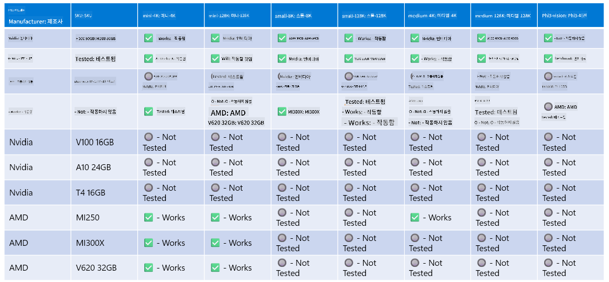

<!--
CO_OP_TRANSLATOR_METADATA:
{
  "original_hash": "8cdc17ce0f10535da30b53d23fe1a795",
  "translation_date": "2025-07-16T18:23:57+00:00",
  "source_file": "md/01.Introduction/01/01.Hardwaresupport.md",
  "language_code": "ko"
}
-->
# Phi 하드웨어 지원

Microsoft Phi는 ONNX Runtime에 최적화되어 있으며 Windows DirectML을 지원합니다. GPU, CPU, 심지어 모바일 기기 등 다양한 하드웨어에서 원활하게 작동합니다.

## 디바이스 하드웨어  
지원되는 하드웨어는 다음과 같습니다:

- GPU SKU: RTX 4090 (DirectML)
- GPU SKU: 1 A100 80GB (CUDA)
- CPU SKU: Standard F64s v2 (64 vCPU, 128 GiB 메모리)

## 모바일 SKU

- Android - Samsung Galaxy S21
- Apple iPhone 14 이상 A16/A17 프로세서

## Phi 하드웨어 사양

- 최소 요구 사양
- Windows: DirectX 12 지원 GPU 및 최소 4GB 통합 RAM

CUDA: Compute Capability가 7.02 이상인 NVIDIA GPU



## 여러 GPU에서 onnxruntime 실행하기

현재 제공되는 Phi ONNX 모델은 1 GPU 전용입니다. Phi 모델에 대해 멀티 GPU 지원이 가능하지만, 2 GPU를 사용하는 ORT가 2개의 ORT 인스턴스를 사용하는 것보다 더 높은 처리량을 보장하지는 않습니다. 최신 정보는 [ONNX Runtime](https://onnxruntime.ai/)을 참고하세요.

[Build 2024 the GenAI ONNX Team](https://youtu.be/WLW4SE8M9i8?si=EtG04UwDvcjunyfC)에서는 Phi 모델에 대해 멀티 GPU 대신 멀티 인스턴스를 활성화했다고 발표했습니다.

현재는 CUDA_VISIBLE_DEVICES 환경 변수를 사용하여 하나의 onnxruntime 또는 onnxruntime-genai 인스턴스를 다음과 같이 실행할 수 있습니다.

```Python
CUDA_VISIBLE_DEVICES=0 python infer.py
CUDA_VISIBLE_DEVICES=1 python infer.py
```

[Azure AI Foundry](https://ai.azure.com)에서 Phi를 더 자유롭게 탐색해 보세요.

**면책 조항**:  
이 문서는 AI 번역 서비스 [Co-op Translator](https://github.com/Azure/co-op-translator)를 사용하여 번역되었습니다. 정확성을 위해 최선을 다하고 있으나, 자동 번역에는 오류나 부정확한 부분이 있을 수 있음을 유의하시기 바랍니다. 원문은 해당 언어의 원본 문서가 권위 있는 출처로 간주되어야 합니다. 중요한 정보의 경우 전문적인 인간 번역을 권장합니다. 본 번역 사용으로 인해 발생하는 오해나 잘못된 해석에 대해 당사는 책임을 지지 않습니다.