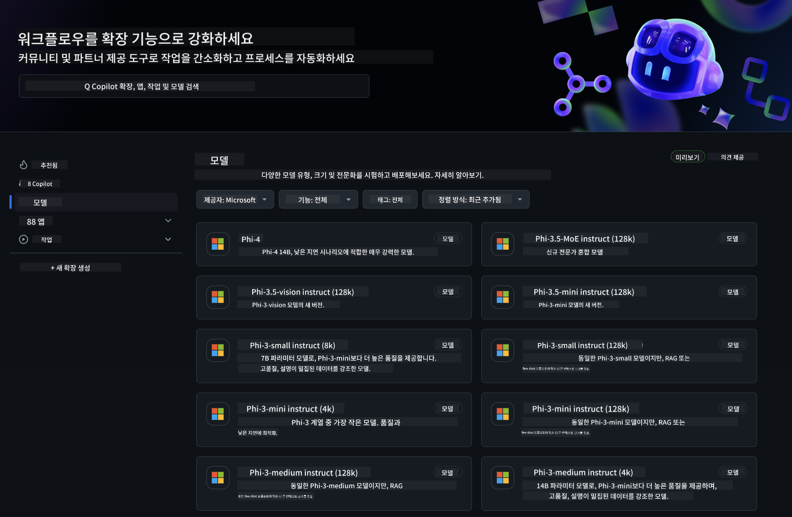
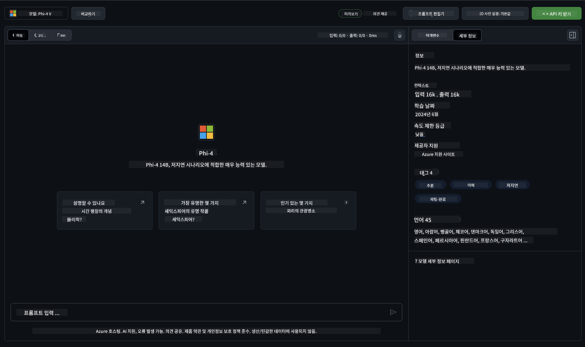
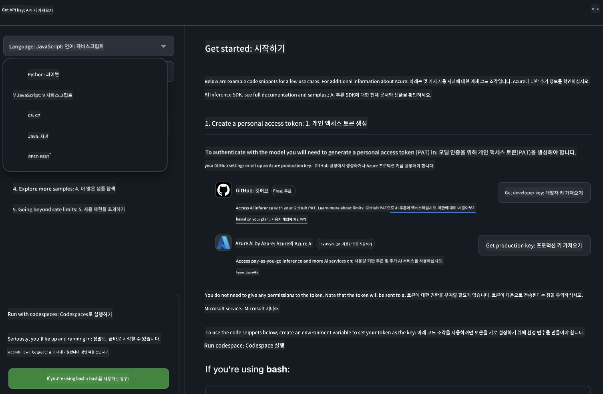
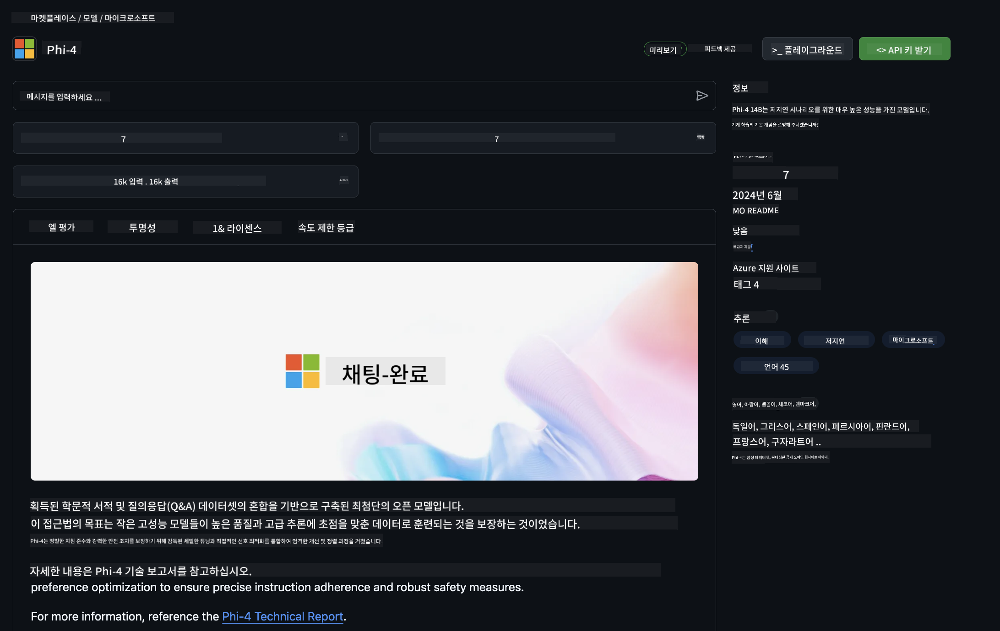

<!--
CO_OP_TRANSLATOR_METADATA:
{
  "original_hash": "fa5cdbc832e5bcffebb25ce25ec1a3c3",
  "translation_date": "2025-04-04T05:47:18+00:00",
  "source_file": "md\\01.Introduction\\02\\02.GitHubModel.md",
  "language_code": "ko"
}
-->
## GitHub 모델의 Phi 패밀리

[GitHub Models](https://github.com/marketplace/models)에 오신 것을 환영합니다! Azure AI에서 호스팅된 AI 모델을 탐색할 준비가 되어 있습니다.



GitHub Models에서 제공되는 모델에 대한 자세한 정보는 [GitHub Model Marketplace](https://github.com/marketplace/models)를 참조하세요.

## 사용 가능한 모델

각 모델에는 전용 플레이그라운드와 샘플 코드가 제공됩니다.



### GitHub 모델 카탈로그의 Phi 패밀리

- [Phi-4](https://github.com/marketplace/models/azureml/Phi-4)

- [Phi-3.5-MoE instruct (128k)](https://github.com/marketplace/models/azureml/Phi-3-5-MoE-instruct)

- [Phi-3.5-vision instruct (128k)](https://github.com/marketplace/models/azureml/Phi-3-5-vision-instruct)

- [Phi-3.5-mini instruct (128k)](https://github.com/marketplace/models/azureml/Phi-3-5-mini-instruct)

- [Phi-3-Medium-128k-Instruct](https://github.com/marketplace/models/azureml/Phi-3-medium-128k-instruct)

- [Phi-3-medium-4k-instruct](https://github.com/marketplace/models/azureml/Phi-3-medium-4k-instruct)

- [Phi-3-mini-128k-instruct](https://github.com/marketplace/models/azureml/Phi-3-mini-128k-instruct)

- [Phi-3-mini-4k-instruct](https://github.com/marketplace/models/azureml/Phi-3-mini-4k-instruct)

- [Phi-3-small-128k-instruct](https://github.com/marketplace/models/azureml/Phi-3-small-128k-instruct)

- [Phi-3-small-8k-instruct](https://github.com/marketplace/models/azureml/Phi-3-small-8k-instruct)

## 시작하기

실행할 준비가 된 몇 가지 기본 예제가 있습니다. 샘플 디렉터리에서 확인할 수 있습니다. 선호하는 언어로 바로 시작하고 싶다면 아래 언어로 된 예제를 확인하세요:

- Python
- JavaScript
- C#
- Java
- cURL

샘플과 모델을 실행하기 위한 전용 Codespaces 환경도 제공됩니다.



## 샘플 코드

아래는 몇 가지 사용 사례를 위한 예제 코드입니다. Azure AI Inference SDK에 대한 추가 정보는 전체 문서와 샘플을 참조하세요.

## 설정

1. 개인 액세스 토큰 생성하기  
토큰에 대해 별도의 권한을 부여할 필요는 없습니다. 이 토큰은 Microsoft 서비스로 전송됩니다.

아래 코드 스니펫을 사용하려면 환경 변수를 생성하여 클라이언트 코드의 키로 토큰을 설정하세요.

bash를 사용하는 경우:  
```
export GITHUB_TOKEN="<your-github-token-goes-here>"
```  
powershell을 사용하는 경우:  
```
$Env:GITHUB_TOKEN="<your-github-token-goes-here>"
```  
Windows 명령 프롬프트를 사용하는 경우:  
```
set GITHUB_TOKEN=<your-github-token-goes-here>
```  

## Python 샘플

### 종속성 설치  
pip을 사용하여 Azure AI Inference SDK 설치 (필수: Python >=3.8):  
```
pip install azure-ai-inference
```  

### 기본 코드 샘플 실행하기  

이 샘플은 chat completion API에 대한 기본 호출을 보여줍니다. GitHub AI 모델 추론 엔드포인트와 GitHub 토큰을 활용합니다. 이 호출은 동기적으로 이루어집니다.  

```python
import os
from azure.ai.inference import ChatCompletionsClient
from azure.ai.inference.models import SystemMessage, UserMessage
from azure.core.credentials import AzureKeyCredential

endpoint = "https://models.inference.ai.azure.com"
model_name = "Phi-4"
token = os.environ["GITHUB_TOKEN"]

client = ChatCompletionsClient(
    endpoint=endpoint,
    credential=AzureKeyCredential(token),
)

response = client.complete(
    messages=[
        UserMessage(content="I have $20,000 in my savings account, where I receive a 4% profit per year and payments twice a year. Can you please tell me how long it will take for me to become a millionaire? Also, can you please explain the math step by step as if you were explaining it to an uneducated person?"),
    ],
    temperature=0.4,
    top_p=1.0,
    max_tokens=2048,
    model=model_name
)

print(response.choices[0].message.content)
```  

### 다중 턴 대화 실행하기  

이 샘플은 chat completion API를 활용한 다중 턴 대화를 보여줍니다. 채팅 애플리케이션에서 모델을 사용할 때는 대화 기록을 관리하고 최신 메시지를 모델에 전달해야 합니다.  

```
import os
from azure.ai.inference import ChatCompletionsClient
from azure.ai.inference.models import AssistantMessage, SystemMessage, UserMessage
from azure.core.credentials import AzureKeyCredential

token = os.environ["GITHUB_TOKEN"]
endpoint = "https://models.inference.ai.azure.com"
# Replace Model_Name
model_name = "Phi-4"

client = ChatCompletionsClient(
    endpoint=endpoint,
    credential=AzureKeyCredential(token),
)

messages = [
    SystemMessage(content="You are a helpful assistant."),
    UserMessage(content="What is the capital of France?"),
    AssistantMessage(content="The capital of France is Paris."),
    UserMessage(content="What about Spain?"),
]

response = client.complete(messages=messages, model=model_name)

print(response.choices[0].message.content)
```  

### 출력 스트리밍하기  

더 나은 사용자 경험을 위해 모델의 응답을 스트리밍하여 첫 번째 토큰이 빨리 표시되도록 하고 긴 응답을 기다리는 시간을 줄일 수 있습니다.  

```
import os
from azure.ai.inference import ChatCompletionsClient
from azure.ai.inference.models import SystemMessage, UserMessage
from azure.core.credentials import AzureKeyCredential

token = os.environ["GITHUB_TOKEN"]
endpoint = "https://models.inference.ai.azure.com"
# Replace Model_Name
model_name = "Phi-4"

client = ChatCompletionsClient(
    endpoint=endpoint,
    credential=AzureKeyCredential(token),
)

response = client.complete(
    stream=True,
    messages=[
        SystemMessage(content="You are a helpful assistant."),
        UserMessage(content="Give me 5 good reasons why I should exercise every day."),
    ],
    model=model_name,
)

for update in response:
    if update.choices:
        print(update.choices[0].delta.content or "", end="")

client.close()
```  

## GitHub 모델의 무료 사용 및 속도 제한



[플레이그라운드 및 무료 API 사용의 속도 제한](https://docs.github.com/en/github-models/prototyping-with-ai-models#rate-limits)은 모델을 실험하고 AI 애플리케이션을 프로토타입화하는 데 도움을 주기 위한 것입니다. 이러한 제한을 넘어 사용하거나 애플리케이션을 확장하려면 Azure 계정에서 리소스를 프로비저닝하고 GitHub 개인 액세스 토큰 대신 Azure에서 인증해야 합니다. 코드에서 다른 변경은 필요하지 않습니다. Azure AI에서 무료 티어 한도를 넘는 방법을 알아보려면 이 링크를 사용하세요.

### 고지사항

모델과 상호작용할 때 AI를 실험하는 것이므로 콘텐츠 오류가 발생할 수 있음을 기억하세요.

이 기능은 여러 제한(분당 요청 수, 하루 요청 수, 요청당 토큰 수, 동시 요청 수 등)이 적용되며, 프로덕션 사용 사례를 위해 설계된 것이 아닙니다.

GitHub Models는 Azure AI Content Safety를 사용합니다. GitHub Models 환경에서는 이러한 필터를 비활성화할 수 없습니다. 유료 서비스를 통해 모델을 사용할 경우, 콘텐츠 필터를 필요에 맞게 구성하세요.

이 서비스는 GitHub의 사전 출시 조건에 따라 제공됩니다.  

**면책 조항**:  
이 문서는 AI 번역 서비스 [Co-op Translator](https://github.com/Azure/co-op-translator)를 사용하여 번역되었습니다. 정확성을 위해 노력하고 있지만, 자동 번역에는 오류나 부정확성이 포함될 수 있음을 유의하시기 바랍니다. 원본 문서의 원어 버전이 권위 있는 자료로 간주되어야 합니다. 중요한 정보의 경우, 전문적인 인간 번역을 권장합니다. 이 번역 사용으로 인해 발생하는 오해나 잘못된 해석에 대해 당사는 책임을 지지 않습니다.