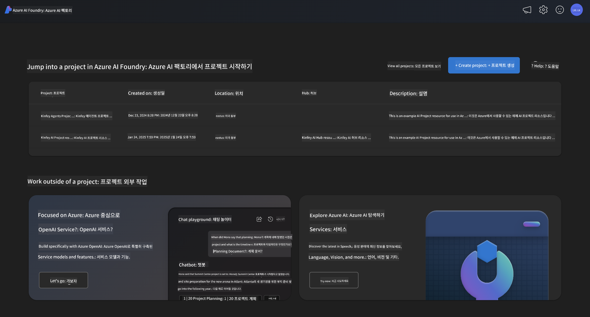
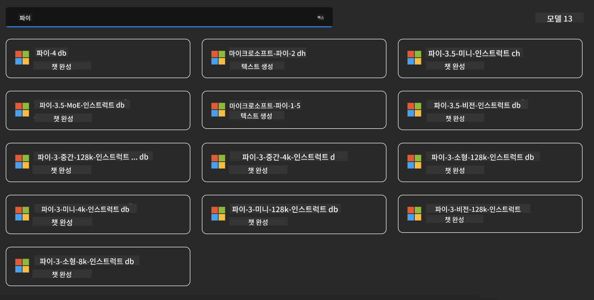
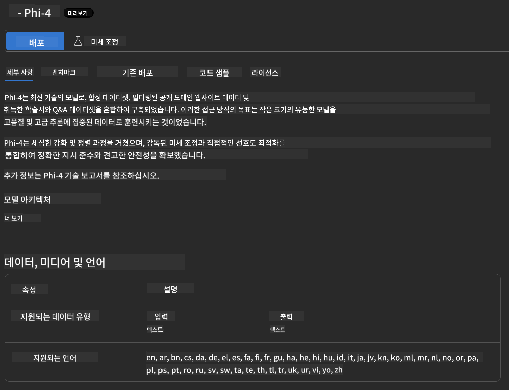
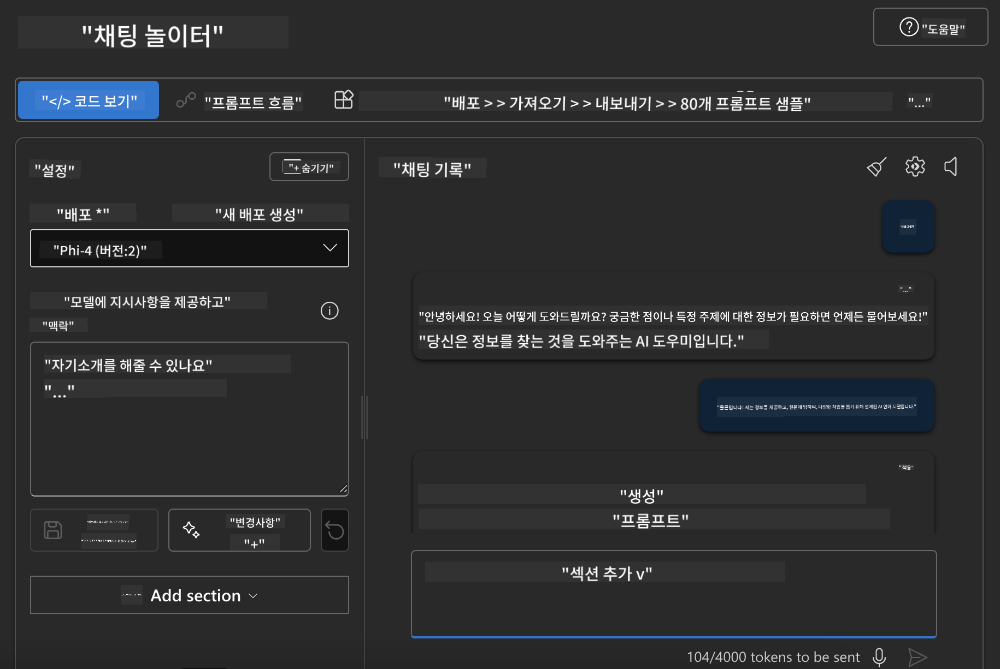

<!--
CO_OP_TRANSLATOR_METADATA:
{
  "original_hash": "70dc9bd6453f70f1a5f6833fe6e24bd0",
  "translation_date": "2025-04-04T05:48:21+00:00",
  "source_file": "md\\01.Introduction\\02\\03.AzureAIFoundry.md",
  "language_code": "ko"
}
-->
## Azure AI Foundry의 Phi 패밀리

[Azure AI Foundry](https://ai.azure.com)는 개발자가 안전하고 보안이 유지되며 책임감 있는 방식으로 AI를 활용하여 혁신을 이끌고 미래를 설계할 수 있도록 지원하는 신뢰할 수 있는 플랫폼입니다.

[Azure AI Foundry](https://ai.azure.com)는 개발자를 위해 설계되었습니다:

- 엔터프라이즈급 플랫폼에서 생성형 AI 애플리케이션을 구축합니다.
- 책임감 있는 AI 실천을 기반으로 최첨단 AI 도구와 ML 모델을 탐색, 구축, 테스트 및 배포합니다.
- 애플리케이션 개발의 전체 라이프사이클 동안 팀과 협업합니다.

Azure AI Foundry를 사용하면 다양한 모델, 서비스 및 기능을 탐색하고 목표에 가장 적합한 AI 애플리케이션을 구축할 수 있습니다. Azure AI Foundry 플랫폼은 개념 증명(PoC)을 손쉽게 완전한 생산 애플리케이션으로 전환할 수 있도록 확장성을 제공합니다. 지속적인 모니터링과 개선은 장기적인 성공을 지원합니다.



Azure AI Foundry에서 Azure AOAI 서비스를 사용하는 것 외에도 Azure AI Foundry 모델 카탈로그에서 타사 모델을 사용할 수 있습니다. 이는 Azure AI Foundry를 AI 솔루션 플랫폼으로 활용하려는 경우에 좋은 선택입니다.

우리는 Azure AI Foundry의 모델 카탈로그를 통해 Phi 패밀리 모델을 빠르게 배포할 수 있습니다.



### **Azure AI Foundry에서 Phi-4 배포하기**



### **Azure AI Foundry Playground에서 Phi-4 테스트하기**



### **Azure AI Foundry Phi-4를 호출하는 Python 코드 실행**

```python

import os  
import base64
from openai import AzureOpenAI  
from azure.identity import DefaultAzureCredential, get_bearer_token_provider  
        
endpoint = os.getenv("ENDPOINT_URL", "Your Azure AOAI Service Endpoint")  
deployment = os.getenv("DEPLOYMENT_NAME", "Phi-4")  
      
token_provider = get_bearer_token_provider(  
    DefaultAzureCredential(),  
    "https://cognitiveservices.azure.com/.default"  
)  
  
client = AzureOpenAI(  
    azure_endpoint=endpoint,  
    azure_ad_token_provider=token_provider,  
    api_version="2024-05-01-preview",  
)  
  

chat_prompt = [
    {
        "role": "system",
        "content": "You are an AI assistant that helps people find information."
    },
    {
        "role": "user",
        "content": "can you introduce yourself"
    }
] 
    
# Include speech result if speech is enabled  
messages = chat_prompt 

completion = client.chat.completions.create(  
    model=deployment,  
    messages=messages,
    max_tokens=800,  
    temperature=0.7,  
    top_p=0.95,  
    frequency_penalty=0,  
    presence_penalty=0,
    stop=None,  
    stream=False  
)  
  
print(completion.to_json())  

```

**면책 조항**:  
이 문서는 AI 번역 서비스 [Co-op Translator](https://github.com/Azure/co-op-translator)를 사용하여 번역되었습니다. 정확성을 위해 최선을 다하고 있으나, 자동 번역에는 오류나 부정확성이 포함될 수 있습니다. 원본 문서(모국어로 작성된 문서)가 권위 있는 출처로 간주되어야 합니다. 중요한 정보에 대해서는 전문적인 인간 번역을 권장합니다. 이 번역 사용으로 인해 발생하는 오해나 잘못된 해석에 대해 책임을 지지 않습니다.