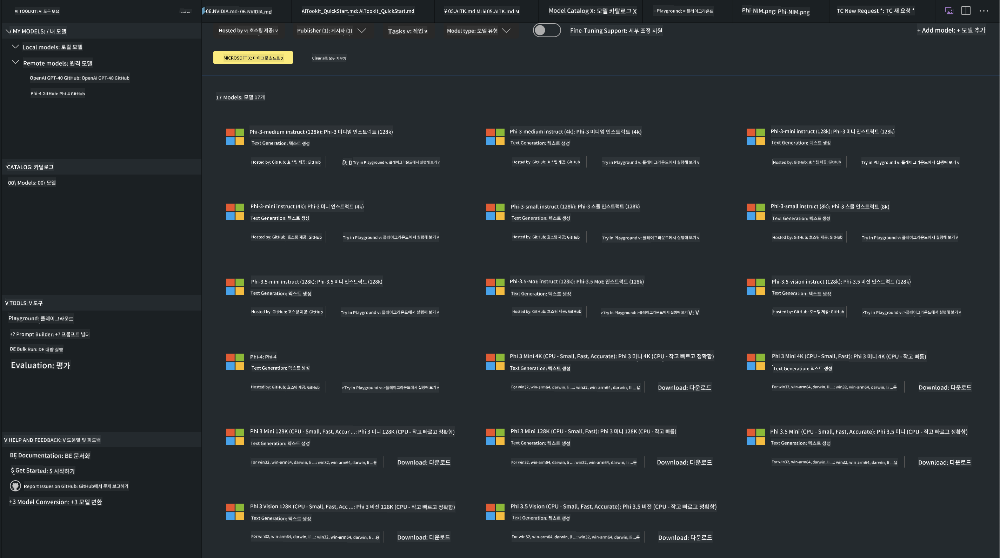
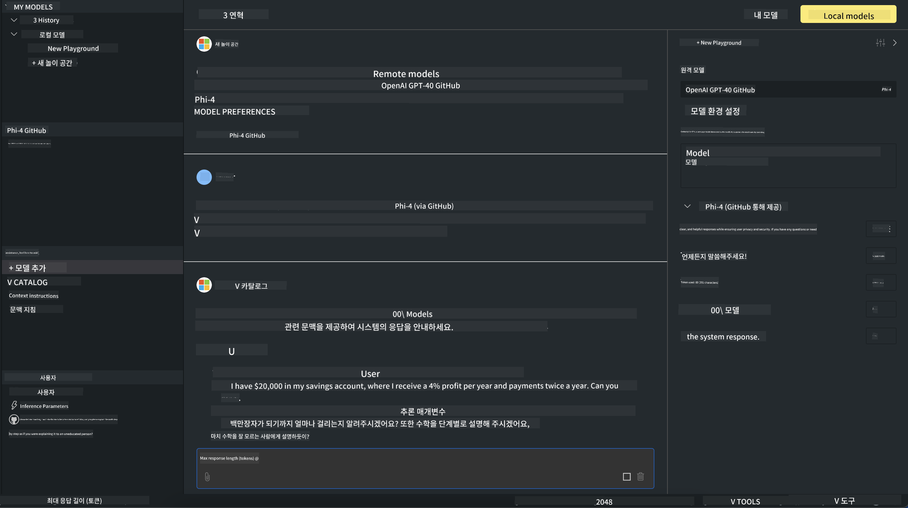

<!--
CO_OP_TRANSLATOR_METADATA:
{
  "original_hash": "9365fb38f5c75c4d7ac9b9a4baa7c9d1",
  "translation_date": "2025-04-04T05:50:23+00:00",
  "source_file": "md\\01.Introduction\\02\\05.AITK.md",
  "language_code": "ko"
}
-->
# AITK의 Phi Family

[AI Toolkit for VS Code](https://marketplace.visualstudio.com/items?itemName=ms-windows-ai-studio.windows-ai-studio)는 Azure AI Foundry Catalog 및 Hugging Face와 같은 다른 카탈로그에서 제공되는 최첨단 AI 개발 도구와 모델을 통합하여 생성형 AI 애플리케이션 개발을 간소화합니다. GitHub Models와 Azure AI Foundry Model Catalogs가 지원하는 AI 모델 카탈로그를 탐색하고, 로컬 또는 원격으로 다운로드하며, 미세 조정, 테스트, 애플리케이션에서 활용할 수 있습니다.

AI Toolkit Preview는 로컬에서 실행됩니다. 선택한 모델에 따라 로컬 추론 또는 미세 조정이 필요할 수 있으며, NVIDIA CUDA GPU와 같은 GPU가 필요할 수 있습니다. GitHub Models도 AITK를 통해 직접 실행할 수 있습니다.

## 시작하기

[Windows Subsystem for Linux 설치 방법 알아보기](https://learn.microsoft.com/windows/wsl/install?WT.mc_id=aiml-137032-kinfeylo)

및 [기본 배포판 변경](https://learn.microsoft.com/windows/wsl/install#change-the-default-linux-distribution-installed).

[AI Toolkit GitHub 저장소](https://github.com/microsoft/vscode-ai-toolkit/)

- Windows, Linux, macOS
  
- Windows와 Linux에서 미세 조정을 수행하려면 Nvidia GPU가 필요합니다. 또한, **Windows**의 경우 Ubuntu 18.4 이상의 배포판을 사용하는 Linux 하위 시스템이 필요합니다. [Windows Subsystem for Linux 설치 방법 알아보기](https://learn.microsoft.com/windows/wsl/install) 및 [기본 배포판 변경](https://learn.microsoft.com/windows/wsl/install#change-the-default-linux-distribution-installed).

### AI Toolkit 설치

AI Toolkit은 [Visual Studio Code 확장](https://code.visualstudio.com/docs/setup/additional-components#_vs-code-extensions)으로 제공되므로 먼저 [VS Code](https://code.visualstudio.com/docs/setup/windows?WT.mc_id=aiml-137032-kinfeylo)를 설치한 다음 [VS Marketplace](https://marketplace.visualstudio.com/items?itemName=ms-windows-ai-studio.windows-ai-studio)에서 AI Toolkit을 다운로드해야 합니다.  
[AI Toolkit은 Visual Studio Marketplace](https://marketplace.visualstudio.com/items?itemName=ms-windows-ai-studio.windows-ai-studio)에서 제공되며 다른 VS Code 확장처럼 설치할 수 있습니다.

VS Code 확장 설치에 익숙하지 않다면 다음 단계를 따르세요:

### 로그인

1. VS Code의 작업 표시줄에서 **Extensions**를 선택합니다.  
2. 확장 검색창에 "AI Toolkit"을 입력합니다.  
3. "AI Toolkit for Visual Studio Code"를 선택합니다.  
4. **Install**을 선택합니다.  

이제 확장을 사용할 준비가 되었습니다!

GitHub에 로그인하라는 메시지가 표시되면 "Allow"를 클릭하여 계속 진행하세요. GitHub 로그인 페이지로 리디렉션됩니다.

로그인한 후 지침을 따르세요. 성공적으로 완료되면 VS Code로 리디렉션됩니다.

확장이 설치되면 작업 표시줄에 AI Toolkit 아이콘이 나타납니다.

이제 사용 가능한 작업들을 살펴봅시다!

### 사용 가능한 작업

AI Toolkit의 기본 사이드바는 다음과 같이 구성되어 있습니다:

- **Models**  
- **Resources**  
- **Playground**  
- **Fine-tuning**  
- **Evaluation**  

Resources 섹션에서 사용할 수 있습니다. 시작하려면 **Model Catalog**를 선택하세요.

### 카탈로그에서 모델 다운로드

VS Code 사이드바에서 AI Toolkit을 실행하면 다음 옵션 중에서 선택할 수 있습니다:



- **Model Catalog**에서 지원되는 모델을 찾아 로컬에 다운로드  
- **Model Playground**에서 모델 추론 테스트  
- **Model Fine-tuning**에서 로컬 또는 원격으로 모델 미세 조정  
- AI Toolkit 명령 팔레트를 통해 클라우드에 미세 조정된 모델 배포  
- 모델 평가  

> [!NOTE]
>
> **GPU Vs CPU**
>
> 모델 카드에는 모델 크기, 플랫폼 및 가속기 유형(CPU, GPU)이 표시됩니다. **GPU가 하나 이상 있는 Windows 장치**에서는 Windows만을 대상으로 하는 모델 버전을 선택하여 최적의 성능을 얻을 수 있습니다.
>
> 이를 통해 DirectML 가속기에 최적화된 모델을 사용할 수 있습니다.
>
> 모델 이름 형식은 다음과 같습니다:
>
> - `{model_name}-{accelerator}-{quantization}-{format}`.
>
> Windows 장치에 GPU가 있는지 확인하려면 **작업 관리자**를 열고 **성능** 탭을 선택하세요. GPU가 있는 경우 "GPU 0" 또는 "GPU 1"과 같은 이름으로 표시됩니다.

### Playground에서 모델 실행

모든 매개변수를 설정한 후 **Generate Project**를 클릭하세요.

모델이 다운로드되면 카탈로그의 모델 카드에서 **Load in Playground**를 선택하세요:

- 모델 다운로드 시작  
- 모든 필수 구성 요소 및 종속성 설치  
- VS Code 작업 공간 생성  



### 애플리케이션에서 REST API 사용

AI Toolkit은 [OpenAI 채팅 완료 형식](https://platform.openai.com/docs/api-reference/chat/create)을 사용하는 **포트 5272**의 로컬 REST API 웹 서버를 제공합니다.

이를 통해 클라우드 AI 모델 서비스를 의존하지 않고 애플리케이션을 로컬에서 테스트할 수 있습니다. 예를 들어, 다음 JSON 파일은 요청 본문을 구성하는 방법을 보여줍니다:

```json
{
    "model": "Phi-4",
    "messages": [
        {
            "role": "user",
            "content": "what is the golden ratio?"
        }
    ],
    "temperature": 0.7,
    "top_p": 1,
    "top_k": 10,
    "max_tokens": 100,
    "stream": true
}
```

다음과 같은 도구를 사용하여 REST API를 테스트할 수 있습니다: [Postman](https://www.postman.com/) 또는 CURL (Client URL) 유틸리티:

```bash
curl -vX POST http://127.0.0.1:5272/v1/chat/completions -H 'Content-Type: application/json' -d @body.json
```

### Python용 OpenAI 클라이언트 라이브러리 사용

```python
from openai import OpenAI

client = OpenAI(
    base_url="http://127.0.0.1:5272/v1/", 
    api_key="x" # required for the API but not used
)

chat_completion = client.chat.completions.create(
    messages=[
        {
            "role": "user",
            "content": "what is the golden ratio?",
        }
    ],
    model="Phi-4",
)

print(chat_completion.choices[0].message.content)
```

### .NET용 Azure OpenAI 클라이언트 라이브러리 사용

[Azure OpenAI 클라이언트 라이브러리 for .NET](https://www.nuget.org/packages/Azure.AI.OpenAI/)을 NuGet을 사용하여 프로젝트에 추가하세요:

```bash
dotnet add {project_name} package Azure.AI.OpenAI --version 1.0.0-beta.17
```

**OverridePolicy.cs**라는 C# 파일을 프로젝트에 추가하고 다음 코드를 붙여넣으세요:

```csharp
// OverridePolicy.cs
using Azure.Core.Pipeline;
using Azure.Core;

internal partial class OverrideRequestUriPolicy(Uri overrideUri)
    : HttpPipelineSynchronousPolicy
{
    private readonly Uri _overrideUri = overrideUri;

    public override void OnSendingRequest(HttpMessage message)
    {
        message.Request.Uri.Reset(_overrideUri);
    }
}
```

그런 다음, **Program.cs** 파일에 다음 코드를 붙여넣으세요:

```csharp
// Program.cs
using Azure.AI.OpenAI;

Uri localhostUri = new("http://localhost:5272/v1/chat/completions");

OpenAIClientOptions clientOptions = new();
clientOptions.AddPolicy(
    new OverrideRequestUriPolicy(localhostUri),
    Azure.Core.HttpPipelinePosition.BeforeTransport);
OpenAIClient client = new(openAIApiKey: "unused", clientOptions);

ChatCompletionsOptions options = new()
{
    DeploymentName = "Phi-4",
    Messages =
    {
        new ChatRequestSystemMessage("You are a helpful assistant. Be brief and succinct."),
        new ChatRequestUserMessage("What is the golden ratio?"),
    }
};

StreamingResponse<StreamingChatCompletionsUpdate> streamingChatResponse
    = await client.GetChatCompletionsStreamingAsync(options);

await foreach (StreamingChatCompletionsUpdate chatChunk in streamingChatResponse)
{
    Console.Write(chatChunk.ContentUpdate);
}
```

## AI Toolkit을 사용한 미세 조정

- 모델 검색 및 Playground로 시작하기  
- 로컬 컴퓨팅 리소스를 사용한 모델 미세 조정 및 추론  
- Azure 리소스를 사용한 원격 미세 조정 및 추론  

[AI Toolkit을 사용한 미세 조정](../../03.FineTuning/Finetuning_VSCodeaitoolkit.md)

## AI Toolkit Q&A 리소스

가장 흔한 문제와 해결 방법은 [Q&A 페이지](https://github.com/microsoft/vscode-ai-toolkit/blob/main/archive/QA.md)를 참조하세요.

**면책 조항**:  
이 문서는 AI 번역 서비스 [Co-op Translator](https://github.com/Azure/co-op-translator)를 사용하여 번역되었습니다. 정확성을 위해 최선을 다하지만, 자동 번역에는 오류나 부정확성이 포함될 수 있습니다. 원본 문서를 해당 언어로 작성된 문서가 권위 있는 출처로 간주되어야 합니다. 중요한 정보의 경우, 전문적인 인간 번역을 권장합니다. 이 번역을 사용함으로 인해 발생하는 오해나 잘못된 해석에 대해 당사는 책임지지 않습니다.