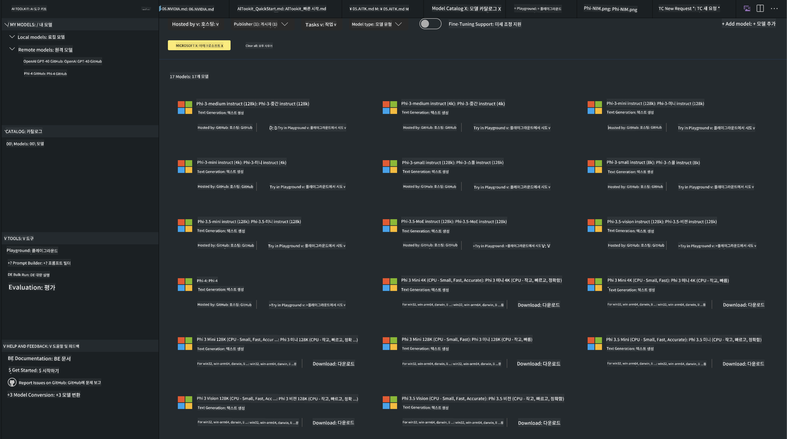
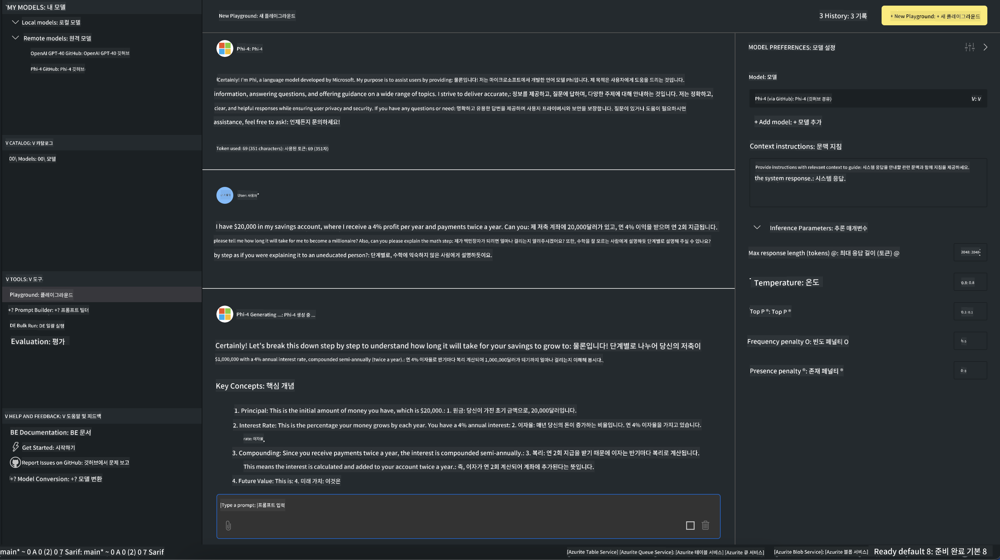

<!--
CO_OP_TRANSLATOR_METADATA:
{
  "original_hash": "4951d458c0b60c02cd1e751b40903877",
  "translation_date": "2025-05-08T06:20:16+00:00",
  "source_file": "md/01.Introduction/02/05.AITK.md",
  "language_code": "ko"
}
-->
# Phi Family in AITK

[AI Toolkit for VS Code](https://marketplace.visualstudio.com/items?itemName=ms-windows-ai-studio.windows-ai-studio)는 Azure AI Foundry Catalog와 Hugging Face 같은 다른 카탈로그에서 제공하는 최신 AI 개발 도구와 모델을 통합하여 생성형 AI 앱 개발을 간소화합니다. GitHub Models와 Azure AI Foundry Model Catalogs가 지원하는 AI 모델 카탈로그를 탐색하고, 로컬 또는 원격으로 다운로드하며, 미세 조정, 테스트 후 애플리케이션에 활용할 수 있습니다.

AI Toolkit Preview는 로컬에서 실행됩니다. 선택한 모델에 따라 로컬 추론 또는 미세 조정을 진행하며, NVIDIA CUDA GPU와 같은 GPU가 필요할 수 있습니다. GitHub Models도 AITK를 통해 직접 실행할 수 있습니다.

## 시작하기

[Windows용 Linux 하위 시스템 설치 방법 자세히 알아보기](https://learn.microsoft.com/windows/wsl/install?WT.mc_id=aiml-137032-kinfeylo)

및 [기본 배포판 변경 방법](https://learn.microsoft.com/windows/wsl/install#change-the-default-linux-distribution-installed).

[AI Toolkit GitHub 저장소](https://github.com/microsoft/vscode-ai-toolkit/)

- Windows, Linux, macOS 지원
  
- Windows와 Linux 모두에서 미세 조정을 하려면 Nvidia GPU가 필요합니다. 또한, **Windows**에서는 Ubuntu 18.4 이상 배포판이 설치된 Linux 하위 시스템이 필요합니다. [Windows용 Linux 하위 시스템 설치 방법](https://learn.microsoft.com/windows/wsl/install)과 [기본 배포판 변경 방법](https://learn.microsoft.com/windows/wsl/install#change-the-default-linux-distribution-installed)을 참고하세요.

### AI Toolkit 설치하기

AI Toolkit은 [Visual Studio Code 확장 프로그램](https://code.visualstudio.com/docs/setup/additional-components#_vs-code-extensions)으로 제공되므로, 먼저 [VS Code](https://code.visualstudio.com/docs/setup/windows?WT.mc_id=aiml-137032-kinfeylo)를 설치한 후 [VS Marketplace](https://marketplace.visualstudio.com/items?itemName=ms-windows-ai-studio.windows-ai-studio)에서 AI Toolkit을 다운로드해야 합니다.  
[AI Toolkit은 Visual Studio Marketplace에서 이용 가능](https://marketplace.visualstudio.com/items?itemName=ms-windows-ai-studio.windows-ai-studio)하며, 다른 VS Code 확장 프로그램과 동일한 방식으로 설치할 수 있습니다.

VS Code 확장 프로그램 설치가 익숙하지 않다면, 다음 단계를 따라하세요:

### 로그인

1. VS Code의 활동 표시줄에서 **Extensions** 선택  
1. 확장 프로그램 검색창에 "AI Toolkit" 입력  
1. "AI Toolkit for Visual Studio code" 선택  
1. **Install** 클릭

이제 확장 프로그램을 사용할 준비가 되었습니다!

GitHub 로그인을 요청받으면 계속 진행하려면 "Allow"를 클릭하세요. GitHub 로그인 페이지로 리디렉션됩니다.

로그인 후 안내에 따라 진행하세요. 완료되면 VS Code로 다시 돌아옵니다.

확장 프로그램 설치가 완료되면 활동 표시줄에 AI Toolkit 아이콘이 나타납니다.

이제 사용 가능한 기능을 살펴봅시다!

### 사용 가능한 기능

AI Toolkit의 기본 사이드바는 다음과 같이 구성되어 있습니다:

- **Models**  
- **Resources**  
- **Playground**  
- **Fine-tuning**  
- **Evaluation**

이 기능들은 Resources 섹션에서 이용할 수 있습니다. 시작하려면 **Model Catalog**를 선택하세요.

### 카탈로그에서 모델 다운로드하기

VS Code 사이드바에서 AI Toolkit을 실행하면 다음 옵션 중에서 선택할 수 있습니다:



- **Model Catalog**에서 지원하는 모델을 찾아 로컬에 다운로드  
- **Model Playground**에서 모델 추론 테스트  
- **Model Fine-tuning**에서 모델을 로컬 또는 원격으로 미세 조정  
- AI Toolkit 명령 팔레트를 통해 미세 조정된 모델을 클라우드에 배포  
- 모델 평가

> [!NOTE]
>
> **GPU와 CPU 비교**
>
> 모델 카드에는 모델 크기, 플랫폼, 가속기 종류(CPU, GPU)가 표시됩니다. **GPU가 하나 이상 장착된 Windows 기기**에서 최적의 성능을 위해서는 Windows만을 대상으로 하는 모델 버전을 선택하세요.
>
> 이렇게 하면 DirectML 가속기에 최적화된 모델을 사용할 수 있습니다.
>
> 모델 이름 형식은
>
> - `{model_name}-{accelerator}-{quantization}-{format}` 입니다.
>
> Windows 기기에 GPU가 있는지 확인하려면 **작업 관리자**를 열고 **성능** 탭을 선택하세요. GPU가 있다면 "GPU 0" 또는 "GPU 1" 같은 이름으로 표시됩니다.

### 플레이그라운드에서 모델 실행하기

모든 매개변수가 설정되면 **Generate Project**를 클릭하세요.

모델이 다운로드되면 카탈로그의 모델 카드에서 **Load in Playground**를 선택하세요:

- 모델 다운로드 시작  
- 모든 필수 조건과 의존성 설치  
- VS Code 작업 공간 생성



### 애플리케이션에서 REST API 사용하기

AI Toolkit은 [OpenAI chat completions format](https://platform.openai.com/docs/api-reference/chat/create)을 사용하는 로컬 REST API 웹 서버를 **포트 5272**에서 제공합니다.

이를 통해 클라우드 AI 모델 서비스에 의존하지 않고도 애플리케이션을 로컬에서 테스트할 수 있습니다. 예를 들어, 다음 JSON 파일은 요청 본문을 구성하는 방법을 보여줍니다:

```json
{
    "model": "Phi-4",
    "messages": [
        {
            "role": "user",
            "content": "what is the golden ratio?"
        }
    ],
    "temperature": 0.7,
    "top_p": 1,
    "top_k": 10,
    "max_tokens": 100,
    "stream": true
}
```

REST API는 [Postman](https://www.postman.com/)이나 CURL(클라이언트 URL) 유틸리티로 테스트할 수 있습니다:

```bash
curl -vX POST http://127.0.0.1:5272/v1/chat/completions -H 'Content-Type: application/json' -d @body.json
```

### Python용 OpenAI 클라이언트 라이브러리 사용하기

```python
from openai import OpenAI

client = OpenAI(
    base_url="http://127.0.0.1:5272/v1/", 
    api_key="x" # required for the API but not used
)

chat_completion = client.chat.completions.create(
    messages=[
        {
            "role": "user",
            "content": "what is the golden ratio?",
        }
    ],
    model="Phi-4",
)

print(chat_completion.choices[0].message.content)
```

### .NET용 Azure OpenAI 클라이언트 라이브러리 사용하기

NuGet을 사용해 프로젝트에 [.NET용 Azure OpenAI 클라이언트 라이브러리](https://www.nuget.org/packages/Azure.AI.OpenAI/)를 추가하세요:

```bash
dotnet add {project_name} package Azure.AI.OpenAI --version 1.0.0-beta.17
```

프로젝트에 **OverridePolicy.cs**라는 C# 파일을 추가하고 다음 코드를 붙여넣으세요:

```csharp
// OverridePolicy.cs
using Azure.Core.Pipeline;
using Azure.Core;

internal partial class OverrideRequestUriPolicy(Uri overrideUri)
    : HttpPipelineSynchronousPolicy
{
    private readonly Uri _overrideUri = overrideUri;

    public override void OnSendingRequest(HttpMessage message)
    {
        message.Request.Uri.Reset(_overrideUri);
    }
}
```

다음으로, **Program.cs** 파일에 아래 코드를 붙여넣으세요:

```csharp
// Program.cs
using Azure.AI.OpenAI;

Uri localhostUri = new("http://localhost:5272/v1/chat/completions");

OpenAIClientOptions clientOptions = new();
clientOptions.AddPolicy(
    new OverrideRequestUriPolicy(localhostUri),
    Azure.Core.HttpPipelinePosition.BeforeTransport);
OpenAIClient client = new(openAIApiKey: "unused", clientOptions);

ChatCompletionsOptions options = new()
{
    DeploymentName = "Phi-4",
    Messages =
    {
        new ChatRequestSystemMessage("You are a helpful assistant. Be brief and succinct."),
        new ChatRequestUserMessage("What is the golden ratio?"),
    }
};

StreamingResponse<StreamingChatCompletionsUpdate> streamingChatResponse
    = await client.GetChatCompletionsStreamingAsync(options);

await foreach (StreamingChatCompletionsUpdate chatChunk in streamingChatResponse)
{
    Console.Write(chatChunk.ContentUpdate);
}
```


## AI Toolkit을 이용한 미세 조정

- 모델 탐색과 플레이그라운드로 시작하기  
- 로컬 컴퓨팅 자원을 활용한 모델 미세 조정 및 추론  
- Azure 자원을 활용한 원격 미세 조정 및 추론

[AI Toolkit을 이용한 미세 조정](../../03.FineTuning/Finetuning_VSCodeaitoolkit.md)

## AI Toolkit Q&A 자료

가장 자주 발생하는 문제와 해결책은 [Q&A 페이지](https://github.com/microsoft/vscode-ai-toolkit/blob/main/archive/QA.md)를 참고하세요.

**면책 조항**:  
이 문서는 AI 번역 서비스 [Co-op Translator](https://github.com/Azure/co-op-translator)를 사용하여 번역되었습니다. 정확성을 위해 노력하고 있으나, 자동 번역에는 오류나 부정확성이 포함될 수 있음을 유의해 주시기 바랍니다. 원본 문서는 해당 언어의 원문을 권위 있는 자료로 간주해야 합니다. 중요한 정보의 경우, 전문적인 인간 번역을 권장합니다. 본 번역의 사용으로 인해 발생하는 오해나 잘못된 해석에 대해 당사는 책임을 지지 않습니다.