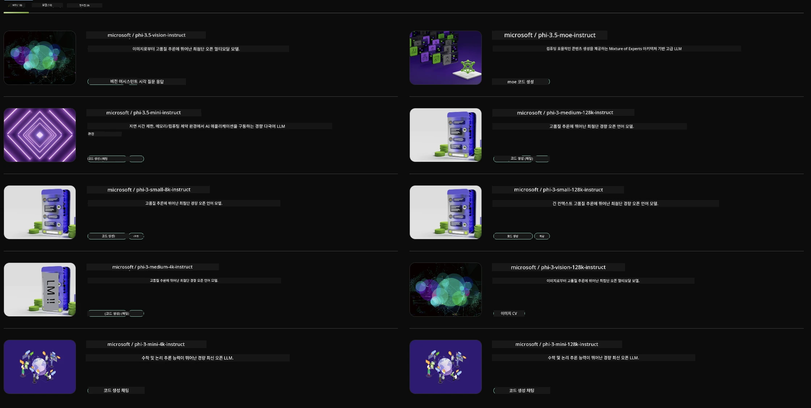

## NVIDIA NIM의 Phi 패밀리

NVIDIA NIM은 클라우드, 데이터 센터, 워크스테이션 전반에 걸쳐 생성형 AI 모델 배포를 가속화하기 위해 설계된 사용하기 쉬운 마이크로서비스 모음입니다. NIM은 모델 패밀리별 및 개별 모델별로 분류됩니다. 예를 들어, 대형 언어 모델(LLM)을 위한 NVIDIA NIM은 최첨단 LLM의 강력한 기능을 기업 애플리케이션에 제공하여 뛰어난 자연어 처리 및 이해 능력을 제공합니다.

NIM은 IT 및 DevOps 팀이 자체 관리 환경에서 대형 언어 모델(LLM)을 손쉽게 자체 호스팅할 수 있도록 하면서도, 개발자들이 강력한 코파일럿, 챗봇, AI 어시스턴트를 구축할 수 있도록 업계 표준 API를 제공합니다. NVIDIA의 최첨단 GPU 가속과 확장 가능한 배포를 활용하여 NIM은 탁월한 성능으로 가장 빠른 추론 경로를 제공합니다.

NVIDIA NIM을 사용하여 Phi 패밀리 모델을 추론할 수 있습니다.



### **샘플 - NVIDIA NIM의 Phi-3-Vision**

이미지(`demo.png`)가 있고, 이 이미지를 처리하여 새로운 버전(`phi-3-vision.jpg`)을 저장하는 Python 코드를 생성하고 싶다고 가정해 보겠습니다.

위 코드는 다음과 같은 과정을 자동화합니다:

1. 환경과 필요한 설정을 준비합니다.
2. 모델에게 필요한 Python 코드를 생성하도록 지시하는 프롬프트를 만듭니다.
3. 프롬프트를 모델에 보내고 생성된 코드를 수집합니다.
4. 생성된 코드를 추출하여 실행합니다.
5. 원본 이미지와 처리된 이미지를 표시합니다.

이 방법은 AI의 힘을 활용해 이미지 처리 작업을 자동화하여 목표를 더 쉽고 빠르게 달성할 수 있게 합니다.

[샘플 코드 솔루션](../../../../../code/06.E2E/E2E_Nvidia_NIM_Phi3_Vision.ipynb)

전체 코드가 단계별로 수행하는 작업을 살펴보겠습니다:

1. **필요한 패키지 설치**:
    ```python
    !pip install langchain_nvidia_ai_endpoints -U
    ```  
    이 명령은 `langchain_nvidia_ai_endpoints` 패키지를 최신 버전으로 설치합니다.

2. **필요한 모듈 임포트**:
    ```python
    from langchain_nvidia_ai_endpoints import ChatNVIDIA
    import getpass
    import os
    import base64
    ```  
    NVIDIA AI 엔드포인트와 상호작용하고, 비밀번호를 안전하게 처리하며, 운영체제와 상호작용하고, base64 인코딩/디코딩을 위한 모듈을 불러옵니다.

3. **API 키 설정**:
    ```python
    if not os.getenv("NVIDIA_API_KEY"):
        os.environ["NVIDIA_API_KEY"] = getpass.getpass("Enter your NVIDIA API key: ")
    ```  
    `NVIDIA_API_KEY` 환경 변수가 설정되어 있는지 확인하고, 없으면 사용자에게 안전하게 API 키를 입력하도록 요청합니다.

4. **모델과 이미지 경로 정의**:
    ```python
    model = 'microsoft/phi-3-vision-128k-instruct'
    chat = ChatNVIDIA(model=model)
    img_path = './imgs/demo.png'
    ```  
    사용할 모델을 지정하고, 해당 모델로 `ChatNVIDIA` 인스턴스를 생성하며, 이미지 파일 경로를 정의합니다.

5. **텍스트 프롬프트 생성**:
    ```python
    text = "Please create Python code for image, and use plt to save the new picture under imgs/ and name it phi-3-vision.jpg."
    ```  
    모델에게 이미지 처리를 위한 Python 코드를 생성하도록 지시하는 텍스트 프롬프트를 정의합니다.

6. **이미지를 Base64로 인코딩**:
    ```python
    with open(img_path, "rb") as f:
        image_b64 = base64.b64encode(f.read()).decode()
    image = f''
    ```  
    이미지 파일을 읽어 base64로 인코딩하고, 인코딩된 데이터를 포함한 HTML 이미지 태그를 만듭니다.

7. **텍스트와 이미지를 프롬프트로 결합**:
    ```python
    prompt = f"{text} {image}"
    ```  
    텍스트 프롬프트와 HTML 이미지 태그를 하나의 문자열로 결합합니다.

8. **ChatNVIDIA를 사용해 코드 생성**:
    ```python
    code = ""
    for chunk in chat.stream(prompt):
        print(chunk.content, end="")
        code += chunk.content
    ```  
    프롬프트를 `ChatNVIDIA` 모델에 보내고, 생성된 코드를 청크 단위로 받아 출력하며 `code` 문자열에 추가합니다.

9. **생성된 내용에서 Python 코드 추출**:
    ```python
    begin = code.index('```python') + 9  
    code = code[begin:]  
    end = code.index('```')
    code = code[:end]
    ```  
    마크다운 형식을 제거하여 실제 Python 코드만 추출합니다.

10. **생성된 코드 실행**:
    ```python
    import subprocess
    result = subprocess.run(["python", "-c", code], capture_output=True)
    ```  
    추출한 Python 코드를 서브프로세스로 실행하고 출력을 캡처합니다.

11. **이미지 표시**:
    ```python
    from IPython.display import Image, display
    display(Image(filename='./imgs/phi-3-vision.jpg'))
    display(Image(filename='./imgs/demo.png'))
    ```  
    `IPython.display` 모듈을 사용해 원본 이미지와 처리된 이미지를 화면에 표시합니다.

**면책 조항**:  
이 문서는 AI 번역 서비스 [Co-op Translator](https://github.com/Azure/co-op-translator)를 사용하여 번역되었습니다. 정확성을 위해 최선을 다하고 있으나, 자동 번역에는 오류나 부정확한 부분이 있을 수 있음을 유의해 주시기 바랍니다. 원문은 해당 언어의 원본 문서가 권위 있는 출처로 간주되어야 합니다. 중요한 정보의 경우 전문적인 인간 번역을 권장합니다. 본 번역의 사용으로 인해 발생하는 오해나 잘못된 해석에 대해 당사는 책임을 지지 않습니다.