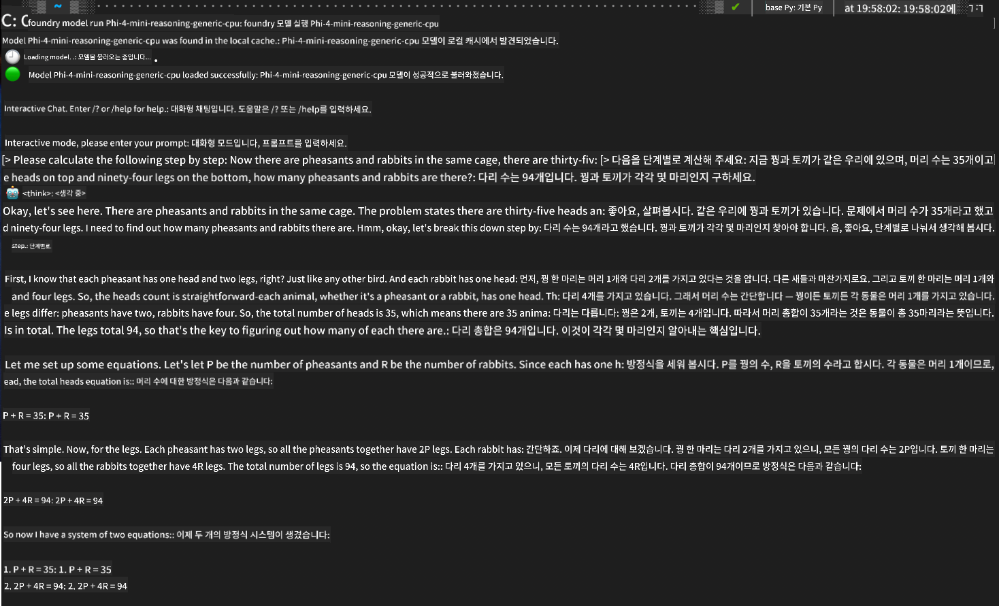

<!--
CO_OP_TRANSLATOR_METADATA:
{
  "original_hash": "52973a5680a65a810aa80b7036afd31f",
  "translation_date": "2025-06-27T13:36:03+00:00",
  "source_file": "md/01.Introduction/02/07.FoundryLocal.md",
  "language_code": "ko"
}
-->
## Foundry Local에서 Phi-Family 모델 시작하기

### Foundry Local 소개

Foundry Local은 강력한 온디바이스 AI 추론 솔루션으로, 엔터프라이즈급 AI 기능을 로컬 하드웨어에서 직접 사용할 수 있게 해줍니다. 이 튜토리얼에서는 Foundry Local과 함께 Phi-Family 모델을 설정하고 사용하는 방법을 안내하여, AI 작업을 완벽하게 제어하면서도 개인정보 보호와 비용 절감 효과를 누릴 수 있도록 도와드립니다.

Foundry Local은 AI 모델을 로컬 디바이스에서 실행하여 성능, 개인정보 보호, 맞춤화, 비용 측면에서 이점을 제공합니다. 직관적인 CLI, SDK, REST API를 통해 기존 워크플로우와 애플리케이션에 원활하게 통합됩니다.


### 왜 Foundry Local을 선택해야 할까요?

Foundry Local의 장점을 이해하면 AI 배포 전략을 더 현명하게 결정할 수 있습니다:

- **온디바이스 추론:** 자신의 하드웨어에서 모델을 실행하여 비용을 절감하고 모든 데이터를 디바이스 내에 안전하게 유지합니다.

- **모델 맞춤화:** 사전 설정된 모델을 선택하거나 직접 만든 모델을 사용하여 특정 요구사항과 사용 사례에 맞출 수 있습니다.

- **비용 효율성:** 기존 하드웨어를 활용하여 클라우드 서비스 비용을 없애 AI 접근성을 높입니다.

- **원활한 통합:** SDK, API 엔드포인트, CLI를 통해 애플리케이션과 연결하며, 필요에 따라 Azure AI Foundry로 쉽게 확장할 수 있습니다.

> **시작 안내:** 이 튜토리얼은 CLI와 SDK 인터페이스를 통한 Foundry Local 사용법에 중점을 둡니다. 두 가지 방법을 모두 익혀서 사용 사례에 가장 적합한 방식을 선택할 수 있습니다.

## 1부: Foundry Local CLI 설정하기

### 1단계: 설치

Foundry Local CLI는 로컬에서 AI 모델을 관리하고 실행하는 관문입니다. 먼저 시스템에 설치해 보겠습니다.

**지원 플랫폼:** Windows 및 macOS

자세한 설치 방법은 [공식 Foundry Local 문서](https://github.com/microsoft/Foundry-Local/blob/main/README.md)를 참고하세요.

### 2단계: 사용 가능한 모델 탐색하기

Foundry Local CLI를 설치한 후, 사용 가능한 모델을 확인할 수 있습니다. 다음 명령어로 지원되는 모든 모델을 확인하세요:


```bash
foundry model list
```

### 3단계: Phi Family 모델 이해하기

Phi Family는 다양한 사용 사례와 하드웨어 구성에 최적화된 여러 모델을 제공합니다. Foundry Local에서 사용할 수 있는 Phi 모델은 다음과 같습니다:

**사용 가능한 Phi 모델:** 

- **phi-3.5-mini** - 기본 작업에 적합한 소형 모델
- **phi-3-mini-128k** - 긴 대화에 적합한 확장 컨텍스트 버전
- **phi-3-mini-4k** - 일반 용도의 표준 컨텍스트 모델
- **phi-4** - 향상된 기능을 갖춘 고급 모델
- **phi-4-mini** - Phi-4의 경량 버전
- **phi-4-mini-reasoning** - 복잡한 추론 작업에 특화된 모델

> **하드웨어 호환성:** 각 모델은 시스템 성능에 따라 CPU, GPU 등 다양한 하드웨어 가속 옵션으로 구성할 수 있습니다.

### 4단계: 첫 Phi 모델 실행하기

실제 예제로 시작해 보겠습니다. 복잡한 문제를 단계별로 해결하는 데 뛰어난 `phi-4-mini-reasoning` 모델을 실행해 보겠습니다.


**모델 실행 명령어:**

```bash
foundry model run Phi-4-mini-reasoning-generic-cpu
```

> **초기 실행 시:** 모델을 처음 실행할 때 Foundry Local이 자동으로 로컬 디바이스에 다운로드합니다. 네트워크 속도에 따라 다운로드 시간이 달라질 수 있으니 처음 설정 시 잠시 기다려 주세요.

### 5단계: 실제 문제로 모델 테스트하기

이제 고전적인 논리 문제로 모델의 단계별 추론 능력을 시험해 보겠습니다:

**예제 문제:**

```txt
Please calculate the following step by step: Now there are pheasants and rabbits in the same cage, there are thirty-five heads on top and ninety-four legs on the bottom, how many pheasants and rabbits are there?
```

**예상 동작:** 모델은 이 문제를 논리적 단계로 나누어, 꿩은 다리가 2개이고 토끼는 4개라는 사실을 활용해 연립방정식을 풀어야 합니다.

**결과:**



## 2부: Foundry Local SDK로 애플리케이션 만들기

### 왜 SDK를 사용해야 할까요?

CLI는 테스트와 빠른 상호작용에 적합하지만, SDK를 사용하면 Foundry Local을 애플리케이션에 프로그래밍 방식으로 통합할 수 있습니다. 이를 통해 다음과 같은 가능성이 열립니다:

- 맞춤형 AI 기반 애플리케이션 개발
- 자동화된 워크플로우 구축
- 기존 시스템에 AI 기능 통합
- 챗봇 및 인터랙티브 도구 개발

### 지원 프로그래밍 언어

Foundry Local은 개발 환경에 맞게 다양한 프로그래밍 언어용 SDK를 제공합니다:

**📦 제공 SDK:**

- **C# (.NET):** [SDK 문서 및 예제](https://github.com/microsoft/Foundry-Local/tree/main/sdk/cs)
- **Python:** [SDK 문서 및 예제](https://github.com/microsoft/Foundry-Local/tree/main/sdk/python)
- **JavaScript:** [SDK 문서 및 예제](https://github.com/microsoft/Foundry-Local/tree/main/sdk/js)
- **Rust:** [SDK 문서 및 예제](https://github.com/microsoft/Foundry-Local/tree/main/sdk/rust)

### 다음 단계

1. 개발 환경에 맞는 **선호하는 SDK를 선택**하세요.
2. **SDK별 문서**를 참고하여 상세 구현 가이드를 확인하세요.
3. 복잡한 애플리케이션 개발 전에 **간단한 예제부터 시작**하세요.
4. 각 SDK 저장소에 제공된 **샘플 코드를 탐색**해 보세요.

## 결론

지금까지 다음 내용을 배웠습니다:
- ✅ Foundry Local CLI 설치 및 설정 방법
- ✅ Phi Family 모델 탐색 및 실행법
- ✅ 실제 문제를 통한 모델 테스트
- ✅ 애플리케이션 개발을 위한 SDK 옵션 이해

Foundry Local은 AI 기능을 로컬 환경으로 직접 가져와 성능, 개인정보 보호, 비용을 제어할 수 있는 강력한 기반을 제공하며, 필요할 때 클라우드 솔루션으로 확장할 수 있는 유연성도 갖추고 있습니다.

**면책 조항**:  
이 문서는 AI 번역 서비스 [Co-op Translator](https://github.com/Azure/co-op-translator)를 사용하여 번역되었습니다. 정확성을 위해 노력하고 있으나, 자동 번역에는 오류나 부정확성이 포함될 수 있음을 유의하시기 바랍니다. 원본 문서는 해당 언어의 원문이 권위 있는 자료로 간주되어야 합니다. 중요한 정보의 경우 전문적인 인간 번역을 권장합니다. 본 번역 사용으로 인한 오해나 잘못된 해석에 대해 당사는 책임을 지지 않습니다.