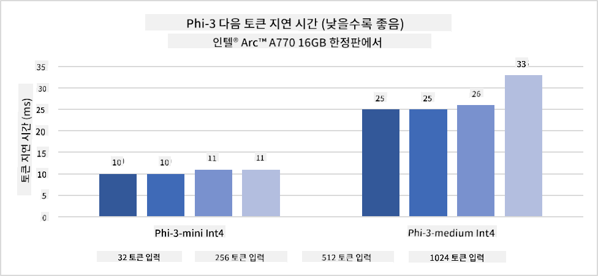
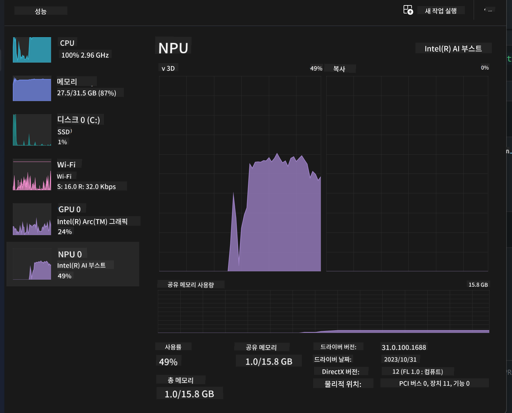
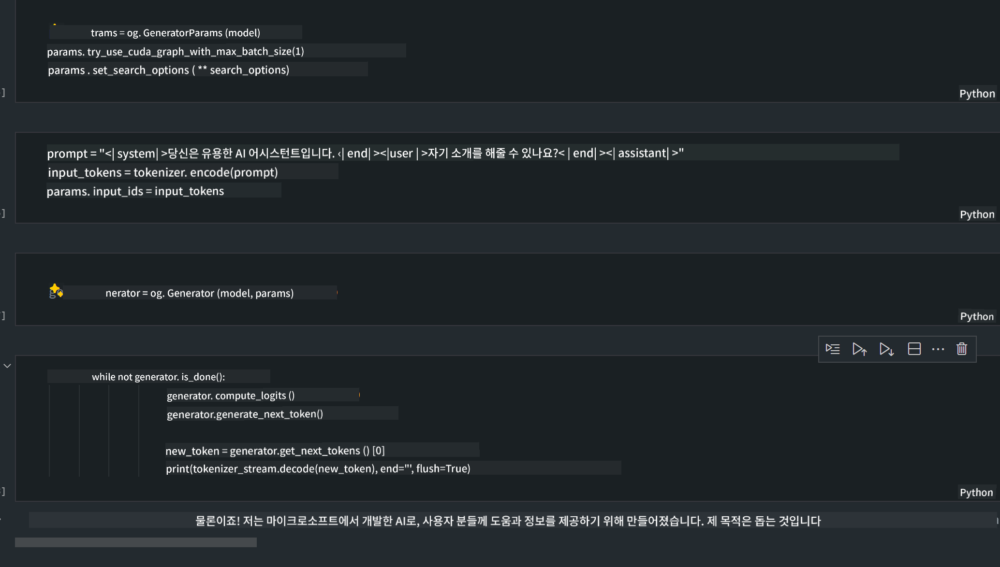
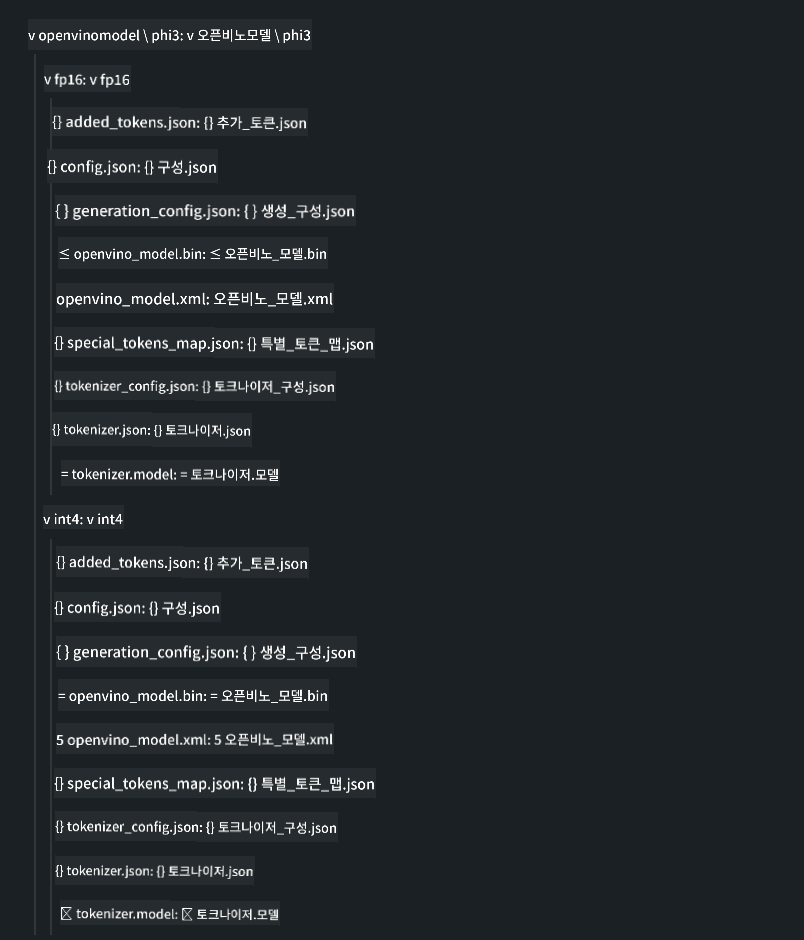

<!--
CO_OP_TRANSLATOR_METADATA:
{
  "original_hash": "e08ce816e23ad813244a09ca34ebb8ac",
  "translation_date": "2025-05-08T06:00:14+00:00",
  "source_file": "md/01.Introduction/03/AIPC_Inference.md",
  "language_code": "ko"
}
-->
# **AI PC에서 Phi-3 추론하기**

생성형 AI의 발전과 엣지 디바이스 하드웨어 성능 향상으로, 점점 더 많은 생성형 AI 모델이 사용자의 BYOD(Bring Your Own Device) 기기에 통합될 수 있게 되었습니다. AI PC도 이러한 모델 중 하나입니다. 2024년부터 인텔, AMD, 퀄컴이 PC 제조사와 협력하여 하드웨어 개조를 통해 로컬 생성형 AI 모델 배포를 지원하는 AI PC를 선보이고 있습니다. 이번 글에서는 인텔 AI PC를 중심으로 Intel AI PC에서 Phi-3를 배포하는 방법을 살펴보겠습니다.

### NPU란 무엇인가

NPU(Neural Processing Unit)는 신경망 연산과 AI 작업을 가속화하기 위해 설계된 SoC 내 전용 프로세서 또는 처리 장치입니다. 일반 CPU나 GPU와 달리, NPU는 데이터 중심의 병렬 컴퓨팅에 최적화되어 있어 비디오, 이미지와 같은 대용량 멀티미디어 데이터를 처리하고 신경망 연산에 적합합니다. 음성 인식, 화상 통화 배경 흐림, 객체 인식 등 AI 관련 작업에 특히 뛰어납니다.

## NPU와 GPU의 차이점

많은 AI 및 머신러닝 작업이 GPU에서 실행되지만, GPU와 NPU 사이에는 중요한 차이가 있습니다. GPU는 병렬 컴퓨팅에 강점을 가지지만, 그래픽 처리 외에는 효율성이 모두 동일하지 않습니다. 반면 NPU는 신경망 연산에 특화된 복잡한 계산을 수행하도록 설계되어 AI 작업에 매우 효과적입니다.

요약하자면, NPU는 AI 연산을 가속하는 수학 전문가로서 AI PC 시대에 핵심적인 역할을 합니다!

***이 예시는 인텔 최신 Intel Core Ultra 프로세서를 기반으로 합니다***

## **1. NPU를 이용해 Phi-3 모델 실행하기**

Intel® NPU 장치는 Intel® Core™ Ultra 세대 CPU(이전 Meteor Lake)부터 통합된 AI 추론 가속기로, 인공신경망 작업을 에너지 효율적으로 실행할 수 있게 해줍니다.




**Intel NPU 가속 라이브러리**

Intel NPU 가속 라이브러리 [https://github.com/intel/intel-npu-acceleration-library](https://github.com/intel/intel-npu-acceleration-library)는 Intel NPU의 강력한 연산 능력을 활용해 호환 하드웨어에서 고속 계산을 수행하도록 애플리케이션 효율을 높이는 파이썬 라이브러리입니다.

Intel® Core™ Ultra 프로세서 기반 AI PC에서 실행한 Phi-3-mini 예시.


pip로 파이썬 라이브러리 설치

```bash

   pip install intel-npu-acceleration-library

```

***참고*** 프로젝트는 아직 개발 중이지만, 참고용 모델은 이미 매우 완성도가 높습니다.

### **Intel NPU 가속 라이브러리로 Phi-3 실행하기**

Intel NPU 가속을 사용할 때, 기존 인코딩 프로세스에는 영향을 주지 않습니다. 이 라이브러리를 이용해 원본 Phi-3 모델을 FP16, INT8, INT4 등으로 양자화하면 됩니다.

```python
from transformers import AutoTokenizer, pipeline,TextStreamer
from intel_npu_acceleration_library import NPUModelForCausalLM, int4
from intel_npu_acceleration_library.compiler import CompilerConfig
import warnings

model_id = "microsoft/Phi-3-mini-4k-instruct"

compiler_conf = CompilerConfig(dtype=int4)
model = NPUModelForCausalLM.from_pretrained(
    model_id, use_cache=True, config=compiler_conf, attn_implementation="sdpa"
).eval()

tokenizer = AutoTokenizer.from_pretrained(model_id)

text_streamer = TextStreamer(tokenizer, skip_prompt=True)
```

양자화가 완료되면 NPU를 호출해 Phi-3 모델을 실행합니다.

```python
generation_args = {
   "max_new_tokens": 1024,
   "return_full_text": False,
   "temperature": 0.3,
   "do_sample": False,
   "streamer": text_streamer,
}

pipe = pipeline(
   "text-generation",
   model=model,
   tokenizer=tokenizer,
)

query = "<|system|>You are a helpful AI assistant.<|end|><|user|>Can you introduce yourself?<|end|><|assistant|>"

with warnings.catch_warnings():
    warnings.simplefilter("ignore")
    pipe(query, **generation_args)
```

코드를 실행하는 동안 작업 관리자를 통해 NPU의 실행 상태를 확인할 수 있습니다.



***샘플*** : [AIPC_NPU_DEMO.ipynb](../../../../../code/03.Inference/AIPC/AIPC_NPU_DEMO.ipynb)

## **2. DirectML + ONNX Runtime으로 Phi-3 모델 실행하기**

### **DirectML이란?**

[DirectML](https://github.com/microsoft/DirectML)은 머신러닝을 위한 고성능 하드웨어 가속 DirectX 12 라이브러리입니다. AMD, Intel, NVIDIA, Qualcomm 등 다양한 제조사의 DirectX 12 지원 GPU에서 공통 머신러닝 작업에 GPU 가속을 제공합니다.

단독으로 사용할 경우 DirectML API는 저수준 DirectX 12 라이브러리로, 프레임워크, 게임, 실시간 애플리케이션 등 고성능·저지연 환경에 적합합니다. Direct3D 12와의 원활한 상호운용성과 낮은 오버헤드, 하드웨어 전반에 걸친 호환성 덕분에 고성능과 신뢰성, 예측 가능한 결과가 중요한 머신러닝 가속에 이상적입니다.

***참고*** : 최신 DirectML은 이미 NPU를 지원합니다(https://devblogs.microsoft.com/directx/introducing-neural-processor-unit-npu-support-in-directml-developer-preview/)

### DirectML과 CUDA의 기능 및 성능 비교

**DirectML**은 마이크로소프트가 개발한 머신러닝 라이브러리로, Windows 기기(데스크톱, 노트북, 엣지 디바이스)에서 머신러닝 작업을 가속합니다.
- DX12 기반: DirectX 12 위에 구축되어 NVIDIA, AMD 등 다양한 GPU를 폭넓게 지원합니다.
- 광범위한 지원: DX12 지원 GPU라면 통합 GPU도 포함해 모두 사용 가능합니다.
- 이미지 처리: 신경망을 이용해 이미지 인식, 객체 탐지 등 작업에 적합합니다.
- 쉬운 설정: GPU 제조사의 별도 SDK나 라이브러리 없이 간단히 설정할 수 있습니다.
- 성능: 특정 작업에서는 CUDA보다 빠른 경우도 있습니다.
- 제한점: 다만 float16 대용량 배치에서는 느릴 수 있습니다.

**CUDA**는 NVIDIA의 병렬 컴퓨팅 플랫폼이자 프로그래밍 모델로, NVIDIA GPU를 활용한 범용 컴퓨팅과 머신러닝, 과학 시뮬레이션에 최적화되어 있습니다.
- NVIDIA 전용: NVIDIA GPU와 밀접하게 통합되어 있습니다.
- 고도로 최적화됨: NVIDIA GPU에서 탁월한 성능을 냅니다.
- 널리 사용됨: TensorFlow, PyTorch 등 많은 머신러닝 프레임워크가 CUDA를 지원합니다.
- 커스터마이징 가능: 특정 작업에 맞게 설정을 조정할 수 있어 최적 성능을 도출할 수 있습니다.
- 제한점: NVIDIA 하드웨어에 종속적이라 다른 GPU와의 호환성은 떨어집니다.

### DirectML과 CUDA 중 선택하기

DirectML과 CUDA 중 어느 것을 선택할지는 사용 환경, 하드웨어, 선호도에 따라 다릅니다. 보다 폭넓은 호환성과 간편한 설정을 원한다면 DirectML이 좋고, NVIDIA GPU가 있고 최적화된 성능이 필요하다면 CUDA가 유리합니다. 각각 장단점이 있으니 요구사항과 보유 하드웨어를 고려해 결정하세요.

### **ONNX Runtime으로 생성형 AI 실행하기**

AI 시대에는 AI 모델의 이식성이 매우 중요합니다. ONNX Runtime은 훈련된 모델을 다양한 기기에 쉽게 배포할 수 있게 해줍니다. 개발자는 추론 프레임워크에 신경 쓰지 않고 통합 API로 모델 추론을 완료할 수 있습니다. 생성형 AI 시대에는 ONNX Runtime이 코드 최적화(https://onnxruntime.ai/docs/genai/)도 수행해, 양자화된 생성형 AI 모델을 다양한 단말에서 추론할 수 있습니다. ONNX Runtime으로 생성형 AI 모델 API를 Python, C#, C/C++로 호출할 수 있으며, iPhone에서는 C++ API를 활용할 수 있습니다.

[샘플 코드](https://github.com/Azure-Samples/Phi-3MiniSamples/tree/main/onnx)

***ONNX Runtime 라이브러리 컴파일***

```bash

winget install --id=Kitware.CMake  -e

git clone https://github.com/microsoft/onnxruntime.git

cd .\onnxruntime\

./build.bat --build_shared_lib --skip_tests --parallel --use_dml --config Release

cd ../

git clone https://github.com/microsoft/onnxruntime-genai.git

cd .\onnxruntime-genai\

mkdir ort

cd ort

mkdir include

mkdir lib

copy ..\onnxruntime\include\onnxruntime\core\providers\dml\dml_provider_factory.h ort\include

copy ..\onnxruntime\include\onnxruntime\core\session\onnxruntime_c_api.h ort\include

copy ..\onnxruntime\build\Windows\Release\Release\*.dll ort\lib

copy ..\onnxruntime\build\Windows\Release\Release\onnxruntime.lib ort\lib

python build.py --use_dml


```

**라이브러리 설치**

```bash

pip install .\onnxruntime_genai_directml-0.3.0.dev0-cp310-cp310-win_amd64.whl

```

실행 결과



***샘플*** : [AIPC_DirectML_DEMO.ipynb](../../../../../code/03.Inference/AIPC/AIPC_DirectML_DEMO.ipynb)

## **3. Intel OpenVino로 Phi-3 모델 실행하기**

### **OpenVINO란?**

[OpenVINO](https://github.com/openvinotoolkit/openvino)는 딥러닝 모델 최적화 및 배포를 위한 오픈소스 툴킷입니다. TensorFlow, PyTorch 등 주요 프레임워크의 비전, 오디오, 언어 모델 성능을 향상시킵니다. OpenVINO는 CPU와 GPU를 조합해 Phi-3 모델을 실행할 수도 있습니다.

***참고***: 현재 OpenVINO는 NPU를 지원하지 않습니다.

### **OpenVINO 라이브러리 설치**

```bash

 pip install git+https://github.com/huggingface/optimum-intel.git

 pip install git+https://github.com/openvinotoolkit/nncf.git

 pip install openvino-nightly

```

### **OpenVINO로 Phi-3 실행하기**

NPU와 마찬가지로 OpenVINO도 양자화 모델을 실행해 생성형 AI 모델을 호출합니다. 먼저 Phi-3 모델을 양자화하고 optimum-cli를 통해 커맨드 라인에서 모델 양자화를 완료해야 합니다.

**INT4**

```bash

optimum-cli export openvino --model "microsoft/Phi-3-mini-4k-instruct" --task text-generation-with-past --weight-format int4 --group-size 128 --ratio 0.6  --sym  --trust-remote-code ./openvinomodel/phi3/int4

```

**FP16**

```bash

optimum-cli export openvino --model "microsoft/Phi-3-mini-4k-instruct" --task text-generation-with-past --weight-format fp16 --trust-remote-code ./openvinomodel/phi3/fp16

```

변환된 형식 예시



OVModelForCausalLM을 통해 모델 경로(model_dir), 관련 설정(ov_config = {"PERFORMANCE_HINT": "LATENCY", "NUM_STREAMS": "1", "CACHE_DIR": ""}), 하드웨어 가속 장치(GPU.0)를 불러옵니다.

```python

ov_model = OVModelForCausalLM.from_pretrained(
     model_dir,
     device='GPU.0',
     ov_config=ov_config,
     config=AutoConfig.from_pretrained(model_dir, trust_remote_code=True),
     trust_remote_code=True,
)

```

코드 실행 중 작업 관리자를 통해 GPU 실행 상태를 확인할 수 있습니다.


***샘플*** : [AIPC_OpenVino_Demo.ipynb](../../../../../code/03.Inference/AIPC/AIPC_OpenVino_Demo.ipynb)

### ***참고*** : 위 세 가지 방법은 각각 장점이 있지만, AI PC 추론에는 NPU 가속 사용을 권장합니다.

**면책 조항**:  
이 문서는 AI 번역 서비스 [Co-op Translator](https://github.com/Azure/co-op-translator)를 사용하여 번역되었습니다. 정확성을 위해 노력하고 있으나, 자동 번역에는 오류나 부정확한 내용이 포함될 수 있음을 유의하시기 바랍니다. 원본 문서의 원어가 권위 있는 출처로 간주되어야 합니다. 중요한 정보의 경우 전문적인 인간 번역을 권장합니다. 본 번역 사용으로 인해 발생하는 오해나 잘못된 해석에 대해 당사는 책임을 지지 않습니다.