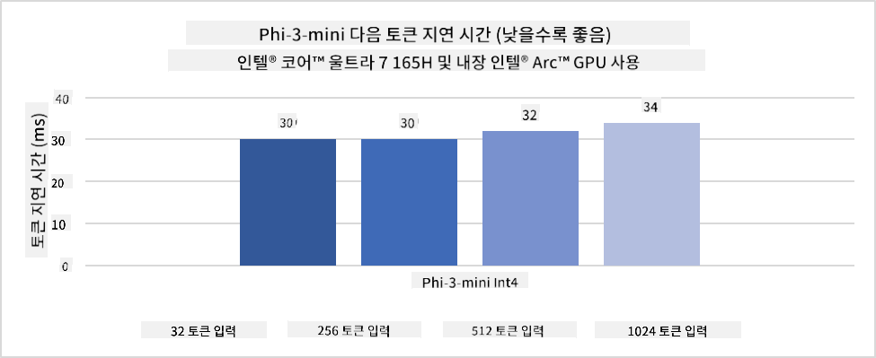
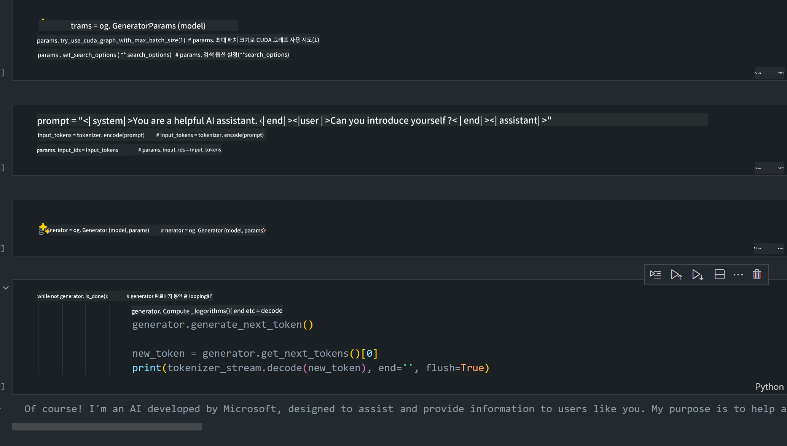
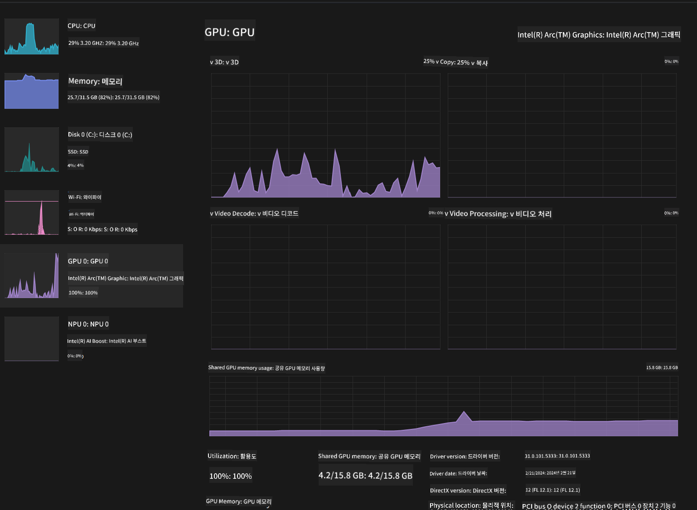

<!--
CO_OP_TRANSLATOR_METADATA:
{
  "original_hash": "5ca6ea8da7aa1335ef287124462b2833",
  "translation_date": "2025-04-04T05:52:56+00:00",
  "source_file": "md\\01.Introduction\\03\\AIPC_Inference.md",
  "language_code": "ko"
}
-->
# **AI PC에서 Phi-3 모델 추론**

생성형 AI의 발전과 엣지 디바이스 하드웨어 성능의 향상으로, 점점 더 많은 생성형 AI 모델이 사용자들의 BYOD(Bring Your Own Device) 디바이스에 통합될 수 있게 되었습니다. AI PC는 이러한 모델 중 하나입니다. 2024년부터 Intel, AMD, Qualcomm은 PC 제조업체들과 협력하여 하드웨어 변화를 통해 로컬 생성형 AI 모델 배포를 가능하게 하는 AI PC를 선보일 예정입니다. 이번 논의에서는 Intel AI PC에 초점을 맞추고, Intel AI PC에서 Phi-3 모델을 배포하는 방법을 살펴보겠습니다.

### NPU란 무엇인가?

NPU(Neural Processing Unit)는 신경망 작업과 AI 작업을 가속화하기 위해 설계된 전용 프로세서 또는 더 큰 SoC 내의 처리 유닛입니다. 범용 CPU와 GPU와는 달리, NPU는 데이터 중심의 병렬 컴퓨팅에 최적화되어 있어 대규모 멀티미디어 데이터(예: 비디오 및 이미지)를 처리하고 신경망 데이터를 처리하는 데 매우 효율적입니다. NPU는 특히 음성 인식, 화상 통화 중 배경 흐림 처리, 객체 탐지와 같은 사진 또는 비디오 편집 작업 등 AI 관련 작업을 처리하는 데 뛰어난 성능을 발휘합니다.

## NPU vs GPU

많은 AI 및 머신러닝 작업이 GPU에서 실행되지만, GPU와 NPU 사이에는 중요한 차이가 있습니다.  
GPU는 병렬 컴퓨팅 능력으로 유명하지만, 모든 GPU가 그래픽 처리 외의 작업에 동일하게 효율적인 것은 아닙니다. 반면, NPU는 신경망 작업의 복잡한 계산을 처리하도록 설계되어 AI 작업에 매우 효과적입니다.

요약하자면, NPU는 AI 계산을 가속화하는 수학 천재이며, AI PC의 새로운 시대에서 중요한 역할을 합니다!

***이 예시는 Intel의 최신 Intel Core Ultra Processor를 기반으로 합니다***

## **1. NPU를 사용하여 Phi-3 모델 실행하기**

Intel® NPU 디바이스는 Intel® Core™ Ultra 세대 CPU(이전 Meteor Lake)부터 통합된 AI 추론 가속기입니다. 이를 통해 인공 신경망 작업을 에너지 효율적으로 실행할 수 있습니다.




**Intel NPU 가속 라이브러리**

Intel NPU 가속 라이브러리 [https://github.com/intel/intel-npu-acceleration-library](https://github.com/intel/intel-npu-acceleration-library)는 Intel Neural Processing Unit(NPU)의 성능을 활용하여 호환 하드웨어에서 고속 계산을 수행함으로써 애플리케이션의 효율성을 높이는 Python 라이브러리입니다.

Intel® Core™ Ultra 프로세서로 구동되는 AI PC에서 Phi-3-mini의 예제.


Python 라이브러리를 pip로 설치하기

```bash

   pip install intel-npu-acceleration-library

```

***참고*** 이 프로젝트는 아직 개발 중이지만, 참조 모델은 이미 매우 완성도가 높습니다.

### **Intel NPU 가속 라이브러리를 사용하여 Phi-3 실행하기**

Intel NPU 가속을 사용하면, 이 라이브러리가 기존 인코딩 프로세스에 영향을 주지 않습니다. 단순히 이 라이브러리를 사용하여 원래 Phi-3 모델을 FP16, INT8, INT4 등으로 양자화하면 됩니다.

```python
from transformers import AutoTokenizer, pipeline,TextStreamer
from intel_npu_acceleration_library import NPUModelForCausalLM, int4
from intel_npu_acceleration_library.compiler import CompilerConfig
import warnings

model_id = "microsoft/Phi-3-mini-4k-instruct"

compiler_conf = CompilerConfig(dtype=int4)
model = NPUModelForCausalLM.from_pretrained(
    model_id, use_cache=True, config=compiler_conf, attn_implementation="sdpa"
).eval()

tokenizer = AutoTokenizer.from_pretrained(model_id)

text_streamer = TextStreamer(tokenizer, skip_prompt=True)
```

양자화가 성공하면 NPU를 호출하여 Phi-3 모델을 실행합니다.

```python
generation_args = {
   "max_new_tokens": 1024,
   "return_full_text": False,
   "temperature": 0.3,
   "do_sample": False,
   "streamer": text_streamer,
}

pipe = pipeline(
   "text-generation",
   model=model,
   tokenizer=tokenizer,
)

query = "<|system|>You are a helpful AI assistant.<|end|><|user|>Can you introduce yourself?<|end|><|assistant|>"

with warnings.catch_warnings():
    warnings.simplefilter("ignore")
    pipe(query, **generation_args)
```

코드 실행 시 작업 관리자를 통해 NPU의 실행 상태를 확인할 수 있습니다.


***샘플*** : [AIPC_NPU_DEMO.ipynb](../../../../../code/03.Inference/AIPC/AIPC_NPU_DEMO.ipynb)

## **2. DirectML + ONNX Runtime을 사용하여 Phi-3 모델 실행하기**

### **DirectML이란?**

[DirectML](https://github.com/microsoft/DirectML)은 머신러닝을 위한 고성능 하드웨어 가속 DirectX 12 라이브러리입니다. DirectML은 AMD, Intel, NVIDIA, Qualcomm과 같은 다양한 하드웨어 및 드라이버를 지원하는 모든 DirectX 12 호환 GPU에서 일반적인 머신러닝 작업에 GPU 가속을 제공합니다.

단독으로 사용할 때, DirectML API는 저지연 고성능 애플리케이션(프레임워크, 게임, 기타 실시간 애플리케이션)에 적합한 저수준 DirectX 12 라이브러리입니다. DirectML의 Direct3D 12와의 원활한 상호 운용성, 낮은 오버헤드 및 하드웨어 간 일관성은 높은 성능과 결과의 신뢰성을 원하는 경우 머신러닝 가속에 이상적입니다.

***참고*** : 최신 DirectML은 이미 NPU를 지원합니다(https://devblogs.microsoft.com/directx/introducing-neural-processor-unit-npu-support-in-directml-developer-preview/).

### DirectML과 CUDA의 성능 및 기능 비교:

**DirectML**은 Microsoft에서 개발한 머신러닝 라이브러리로, Windows 디바이스(데스크톱, 노트북, 엣지 디바이스)에서 머신러닝 작업을 가속화하도록 설계되었습니다.
- DX12 기반: DirectML은 DirectX 12(DX12)를 기반으로 하며, NVIDIA와 AMD를 포함한 다양한 GPU 하드웨어를 지원합니다.
- 폭넓은 호환성: DX12를 활용하므로 통합 GPU를 포함하여 DX12를 지원하는 모든 GPU에서 작동할 수 있습니다.
- 이미지 처리: DirectML은 이미지 인식, 객체 탐지 등과 같은 작업에 적합한 신경망을 사용하여 이미지를 처리합니다.
- 설정 용이성: DirectML은 설정이 간단하며, GPU 제조업체의 특정 SDK나 라이브러리가 필요하지 않습니다.
- 성능: 특정 작업에서는 DirectML이 CUDA보다 빠를 수 있습니다.
- 제한점: 그러나 일부 작업, 특히 float16 대규모 배치 크기에서는 DirectML이 느릴 수 있습니다.

**CUDA**는 NVIDIA의 병렬 컴퓨팅 플랫폼 및 프로그래밍 모델로, NVIDIA GPU의 성능을 활용하여 머신러닝 및 과학 시뮬레이션과 같은 범용 컴퓨팅 작업을 수행할 수 있습니다.
- NVIDIA 전용: CUDA는 NVIDIA GPU와 긴밀히 통합되어 있습니다.
- 높은 최적화: NVIDIA GPU를 사용하는 GPU 가속 작업에서 뛰어난 성능을 제공합니다.
- 널리 사용됨: TensorFlow, PyTorch와 같은 많은 머신러닝 프레임워크와 라이브러리가 CUDA를 지원합니다.
- 커스터마이징: 개발자는 특정 작업에 대해 CUDA 설정을 세밀하게 조정하여 최적의 성능을 얻을 수 있습니다.
- 제한점: 하지만 CUDA는 NVIDIA 하드웨어에 의존하므로 다양한 GPU에서의 호환성이 제한될 수 있습니다.

### DirectML과 CUDA 선택하기

DirectML과 CUDA 중에서 선택할 때는 특정 사용 사례, 하드웨어 가용성, 개인 선호도를 고려해야 합니다.  
폭넓은 호환성과 설정의 용이성을 원한다면 DirectML이 좋은 선택일 수 있습니다. 그러나 NVIDIA GPU를 보유하고 있고 고도로 최적화된 성능이 필요하다면 CUDA가 강력한 대안으로 남아 있습니다. 요약하자면, DirectML과 CUDA는 각각의 장단점이 있으므로 요구 사항과 사용 가능한 하드웨어를 기반으로 결정을 내리십시오.

### **ONNX Runtime을 활용한 생성형 AI**

AI 시대에서는 AI 모델의 이식성이 매우 중요합니다. ONNX Runtime을 사용하면 훈련된 모델을 손쉽게 다양한 디바이스로 배포할 수 있습니다. 개발자는 추론 프레임워크를 신경 쓰지 않고 통합된 API를 사용하여 모델 추론을 완료할 수 있습니다. 생성형 AI 시대에서 ONNX Runtime은 코드 최적화(https://onnxruntime.ai/docs/genai/)도 수행합니다. 최적화된 ONNX Runtime을 통해 양자화된 생성형 AI 모델을 다양한 단말에서 추론할 수 있습니다. ONNX Runtime을 활용한 생성형 AI에서는 Python, C#, C/C++ API를 통해 AI 모델을 추론할 수 있습니다. 물론 iPhone에서 C++의 ONNX Runtime API를 활용한 생성형 AI 배포도 가능합니다.

[샘플 코드](https://github.com/Azure-Samples/Phi-3MiniSamples/tree/main/onnx)

***ONNX Runtime 라이브러리로 생성형 AI 컴파일하기***

```bash

winget install --id=Kitware.CMake  -e

git clone https://github.com/microsoft/onnxruntime.git

cd .\onnxruntime\

./build.bat --build_shared_lib --skip_tests --parallel --use_dml --config Release

cd ../

git clone https://github.com/microsoft/onnxruntime-genai.git

cd .\onnxruntime-genai\

mkdir ort

cd ort

mkdir include

mkdir lib

copy ..\onnxruntime\include\onnxruntime\core\providers\dml\dml_provider_factory.h ort\include

copy ..\onnxruntime\include\onnxruntime\core\session\onnxruntime_c_api.h ort\include

copy ..\onnxruntime\build\Windows\Release\Release\*.dll ort\lib

copy ..\onnxruntime\build\Windows\Release\Release\onnxruntime.lib ort\lib

python build.py --use_dml


```

**라이브러리 설치**

```bash

pip install .\onnxruntime_genai_directml-0.3.0.dev0-cp310-cp310-win_amd64.whl

```

실행 결과는 다음과 같습니다.



***샘플*** : [AIPC_DirectML_DEMO.ipynb](../../../../../code/03.Inference/AIPC/AIPC_DirectML_DEMO.ipynb)

## **3. Intel OpenVINO를 사용하여 Phi-3 모델 실행하기**

### **OpenVINO란?**

[OpenVINO](https://github.com/openvinotoolkit/openvino)는 딥러닝 모델 최적화 및 배포를 위한 오픈소스 툴킷입니다. TensorFlow, PyTorch 등 인기 있는 프레임워크에서 비전, 오디오, 언어 모델의 딥러닝 성능을 향상시킵니다. OpenVINO를 사용하여 시작하세요. OpenVINO는 CPU 및 GPU와 결합하여 Phi-3 모델을 실행하는 데도 사용할 수 있습니다.

***참고***: 현재 OpenVINO는 NPU를 지원하지 않습니다.

### **OpenVINO 라이브러리 설치**

```bash

 pip install git+https://github.com/huggingface/optimum-intel.git

 pip install git+https://github.com/openvinotoolkit/nncf.git

 pip install openvino-nightly

```

### **OpenVINO를 사용하여 Phi-3 실행하기**

NPU와 마찬가지로 OpenVINO는 양자화된 모델을 실행하여 생성형 AI 모델을 호출합니다. 먼저 Phi-3 모델을 양자화해야 하며, 명령줄에서 optimum-cli를 통해 모델 양자화를 완료합니다.

**INT4**

```bash

optimum-cli export openvino --model "microsoft/Phi-3-mini-4k-instruct" --task text-generation-with-past --weight-format int4 --group-size 128 --ratio 0.6  --sym  --trust-remote-code ./openvinomodel/phi3/int4

```

**FP16**

```bash

optimum-cli export openvino --model "microsoft/Phi-3-mini-4k-instruct" --task text-generation-with-past --weight-format fp16 --trust-remote-code ./openvinomodel/phi3/fp16

```

변환된 형식은 다음과 같습니다.


OVModelForCausalLM을 통해 모델 경로(model_dir), 관련 설정(ov_config = {"PERFORMANCE_HINT": "LATENCY", "NUM_STREAMS": "1", "CACHE_DIR": ""}), 하드웨어 가속 장치(GPU.0)를 로드합니다.

```python

ov_model = OVModelForCausalLM.from_pretrained(
     model_dir,
     device='GPU.0',
     ov_config=ov_config,
     config=AutoConfig.from_pretrained(model_dir, trust_remote_code=True),
     trust_remote_code=True,
)

```

코드 실행 시 작업 관리자를 통해 GPU의 실행 상태를 확인할 수 있습니다.



***샘플*** : [AIPC_OpenVino_Demo.ipynb](../../../../../code/03.Inference/AIPC/AIPC_OpenVino_Demo.ipynb)

### ***참고*** : 위의 세 가지 방법은 각각의 장점이 있지만, AI PC 추론에는 NPU 가속을 사용하는 것을 권장합니다.

**면책조항**:  
이 문서는 AI 번역 서비스 [Co-op Translator](https://github.com/Azure/co-op-translator)를 사용하여 번역되었습니다. 정확성을 위해 최선을 다하고 있으나, 자동 번역은 오류나 부정확성을 포함할 수 있습니다. 원문이 작성된 원어 문서를 신뢰할 수 있는 권위 있는 출처로 간주해야 합니다. 중요한 정보의 경우, 전문적인 인간 번역을 권장합니다. 이 번역 사용으로 인해 발생할 수 있는 오해나 잘못된 해석에 대해 당사는 책임을 지지 않습니다.