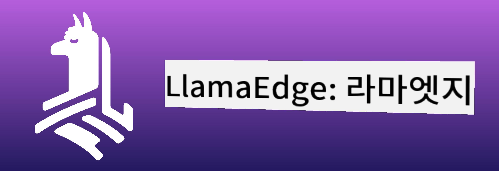
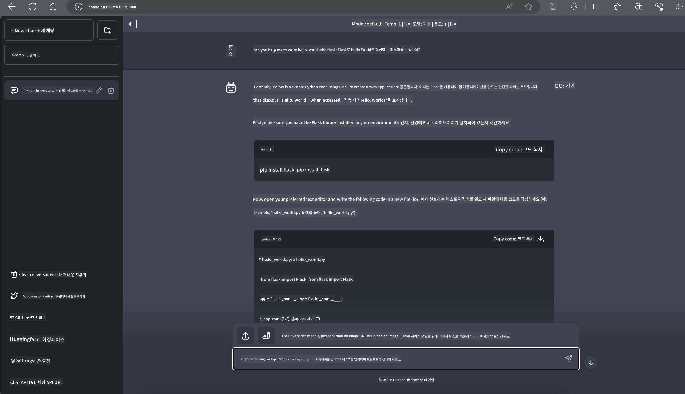

<!--
CO_OP_TRANSLATOR_METADATA:
{
  "original_hash": "be4101a30d98e95a71d42c276e8bcd37",
  "translation_date": "2025-05-08T05:55:26+00:00",
  "source_file": "md/01.Introduction/03/Jetson_Inference.md",
  "language_code": "ko"
}
-->
# **Nvidia Jetson에서 Phi-3 추론**

Nvidia Jetson은 Nvidia에서 만든 임베디드 컴퓨팅 보드 시리즈입니다. Jetson TK1, TX1, TX2 모델은 모두 ARM 아키텍처 CPU가 통합된 Nvidia의 Tegra 프로세서(또는 SoC)를 탑재하고 있습니다. Jetson은 저전력 시스템으로 머신러닝 애플리케이션 가속을 위해 설계되었습니다. Nvidia Jetson은 전문 개발자들이 다양한 산업 분야에서 혁신적인 AI 제품을 만들기 위해 사용하며, 학생과 AI 애호가들이 실습을 통해 AI를 배우고 놀라운 프로젝트를 만드는 데 활용합니다. SLM은 Jetson과 같은 엣지 디바이스에 배포되어 산업용 생성 AI 애플리케이션 시나리오의 구현을 더욱 향상시킵니다.

## NVIDIA Jetson에서의 배포:
자율 로봇 및 임베디드 디바이스 개발자들은 Phi-3 Mini를 활용할 수 있습니다. Phi-3는 비교적 작은 크기로 엣지 배포에 적합합니다. 학습 과정에서 매개변수가 세밀하게 조정되어 높은 응답 정확도를 보장합니다.

### TensorRT-LLM 최적화:
NVIDIA의 [TensorRT-LLM 라이브러리](https://github.com/NVIDIA/TensorRT-LLM?WT.mc_id=aiml-138114-kinfeylo)는 대형 언어 모델 추론을 최적화합니다. Phi-3 Mini의 긴 컨텍스트 윈도우를 지원하여 처리량과 지연 시간을 모두 개선합니다. 최적화 기법으로는 LongRoPE, FP8, inflight 배칭 등이 포함됩니다.

### 사용 가능성 및 배포:
개발자들은 [NVIDIA의 AI 페이지](https://www.nvidia.com/en-us/ai-data-science/generative-ai/)에서 128K 컨텍스트 윈도우를 가진 Phi-3 Mini를 탐색할 수 있습니다. 이는 표준 API를 가진 마이크로서비스인 NVIDIA NIM 형태로 패키징되어 어디서든 배포할 수 있습니다. 또한 [GitHub의 TensorRT-LLM 구현체](https://github.com/NVIDIA/TensorRT-LLM)도 참고할 수 있습니다.

## **1. 준비 사항**

a. Jetson Orin NX / Jetson NX

b. JetPack 5.1.2+

c. Cuda 11.8

d. Python 3.8+

## **2. Jetson에서 Phi-3 실행하기**

[Ollama](https://ollama.com) 또는 [LlamaEdge](https://llamaedge.com)를 선택할 수 있습니다.

클라우드와 엣지 디바이스에서 동시에 gguf를 사용하려면 LlamaEdge를 WasmEdge로 이해할 수 있습니다. (WasmEdge는 클라우드 네이티브, 엣지, 분산 애플리케이션에 적합한 경량 고성능 확장 가능한 WebAssembly 런타임입니다. 서버리스 애플리케이션, 임베디드 함수, 마이크로서비스, 스마트 계약, IoT 디바이스를 지원합니다.) LlamaEdge를 통해 gguf의 양자화 모델을 엣지 디바이스와 클라우드에 배포할 수 있습니다.



사용 방법은 다음과 같습니다.

1. 관련 라이브러리와 파일 설치 및 다운로드

```bash

curl -sSf https://raw.githubusercontent.com/WasmEdge/WasmEdge/master/utils/install.sh | bash -s -- --plugin wasi_nn-ggml

curl -LO https://github.com/LlamaEdge/LlamaEdge/releases/latest/download/llama-api-server.wasm

curl -LO https://github.com/LlamaEdge/chatbot-ui/releases/latest/download/chatbot-ui.tar.gz

tar xzf chatbot-ui.tar.gz

```

**참고**: llama-api-server.wasm과 chatbot-ui는 동일한 디렉터리에 있어야 합니다.

2. 터미널에서 스크립트 실행

```bash

wasmedge --dir .:. --nn-preload default:GGML:AUTO:{Your gguf path} llama-api-server.wasm -p phi-3-chat

```

실행 결과는 다음과 같습니다.



***샘플 코드*** [Phi-3 mini WASM Notebook 샘플](https://github.com/Azure-Samples/Phi-3MiniSamples/tree/main/wasm)

요약하자면, Phi-3 Mini는 효율성, 컨텍스트 인식, NVIDIA의 최적화 역량을 결합한 언어 모델링의 도약을 의미합니다. 로봇을 만들거나 엣지 애플리케이션을 개발할 때 Phi-3 Mini는 주목할 만한 강력한 도구입니다.

**면책 조항**:  
이 문서는 AI 번역 서비스 [Co-op Translator](https://github.com/Azure/co-op-translator)를 사용하여 번역되었습니다. 정확성을 위해 최선을 다하고 있으나, 자동 번역에는 오류나 부정확성이 포함될 수 있음을 유의해 주시기 바랍니다. 원문은 해당 언어로 된 원본 문서가 권위 있는 출처로 간주되어야 합니다. 중요한 정보의 경우, 전문적인 인간 번역을 권장합니다. 본 번역 사용으로 인한 오해나 잘못된 해석에 대해 당사는 책임을 지지 않습니다.