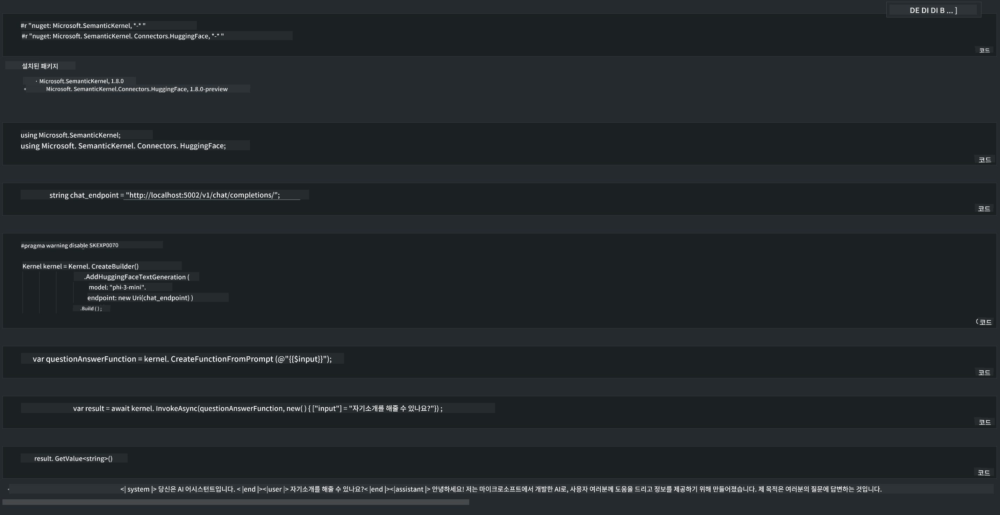

<!--
CO_OP_TRANSLATOR_METADATA:
{
  "original_hash": "bcf5dd7031db0031abdb9dd0c05ba118",
  "translation_date": "2025-05-08T05:56:56+00:00",
  "source_file": "md/01.Introduction/03/Local_Server_Inference.md",
  "language_code": "ko"
}
-->
# **로컬 서버에서 Phi-3 추론**

Phi-3를 로컬 서버에 배포할 수 있습니다. 사용자는 [Ollama](https://ollama.com) 또는 [LM Studio](https://llamaedge.com) 솔루션을 선택하거나 직접 코드를 작성할 수 있습니다. Phi-3의 로컬 서비스를 [Semantic Kernel](https://github.com/microsoft/semantic-kernel?WT.mc_id=aiml-138114-kinfeylo) 또는 [Langchain](https://www.langchain.com/)을 통해 연결하여 Copilot 애플리케이션을 만들 수 있습니다.

## **Semantic Kernel을 사용해 Phi-3-mini 접근하기**

Copilot 애플리케이션에서는 Semantic Kernel / LangChain을 통해 애플리케이션을 만듭니다. 이런 유형의 애플리케이션 프레임워크는 일반적으로 Azure OpenAI Service / OpenAI 모델과 호환되며, Hugging Face의 오픈 소스 모델이나 로컬 모델도 지원할 수 있습니다. Semantic Kernel을 사용해 Phi-3-mini에 접근하려면 어떻게 해야 할까요? .NET을 예로 들면, Semantic Kernel의 Hugging Face Connector와 결합할 수 있습니다. 기본적으로 Hugging Face의 모델 id에 대응하며(처음 사용할 때는 모델을 Hugging Face에서 다운로드하므로 시간이 오래 걸립니다), 직접 구축한 로컬 서비스에도 연결할 수 있습니다. 이 두 가지 방법 중에서는 후자를 추천하는데, 특히 기업용 애플리케이션에서 자율성이 더 높기 때문입니다.

위 그림에서 볼 수 있듯 Semantic Kernel을 통해 로컬 서비스에 접근하면 직접 구축한 Phi-3-mini 모델 서버에 쉽게 연결할 수 있습니다. 다음은 실행 결과입니다.

***샘플 코드*** https://github.com/kinfey/Phi3MiniSamples/tree/main/semantickernel

**면책 조항**:  
이 문서는 AI 번역 서비스 [Co-op Translator](https://github.com/Azure/co-op-translator)를 사용하여 번역되었습니다. 정확성을 위해 노력하고 있으나, 자동 번역에는 오류나 부정확성이 있을 수 있음을 양지해 주시기 바랍니다. 원본 문서는 해당 언어로 된 원문이 권위 있는 출처로 간주되어야 합니다. 중요한 정보의 경우 전문적인 인간 번역을 권장합니다. 본 번역 사용으로 인해 발생하는 오해나 잘못된 해석에 대해 당사는 책임을 지지 않습니다.