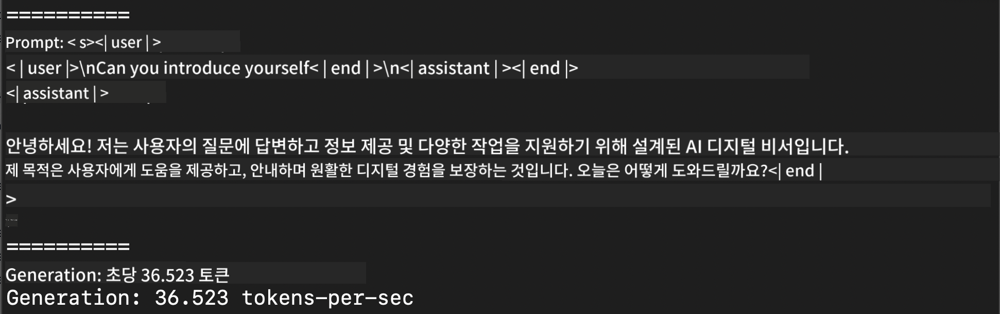
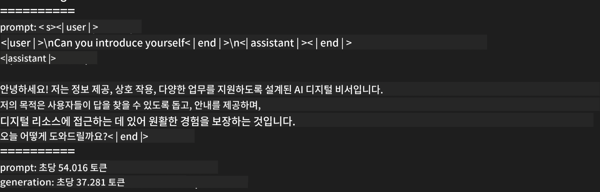

<!--
CO_OP_TRANSLATOR_METADATA:
{
  "original_hash": "700b9a537ce4426de5a7ccfa8e96e581",
  "translation_date": "2025-04-04T06:00:26+00:00",
  "source_file": "md\\01.Introduction\\03\\MLX_Inference.md",
  "language_code": "ko"
}
-->
# **Apple MLX 프레임워크를 사용한 Phi-3 추론**

## **MLX 프레임워크란 무엇인가**

MLX는 Apple 실리콘에서 머신 러닝 연구를 위한 배열 프레임워크로, Apple 머신 러닝 연구팀에 의해 개발되었습니다.

MLX는 머신 러닝 연구자들을 위해 설계된 프레임워크로, 사용자 친화적이면서도 모델을 효율적으로 학습하고 배포할 수 있도록 설계되었습니다. 프레임워크 자체의 디자인은 개념적으로도 간단하여 연구자들이 MLX를 쉽게 확장하고 개선할 수 있도록 하며, 새로운 아이디어를 빠르게 탐구할 수 있도록 돕습니다.

Apple 실리콘 디바이스에서 MLX를 통해 LLM을 가속화할 수 있으며, 모델을 로컬에서 매우 편리하게 실행할 수 있습니다.

## **MLX를 사용하여 Phi-3-mini 추론하기**

### **1. MLX 환경 설정하기**

1. Python 3.11.x
2. MLX 라이브러리 설치하기

```bash

pip install mlx-lm

```

### **2. 터미널에서 MLX를 사용하여 Phi-3-mini 실행하기**

```bash

python -m mlx_lm.generate --model microsoft/Phi-3-mini-4k-instruct --max-token 2048 --prompt  "<|user|>\nCan you introduce yourself<|end|>\n<|assistant|>"

```

결과 (내 환경은 Apple M1 Max, 64GB):



### **3. 터미널에서 MLX를 사용하여 Phi-3-mini 양자화하기**

```bash

python -m mlx_lm.convert --hf-path microsoft/Phi-3-mini-4k-instruct

```

***참고：*** 모델은 mlx_lm.convert를 통해 양자화할 수 있으며, 기본 양자화는 INT4입니다. 이 예제는 Phi-3-mini를 INT4로 양자화하는 것입니다.

모델은 mlx_lm.convert를 통해 양자화할 수 있으며, 기본 양자화는 INT4입니다. 이 예제에서는 Phi-3-mini를 INT4로 양자화합니다. 양자화 후에는 기본 디렉토리 ./mlx_model에 저장됩니다.

터미널에서 MLX로 양자화된 모델을 테스트할 수 있습니다.

```bash

python -m mlx_lm.generate --model ./mlx_model/ --max-token 2048 --prompt  "<|user|>\nCan you introduce yourself<|end|>\n<|assistant|>"

```

결과는 다음과 같습니다:



### **4. Jupyter Notebook에서 MLX를 사용하여 Phi-3-mini 실행하기**


***참고:*** 이 샘플을 확인하려면 [이 링크 클릭](../../../../../code/03.Inference/MLX/MLX_DEMO.ipynb)

## **리소스**

1. Apple MLX 프레임워크에 대해 알아보기 [https://ml-explore.github.io](https://ml-explore.github.io/mlx/build/html/index.html)

2. Apple MLX GitHub 저장소 [https://github.com/ml-explore](https://github.com/ml-explore)

**면책 조항**:  
이 문서는 AI 번역 서비스 [Co-op Translator](https://github.com/Azure/co-op-translator)를 사용하여 번역되었습니다. 정확성을 위해 최선을 다하고 있지만, 자동 번역은 오류나 부정확성을 포함할 수 있습니다. 원본 문서의 원어가 권위 있는 출처로 간주되어야 합니다. 중요한 정보에 대해서는 전문적인 인간 번역을 권장합니다. 이 번역 사용으로 인해 발생하는 오해나 잘못된 해석에 대해 책임을 지지 않습니다.