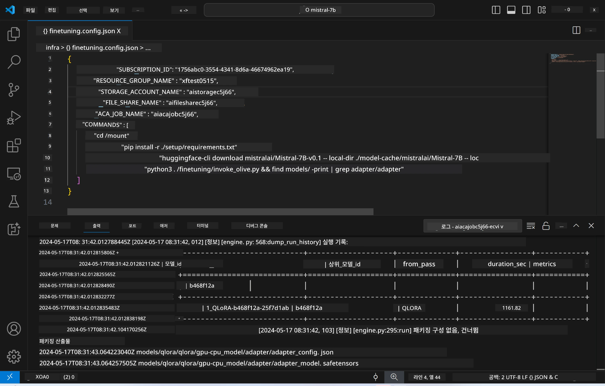
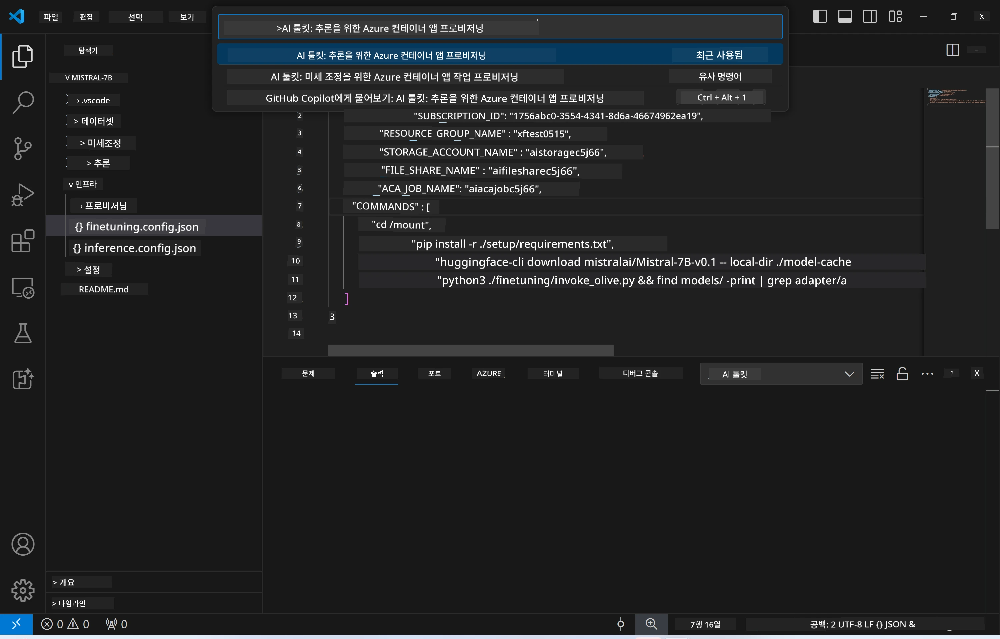
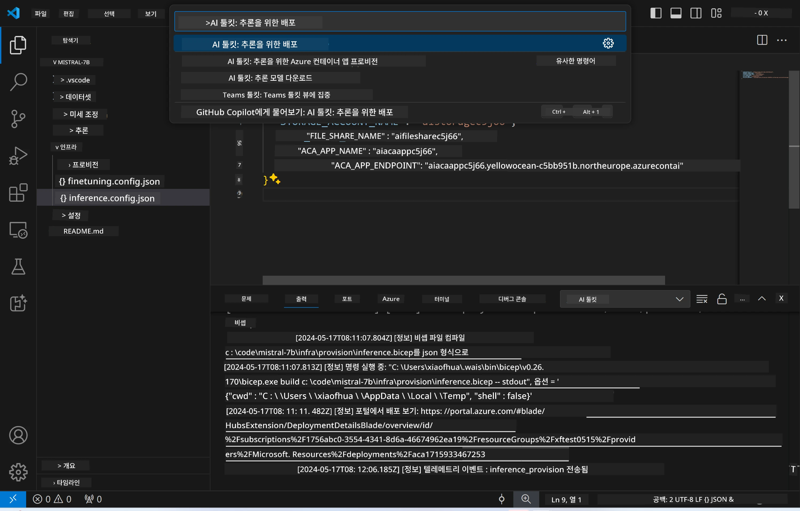
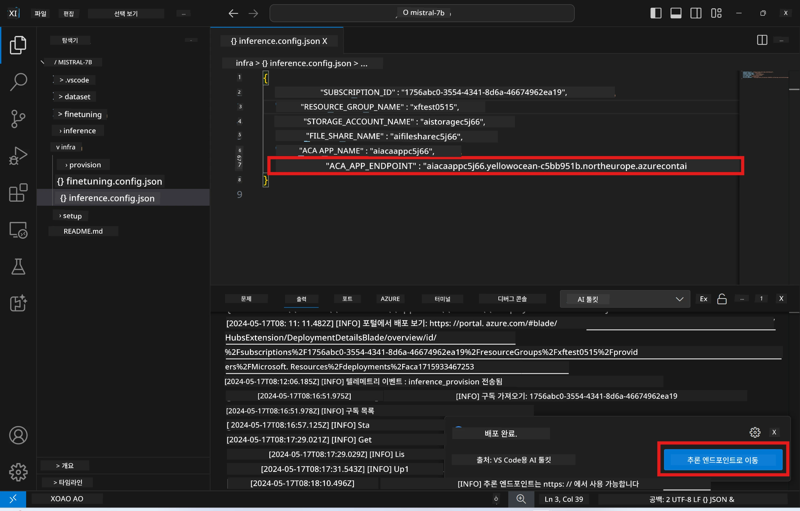

# 미세 조정된 모델을 이용한 원격 추론

어댑터가 원격 환경에서 학습된 후, 간단한 Gradio 애플리케이션을 사용하여 모델과 상호작용할 수 있습니다.



### Azure 리소스 프로비저닝  
원격 추론을 위해 `AI Toolkit: Provision Azure Container Apps for inference` 명령어를 커맨드 팔레트에서 실행하여 Azure 리소스를 설정해야 합니다. 이 과정에서 Azure 구독과 리소스 그룹을 선택하라는 메시지가 표시됩니다.  


기본적으로 추론에 사용할 구독과 리소스 그룹은 미세 조정에 사용한 것과 동일해야 합니다. 추론은 동일한 Azure Container App 환경을 사용하며, 미세 조정 단계에서 생성된 Azure Files에 저장된 모델과 모델 어댑터에 접근합니다.

## AI Toolkit 사용법

### 추론 배포  
추론 코드를 수정하거나 추론 모델을 다시 로드하려면 `AI Toolkit: Deploy for inference` 명령어를 실행하세요. 이 명령어는 최신 코드를 ACA와 동기화하고 복제본을 재시작합니다.



배포가 성공적으로 완료되면, 이 엔드포인트를 통해 모델 평가가 가능합니다.

### 추론 API 접근

VSCode 알림에 표시되는 "*Go to Inference Endpoint*" 버튼을 클릭하여 추론 API에 접근할 수 있습니다. 또는 웹 API 엔드포인트는 `./infra/inference.config.json` 파일 내 `ACA_APP_ENDPOINT` 항목과 출력 패널에서 확인할 수 있습니다.



> **Note:** 추론 엔드포인트가 완전히 작동하기까지 몇 분 정도 소요될 수 있습니다.

## 템플릿에 포함된 추론 구성 요소

| 폴더 | 내용 |
| ------ |--------- |
| `infra` | 원격 작업에 필요한 모든 설정 파일을 포함합니다. |
| `infra/provision/inference.parameters.json` | bicep 템플릿에 사용되는 파라미터를 담고 있으며, 추론용 Azure 리소스 프로비저닝에 사용됩니다. |
| `infra/provision/inference.bicep` | 추론용 Azure 리소스 프로비저닝을 위한 템플릿 파일입니다. |
| `infra/inference.config.json` | `AI Toolkit: Provision Azure Container Apps for inference` 명령어 실행 시 생성되는 설정 파일로, 다른 원격 명령어 팔레트의 입력으로 사용됩니다. |

### AI Toolkit을 사용한 Azure 리소스 프로비저닝 설정  
[AI Toolkit](https://marketplace.visualstudio.com/items?itemName=ms-windows-ai-studio.windows-ai-studio)을 구성하고, `Provision Azure Container Apps for inference` 명령어를 실행하세요.

설정 파라미터는 `./infra/provision/inference.parameters.json` 파일에서 확인할 수 있습니다. 주요 내용은 다음과 같습니다:

| 파라미터 | 설명 |
| --------- |------------ |
| `defaultCommands` | 웹 API를 시작하는 명령어입니다. |
| `maximumInstanceCount` | GPU 인스턴스의 최대 개수를 설정합니다. |
| `location` | Azure 리소스가 프로비저닝될 위치입니다. 기본값은 선택한 리소스 그룹의 위치와 동일합니다. |
| `storageAccountName`, `fileShareName`, `acaEnvironmentName`, `acaEnvironmentStorageName`, `acaAppName`, `acaLogAnalyticsName` | 프로비저닝할 Azure 리소스의 이름을 지정하는 파라미터입니다. 기본적으로 미세 조정에 사용된 리소스 이름과 동일하게 설정됩니다. 새롭고 사용하지 않은 이름을 입력하여 커스텀 리소스를 생성하거나, 이미 존재하는 Azure 리소스 이름을 입력하여 해당 리소스를 사용할 수 있습니다. 자세한 내용은 [기존 Azure 리소스 사용](../../../../../md/01.Introduction/03) 섹션을 참고하세요. |

### 기존 Azure 리소스 사용하기

기본적으로 추론 프로비저닝은 미세 조정에 사용된 동일한 Azure Container App 환경, 스토리지 계정, Azure File Share, Azure Log Analytics를 사용합니다. 추론 API를 위한 별도의 Azure Container App만 새로 생성됩니다.

미세 조정 단계에서 Azure 리소스를 커스텀 설정했거나, 추론에 기존 Azure 리소스를 사용하고 싶다면 `./infra/inference.parameters.json` 파일에 해당 리소스 이름을 지정하세요. 이후 커맨드 팔레트에서 `AI Toolkit: Provision Azure Container Apps for inference` 명령어를 실행하면 지정한 리소스를 업데이트하거나 누락된 리소스를 생성합니다.

예를 들어, 기존 Azure 컨테이너 환경이 있다면 `./infra/finetuning.parameters.json` 파일은 다음과 같아야 합니다:

```json
{
    "$schema": "https://schema.management.azure.com/schemas/2019-04-01/deploymentParameters.json#",
    "contentVersion": "1.0.0.0",
    "parameters": {
      ...
      "acaEnvironmentName": {
        "value": "<your-aca-env-name>"
      },
      "acaEnvironmentStorageName": {
        "value": null
      },
      ...
    }
  }
```

### 수동 프로비저닝  
Azure 리소스를 직접 수동으로 설정하고 싶다면, `./infra/provision` 폴더 내 제공된 bicep 파일을 사용할 수 있습니다. AI Toolkit 커맨드 팔레트를 사용하지 않고 이미 모든 Azure 리소스를 설정했다면, `inference.config.json` 파일에 리소스 이름만 입력하면 됩니다.

예시:

```json
{
  "SUBSCRIPTION_ID": "<your-subscription-id>",
  "RESOURCE_GROUP_NAME": "<your-resource-group-name>",
  "STORAGE_ACCOUNT_NAME": "<your-storage-account-name>",
  "FILE_SHARE_NAME": "<your-file-share-name>",
  "ACA_APP_NAME": "<your-aca-name>",
  "ACA_APP_ENDPOINT": "<your-aca-endpoint>"
}
```

**면책 조항**:  
이 문서는 AI 번역 서비스 [Co-op Translator](https://github.com/Azure/co-op-translator)를 사용하여 번역되었습니다. 정확성을 위해 최선을 다하고 있으나, 자동 번역에는 오류나 부정확한 부분이 있을 수 있음을 유의하시기 바랍니다. 원문은 해당 언어의 원본 문서가 권위 있는 출처로 간주되어야 합니다. 중요한 정보의 경우 전문적인 인간 번역을 권장합니다. 본 번역 사용으로 인해 발생하는 오해나 잘못된 해석에 대해 당사는 책임을 지지 않습니다.