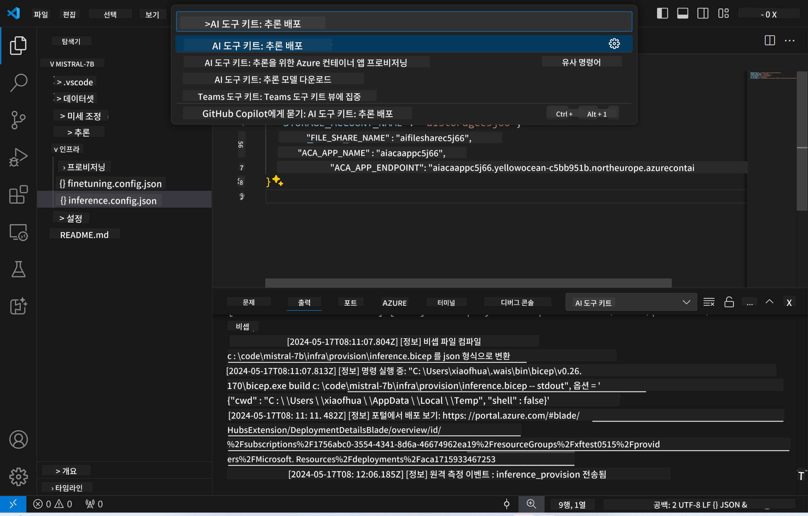
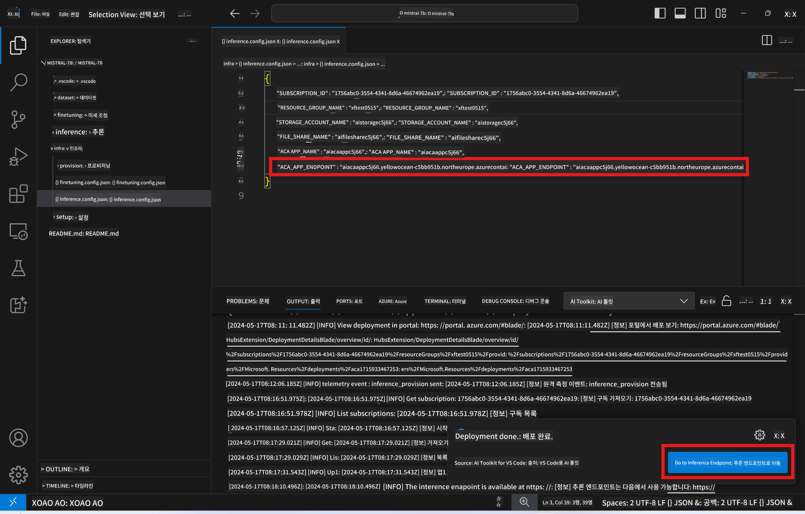

<!--
CO_OP_TRANSLATOR_METADATA:
{
  "original_hash": "a54cd3d65b6963e4e8ce21e143c3ab04",
  "translation_date": "2025-05-08T05:58:15+00:00",
  "source_file": "md/01.Introduction/03/Remote_Interence.md",
  "language_code": "ko"
}
-->
# 미세 조정된 모델을 이용한 원격 추론

어댑터가 원격 환경에서 학습된 후, 간단한 Gradio 애플리케이션을 사용해 모델과 상호작용할 수 있습니다.


### Azure 리소스 프로비저닝  
원격 추론을 위해 명령 팔레트에서 `AI Toolkit: Provision Azure Container Apps for inference`를 실행하여 Azure 리소스를 설정해야 합니다. 이 과정에서 Azure 구독과 리소스 그룹을 선택하라는 메시지가 표시됩니다.  


기본적으로, 추론에 사용할 구독과 리소스 그룹은 미세 조정에 사용된 것과 일치해야 합니다. 추론은 동일한 Azure Container App 환경을 사용하며, 미세 조정 단계에서 생성된 Azure Files에 저장된 모델과 모델 어댑터에 접근합니다.

## AI Toolkit 사용법

### 추론을 위한 배포  
추론 코드를 수정하거나 추론 모델을 다시 로드하려면 `AI Toolkit: Deploy for inference` 명령을 실행하세요. 이 명령은 최신 코드를 ACA와 동기화하고 복제본을 재시작합니다.



배포가 성공적으로 완료되면, 이 엔드포인트를 통해 모델 평가가 가능합니다.

### 추론 API 접근하기

VSCode 알림에 표시되는 "*Go to Inference Endpoint*" 버튼을 클릭하면 추론 API에 접근할 수 있습니다. 또는 `./infra/inference.config.json`의 `ACA_APP_ENDPOINT` 아래와 출력 패널에서 웹 API 엔드포인트를 확인할 수 있습니다.



> **Note:** 추론 엔드포인트가 완전히 작동하기까지 몇 분 정도 소요될 수 있습니다.

## 템플릿에 포함된 추론 구성 요소

| 폴더 | 내용 |
| ------ |--------- |
| `infra` | 원격 작업에 필요한 모든 구성 파일을 포함합니다. |
| `infra/provision/inference.parameters.json` | 추론을 위한 Azure 리소스 프로비저닝에 사용되는 bicep 템플릿의 매개변수를 보관합니다. |
| `infra/provision/inference.bicep` | 추론용 Azure 리소스 프로비저닝 템플릿을 포함합니다. |
| `infra/inference.config.json` | `AI Toolkit: Provision Azure Container Apps for inference` 명령으로 생성된 구성 파일로, 다른 원격 명령 팔레트의 입력으로 사용됩니다. |

### AI Toolkit을 사용한 Azure 리소스 프로비저닝 설정  
[AI Toolkit](https://marketplace.visualstudio.com/items?itemName=ms-windows-ai-studio.windows-ai-studio)을 설정하세요.

추론용 Azure Container Apps 프로비저닝은 ` command.

You can find configuration parameters in `./infra/provision/inference.parameters.json` file. Here are the details:
| Parameter | Description |
| --------- |------------ |
| `defaultCommands` | This is the commands to initiate a web API. |
| `maximumInstanceCount` | This parameter sets the maximum capacity of GPU instances. |
| `location` | This is the location where Azure resources are provisioned. The default value is the same as the chosen resource group's location. |
| `storageAccountName`, `fileShareName` `acaEnvironmentName`, `acaEnvironmentStorageName`, `acaAppName`,  `acaLogAnalyticsName` | These parameters are used to name the Azure resources for provision. By default, they will be same to the fine-tuning resource name. You can input a new, unused resource name to create your own custom-named resources, or you can input the name of an already existing Azure resource if you'd prefer to use that. For details, refer to the section [Using existing Azure Resources](../../../../../md/01.Introduction/03). |

### Using Existing Azure Resources

By default, the inference provision use the same Azure Container App Environment, Storage Account, Azure File Share, and Azure Log Analytics that were used for fine-tuning. A separate Azure Container App is created solely for the inference API. 

If you have customized the Azure resources during the fine-tuning step or want to use your own existing Azure resources for inference, specify their names in the `./infra/inference.parameters.json` 파일을 참고하세요. 그런 다음 명령 팔레트에서 `AI Toolkit: Provision Azure Container Apps for inference` 명령을 실행하면 지정된 리소스를 업데이트하고 누락된 리소스를 생성합니다.

예를 들어, 기존 Azure 컨테이너 환경이 있다면 `./infra/finetuning.parameters.json` 파일은 다음과 같이 구성되어야 합니다:

```json
{
    "$schema": "https://schema.management.azure.com/schemas/2019-04-01/deploymentParameters.json#",
    "contentVersion": "1.0.0.0",
    "parameters": {
      ...
      "acaEnvironmentName": {
        "value": "<your-aca-env-name>"
      },
      "acaEnvironmentStorageName": {
        "value": null
      },
      ...
    }
  }
```

### 수동 프로비저닝  
Azure 리소스를 수동으로 설정하려면, `./infra/provision` folders. If you have already set up and configured all the Azure resources without using the AI Toolkit command palette, you can simply enter the resource names in the `inference.config.json` 파일과 함께 제공된 bicep 파일을 사용할 수 있습니다.

예시는 다음과 같습니다:

```json
{
  "SUBSCRIPTION_ID": "<your-subscription-id>",
  "RESOURCE_GROUP_NAME": "<your-resource-group-name>",
  "STORAGE_ACCOUNT_NAME": "<your-storage-account-name>",
  "FILE_SHARE_NAME": "<your-file-share-name>",
  "ACA_APP_NAME": "<your-aca-name>",
  "ACA_APP_ENDPOINT": "<your-aca-endpoint>"
}
```

**면책 조항**:  
이 문서는 AI 번역 서비스 [Co-op Translator](https://github.com/Azure/co-op-translator)를 사용하여 번역되었습니다. 정확성을 위해 노력하고 있으나, 자동 번역에는 오류나 부정확한 내용이 포함될 수 있음을 유의해 주시기 바랍니다. 원문은 해당 언어의 원본 문서를 권위 있는 자료로 간주해야 합니다. 중요한 정보의 경우 전문 인간 번역을 권장합니다. 이 번역 사용으로 인해 발생하는 오해나 잘못된 해석에 대해 당사는 책임을 지지 않습니다.