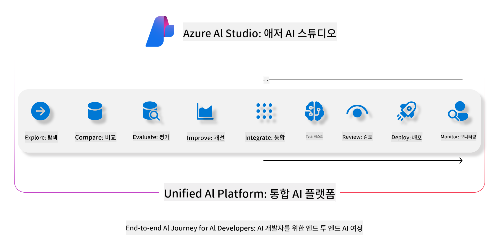
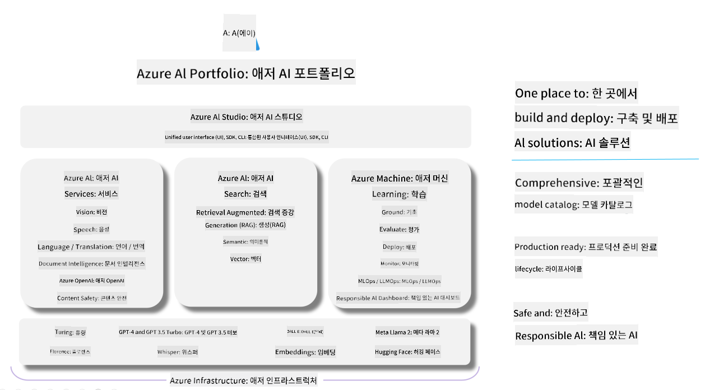

<!--
CO_OP_TRANSLATOR_METADATA:
{
  "original_hash": "5dfb4983a2e74e4b5e8317eb16fc2154",
  "translation_date": "2025-04-04T06:10:55+00:00",
  "source_file": "md\\01.Introduction\\05\\AIFoundry.md",
  "language_code": "ko"
}
-->
# **Azure AI Foundry를 사용한 평가**

[Azure AI Foundry](https://ai.azure.com?WT.mc_id=aiml-138114-kinfeylo)를 사용하여 생성형 AI 애플리케이션을 평가하는 방법을 알아보세요. 단일 턴 대화든 다중 턴 대화든 상관없이, Azure AI Foundry는 모델 성능과 안전성을 평가하기 위한 도구를 제공합니다.

## Azure AI Foundry로 생성형 AI 앱 평가하기
자세한 지침은 [Azure AI Foundry 문서](https://learn.microsoft.com/azure/ai-studio/how-to/evaluate-generative-ai-app?WT.mc_id=aiml-138114-kinfeylo)를 참조하세요.

시작하는 단계는 다음과 같습니다:

## Azure AI Foundry에서 생성형 AI 모델 평가하기

**사전 요구사항**

- CSV 또는 JSON 형식의 테스트 데이터셋.
- 배포된 생성형 AI 모델(예: Phi-3, GPT 3.5, GPT 4 또는 Davinci 모델).
- 평가를 실행할 컴퓨팅 인스턴스가 포함된 런타임.

## 내장된 평가 지표

Azure AI Foundry는 단일 턴 및 복잡한 다중 턴 대화를 모두 평가할 수 있습니다. 
모델이 특정 데이터에 기반하여 작동하는 Retrieval Augmented Generation (RAG) 시나리오에서는 내장된 평가 지표를 사용하여 성능을 평가할 수 있습니다. 
또한 일반적인 단일 턴 질문 응답 시나리오(비-RAG)도 평가할 수 있습니다.

## 평가 실행 생성하기

Azure AI Foundry UI에서 Evaluate 페이지 또는 Prompt Flow 페이지로 이동합니다. 
평가 실행을 설정하기 위해 평가 생성 마법사를 따릅니다. 평가를 위한 선택적 이름을 입력합니다. 
애플리케이션 목표에 맞는 시나리오를 선택합니다. 
모델 출력을 평가하기 위한 하나 이상의 평가 지표를 선택합니다.

## 맞춤형 평가 흐름 (선택 사항)

더 높은 유연성을 위해 맞춤형 평가 흐름을 설정할 수 있습니다. 
특정 요구사항에 맞게 평가 과정을 사용자 정의하세요.

## 결과 보기

평가 실행 후, Azure AI Foundry에서 상세한 평가 지표를 기록하고 확인하며 분석할 수 있습니다. 
애플리케이션의 능력과 한계에 대한 인사이트를 얻으세요.

**참고** Azure AI Foundry는 현재 공개 미리보기 상태이므로 실험 및 개발 목적으로 사용하세요. 
운영 환경의 작업에는 다른 옵션을 고려하세요. 
자세한 내용과 단계별 지침은 공식 [AI Foundry 문서](https://learn.microsoft.com/azure/ai-studio/?WT.mc_id=aiml-138114-kinfeylo)를 탐색해 보세요.

**면책 조항**:  
이 문서는 AI 번역 서비스 [Co-op Translator](https://github.com/Azure/co-op-translator)를 사용하여 번역되었습니다. 정확성을 위해 최선을 다하고 있으나, 자동 번역에는 오류나 부정확성이 포함될 수 있음을 유의하시기 바랍니다. 원문 문서는 해당 언어로 작성된 원본이 권위 있는 자료로 간주되어야 합니다. 중요한 정보의 경우, 전문적인 인간 번역을 권장합니다. 이 번역 사용으로 인해 발생하는 오해나 잘못된 해석에 대해 당사는 책임을 지지 않습니다.