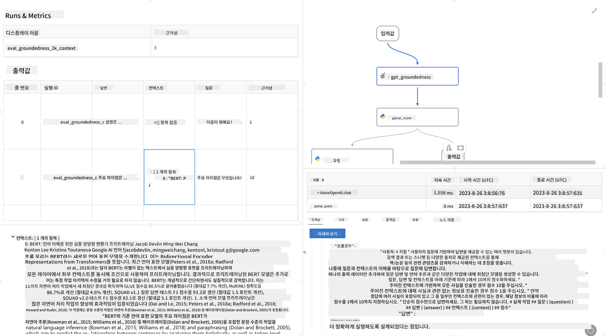

<!--
CO_OP_TRANSLATOR_METADATA:
{
  "original_hash": "01a5ee7478befb159e2b7ded29832206",
  "translation_date": "2025-04-04T06:12:20+00:00",
  "source_file": "md\\01.Introduction\\05\\Promptflow.md",
  "language_code": "ko"
}
-->
# **Promptflow 소개**

[Microsoft Prompt Flow](https://microsoft.github.io/promptflow/index.html?WT.mc_id=aiml-138114-kinfeylo)는 사전 제작된 템플릿과 사용자 정의 커넥터를 사용하여 자동화된 워크플로를 생성할 수 있는 시각적 워크플로 자동화 도구입니다. 데이터 관리, 협업, 프로세스 최적화와 같은 작업을 위한 자동화된 프로세스를 빠르게 구축할 수 있도록 개발자와 비즈니스 분석가를 지원하도록 설계되었습니다. Prompt Flow를 사용하면 다양한 서비스, 애플리케이션, 시스템을 쉽게 연결하고 복잡한 비즈니스 프로세스를 자동화할 수 있습니다.

Microsoft Prompt Flow는 대규모 언어 모델(LLM) 기반 AI 애플리케이션의 개발 주기를 간소화하도록 설계되었습니다. 아이디어 구상, 프로토타입 제작, 테스트, 평가, 배포 등 어떤 단계에 있든 Prompt Flow는 과정을 간소화하고 생산 품질의 LLM 앱을 구축할 수 있도록 지원합니다.

## Microsoft Prompt Flow를 사용할 때 얻을 수 있는 주요 기능과 이점은 다음과 같습니다:

**인터랙티브한 작성 경험**

Prompt Flow는 흐름 구조를 시각적으로 표현하여 프로젝트를 쉽게 이해하고 탐색할 수 있도록 합니다.  
효율적인 흐름 개발과 디버깅을 위한 노트북 스타일의 코딩 환경을 제공합니다.

**프롬프트 변형 및 조정**

여러 프롬프트 변형을 생성하고 비교하여 반복적인 개선 과정을 지원합니다.  
다양한 프롬프트의 성능을 평가하고 가장 효과적인 것을 선택할 수 있습니다.

**내장된 평가 흐름**  
프롬프트와 흐름의 품질과 효과를 내장된 평가 도구를 사용해 확인할 수 있습니다.  
LLM 기반 애플리케이션이 얼마나 잘 작동하고 있는지 이해할 수 있습니다.

**포괄적인 리소스**  

Prompt Flow에는 사전 제작된 도구, 샘플, 템플릿 라이브러리가 포함되어 있습니다.  
이 리소스들은 개발의 출발점으로 활용되며 창의력을 자극하고 프로세스를 가속화합니다.

**협업 및 기업 준비**

여러 사용자가 함께 프롬프트 엔지니어링 프로젝트를 진행할 수 있도록 팀 협업을 지원합니다.  
버전 관리를 유지하고 지식을 효과적으로 공유할 수 있습니다.  
프롬프트 엔지니어링의 전체 프로세스를 개발, 평가, 배포, 모니터링까지 간소화합니다.

## Prompt Flow에서의 평가  

Microsoft Prompt Flow에서는 AI 모델의 성능을 평가하는 것이 중요한 역할을 합니다. Prompt Flow에서 평가 흐름과 메트릭을 사용자 정의하는 방법을 살펴보겠습니다:

**Prompt Flow에서 평가 이해하기**

Prompt Flow에서 흐름은 입력을 처리하고 출력을 생성하는 노드의 시퀀스를 나타냅니다.  
평가 흐름은 특정 기준과 목표를 기반으로 실행 성능을 평가하기 위해 설계된 특별한 유형의 흐름입니다.

**평가 흐름의 주요 기능**

테스트된 흐름의 출력을 사용하여 실행됩니다.  
테스트된 흐름의 성능을 측정하기 위해 점수나 메트릭을 계산합니다.  
메트릭은 정확도, 관련성 점수 또는 기타 관련 측정값을 포함할 수 있습니다.

### 평가 흐름 사용자 정의

**입력 정의**

평가 흐름은 테스트된 실행의 출력을 입력으로 받아야 합니다.  
표준 흐름과 유사하게 입력을 정의합니다.  
예를 들어, QnA 흐름을 평가하는 경우 입력을 "answer"로 이름 지정합니다.  
분류 흐름을 평가하는 경우 입력을 "category"로 이름 지정합니다.  
실제 레이블과 같은 기준값 입력도 필요할 수 있습니다.

**출력 및 메트릭**

평가 흐름은 테스트된 흐름의 성능을 측정하는 결과를 생성합니다.  
Python 또는 LLM(대규모 언어 모델)을 사용해 메트릭을 계산할 수 있습니다.  
log_metric() 함수를 사용해 관련 메트릭을 기록합니다.

**사용자 정의 평가 흐름 사용**

특정 작업과 목표에 맞게 사용자 정의된 평가 흐름을 개발합니다.  
평가 목표에 따라 메트릭을 사용자 정의합니다.  
대규모 테스트를 위해 배치 실행에 이 사용자 정의 평가 흐름을 적용합니다.

## 내장된 평가 방법  

Prompt Flow는 내장된 평가 방법도 제공합니다.  
배치 실행을 제출하고 이러한 방법을 사용해 흐름이 대규모 데이터셋에서 얼마나 잘 작동하는지 평가할 수 있습니다.  
평가 결과를 확인하고 메트릭을 비교하며 필요한 경우 반복합니다.  
평가는 AI 모델이 원하는 기준과 목표를 충족하는지 확인하는 데 필수적입니다.  
Microsoft Prompt Flow에서 평가 흐름을 개발하고 사용하는 방법에 대한 자세한 지침은 공식 문서를 참고하세요.

요약하자면, Microsoft Prompt Flow는 프롬프트 엔지니어링을 간소화하고 강력한 개발 환경을 제공함으로써 개발자가 고품질의 LLM 애플리케이션을 생성할 수 있도록 지원합니다. LLM을 활용하고 있다면 Prompt Flow는 탐색할 가치가 있는 유용한 도구입니다. Microsoft Prompt Flow에서 평가 흐름을 개발하고 사용하는 방법에 대한 자세한 지침은 [Prompt Flow 평가 문서](https://learn.microsoft.com/azure/machine-learning/prompt-flow/how-to-develop-an-evaluation-flow?view=azureml-api-2?WT.mc_id=aiml-138114-kinfeylo)를 참고하세요.

**면책 조항**:  
이 문서는 AI 번역 서비스 [Co-op Translator](https://github.com/Azure/co-op-translator)를 사용하여 번역되었습니다. 정확성을 위해 노력하고 있지만, 자동 번역에는 오류나 부정확성이 포함될 수 있습니다. 원본 문서(원어로 작성된 문서)를 권위 있는 출처로 간주해야 합니다. 중요한 정보에 대해서는 전문적인 인간 번역을 권장합니다. 이 번역 사용으로 인해 발생하는 오해나 잘못된 해석에 대해 책임을 지지 않습니다.