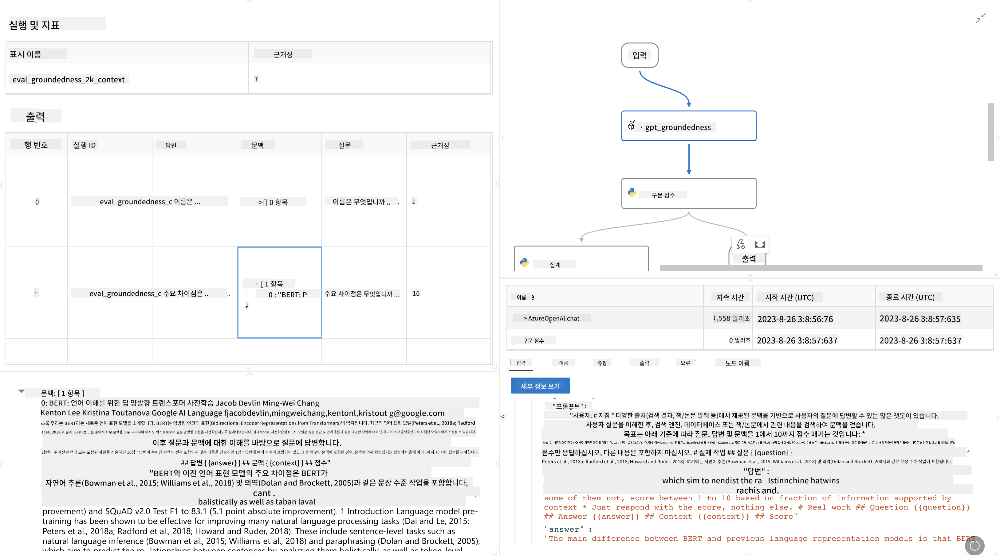

<!--
CO_OP_TRANSLATOR_METADATA:
{
  "original_hash": "3cbe7629d254f1043193b7fe22524d55",
  "translation_date": "2025-05-08T06:08:06+00:00",
  "source_file": "md/01.Introduction/05/Promptflow.md",
  "language_code": "ko"
}
-->
# **Promptflow 소개**

[Microsoft Prompt Flow](https://microsoft.github.io/promptflow/index.html?WT.mc_id=aiml-138114-kinfeylo)는 사전 제작된 템플릿과 맞춤형 커넥터를 사용해 자동화된 워크플로를 시각적으로 생성할 수 있는 도구입니다. 개발자와 비즈니스 분석가가 데이터 관리, 협업, 프로세스 최적화 같은 작업을 위한 자동화 프로세스를 빠르게 구축할 수 있도록 설계되었습니다. Prompt Flow를 통해 사용자는 다양한 서비스, 애플리케이션, 시스템을 손쉽게 연결하고 복잡한 비즈니스 프로세스를 자동화할 수 있습니다.

Microsoft Prompt Flow는 대형 언어 모델(LLM)을 활용한 AI 애플리케이션의 개발 전 과정을 간소화하도록 설계되었습니다. 아이디어 구상, 프로토타입 제작, 테스트, 평가, 배포 등 LLM 기반 애플리케이션 개발의 모든 단계에서 Prompt Flow는 과정을 단순화하고 생산 수준의 LLM 앱을 구축할 수 있게 합니다.

## Microsoft Prompt Flow의 주요 기능 및 장점

**인터랙티브한 작성 환경**

Prompt Flow는 플로우 구조를 시각적으로 표현하여 프로젝트를 쉽게 이해하고 탐색할 수 있게 합니다.  
효율적인 플로우 개발과 디버깅을 위한 노트북 같은 코딩 경험을 제공합니다.

**프롬프트 변형 및 튜닝**

여러 프롬프트 변형을 생성하고 비교하여 반복적인 개선 과정을 지원합니다.  
다양한 프롬프트의 성능을 평가하고 가장 효과적인 것을 선택할 수 있습니다.

**내장 평가 플로우**

내장된 평가 도구를 사용해 프롬프트와 플로우의 품질과 효과를 평가할 수 있습니다.  
LLM 기반 애플리케이션의 성능을 명확히 파악할 수 있습니다.

**포괄적인 리소스**

Prompt Flow는 내장 도구, 샘플, 템플릿 라이브러리를 포함하고 있습니다.  
이러한 리소스는 개발의 출발점이자 창의력 자극 및 작업 가속화에 도움을 줍니다.

**협업 및 기업 환경 지원**

여러 사용자가 함께 프롬프트 엔지니어링 프로젝트에 참여할 수 있도록 팀 협업을 지원합니다.  
버전 관리와 지식 공유가 용이하며, 개발부터 평가, 배포, 모니터링에 이르는 전체 프롬프트 엔지니어링 과정을 효율화합니다.

## Prompt Flow에서의 평가

Microsoft Prompt Flow에서 평가는 AI 모델의 성능을 평가하는 데 중요한 역할을 합니다. Prompt Flow 내에서 평가 플로우와 메트릭을 어떻게 맞춤 설정할 수 있는지 살펴보겠습니다:

**Prompt Flow에서 평가 이해하기**

Prompt Flow에서 플로우는 입력을 처리하고 출력을 생성하는 노드들의 연속입니다. 평가 플로우는 특정 기준과 목표에 따라 실행 결과의 성능을 평가하기 위해 설계된 특별한 플로우입니다.

**평가 플로우의 주요 특징**

일반적으로 테스트 대상 플로우가 실행된 후 그 출력을 사용해 실행됩니다.  
테스트된 플로우의 성능을 측정하기 위해 점수나 메트릭을 계산합니다.  
메트릭에는 정확도, 관련성 점수 등 다양한 측정 지표가 포함될 수 있습니다.

### 평가 플로우 맞춤 설정하기

**입력 정의**

평가 플로우는 테스트 대상 실행의 출력을 입력으로 받아야 합니다. 표준 플로우와 유사하게 입력을 정의하세요.  
예를 들어 QnA 플로우를 평가할 경우 입력 이름을 "answer"로, 분류 플로우를 평가할 경우 "category"로 지정합니다. 실제 정답(ground truth) 입력도 필요할 수 있습니다.

**출력 및 메트릭**

평가 플로우는 테스트 대상 플로우의 성능을 측정하는 결과를 생성합니다.  
메트릭은 Python 또는 LLM을 사용해 계산할 수 있으며, log_metric() 함수를 사용해 관련 메트릭을 기록하세요.

**맞춤형 평가 플로우 활용**

특정 작업과 목표에 맞춰 직접 평가 플로우를 개발하세요.  
평가 목표에 따라 메트릭을 맞춤 설정할 수 있습니다.  
대규모 테스트를 위해 이 맞춤형 평가 플로우를 배치 실행에 적용하세요.

## 내장 평가 방법

Prompt Flow는 내장된 평가 방법도 제공합니다.  
배치 실행을 제출하고 대규모 데이터셋에 대해 플로우 성능을 평가할 수 있습니다.  
평가 결과를 확인하고 메트릭을 비교하며 필요에 따라 반복 개선하세요.  
평가는 AI 모델이 원하는 기준과 목표를 충족하는지 확인하는 데 필수적입니다.  
Microsoft Prompt Flow에서 평가 플로우를 개발하고 사용하는 자세한 방법은 공식 문서를 참고하세요.

요약하자면, Microsoft Prompt Flow는 프롬프트 엔지니어링을 단순화하고 강력한 개발 환경을 제공함으로써 개발자가 고품질 LLM 애플리케이션을 구축할 수 있도록 지원합니다. LLM 작업을 한다면 Prompt Flow는 꼭 살펴볼 만한 유용한 도구입니다. 자세한 평가 플로우 개발 및 사용법은 [Prompt Flow Evaluation Documents](https://learn.microsoft.com/azure/machine-learning/prompt-flow/how-to-develop-an-evaluation-flow?view=azureml-api-2?WT.mc_id=aiml-138114-kinfeylo)를 참고하세요.

**면책 조항**:  
이 문서는 AI 번역 서비스 [Co-op Translator](https://github.com/Azure/co-op-translator)를 사용하여 번역되었습니다. 정확성을 위해 최선을 다하고 있으나, 자동 번역에는 오류나 부정확한 내용이 포함될 수 있음을 양지해 주시기 바랍니다. 원본 문서의 원어 버전이 권위 있는 출처로 간주되어야 합니다. 중요한 정보의 경우, 전문적인 인간 번역을 권장합니다. 본 번역 사용으로 인해 발생하는 오해나 잘못된 해석에 대해 당사는 책임을 지지 않습니다.