<!--
CO_OP_TRANSLATOR_METADATA:
{
  "original_hash": "7799f9e2960966adc296d24cdf0d6486",
  "translation_date": "2025-04-04T06:17:28+00:00",
  "source_file": "md\\02.Application\\01.TextAndChat\\Phi3\\E2E_Phi-3-Evaluation_AIFoundry.md",
  "language_code": "ko"
}
-->
# Microsoft의 책임 있는 AI 원칙에 중점을 둔 Azure AI Foundry에서 Fine-tuned Phi-3 / Phi-3.5 모델 평가

이 E2E(End-to-End) 샘플은 Microsoft Tech Community의 가이드 "[Microsoft의 책임 있는 AI에 중점을 둔 Azure AI Foundry에서 Fine-tuned Phi-3 / 3.5 모델 평가](https://techcommunity.microsoft.com/t5/educator-developer-blog/evaluate-fine-tuned-phi-3-3-5-models-in-azure-ai-studio-focusing/ba-p/4227850?WT.mc_id=aiml-137032-kinfeylo)"를 기반으로 작성되었습니다.

## 개요

### Azure AI Foundry에서 Fine-tuned Phi-3 / Phi-3.5 모델의 안전성과 성능을 어떻게 평가할 수 있나요?

모델을 세부 조정하면 때때로 의도하지 않거나 원치 않는 응답이 생성될 수 있습니다. 모델이 안전하고 효과적으로 유지되도록 하려면, 모델이 유해한 콘텐츠를 생성할 가능성과 정확하고 관련성 있으며 일관된 응답을 생성하는 능력을 평가하는 것이 중요합니다. 이 튜토리얼에서는 Azure AI Foundry의 Prompt flow와 통합된 Fine-tuned Phi-3 / Phi-3.5 모델의 안전성과 성능을 평가하는 방법을 배웁니다.

다음은 Azure AI Foundry의 평가 프로세스입니다.

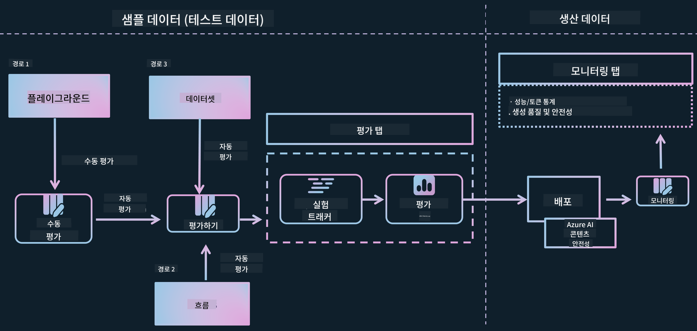

*이미지 출처: [생성형 AI 응용 프로그램 평가](https://learn.microsoft.com/azure/ai-studio/concepts/evaluation-approach-gen-ai?wt.mc_id%3Dstudentamb_279723)*

> [!NOTE]
>
> Phi-3 / Phi-3.5에 대한 더 자세한 정보와 추가 자료를 보려면 [Phi-3CookBook](https://github.com/microsoft/Phi-3CookBook?wt.mc_id=studentamb_279723)을 방문하세요.

### 사전 요구 사항

- [Python](https://www.python.org/downloads)
- [Azure 구독](https://azure.microsoft.com/free?wt.mc_id=studentamb_279723)
- [Visual Studio Code](https://code.visualstudio.com)
- Fine-tuned Phi-3 / Phi-3.5 모델

### 목차

1. [**시나리오 1: Azure AI Foundry의 Prompt flow 평가 소개**](../../../../../../md/02.Application/01.TextAndChat/Phi3)

    - [안전성 평가 소개](../../../../../../md/02.Application/01.TextAndChat/Phi3)
    - [성능 평가 소개](../../../../../../md/02.Application/01.TextAndChat/Phi3)

1. [**시나리오 2: Azure AI Foundry에서 Phi-3 / Phi-3.5 모델 평가**](../../../../../../md/02.Application/01.TextAndChat/Phi3)

    - [시작하기 전에](../../../../../../md/02.Application/01.TextAndChat/Phi3)
    - [Azure OpenAI를 배포하여 Phi-3 / Phi-3.5 모델 평가](../../../../../../md/02.Application/01.TextAndChat/Phi3)
    - [Azure AI Foundry의 Prompt flow 평가를 사용하여 Fine-tuned Phi-3 / Phi-3.5 모델 평가](../../../../../../md/02.Application/01.TextAndChat/Phi3)

1. [축하합니다!](../../../../../../md/02.Application/01.TextAndChat/Phi3)

## **시나리오 1: Azure AI Foundry의 Prompt flow 평가 소개**

### 안전성 평가 소개

AI 모델이 윤리적이고 안전한지 확인하려면 Microsoft의 책임 있는 AI 원칙에 따라 평가하는 것이 중요합니다. Azure AI Foundry에서는 안전성 평가를 통해 모델이 탈옥 공격에 얼마나 취약한지와 유해한 콘텐츠를 생성할 가능성을 평가할 수 있습니다. 이는 이러한 원칙과 직접적으로 연계됩니다.

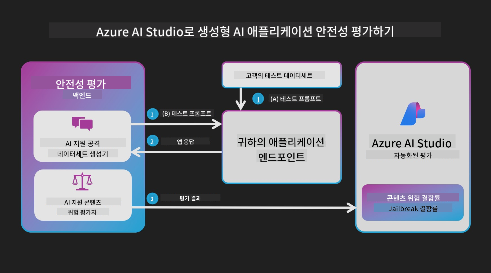

*이미지 출처: [생성형 AI 응용 프로그램 평가](https://learn.microsoft.com/azure/ai-studio/concepts/evaluation-approach-gen-ai?wt.mc_id%3Dstudentamb_279723)*

#### Microsoft의 책임 있는 AI 원칙

기술적인 단계를 시작하기 전에, Microsoft의 책임 있는 AI 원칙을 이해하는 것이 중요합니다. 이는 AI 시스템의 책임 있는 개발, 배포, 운영을 안내하기 위한 윤리적 프레임워크입니다. 이 원칙은 공정하고, 투명하며, 포괄적인 방식으로 AI 기술이 설계되고 개발되도록 보장합니다. 이는 AI 모델의 안전성을 평가하기 위한 기반이 됩니다.

Microsoft의 책임 있는 AI 원칙은 다음을 포함합니다:

- **공정성과 포괄성**: AI 시스템은 모든 사람을 공정하게 대해야 하며, 유사한 상황에 있는 그룹에 대해 다르게 영향을 미치지 않아야 합니다. 예를 들어, AI 시스템이 의료 치료, 대출 신청 또는 고용 관련 안내를 제공할 때, 유사한 증상, 재정 상황 또는 자격을 가진 모든 사람에게 동일한 권고를 해야 합니다.

- **신뢰성과 안전성**: 신뢰를 구축하려면 AI 시스템이 신뢰할 수 있고, 안전하며, 일관되게 작동하는 것이 중요합니다. 이러한 시스템은 설계된 대로 작동하고, 예기치 않은 상황에 안전하게 반응하며, 유해한 조작을 방지할 수 있어야 합니다.

- **투명성**: AI 시스템이 사람들의 삶에 큰 영향을 미치는 결정을 내리는 데 도움을 줄 때, 사람들은 그 결정이 어떻게 내려졌는지 이해하는 것이 중요합니다.

- **프라이버시와 보안**: AI가 점점 더 널리 사용됨에 따라 프라이버시를 보호하고 개인 및 비즈니스 정보를 안전하게 유지하는 것이 더 중요하고 복잡해지고 있습니다.

- **책임성**: AI 시스템을 설계하고 배포하는 사람들은 시스템의 작동 방식에 대해 책임을 져야 합니다.

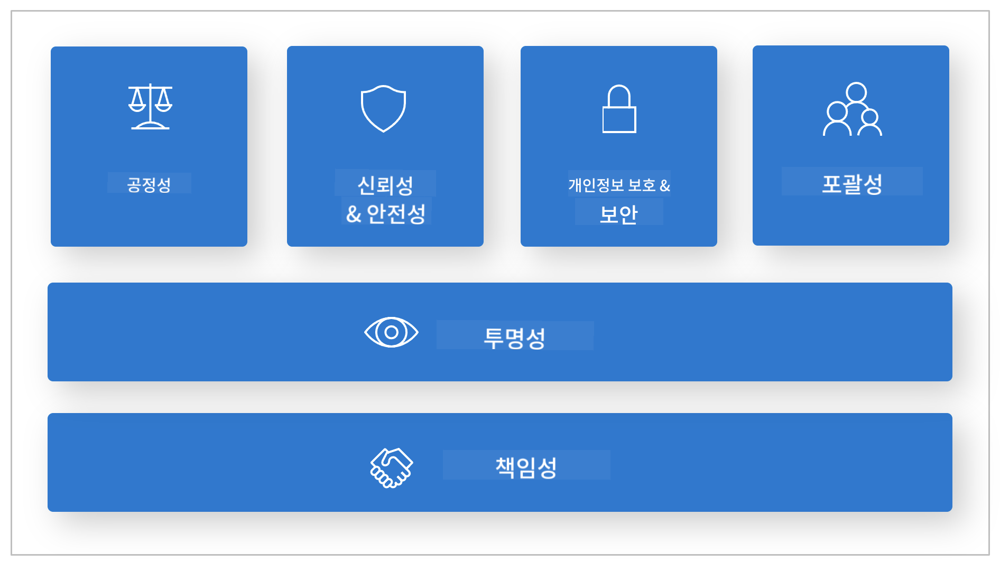

*이미지 출처: [책임 있는 AI란 무엇인가?](https://learn.microsoft.com/azure/machine-learning/concept-responsible-ai?view=azureml-api-2&viewFallbackFrom=azureml-api-2%253fwt.mc_id%3Dstudentamb_279723)*

> [!NOTE]
> Microsoft의 책임 있는 AI 원칙에 대해 더 알아보려면 [책임 있는 AI란 무엇인가?](https://learn.microsoft.com/azure/machine-learning/concept-responsible-ai?view=azureml-api-2?wt.mc_id=studentamb_279723)를 방문하세요.

#### 안전성 지표

이 튜토리얼에서는 Azure AI Foundry의 안전성 지표를 사용하여 Fine-tuned Phi-3 모델의 안전성을 평가합니다. 이러한 지표는 모델이 유해한 콘텐츠를 생성할 가능성과 탈옥 공격에 대한 취약성을 평가하는 데 도움을 줍니다. 안전성 지표는 다음을 포함합니다:

- **자해 관련 콘텐츠**: 모델이 자해와 관련된 콘텐츠를 생성할 가능성을 평가합니다.
- **증오적이고 불공정한 콘텐츠**: 모델이 증오적이거나 불공정한 콘텐츠를 생성할 가능성을 평가합니다.
- **폭력적 콘텐츠**: 모델이 폭력적 콘텐츠를 생성할 가능성을 평가합니다.
- **성적 콘텐츠**: 모델이 부적절한 성적 콘텐츠를 생성할 가능성을 평가합니다.

이러한 측면을 평가하면 AI 모델이 유해하거나 불쾌한 콘텐츠를 생성하지 않도록 보장하며, 이는 사회적 가치와 규제 표준에 부합합니다.

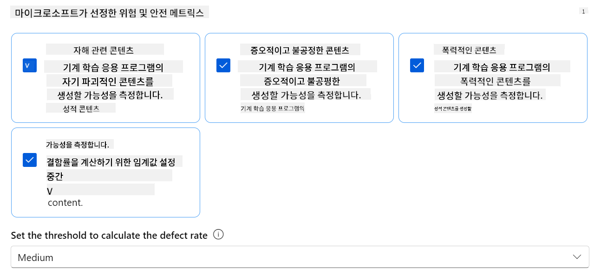

### 성능 평가 소개

AI 모델이 기대대로 작동하는지 확인하려면 성능 지표에 따라 모델의 성능을 평가하는 것이 중요합니다. Azure AI Foundry에서는 성능 평가를 통해 모델이 정확하고 관련성 있으며 일관된 응답을 생성하는 능력을 평가할 수 있습니다.

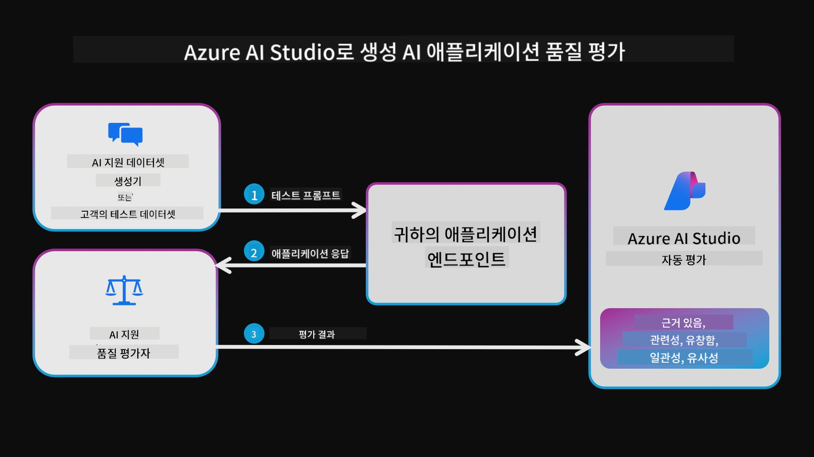

*이미지 출처: [생성형 AI 응용 프로그램 평가](https://learn.microsoft.com/azure/ai-studio/concepts/evaluation-approach-gen-ai?wt.mc_id%3Dstudentamb_279723)*

#### 성능 지표

이 튜토리얼에서는 Azure AI Foundry의 성능 지표를 사용하여 Fine-tuned Phi-3 / Phi-3.5 모델의 성능을 평가합니다. 이러한 지표는 모델이 정확하고 관련성 있으며 일관된 응답을 생성하는 능력을 평가하는 데 도움을 줍니다. 성능 지표는 다음을 포함합니다:

- **근거성**: 생성된 응답이 입력 소스의 정보와 얼마나 잘 일치하는지 평가합니다.
- **관련성**: 주어진 질문에 대한 생성된 응답의 적절성을 평가합니다.
- **일관성**: 생성된 텍스트가 얼마나 자연스럽게 읽히고, 인간과 유사한 언어로 보이는지를 평가합니다.
- **유창성**: 생성된 텍스트의 언어 능력을 평가합니다.
- **GPT 유사성**: 생성된 응답을 기준 데이터와 비교하여 유사성을 평가합니다.
- **F1 점수**: 생성된 응답과 소스 데이터 간의 공유 단어 비율을 계산합니다.

이러한 지표는 모델이 정확하고 관련성 있으며 일관된 응답을 생성하는 능력을 평가하는 데 도움을 줍니다.

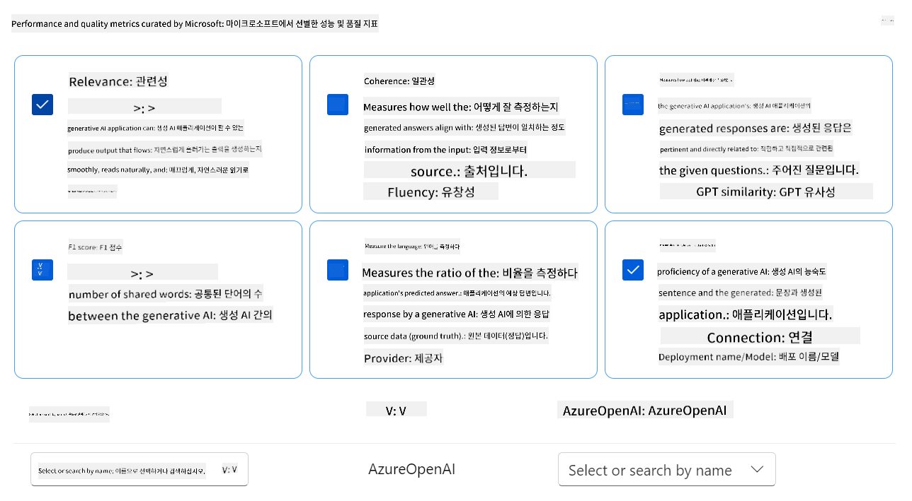

## **시나리오 2: Azure AI Foundry에서 Phi-3 / Phi-3.5 모델 평가**

### 시작하기 전에

이 튜토리얼은 이전 블로그 게시물 "[Prompt Flow를 사용하여 Fine-Tuned Phi-3 모델 통합: 단계별 가이드](https://techcommunity.microsoft.com/t5/educator-developer-blog/fine-tune-and-integrate-custom-phi-3-models-with-prompt-flow/ba-p/4178612?wt.mc_id=studentamb_279723)" 및 "[Azure AI Foundry에서 Prompt Flow와 함께 Fine-Tuned Phi-3 모델 통합](https://techcommunity.microsoft.com/t5/educator-developer-blog/fine-tune-and-integrate-custom-phi-3-models-with-prompt-flow-in/ba-p/4191726?wt.mc_id=studentamb_279723)"의 후속입니다. 이전 게시물에서는 Azure AI Foundry에서 Phi-3 / Phi-3.5 모델을 세부 조정하고 Prompt flow와 통합하는 과정을 다루었습니다.

이 튜토리얼에서는 Azure AI Foundry에서 평가자로 Azure OpenAI 모델을 배포하고 이를 사용하여 Fine-tuned Phi-3 / Phi-3.5 모델을 평가합니다.

시작하기 전에, 다음 요구 사항을 충족했는지 확인하세요. 이는 이전 튜토리얼에서 설명되었습니다:

1. Fine-tuned Phi-3 / Phi-3.5 모델을 평가하기 위한 준비된 데이터셋.
1. 세부 조정되고 Azure Machine Learning에 배포된 Phi-3 / Phi-3.5 모델.
1. Azure AI Foundry에서 Fine-tuned Phi-3 / Phi-3.5 모델과 통합된 Prompt flow.

> [!NOTE]
> 이전 블로그 게시물에서 다운로드한 **ULTRACHAT_200k** 데이터셋의 데이터 폴더에 있는 *test_data.jsonl* 파일을 Fine-tuned Phi-3 / Phi-3.5 모델을 평가하는 데이터셋으로 사용합니다.

#### Azure AI Foundry에서 Prompt flow와 Fine-tuned Phi-3 / Phi-3.5 모델 통합(코드 우선 접근 방식)

> [!NOTE]
> "[Azure AI Foundry에서 Prompt Flow와 함께 Fine-Tuned Phi-3 모델 통합](https://techcommunity.microsoft.com/t5/educator-developer-blog/fine-tune-and-integrate-custom-phi-3-models-with-prompt-flow-in/ba-p/4191726?wt.mc_id=studentamb_279723)"에서 설명한 로우코드 접근 방식을 따랐다면 이 연습을 건너뛰고 다음으로 진행할 수 있습니다.
> 그러나 "[Prompt Flow를 사용하여 Fine-Tuned Phi-3 모델 통합: 단계별 가이드](https://techcommunity.microsoft.com/t5/educator-developer-blog/fine-tune-and-integrate-custom-phi-3-models-with-prompt-flow/ba-p/4178612?wt.mc_id=studentamb_279723)"에서 설명한 코드 우선 접근 방식을 따라 Phi-3 / Phi-3.5 모델을 세부 조정하고 배포한 경우, 모델을 Prompt flow에 연결하는 과정이 약간 다릅니다. 이 연습에서 이 과정을 배울 수 있습니다.

Fine-tuned Phi-3 / Phi-3.5 모델을 Azure AI Foundry의 Prompt flow에 통합해야 합니다.

#### Azure AI Foundry 허브 생성

프로젝트를 생성하기 전에 허브를 생성해야 합니다. 허브는 리소스 그룹과 유사하며 Azure AI Foundry 내에서 여러 프로젝트를 구성하고 관리할 수 있습니다.

1. [Azure AI Foundry](https://ai.azure.com/?wt.mc_id=studentamb_279723)에 로그인하세요.

1. 왼쪽 탭에서 **모든 허브**를 선택하세요.

1. 탐색 메뉴에서 **+ 새 허브**를 선택하세요.

    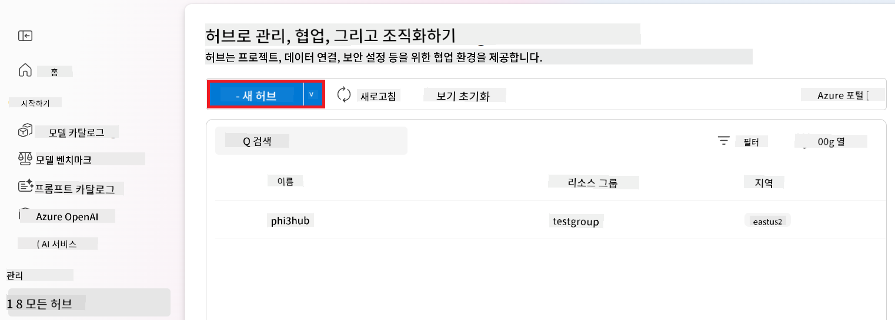

1. 다음 작업을 수행하세요:

    - **허브 이름**을 입력하세요. 고유한 값이어야 합니다.
    - Azure **구독**을 선택하세요.
    - 사용할 **리소스 그룹**을 선택하세요(필요시 새로 생성).
    - 사용할 **위치**를 선택하세요.
    - 사용할 **Azure AI 서비스 연결**을 선택하세요(필요시 새로 생성).
    - **Azure AI 검색 연결**에서 **연결 건너뛰기**를 선택하세요.
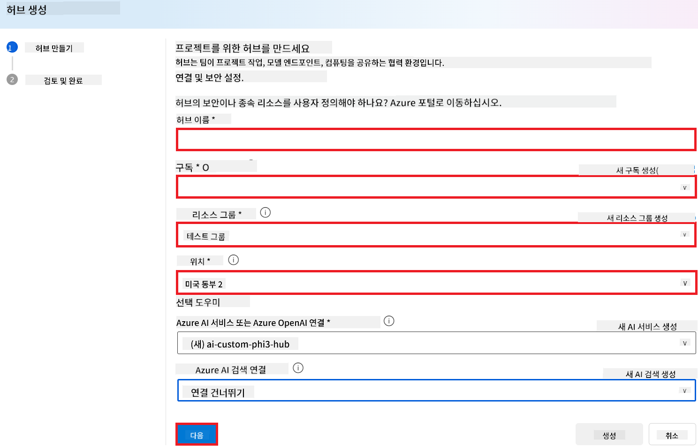

1. **Next**를 선택합니다.

#### Azure AI Foundry 프로젝트 생성

1. 생성한 허브에서 왼쪽 탭에서 **All projects**를 선택합니다.

1. 내비게이션 메뉴에서 **+ New project**를 선택합니다.

    

1. **Project name**을 입력합니다. 반드시 고유한 값을 입력해야 합니다.

    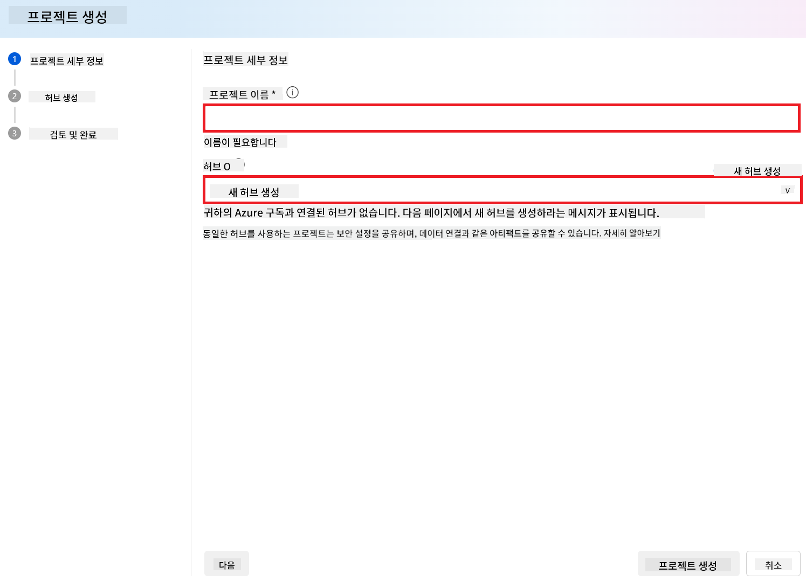

1. **Create a project**를 선택합니다.

#### 맞춤형 Phi-3 / Phi-3.5 모델을 위한 사용자 정의 연결 추가

사용자 정의 Phi-3 / Phi-3.5 모델을 Prompt flow에 통합하려면 모델의 엔드포인트와 키를 사용자 정의 연결에 저장해야 합니다. 이를 통해 Prompt flow에서 사용자 정의 Phi-3 / Phi-3.5 모델에 접근할 수 있습니다.

#### 맞춤형 Phi-3 / Phi-3.5 모델의 API 키와 엔드포인트 URI 설정

1. [Azure ML Studio](https://ml.azure.com/home?wt.mc_id=studentamb_279723)를 방문합니다.

1. 생성한 Azure Machine Learning 작업 공간으로 이동합니다.

1. 왼쪽 탭에서 **Endpoints**를 선택합니다.

    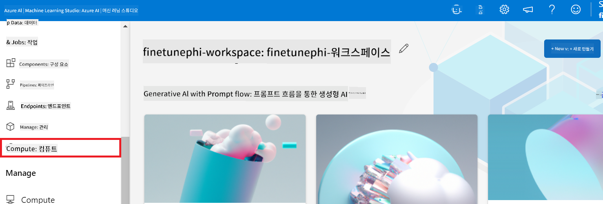

1. 생성한 엔드포인트를 선택합니다.

    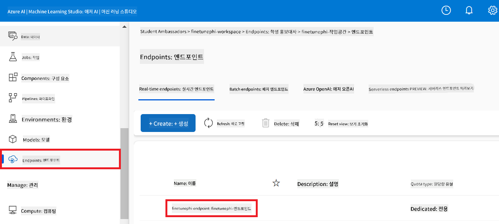

1. 내비게이션 메뉴에서 **Consume**을 선택합니다.

1. **REST endpoint**와 **Primary key**를 복사합니다.

    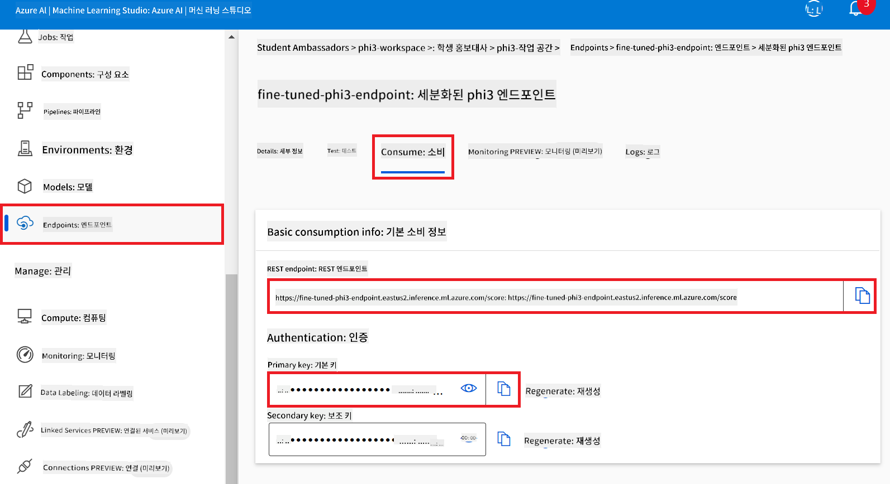

#### 사용자 정의 연결 추가

1. [Azure AI Foundry](https://ai.azure.com/?wt.mc_id=studentamb_279723)를 방문합니다.

1. 생성한 Azure AI Foundry 프로젝트로 이동합니다.

1. 생성한 프로젝트에서 왼쪽 탭에서 **Settings**를 선택합니다.

1. **+ New connection**을 선택합니다.

    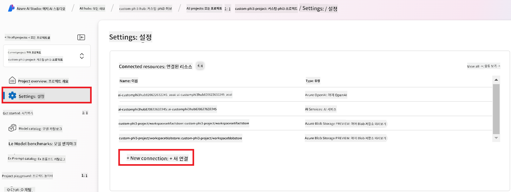

1. 내비게이션 메뉴에서 **Custom keys**를 선택합니다.

    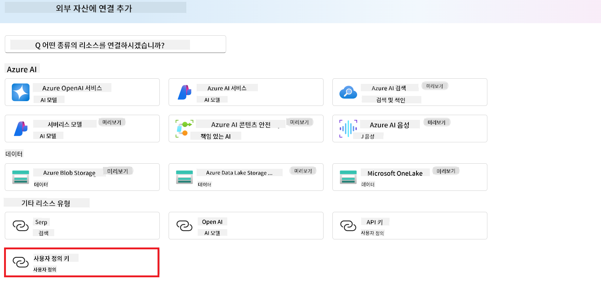

1. 다음 작업을 수행합니다:

    - **+ Add key value pairs**를 선택합니다.
    - 키 이름에 **endpoint**를 입력하고 Azure ML Studio에서 복사한 엔드포인트를 값 필드에 붙여넣습니다.
    - **+ Add key value pairs**를 다시 선택합니다.
    - 키 이름에 **key**를 입력하고 Azure ML Studio에서 복사한 키를 값 필드에 붙여넣습니다.
    - 키를 추가한 후 **is secret**을 선택하여 키가 노출되지 않도록 설정합니다.

    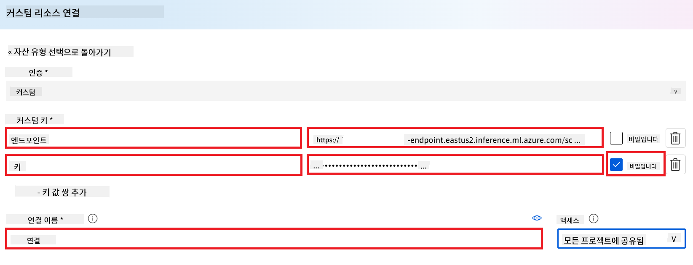

1. **Add connection**을 선택합니다.

#### Prompt flow 생성

Azure AI Foundry에 사용자 정의 연결을 추가했습니다. 이제 다음 단계를 통해 Prompt flow를 생성합니다. 그런 다음, 이 Prompt flow를 사용자 정의 연결에 연결하여 Prompt flow 내에서 맞춤형 모델을 사용할 수 있습니다.

1. 생성한 Azure AI Foundry 프로젝트로 이동합니다.

1. 왼쪽 탭에서 **Prompt flow**를 선택합니다.

1. 내비게이션 메뉴에서 **+ Create**를 선택합니다.

    

1. 내비게이션 메뉴에서 **Chat flow**를 선택합니다.

    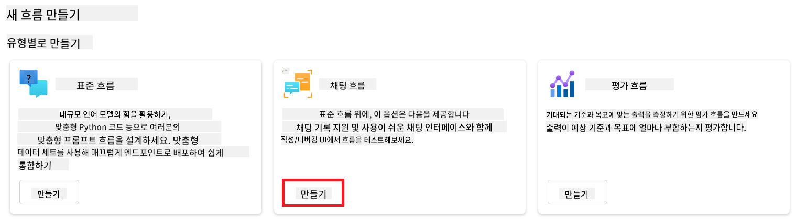

1. 사용할 **Folder name**을 입력합니다.

    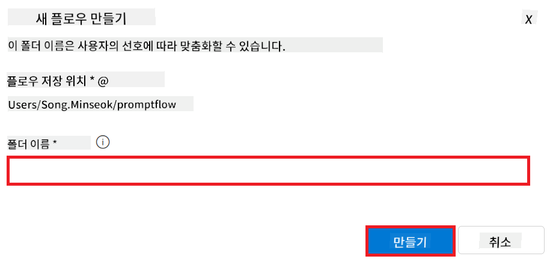

1. **Create**를 선택합니다.

#### Prompt flow를 사용자 정의 Phi-3 / Phi-3.5 모델과 채팅하도록 설정

맞춤형 Phi-3 / Phi-3.5 모델을 Prompt flow에 통합해야 합니다. 하지만 제공된 기존 Prompt flow는 이 목적에 적합하지 않으므로 Prompt flow를 재설계해야 합니다.

1. Prompt flow에서 다음 작업을 수행하여 기존 흐름을 재구성합니다:

    - **Raw file mode**를 선택합니다.
    - *flow.dag.yml* 파일의 기존 코드를 모두 삭제합니다.
    - *flow.dag.yml*에 다음 코드를 추가합니다.

        ```yml
        inputs:
          input_data:
            type: string
            default: "Who founded Microsoft?"

        outputs:
          answer:
            type: string
            reference: ${integrate_with_promptflow.output}

        nodes:
        - name: integrate_with_promptflow
          type: python
          source:
            type: code
            path: integrate_with_promptflow.py
          inputs:
            input_data: ${inputs.input_data}
        ```

    - **Save**를 선택합니다.

    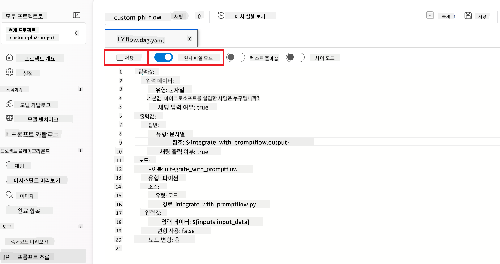

1. 사용자 정의 Phi-3 / Phi-3.5 모델을 Prompt flow에서 사용하기 위해 *integrate_with_promptflow.py*에 다음 코드를 추가합니다.

    ```python
    import logging
    import requests
    from promptflow import tool
    from promptflow.connections import CustomConnection

    # Logging setup
    logging.basicConfig(
        format="%(asctime)s - %(levelname)s - %(name)s - %(message)s",
        datefmt="%Y-%m-%d %H:%M:%S",
        level=logging.DEBUG
    )
    logger = logging.getLogger(__name__)

    def query_phi3_model(input_data: str, connection: CustomConnection) -> str:
        """
        Send a request to the Phi-3 / Phi-3.5 model endpoint with the given input data using Custom Connection.
        """

        # "connection" is the name of the Custom Connection, "endpoint", "key" are the keys in the Custom Connection
        endpoint_url = connection.endpoint
        api_key = connection.key

        headers = {
            "Content-Type": "application/json",
            "Authorization": f"Bearer {api_key}"
        }
    data = {
        "input_data": [input_data],
        "params": {
            "temperature": 0.7,
            "max_new_tokens": 128,
            "do_sample": True,
            "return_full_text": True
            }
        }
        try:
            response = requests.post(endpoint_url, json=data, headers=headers)
            response.raise_for_status()
            
            # Log the full JSON response
            logger.debug(f"Full JSON response: {response.json()}")

            result = response.json()["output"]
            logger.info("Successfully received response from Azure ML Endpoint.")
            return result
        except requests.exceptions.RequestException as e:
            logger.error(f"Error querying Azure ML Endpoint: {e}")
            raise

    @tool
    def my_python_tool(input_data: str, connection: CustomConnection) -> str:
        """
        Tool function to process input data and query the Phi-3 / Phi-3.5 model.
        """
        return query_phi3_model(input_data, connection)

    ```

    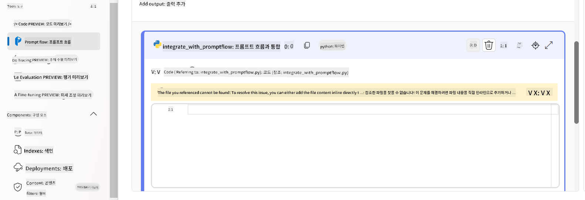

> [!NOTE]
> Azure AI Foundry에서 Prompt flow를 사용하는 방법에 대한 자세한 내용은 [Prompt flow in Azure AI Foundry](https://learn.microsoft.com/azure/ai-studio/how-to/prompt-flow)를 참조하세요.

1. **Chat input**, **Chat output**을 선택하여 모델과의 채팅을 활성화합니다.

    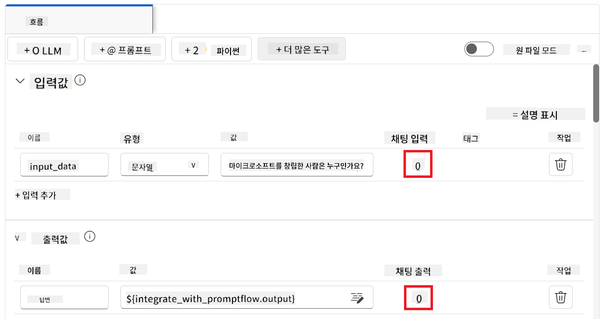

1. 이제 맞춤형 Phi-3 / Phi-3.5 모델과 채팅할 준비가 되었습니다. 다음 연습에서는 Prompt flow를 시작하고 이를 사용하여 세부 조정된 Phi-3 / Phi-3.5 모델과 채팅하는 방법을 배우게 됩니다.

> [!NOTE]
>
> 재구성된 흐름은 아래 이미지와 같이 표시됩니다:
>
> 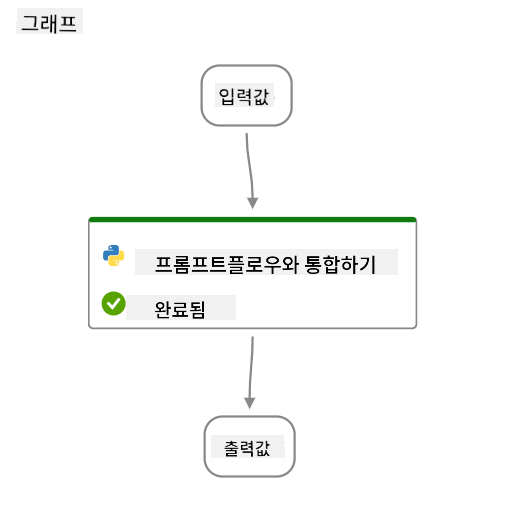
>

#### Prompt flow 시작

1. **Start compute sessions**를 선택하여 Prompt flow를 시작합니다.

    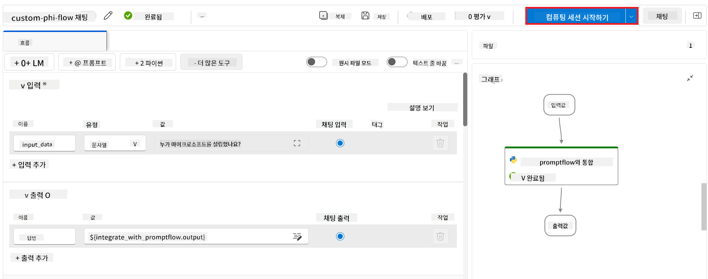

1. **Validate and parse input**을 선택하여 매개변수를 갱신합니다.

    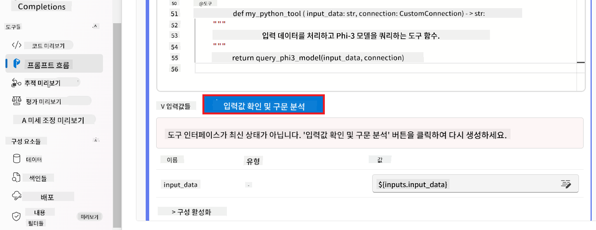

1. 생성한 사용자 정의 연결의 **connection** 값을 선택합니다. 예: *connection*.

    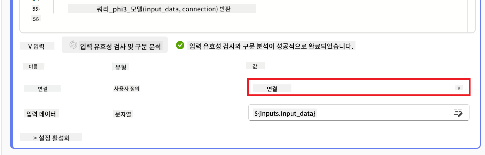

#### 사용자 정의 Phi-3 / Phi-3.5 모델과 채팅

1. **Chat**을 선택합니다.

    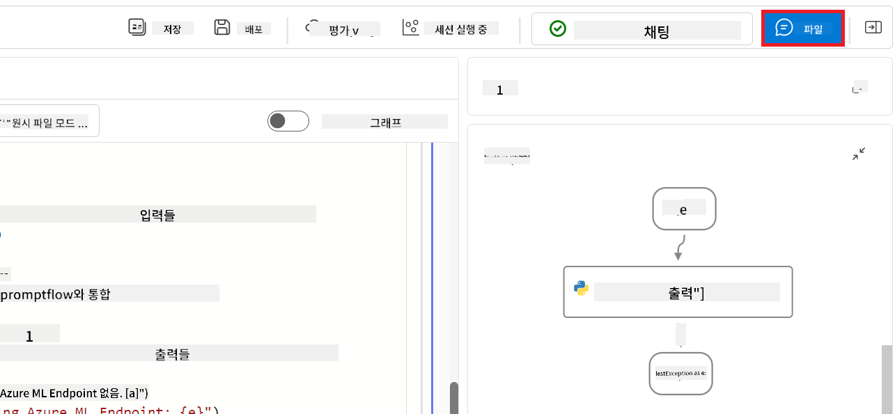

1. 다음은 결과 예시입니다: 이제 맞춤형 Phi-3 / Phi-3.5 모델과 채팅할 수 있습니다. 세부 조정에 사용된 데이터를 기반으로 질문하는 것이 좋습니다.

    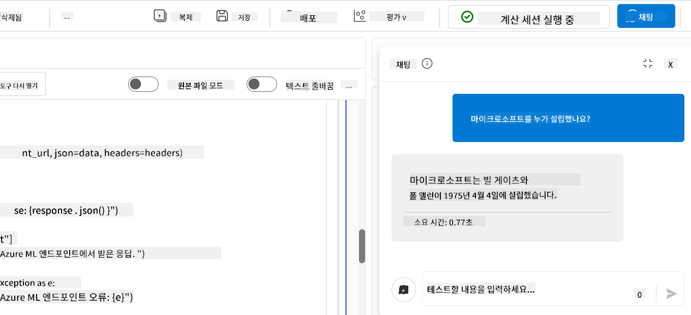

### Phi-3 / Phi-3.5 모델을 평가하기 위해 Azure OpenAI 배포

Azure AI Foundry에서 Phi-3 / Phi-3.5 모델을 평가하려면 Azure OpenAI 모델을 배포해야 합니다. 이 모델은 Phi-3 / Phi-3.5 모델의 성능을 평가하는 데 사용됩니다.

#### Azure OpenAI 배포

1. [Azure AI Foundry](https://ai.azure.com/?wt.mc_id=studentamb_279723)에 로그인합니다.

1. 생성한 Azure AI Foundry 프로젝트로 이동합니다.

    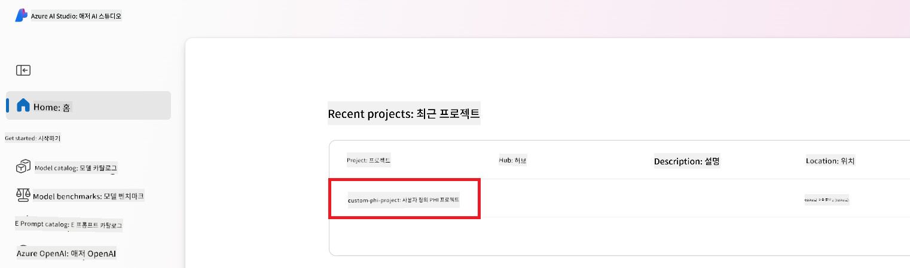

1. 생성한 프로젝트에서 왼쪽 탭에서 **Deployments**를 선택합니다.

1. 내비게이션 메뉴에서 **+ Deploy model**을 선택합니다.

1. **Deploy base model**을 선택합니다.

    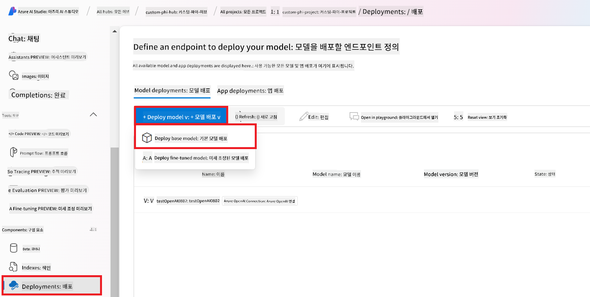

1. 사용할 Azure OpenAI 모델을 선택합니다. 예: **gpt-4o**.

    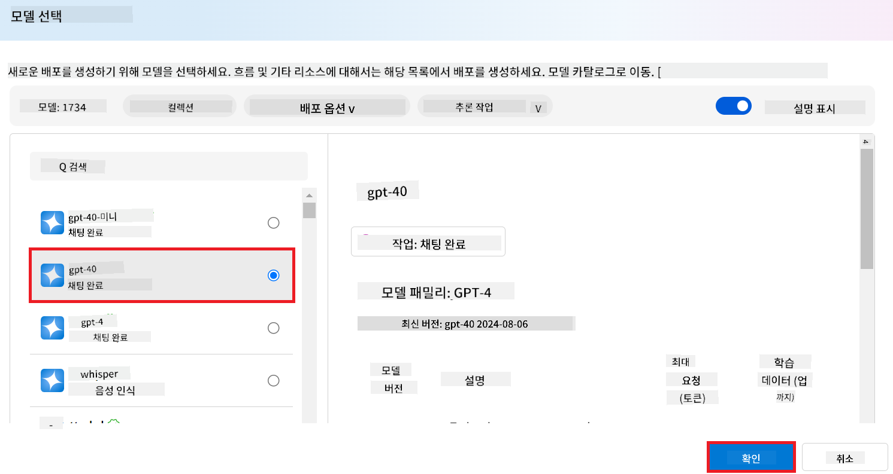

1. **Confirm**을 선택합니다.

### Azure AI Foundry의 Prompt flow 평가를 사용한 세부 조정된 Phi-3 / Phi-3.5 모델 평가

### 새 평가 시작

1. [Azure AI Foundry](https://ai.azure.com/?wt.mc_id=studentamb_279723)를 방문합니다.

1. 생성한 Azure AI Foundry 프로젝트로 이동합니다.

    

1. 생성한 프로젝트에서 왼쪽 탭에서 **Evaluation**을 선택합니다.

1. 내비게이션 메뉴에서 **+ New evaluation**을 선택합니다.
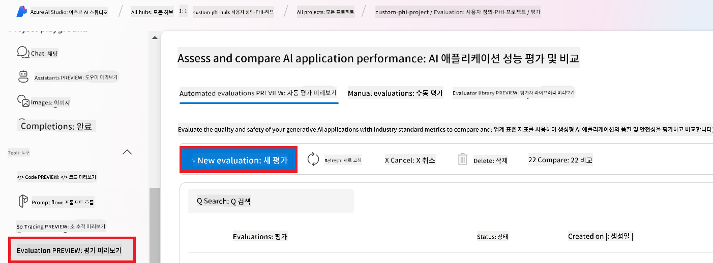

1. **Prompt flow** 평가를 선택합니다.

   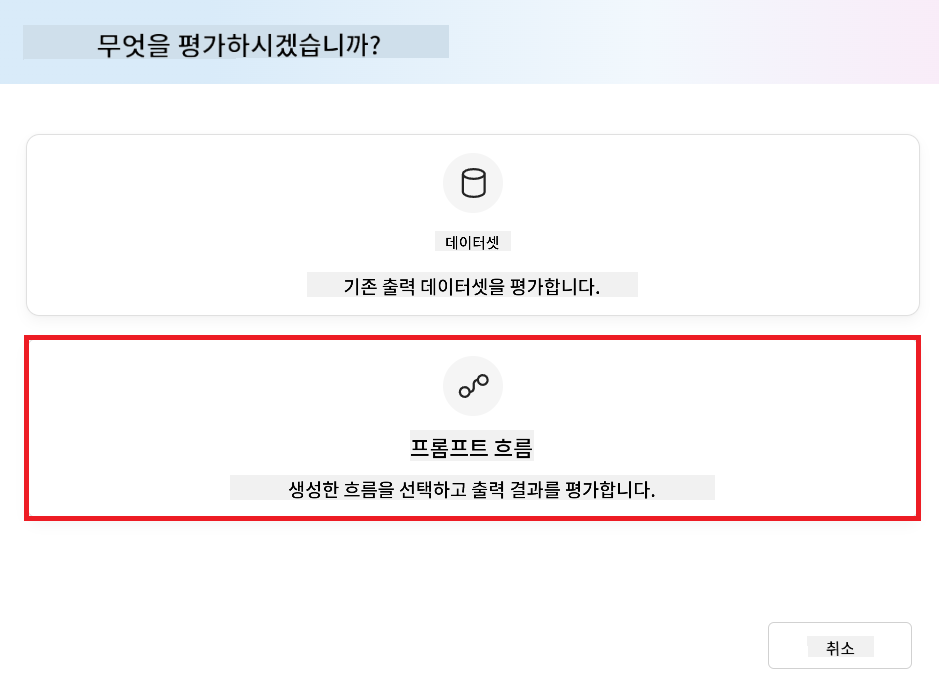

1. 다음 작업을 수행합니다:

   - 평가 이름을 입력합니다. 고유한 값이어야 합니다.
   - 작업 유형으로 **Question and answer without context**를 선택합니다. 이 튜토리얼에서 사용하는 **ULTRACHAT_200k** 데이터셋은 컨텍스트를 포함하지 않기 때문입니다.
   - 평가하려는 Prompt flow를 선택합니다.

   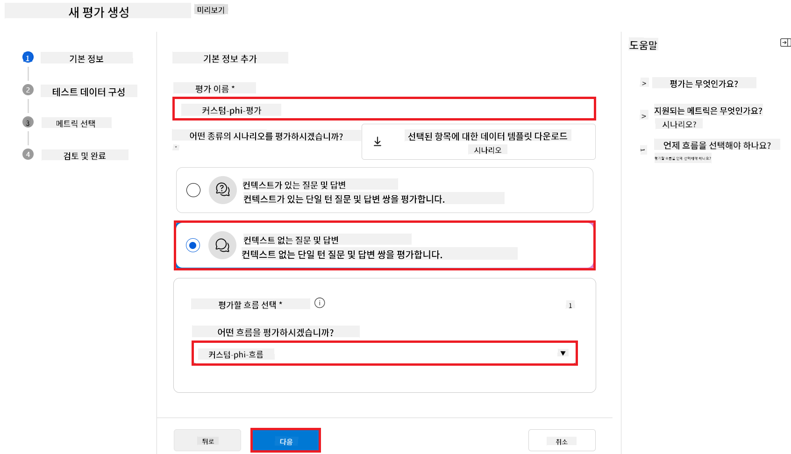

1. **Next**를 선택합니다.

1. 다음 작업을 수행합니다:

   - **Add your dataset**을 선택하여 데이터셋을 업로드합니다. 예를 들어, **ULTRACHAT_200k** 데이터셋을 다운로드할 때 포함된 *test_data.json1*과 같은 테스트 데이터셋 파일을 업로드할 수 있습니다.
   - 데이터셋에 맞는 적절한 **Dataset column**을 선택합니다. 예를 들어, **ULTRACHAT_200k** 데이터셋을 사용하는 경우 **${data.prompt}**를 데이터셋 열로 선택합니다.

   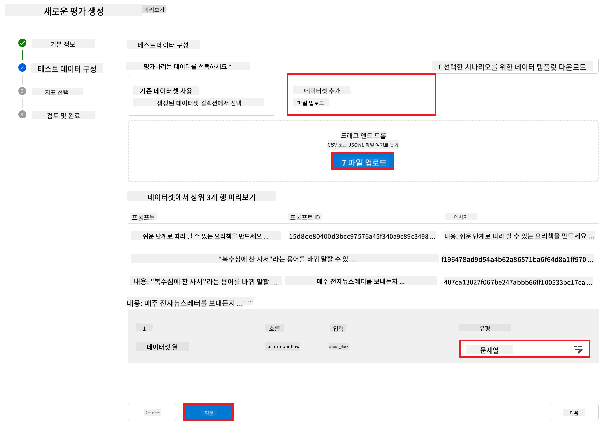

1. **Next**를 선택합니다.

1. 성능 및 품질 메트릭을 설정하려면 다음 작업을 수행합니다:

   - 사용할 성능 및 품질 메트릭을 선택합니다.
   - 평가를 위해 생성한 Azure OpenAI 모델을 선택합니다. 예를 들어, **gpt-4o**를 선택합니다.

   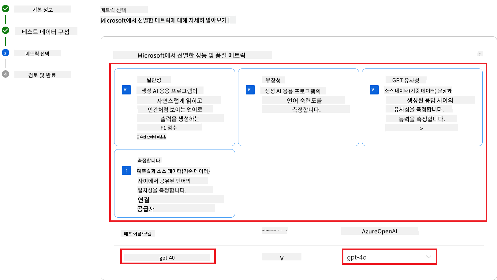

1. 위험 및 안전 메트릭을 설정하려면 다음 작업을 수행합니다:

   - 사용할 위험 및 안전 메트릭을 선택합니다.
   - 사용할 결함률 계산 임계값을 선택합니다. 예를 들어, **Medium**을 선택합니다.
   - **question**의 경우 **Data source**를 **{$data.prompt}**로 설정합니다.
   - **answer**의 경우 **Data source**를 **{$run.outputs.answer}**로 설정합니다.
   - **ground_truth**의 경우 **Data source**를 **{$data.message}**로 설정합니다.

   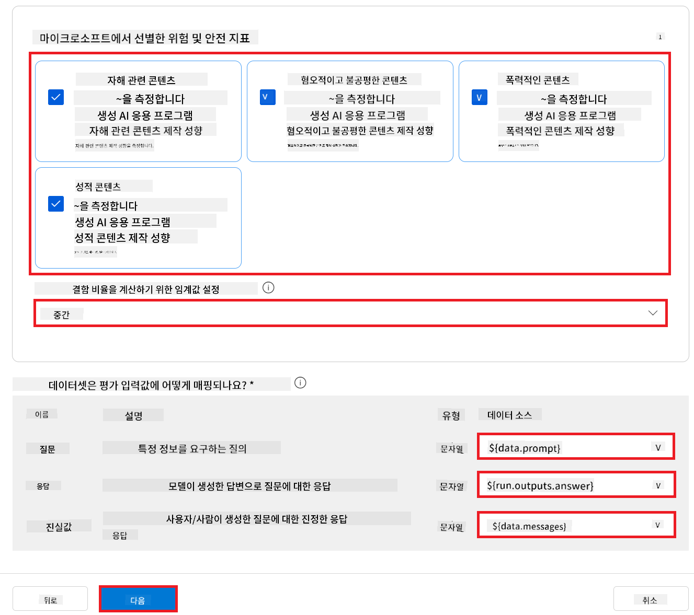

1. **Next**를 선택합니다.

1. **Submit**을 선택하여 평가를 시작합니다.

1. 평가가 완료되는 데 시간이 걸릴 수 있습니다. **Evaluation** 탭에서 진행 상황을 모니터링할 수 있습니다.

### 평가 결과 검토

> [!NOTE]  
> 아래에 제공된 결과는 평가 프로세스를 보여주기 위한 예시입니다. 이 튜토리얼에서는 상대적으로 작은 데이터셋으로 미세 조정된 모델을 사용했기 때문에 최적의 결과를 얻지 못할 수 있습니다. 실제 결과는 사용된 데이터셋의 크기, 품질, 다양성 및 모델의 특정 설정에 따라 크게 달라질 수 있습니다.

평가가 완료되면 성능 및 안전 메트릭에 대한 결과를 검토할 수 있습니다.

1. 성능 및 품질 메트릭:

   - 모델이 일관성 있고, 유창하며, 관련성 높은 응답을 생성하는 능력을 평가합니다.

   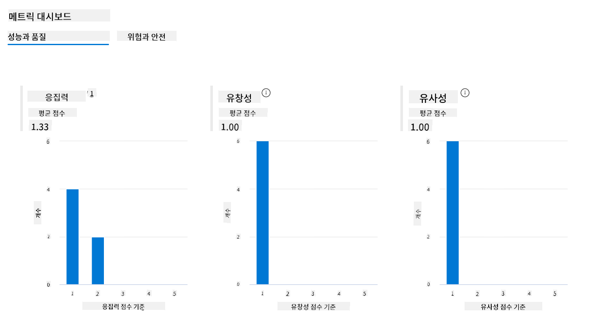

1. 위험 및 안전 메트릭:

   - 모델의 출력이 안전하고, 유해하거나 불쾌감을 줄 수 있는 콘텐츠를 피하며 Responsible AI Principles에 부합하는지 확인합니다.

   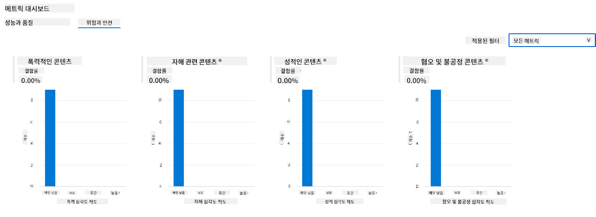

1. **Detailed metrics result**를 아래로 스크롤하여 확인할 수 있습니다.

   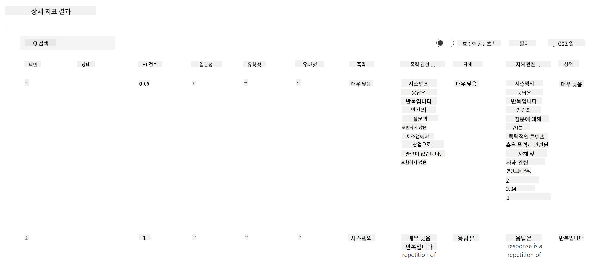

1. 사용자 정의 Phi-3 / Phi-3.5 모델을 성능 및 안전 메트릭에 대해 평가함으로써 모델이 효과적일 뿐만 아니라 Responsible AI Practices를 준수하여 실제 환경에서 사용하기에 적합한지 확인할 수 있습니다.

## 축하합니다!

### 이 튜토리얼을 완료했습니다

Prompt flow와 통합된 미세 조정된 Phi-3 모델을 Azure AI Foundry에서 성공적으로 평가했습니다. 이는 AI 모델이 잘 작동할 뿐만 아니라 Microsoft의 Responsible AI 원칙을 준수하여 신뢰할 수 있고 신뢰할 만한 AI 애플리케이션을 구축할 수 있도록 보장하는 중요한 단계입니다.


## Azure 리소스 정리

추가 요금을 방지하기 위해 Azure 리소스를 정리하세요. Azure 포털로 이동하여 다음 리소스를 삭제합니다:

- Azure Machine learning 리소스.
- Azure Machine learning 모델 엔드포인트.
- Azure AI Foundry 프로젝트 리소스.
- Azure AI Foundry Prompt flow 리소스.

### 다음 단계

#### 문서

- [Responsible AI 대시보드를 사용하여 AI 시스템 평가하기](https://learn.microsoft.com/azure/machine-learning/concept-responsible-ai-dashboard?view=azureml-api-2&source=recommendations?wt.mc_id=studentamb_279723)  
- [생성형 AI의 평가 및 모니터링 메트릭](https://learn.microsoft.com/azure/ai-studio/concepts/evaluation-metrics-built-in?tabs=definition?wt.mc_id=studentamb_279723)  
- [Azure AI Foundry 문서](https://learn.microsoft.com/azure/ai-studio/?wt.mc_id=studentamb_279723)  
- [Prompt flow 문서](https://microsoft.github.io/promptflow/?wt.mc_id=studentamb_279723)  

#### 교육 콘텐츠

- [Microsoft의 Responsible AI 접근 방식 소개](https://learn.microsoft.com/training/modules/introduction-to-microsofts-responsible-ai-approach/?source=recommendations?wt.mc_id=studentamb_279723)  
- [Azure AI Foundry 소개](https://learn.microsoft.com/training/modules/introduction-to-azure-ai-studio/?wt.mc_id=studentamb_279723)  

### 참고 자료

- [Responsible AI란 무엇인가?](https://learn.microsoft.com/azure/machine-learning/concept-responsible-ai?view=azureml-api-2?wt.mc_id=studentamb_279723)  
- [더 안전하고 신뢰할 수 있는 생성형 AI 애플리케이션 구축을 위한 Azure AI의 새로운 도구 발표](https://azure.microsoft.com/blog/announcing-new-tools-in-azure-ai-to-help-you-build-more-secure-and-trustworthy-generative-ai-applications/?wt.mc_id=studentamb_279723)  
- [생성형 AI 애플리케이션 평가](https://learn.microsoft.com/azure/ai-studio/concepts/evaluation-approach-gen-ai?wt.mc_id%3Dstudentamb_279723)  

**면책 조항**:  
이 문서는 AI 번역 서비스 [Co-op Translator](https://github.com/Azure/co-op-translator)를 사용하여 번역되었습니다. 정확성을 위해 노력하고 있으나, 자동 번역은 오류나 부정확성을 포함할 수 있습니다. 원문은 해당 언어로 작성된 권위 있는 자료로 간주되어야 합니다. 중요한 정보의 경우, 전문적인 인간 번역을 권장합니다. 이 번역 사용으로 인해 발생하는 오해나 잘못된 해석에 대해 당사는 책임을 지지 않습니다.