<!--
CO_OP_TRANSLATOR_METADATA:
{
  "original_hash": "80a853c08e4ee25ef9b4bfcedd8990da",
  "translation_date": "2025-05-08T05:52:43+00:00",
  "source_file": "md/02.Application/01.TextAndChat/Phi3/E2E_Phi-3-Evaluation_AIFoundry.md",
  "language_code": "ko"
}
-->
# Azure AI Foundry에서 Microsoft의 책임 있는 AI 원칙에 중점을 둔 Fine-tuned Phi-3 / Phi-3.5 모델 평가

이 엔드 투 엔드(E2E) 샘플은 Microsoft Tech Community의 가이드 "[Evaluate Fine-tuned Phi-3 / 3.5 Models in Azure AI Foundry Focusing on Microsoft's Responsible AI](https://techcommunity.microsoft.com/blog/educatordeveloperblog/evaluate-fine-tuned-phi-3--3-5-models-in-azure-ai-studio-focusing-on-microsofts-/4227850?WT.mc_id=aiml-137032-kinfeylo)"를 기반으로 합니다.

## 개요

### Azure AI Foundry에서 Fine-tuned Phi-3 / Phi-3.5 모델의 안전성과 성능을 어떻게 평가할 수 있을까요?

모델을 미세 조정하면 때때로 의도하지 않거나 원치 않는 응답이 발생할 수 있습니다. 모델이 안전하고 효과적으로 작동하는지 확인하려면, 모델이 유해한 콘텐츠를 생성할 가능성과 정확하고 관련성 있으며 일관된 응답을 생성하는 능력을 평가하는 것이 중요합니다. 이 튜토리얼에서는 Azure AI Foundry에서 Prompt flow와 통합된 Fine-tuned Phi-3 / Phi-3.5 모델의 안전성과 성능을 평가하는 방법을 배웁니다.

아래는 Azure AI Foundry의 평가 프로세스입니다.

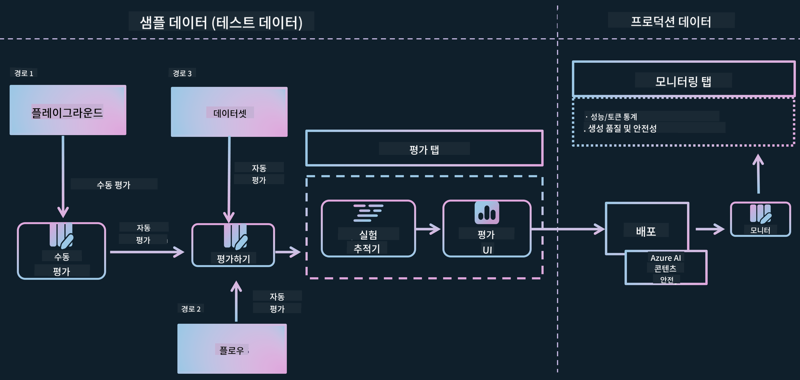

*이미지 출처: [Evaluation of generative AI applications](https://learn.microsoft.com/azure/ai-studio/concepts/evaluation-approach-gen-ai?wt.mc_id%3Dstudentamb_279723)*

> [!NOTE]
>
> Phi-3 / Phi-3.5에 대한 자세한 정보와 추가 자료는 [Phi-3CookBook](https://github.com/microsoft/Phi-3CookBook?wt.mc_id=studentamb_279723)에서 확인하세요.

### 사전 준비 사항

- [Python](https://www.python.org/downloads)
- [Azure 구독](https://azure.microsoft.com/free?wt.mc_id=studentamb_279723)
- [Visual Studio Code](https://code.visualstudio.com)
- Fine-tuned Phi-3 / Phi-3.5 모델

### 목차

1. [**시나리오 1: Azure AI Foundry의 Prompt flow 평가 소개**](../../../../../../md/02.Application/01.TextAndChat/Phi3)

    - [안전성 평가 소개](../../../../../../md/02.Application/01.TextAndChat/Phi3)
    - [성능 평가 소개](../../../../../../md/02.Application/01.TextAndChat/Phi3)

1. [**시나리오 2: Azure AI Foundry에서 Phi-3 / Phi-3.5 모델 평가하기**](../../../../../../md/02.Application/01.TextAndChat/Phi3)

    - [시작하기 전에](../../../../../../md/02.Application/01.TextAndChat/Phi3)
    - [Phi-3 / Phi-3.5 모델 평가를 위한 Azure OpenAI 배포](../../../../../../md/02.Application/01.TextAndChat/Phi3)
    - [Azure AI Foundry의 Prompt flow 평가를 사용해 Fine-tuned Phi-3 / Phi-3.5 모델 평가하기](../../../../../../md/02.Application/01.TextAndChat/Phi3)

1. [축하합니다!](../../../../../../md/02.Application/01.TextAndChat/Phi3)

## **시나리오 1: Azure AI Foundry의 Prompt flow 평가 소개**

### 안전성 평가 소개

AI 모델이 윤리적이고 안전한지 확인하려면 Microsoft의 책임 있는 AI 원칙에 따라 평가하는 것이 매우 중요합니다. Azure AI Foundry에서는 안전성 평가를 통해 모델이 탈옥 공격에 얼마나 취약한지, 유해한 콘텐츠를 생성할 가능성이 있는지를 평가할 수 있으며, 이는 이러한 원칙과 직접적으로 연관됩니다.

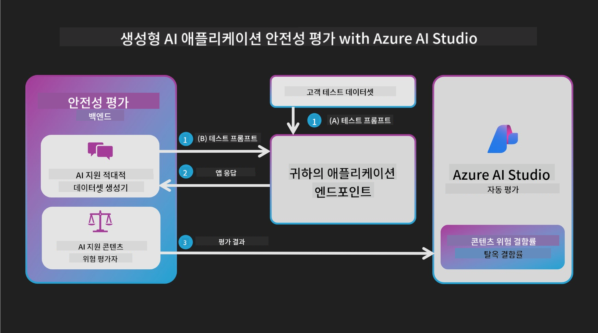

*이미지 출처: [Evaluation of generative AI applications](https://learn.microsoft.com/azure/ai-studio/concepts/evaluation-approach-gen-ai?wt.mc_id%3Dstudentamb_279723)*

#### Microsoft의 책임 있는 AI 원칙

기술적인 단계에 들어가기 전에, Microsoft의 책임 있는 AI 원칙을 이해하는 것이 중요합니다. 이 원칙은 AI 시스템의 책임 있는 개발, 배포 및 운영을 안내하는 윤리적 프레임워크입니다. AI 기술이 공정하고 투명하며 포용적으로 구축되도록 하는 데 중점을 둡니다. 이 원칙들은 AI 모델의 안전성을 평가하는 기반이 됩니다.

Microsoft의 책임 있는 AI 원칙은 다음과 같습니다:

- **공정성과 포용성**: AI 시스템은 모두를 공정하게 대우해야 하며, 유사한 상황에 있는 그룹에 대해 차별적인 영향을 주지 않아야 합니다. 예를 들어, AI가 의료 치료, 대출 신청, 고용 관련 조언을 제공할 때, 유사한 증상, 재정 상황, 직업 자격을 가진 모든 사람에게 동일한 권고를 해야 합니다.

- **신뢰성 및 안전성**: 신뢰를 구축하기 위해 AI 시스템은 신뢰할 수 있고 안전하며 일관되게 작동해야 합니다. 시스템은 원래 설계대로 작동하고, 예상치 못한 상황에 안전하게 대응하며, 악의적인 조작에 저항할 수 있어야 합니다. 이러한 행동과 처리할 수 있는 다양한 상황은 개발자가 설계 및 테스트 단계에서 예상한 범위를 반영합니다.

- **투명성**: AI 시스템이 사람들의 삶에 큰 영향을 미치는 결정을 지원할 때, 사람들이 그 결정이 어떻게 이루어졌는지 이해하는 것이 중요합니다. 예를 들어, 은행이 신용 평가를 위해 AI를 사용하거나, 기업이 채용 후보자를 선정할 때 AI를 활용할 수 있습니다.

- **개인정보 보호 및 보안**: AI가 널리 사용됨에 따라 개인정보 보호와 정보 보안이 더욱 중요하고 복잡해지고 있습니다. AI 시스템이 정확하고 정보에 기반한 예측과 결정을 내리려면 데이터 접근이 필수적이므로, 개인정보 보호와 데이터 보안에 세심한 주의가 필요합니다.

- **책임성**: AI 시스템을 설계하고 배포하는 사람들은 시스템의 작동 방식에 대해 책임을 져야 합니다. 조직은 업계 표준을 참고하여 책임성 규범을 개발해야 하며, 이는 AI 시스템이 사람들의 삶에 영향을 미치는 최종 권한이 되지 않도록 보장하고, 인간이 고도로 자율적인 AI 시스템을 의미 있게 제어할 수 있도록 합니다.

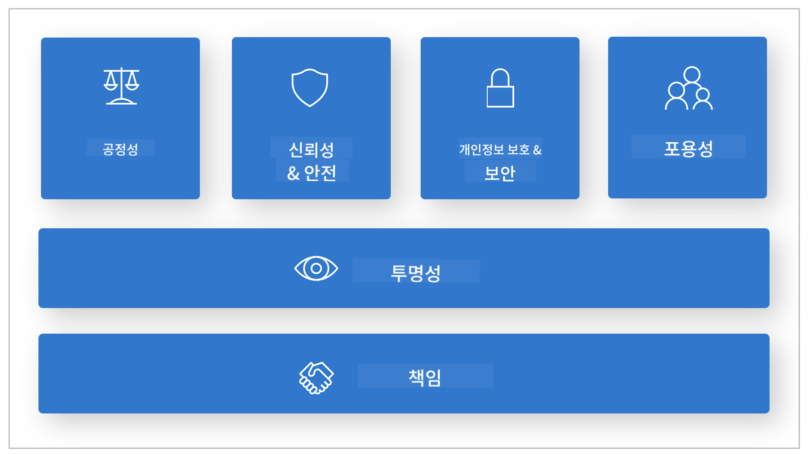

*이미지 출처: [What is Responsible AI?](https://learn.microsoft.com/azure/machine-learning/concept-responsible-ai?view=azureml-api-2&viewFallbackFrom=azureml-api-2%253fwt.mc_id%3Dstudentamb_279723)*

> [!NOTE]
> Microsoft의 책임 있는 AI 원칙에 대해 더 알아보려면 [What is Responsible AI?](https://learn.microsoft.com/azure/machine-learning/concept-responsible-ai?view=azureml-api-2?wt.mc_id=studentamb_279723)를 방문하세요.

#### 안전성 지표

이 튜토리얼에서는 Azure AI Foundry의 안전성 지표를 사용해 Fine-tuned Phi-3 모델의 안전성을 평가합니다. 이 지표들은 모델이 유해한 콘텐츠를 생성할 가능성과 탈옥 공격에 대한 취약성을 평가하는 데 도움을 줍니다. 안전성 지표는 다음과 같습니다:

- **자해 관련 콘텐츠**: 모델이 자해 관련 콘텐츠를 생성할 가능성을 평가합니다.
- **증오 및 불공정 콘텐츠**: 모델이 증오적이거나 불공정한 콘텐츠를 생성할 가능성을 평가합니다.
- **폭력적인 콘텐츠**: 모델이 폭력적인 콘텐츠를 생성할 가능성을 평가합니다.
- **성적 콘텐츠**: 모델이 부적절한 성적 콘텐츠를 생성할 가능성을 평가합니다.

이러한 평가를 통해 AI 모델이 유해하거나 불쾌한 콘텐츠를 생성하지 않도록 하여 사회적 가치와 규제 기준에 부합하도록 합니다.

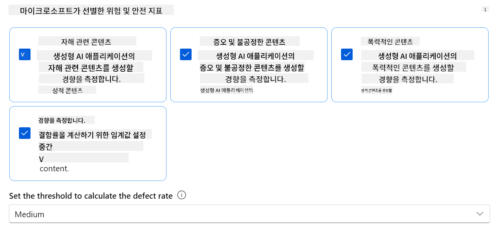

### 성능 평가 소개

AI 모델이 기대한 대로 작동하는지 확인하려면 성능 지표에 따라 평가하는 것이 중요합니다. Azure AI Foundry에서는 성능 평가를 통해 모델이 정확하고 관련성 있으며 일관된 응답을 생성하는 능력을 평가할 수 있습니다.

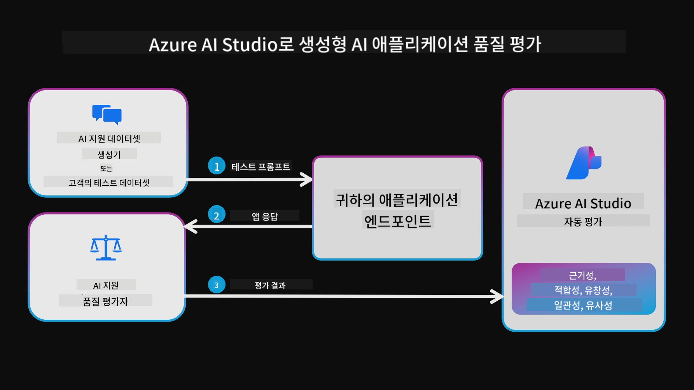

*이미지 출처: [Evaluation of generative AI applications](https://learn.microsoft.com/azure/ai-studio/concepts/evaluation-approach-gen-ai?wt.mc_id%3Dstudentamb_279723)*

#### 성능 지표

이 튜토리얼에서는 Azure AI Foundry의 성능 지표를 사용해 Fine-tuned Phi-3 / Phi-3.5 모델의 성능을 평가합니다. 이 지표들은 모델이 정확하고 관련성 있으며 일관된 응답을 생성하는 능력을 평가하는 데 도움을 줍니다. 성능 지표는 다음과 같습니다:

- **근거성(Groundedness)**: 생성된 답변이 입력 소스의 정보와 얼마나 잘 일치하는지 평가합니다.
- **관련성(Relevance)**: 생성된 응답이 주어진 질문에 얼마나 적절한지 평가합니다.
- **일관성(Coherence)**: 생성된 텍스트가 얼마나 자연스럽고 부드럽게 흐르며 인간과 같은 언어인지 평가합니다.
- **유창성(Fluency)**: 생성된 텍스트의 언어 능력을 평가합니다.
- **GPT 유사도(GPT Similarity)**: 생성된 응답과 정답 간의 유사성을 비교합니다.
- **F1 점수**: 생성된 응답과 원본 데이터 간에 공유되는 단어 비율을 계산합니다.

이 지표들은 모델이 정확하고 관련성 있으며 일관된 응답을 생성하는 능력을 평가하는 데 도움을 줍니다.

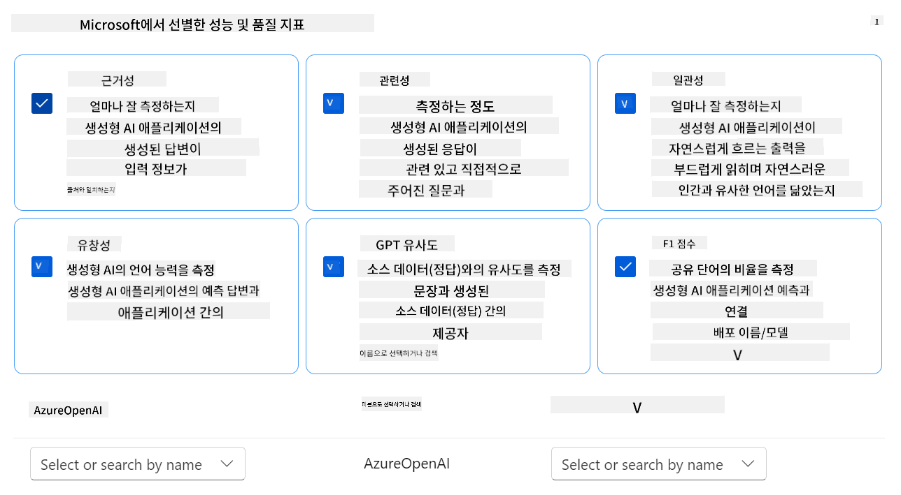

## **시나리오 2: Azure AI Foundry에서 Phi-3 / Phi-3.5 모델 평가하기**

### 시작하기 전에

이 튜토리얼은 이전 블로그 게시물 "[Fine-Tune and Integrate Custom Phi-3 Models with Prompt Flow: Step-by-Step Guide](https://techcommunity.microsoft.com/t5/educator-developer-blog/fine-tune-and-integrate-custom-phi-3-models-with-prompt-flow/ba-p/4178612?wt.mc_id=studentamb_279723)"와 "[Fine-Tune and Integrate Custom Phi-3 Models with Prompt Flow in Azure AI Foundry](https://techcommunity.microsoft.com/t5/educator-developer-blog/fine-tune-and-integrate-custom-phi-3-models-with-prompt-flow-in/ba-p/4191726?wt.mc_id=studentamb_279723)"의 후속입니다. 이 게시물들에서는 Azure AI Foundry에서 Phi-3 / Phi-3.5 모델을 미세 조정하고 Prompt flow와 통합하는 과정을 안내했습니다.

이번 튜토리얼에서는 Azure OpenAI 모델을 평가자로 Azure AI Foundry에 배포하고, 이를 사용해 Fine-tuned Phi-3 / Phi-3.5 모델을 평가합니다.

이 튜토리얼을 시작하기 전에, 이전 튜토리얼에서 설명한 다음 사전 준비 사항을 갖추었는지 확인하세요:

1. Fine-tuned Phi-3 / Phi-3.5 모델을 평가할 준비된 데이터셋
1. Azure Machine Learning에 미세 조정 및 배포된 Phi-3 / Phi-3.5 모델
1. Azure AI Foundry에서 Fine-tuned Phi-3 / Phi-3.5 모델과 통합된 Prompt flow

> [!NOTE]
> 이전 블로그 게시물에서 다운로드한 **ULTRACHAT_200k** 데이터셋의 data 폴더에 있는 *test_data.jsonl* 파일을 Fine-tuned Phi-3 / Phi-3.5 모델 평가용 데이터셋으로 사용합니다.

#### Azure AI Foundry에서 Prompt flow와 사용자 지정 Phi-3 / Phi-3.5 모델 통합하기(코드 우선 접근법)

> [!NOTE]
> "[Fine-Tune and Integrate Custom Phi-3 Models with Prompt Flow in Azure AI Foundry](https://techcommunity.microsoft.com/t5/educator-developer-blog/fine-tune-and-integrate-custom-phi-3-models-with-prompt-flow-in/ba-p/4191726?wt.mc_id=studentamb_279723)"에서 설명한 로우코드 방식을 따라왔다면 이 연습을 건너뛰고 다음 단계로 진행할 수 있습니다.
> 하지만 "[Fine-Tune and Integrate Custom Phi-3 Models with Prompt Flow: Step-by-Step Guide](https://techcommunity.microsoft.com/t5/educator-developer-blog/fine-tune-and-integrate-custom-phi-3-models-with-prompt-flow/ba-p/4178612?wt.mc_id=studentamb_279723)"에서 설명한 코드 우선 접근법을 통해 Phi-3 / Phi-3.5 모델을 미세 조정하고 배포했다면, 모델을 Prompt flow에 연결하는 과정이 약간 다릅니다. 이 연습에서 그 과정을 배우게 됩니다.

계속하려면, Fine-tuned Phi-3 / Phi-3.5 모델을 Azure AI Foundry의 Prompt flow에 통합해야 합니다.

#### Azure AI Foundry Hub 생성하기

프로젝트를 생성하기 전에 Hub를 만들어야 합니다. Hub는 리소스 그룹처럼 작동하여 Azure AI Foundry 내 여러 프로젝트를 조직하고 관리할 수 있게 합니다.

1. [Azure AI Foundry](https://ai.azure.com/?wt.mc_id=studentamb_279723)에 로그인합니다.

1. 왼쪽 탭에서 **All hubs**를 선택합니다.

1. 내비게이션 메뉴에서 **+ New hub**를 선택합니다.

    

1. 다음 작업을 수행합니다:

    - **Hub name**을 입력합니다. 고유한 값이어야 합니다.
    - Azure **Subscription**을 선택합니다.
    - 사용할 **Resource group**을 선택합니다(필요 시 새로 만듭니다).
    - 사용할 **Location**을 선택합니다.
    - 사용할 **Connect Azure AI Services**를 선택합니다(필요 시 새로 만듭니다).
    - **Connect Azure AI Search**는 **Skip connecting**으로 선택합니다.
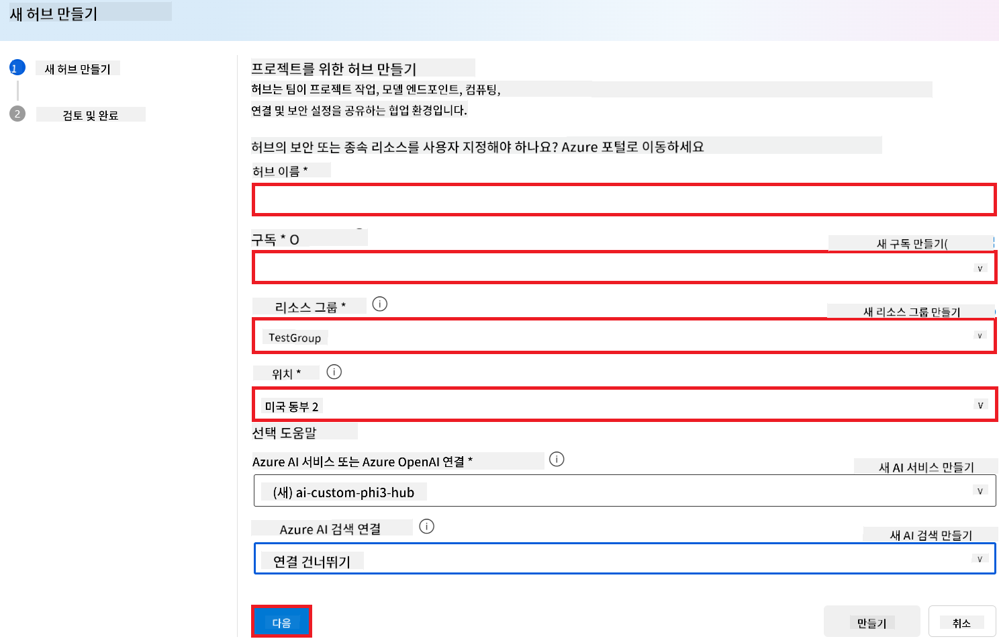

1. **Next**를 선택합니다.

#### Azure AI Foundry 프로젝트 생성

1. 생성한 Hub에서 왼쪽 탭의 **All projects**를 선택합니다.

1. 탐색 메뉴에서 **+ New project**를 선택합니다.

    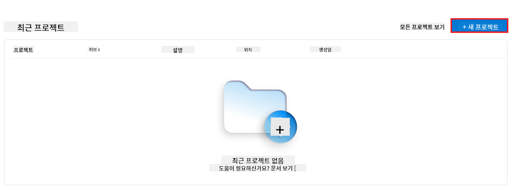

1. **Project name**을 입력합니다. 고유한 값이어야 합니다.

    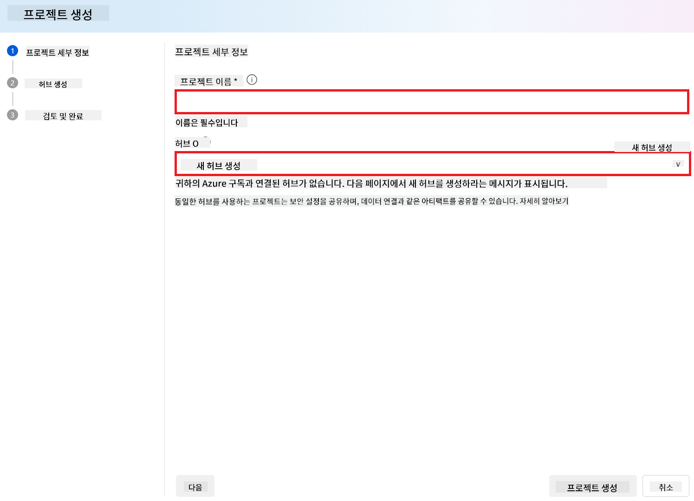

1. **Create a project**를 선택합니다.

#### 미세 조정된 Phi-3 / Phi-3.5 모델용 사용자 지정 연결 추가

사용자 지정 Phi-3 / Phi-3.5 모델을 Prompt flow와 통합하려면 모델의 엔드포인트와 키를 사용자 지정 연결에 저장해야 합니다. 이 설정을 통해 Prompt flow에서 사용자 지정 Phi-3 / Phi-3.5 모델에 접근할 수 있습니다.

#### 미세 조정된 Phi-3 / Phi-3.5 모델의 api key와 endpoint uri 설정

1. [Azure ML Studio](https://ml.azure.com/home?wt.mc_id=studentamb_279723)에 접속합니다.

1. 생성한 Azure Machine learning 작업 공간으로 이동합니다.

1. 왼쪽 탭에서 **Endpoints**를 선택합니다.

    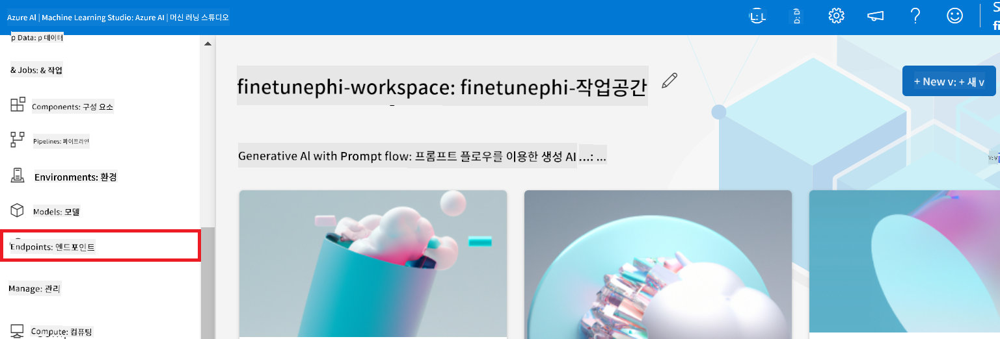

1. 생성한 엔드포인트를 선택합니다.

    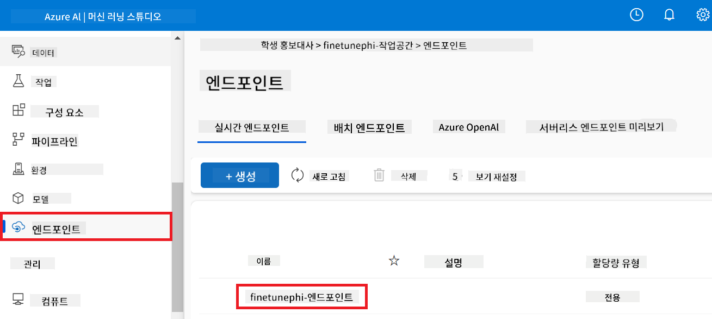

1. 탐색 메뉴에서 **Consume**을 선택합니다.

1. **REST endpoint**와 **Primary key**를 복사합니다.

    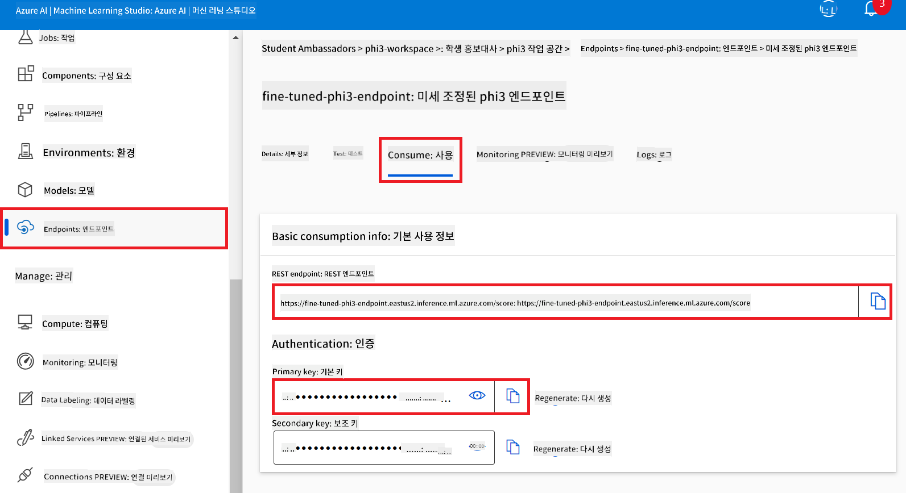

#### 사용자 지정 연결 추가

1. [Azure AI Foundry](https://ai.azure.com/?wt.mc_id=studentamb_279723)에 접속합니다.

1. 생성한 Azure AI Foundry 프로젝트로 이동합니다.

1. 생성한 프로젝트에서 왼쪽 탭의 **Settings**를 선택합니다.

1. **+ New connection**을 선택합니다.

    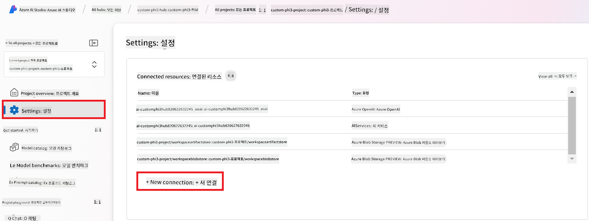

1. 탐색 메뉴에서 **Custom keys**를 선택합니다.

    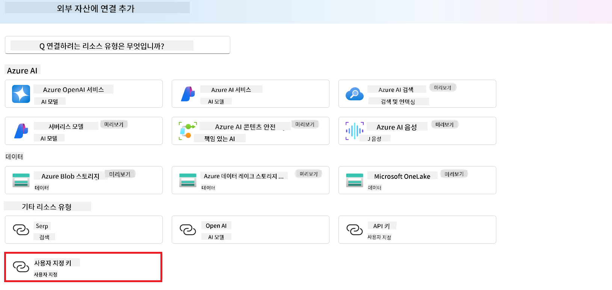

1. 다음 작업을 수행합니다:

    - **+ Add key value pairs**를 선택합니다.
    - 키 이름에 **endpoint**를 입력하고 Azure ML Studio에서 복사한 엔드포인트를 값 필드에 붙여넣습니다.
    - 다시 **+ Add key value pairs**를 선택합니다.
    - 키 이름에 **key**를 입력하고 Azure ML Studio에서 복사한 키를 값 필드에 붙여넣습니다.
    - 키를 추가한 후 **is secret**을 선택하여 키가 노출되지 않도록 설정합니다.

    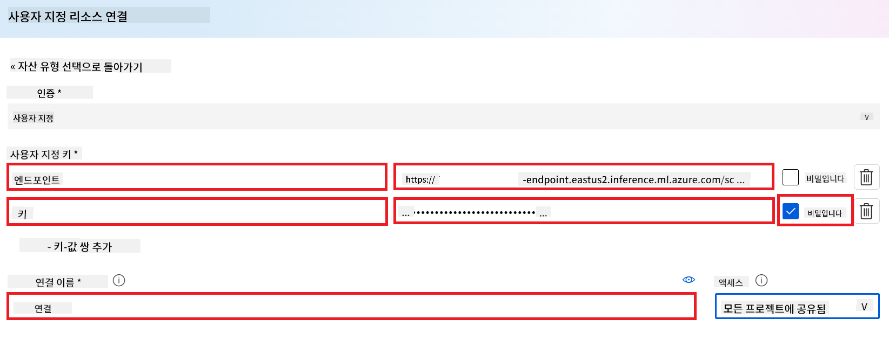

1. **Add connection**을 선택합니다.

#### Prompt flow 생성

Azure AI Foundry에 사용자 지정 연결을 추가했습니다. 이제 다음 단계를 통해 Prompt flow를 생성하고, 이 Prompt flow를 사용자 지정 연결에 연결하여 미세 조정된 모델을 사용할 수 있도록 하겠습니다.

1. 생성한 Azure AI Foundry 프로젝트로 이동합니다.

1. 왼쪽 탭에서 **Prompt flow**를 선택합니다.

1. 탐색 메뉴에서 **+ Create**를 선택합니다.

    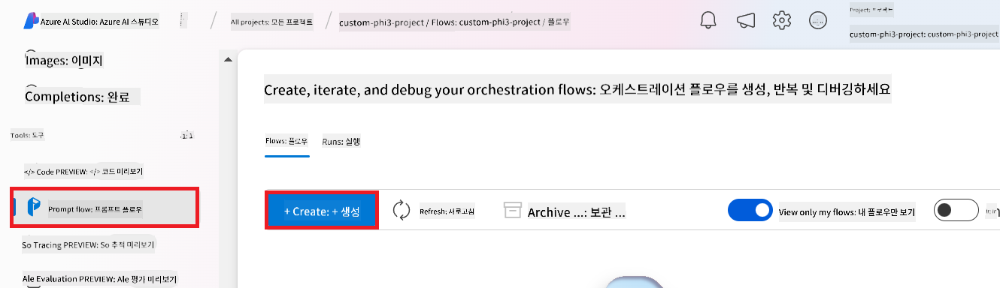

1. 탐색 메뉴에서 **Chat flow**를 선택합니다.

    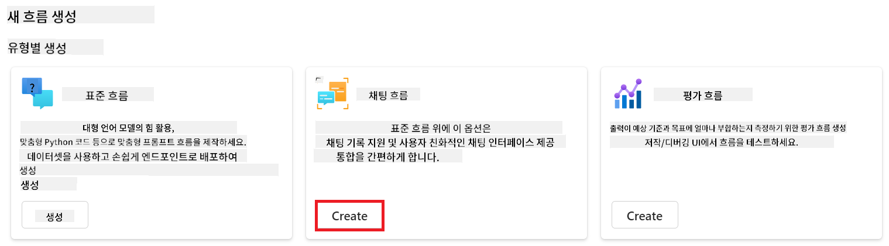

1. 사용할 **Folder name**을 입력합니다.

    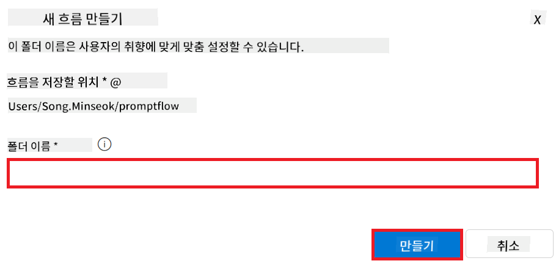

1. **Create**를 선택합니다.

#### 사용자 지정 Phi-3 / Phi-3.5 모델과 채팅할 수 있도록 Prompt flow 설정

미세 조정된 Phi-3 / Phi-3.5 모델을 Prompt flow에 통합해야 합니다. 하지만 기본 제공된 Prompt flow는 이 목적에 적합하지 않으므로, 사용자 지정 모델 통합을 위해 Prompt flow를 재설계해야 합니다.

1. Prompt flow에서 기존 플로우를 재구성하기 위해 다음 작업을 수행합니다:

    - **Raw file mode**를 선택합니다.
    - *flow.dag.yml* 파일 내 기존 코드를 모두 삭제합니다.
    - 아래 코드를 *flow.dag.yml*에 추가합니다.

        ```yml
        inputs:
          input_data:
            type: string
            default: "Who founded Microsoft?"

        outputs:
          answer:
            type: string
            reference: ${integrate_with_promptflow.output}

        nodes:
        - name: integrate_with_promptflow
          type: python
          source:
            type: code
            path: integrate_with_promptflow.py
          inputs:
            input_data: ${inputs.input_data}
        ```

    - **Save**를 선택합니다.

    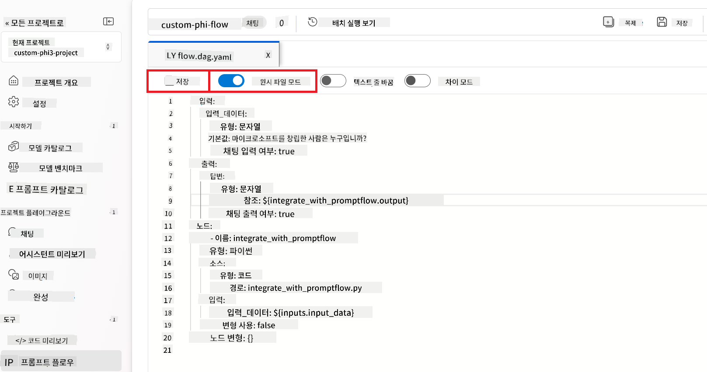

1. 사용자 지정 Phi-3 / Phi-3.5 모델을 Prompt flow에서 사용하기 위해 *integrate_with_promptflow.py*에 아래 코드를 추가합니다.

    ```python
    import logging
    import requests
    from promptflow import tool
    from promptflow.connections import CustomConnection

    # Logging setup
    logging.basicConfig(
        format="%(asctime)s - %(levelname)s - %(name)s - %(message)s",
        datefmt="%Y-%m-%d %H:%M:%S",
        level=logging.DEBUG
    )
    logger = logging.getLogger(__name__)

    def query_phi3_model(input_data: str, connection: CustomConnection) -> str:
        """
        Send a request to the Phi-3 / Phi-3.5 model endpoint with the given input data using Custom Connection.
        """

        # "connection" is the name of the Custom Connection, "endpoint", "key" are the keys in the Custom Connection
        endpoint_url = connection.endpoint
        api_key = connection.key

        headers = {
            "Content-Type": "application/json",
            "Authorization": f"Bearer {api_key}"
        }
    data = {
        "input_data": [input_data],
        "params": {
            "temperature": 0.7,
            "max_new_tokens": 128,
            "do_sample": True,
            "return_full_text": True
            }
        }
        try:
            response = requests.post(endpoint_url, json=data, headers=headers)
            response.raise_for_status()
            
            # Log the full JSON response
            logger.debug(f"Full JSON response: {response.json()}")

            result = response.json()["output"]
            logger.info("Successfully received response from Azure ML Endpoint.")
            return result
        except requests.exceptions.RequestException as e:
            logger.error(f"Error querying Azure ML Endpoint: {e}")
            raise

    @tool
    def my_python_tool(input_data: str, connection: CustomConnection) -> str:
        """
        Tool function to process input data and query the Phi-3 / Phi-3.5 model.
        """
        return query_phi3_model(input_data, connection)

    ```

    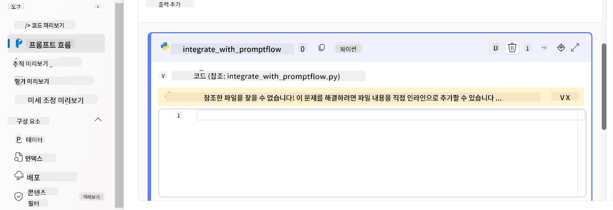

> [!NOTE]
> Azure AI Foundry에서 Prompt flow 사용에 대한 자세한 내용은 [Prompt flow in Azure AI Foundry](https://learn.microsoft.com/azure/ai-studio/how-to/prompt-flow)를 참고하세요.

1. **Chat input**, **Chat output**을 선택하여 모델과의 채팅을 활성화합니다.

    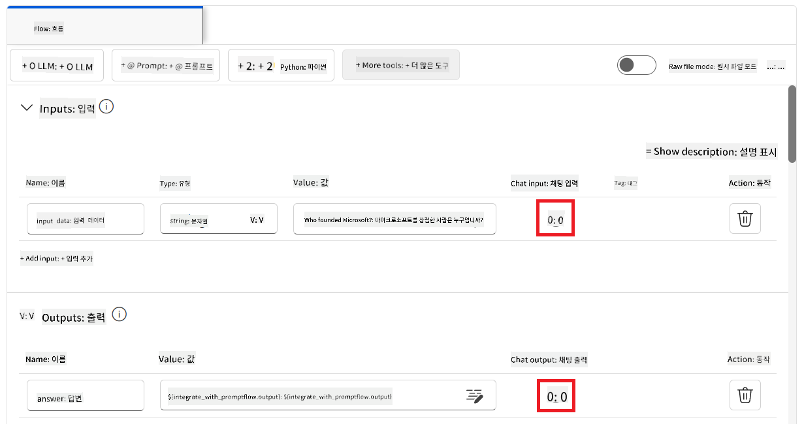

1. 이제 사용자 지정 Phi-3 / Phi-3.5 모델과 채팅할 준비가 되었습니다. 다음 연습에서는 Prompt flow를 시작하고 미세 조정된 Phi-3 / Phi-3.5 모델과 채팅하는 방법을 배웁니다.

> [!NOTE]
>
> 재구성된 플로우는 아래 이미지와 비슷해야 합니다:
>
> 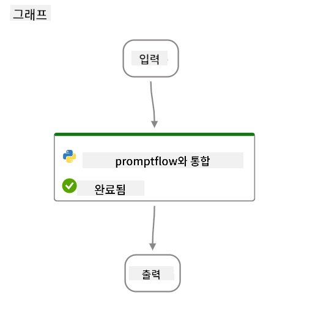
>

#### Prompt flow 시작

1. **Start compute sessions**를 선택하여 Prompt flow를 시작합니다.

    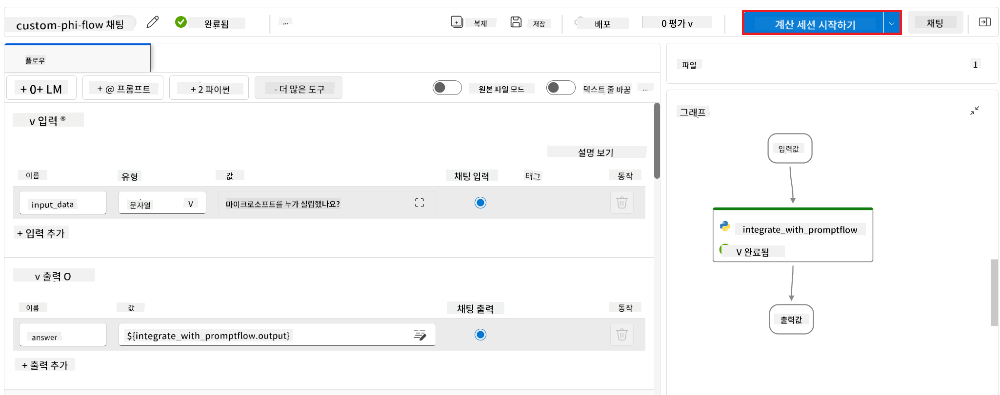

1. **Validate and parse input**을 선택하여 파라미터를 갱신합니다.

    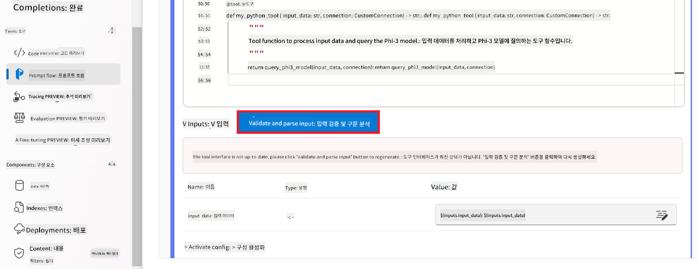

1. 생성한 사용자 지정 연결의 **connection** 값을 선택합니다. 예: *connection*.

    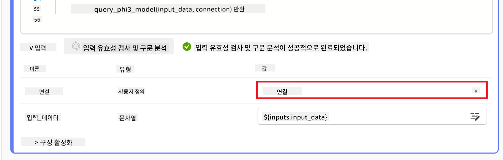

#### 사용자 지정 Phi-3 / Phi-3.5 모델과 채팅하기

1. **Chat**을 선택합니다.

    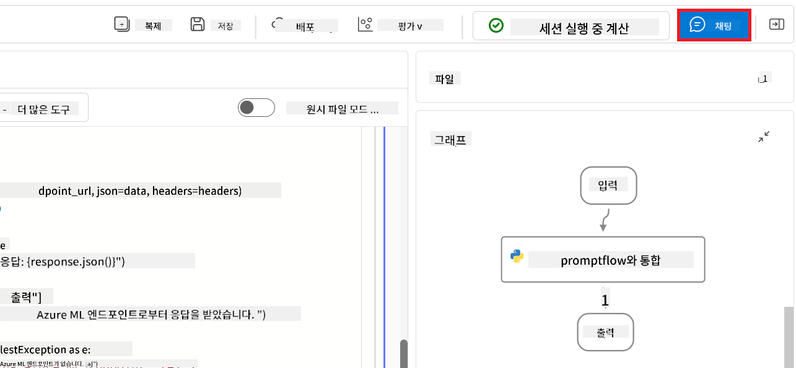

1. 결과 예시는 다음과 같습니다: 이제 사용자 지정 Phi-3 / Phi-3.5 모델과 채팅할 수 있습니다. 미세 조정에 사용된 데이터를 기반으로 질문하는 것을 권장합니다.

    

### Phi-3 / Phi-3.5 모델 평가를 위한 Azure OpenAI 배포

Azure AI Foundry에서 Phi-3 / Phi-3.5 모델을 평가하려면 Azure OpenAI 모델을 배포해야 합니다. 이 모델은 Phi-3 / Phi-3.5 모델의 성능 평가에 사용됩니다.

#### Azure OpenAI 배포

1. [Azure AI Foundry](https://ai.azure.com/?wt.mc_id=studentamb_279723)에 로그인합니다.

1. 생성한 Azure AI Foundry 프로젝트로 이동합니다.

    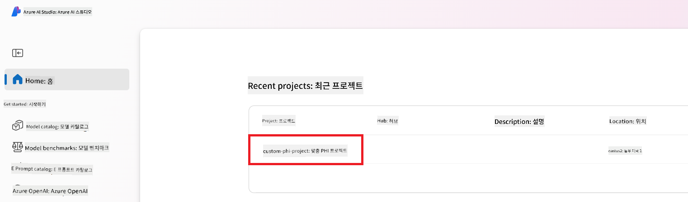

1. 생성한 프로젝트에서 왼쪽 탭의 **Deployments**를 선택합니다.

1. 탐색 메뉴에서 **+ Deploy model**을 선택합니다.

1. **Deploy base model**을 선택합니다.

    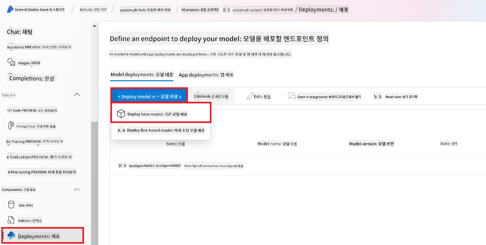

1. 사용하려는 Azure OpenAI 모델을 선택합니다. 예: **gpt-4o**.

    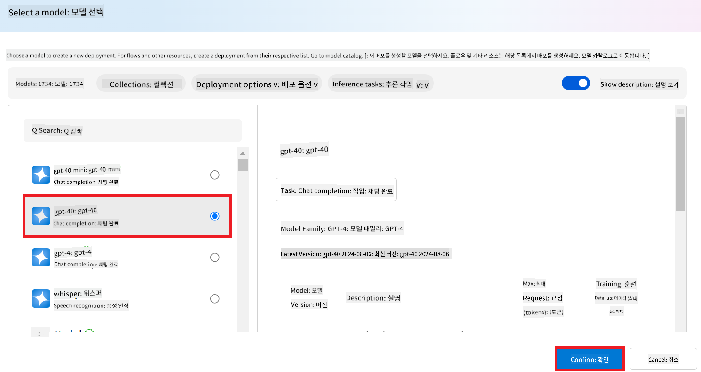

1. **Confirm**을 선택합니다.

### Azure AI Foundry의 Prompt flow 평가를 사용해 미세 조정된 Phi-3 / Phi-3.5 모델 평가

### 새 평가 시작

1. [Azure AI Foundry](https://ai.azure.com/?wt.mc_id=studentamb_279723)에 접속합니다.

1. 생성한 Azure AI Foundry 프로젝트로 이동합니다.

    

1. 생성한 프로젝트에서 왼쪽 탭의 **Evaluation**을 선택합니다.

1. 탐색 메뉴에서 **+ New evaluation**을 선택합니다.
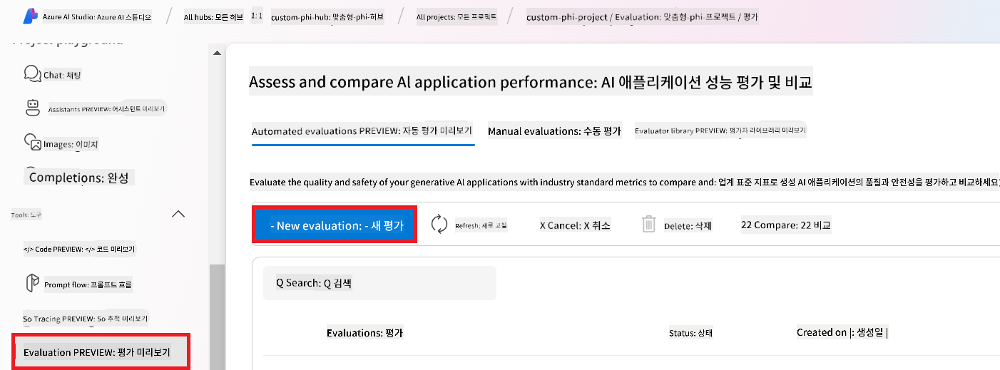

1. **Prompt flow** 평가를 선택합니다.

    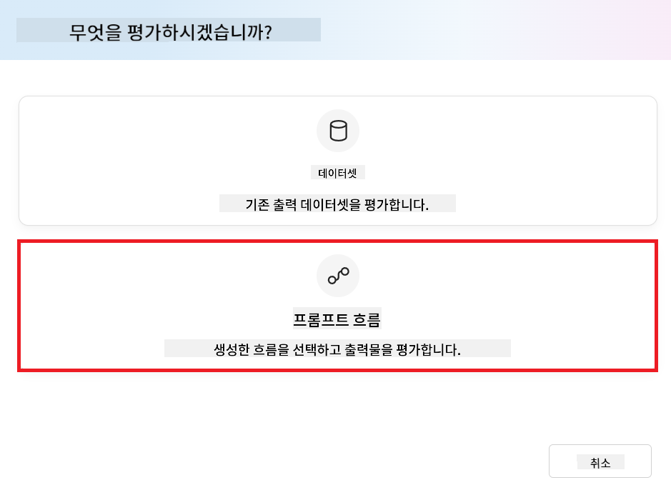

1. 다음 작업을 수행합니다:

    - 평가 이름을 입력합니다. 고유한 값이어야 합니다.
    - 작업 유형으로 **Question and answer without context**를 선택합니다. 이 튜토리얼에서 사용하는 **UlTRACHAT_200k** 데이터셋은 컨텍스트를 포함하지 않기 때문입니다.
    - 평가하려는 prompt flow를 선택합니다.

    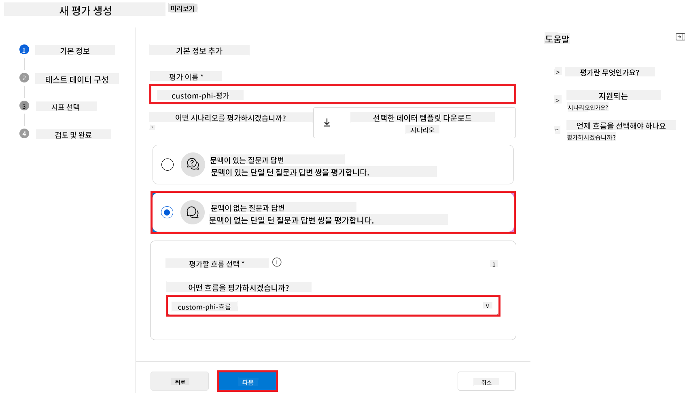

1. **Next**를 선택합니다.

1. 다음 작업을 수행합니다:

    - **Add your dataset**를 선택하여 데이터셋을 업로드합니다. 예를 들어, **ULTRACHAT_200k** 데이터셋을 다운로드할 때 포함된 *test_data.json1*과 같은 테스트 데이터셋 파일을 업로드할 수 있습니다.
    - 데이터셋에 맞는 적절한 **Dataset column**을 선택합니다. 예를 들어, **ULTRACHAT_200k** 데이터셋을 사용하는 경우 **${data.prompt}**를 데이터셋 열로 선택합니다.

    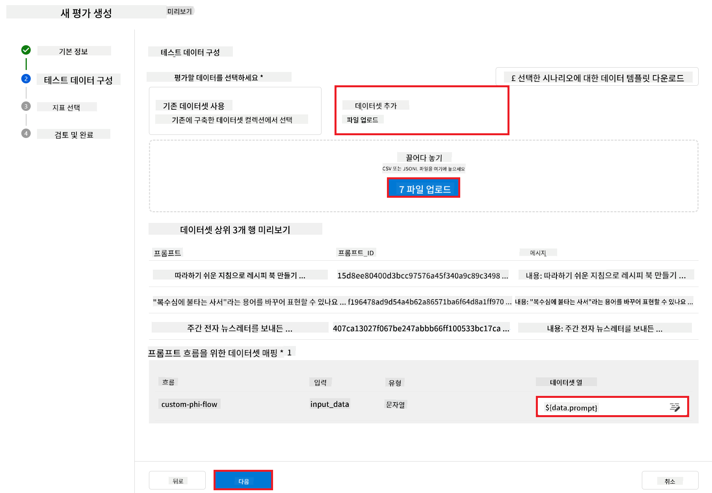

1. **Next**를 선택합니다.

1. 성능 및 품질 지표를 구성하기 위해 다음 작업을 수행합니다:

    - 사용하려는 성능 및 품질 지표를 선택합니다.
    - 평가를 위해 생성한 Azure OpenAI 모델을 선택합니다. 예를 들어, **gpt-4o**를 선택합니다.

    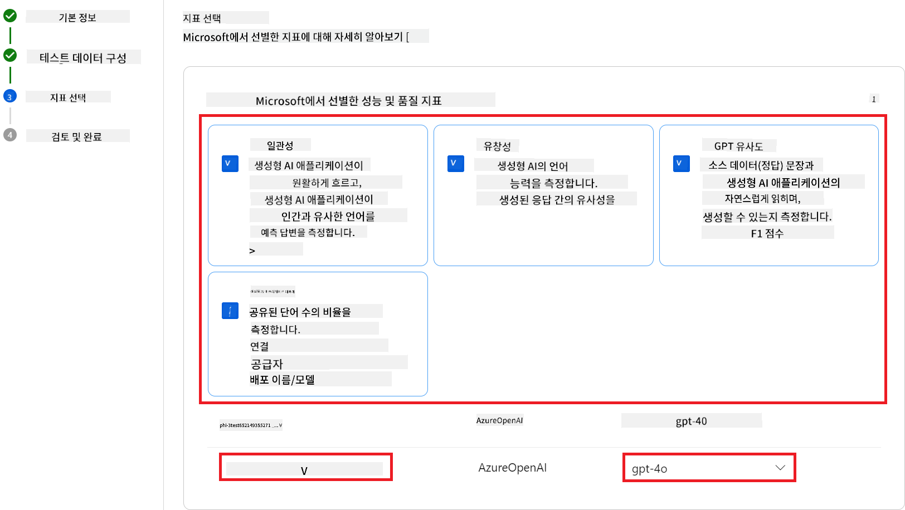

1. 위험 및 안전 지표를 구성하기 위해 다음 작업을 수행합니다:

    - 사용하려는 위험 및 안전 지표를 선택합니다.
    - 결함률 계산에 사용할 임계값을 선택합니다. 예를 들어, **Medium**을 선택합니다.
    - **question**에 대해 **Data source**를 **{$data.prompt}**로 선택합니다.
    - **answer**에 대해 **Data source**를 **{$run.outputs.answer}**로 선택합니다.
    - **ground_truth**에 대해 **Data source**를 **{$data.message}**로 선택합니다.

    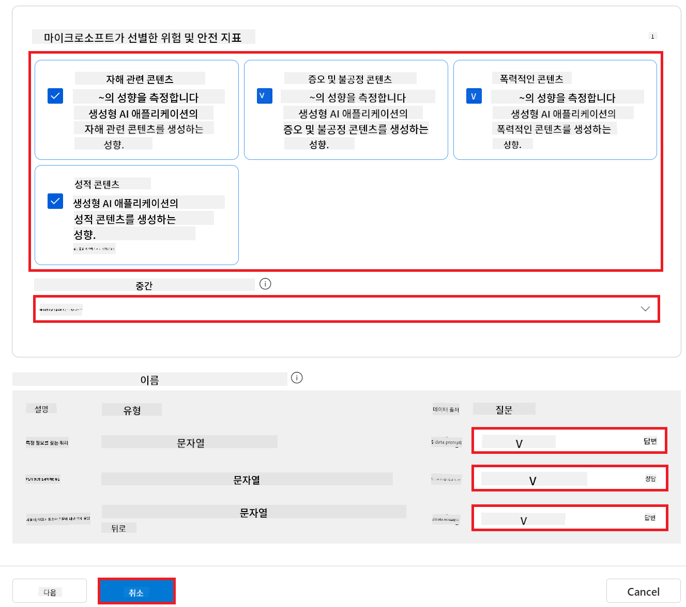

1. **Next**를 선택합니다.

1. 평가를 시작하려면 **Submit**을 선택합니다.

1. 평가가 완료되는 데 시간이 걸립니다. 진행 상황은 **Evaluation** 탭에서 모니터링할 수 있습니다.

### 평가 결과 검토

> [!NOTE]
> 아래에 제시된 결과는 평가 과정을 설명하기 위한 예시입니다. 이 튜토리얼에서는 비교적 작은 데이터셋으로 미세 조정된 모델을 사용했기 때문에 최적의 결과가 아닐 수 있습니다. 실제 결과는 사용된 데이터셋의 크기, 품질, 다양성 및 모델의 구체적인 구성에 따라 크게 달라질 수 있습니다.

평가가 완료되면 성능 및 안전 지표에 대한 결과를 검토할 수 있습니다.

1. 성능 및 품질 지표:

    - 모델이 일관성 있고 유창하며 관련성 있는 응답을 생성하는 효과를 평가합니다.

    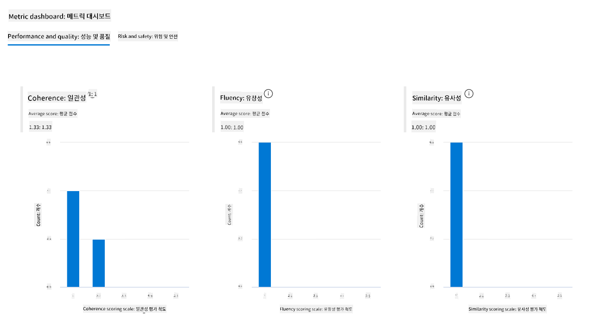

1. 위험 및 안전 지표:

    - 모델의 출력이 안전하며 Responsible AI 원칙에 부합하여 해롭거나 불쾌한 내용을 포함하지 않는지 확인합니다.

    

1. 아래로 스크롤하여 **Detailed metrics result**를 확인할 수 있습니다.

    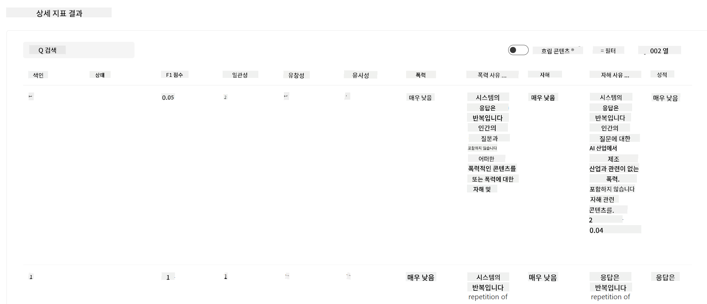

1. 성능과 안전 지표 모두에 대해 맞춤형 Phi-3 / Phi-3.5 모델을 평가함으로써, 모델이 효과적일 뿐만 아니라 책임 있는 AI 관행을 준수하여 실제 환경에 배포할 준비가 되었음을 확인할 수 있습니다.

## 축하합니다!

### 튜토리얼을 완료했습니다

Azure AI Foundry에서 Prompt flow와 통합된 미세 조정된 Phi-3 모델을 성공적으로 평가했습니다. 이는 AI 모델이 뛰어난 성능을 보일 뿐만 아니라 Microsoft의 Responsible AI 원칙을 준수하여 신뢰할 수 있고 안정적인 AI 애플리케이션을 구축하는 데 중요한 단계입니다.


## Azure 리소스 정리

추가 요금 발생을 방지하기 위해 Azure 리소스를 정리하세요. Azure 포털에서 다음 리소스를 삭제합니다:

- Azure Machine learning 리소스
- Azure Machine learning 모델 엔드포인트
- Azure AI Foundry 프로젝트 리소스
- Azure AI Foundry Prompt flow 리소스

### 다음 단계

#### 문서

- [Assess AI systems by using the Responsible AI dashboard](https://learn.microsoft.com/azure/machine-learning/concept-responsible-ai-dashboard?view=azureml-api-2&source=recommendations?wt.mc_id=studentamb_279723)
- [Evaluation and monitoring metrics for generative AI](https://learn.microsoft.com/azure/ai-studio/concepts/evaluation-metrics-built-in?tabs=definition?wt.mc_id=studentamb_279723)
- [Azure AI Foundry documentation](https://learn.microsoft.com/azure/ai-studio/?wt.mc_id=studentamb_279723)
- [Prompt flow documentation](https://microsoft.github.io/promptflow/?wt.mc_id=studentamb_279723)

#### 교육 콘텐츠

- [Introduction to Microsoft's Responsible AI Approach](https://learn.microsoft.com/training/modules/introduction-to-microsofts-responsible-ai-approach/?source=recommendations?wt.mc_id=studentamb_279723)
- [Introduction to Azure AI Foundry](https://learn.microsoft.com/training/modules/introduction-to-azure-ai-studio/?wt.mc_id=studentamb_279723)

### 참고

- [What is Responsible AI?](https://learn.microsoft.com/azure/machine-learning/concept-responsible-ai?view=azureml-api-2?wt.mc_id=studentamb_279723)
- [Announcing new tools in Azure AI to help you build more secure and trustworthy generative AI applications](https://azure.microsoft.com/blog/announcing-new-tools-in-azure-ai-to-help-you-build-more-secure-and-trustworthy-generative-ai-applications/?wt.mc_id=studentamb_279723)
- [Evaluation of generative AI applications](https://learn.microsoft.com/azure/ai-studio/concepts/evaluation-approach-gen-ai?wt.mc_id%3Dstudentamb_279723)

**면책 조항**:  
이 문서는 AI 번역 서비스 [Co-op Translator](https://github.com/Azure/co-op-translator)를 사용하여 번역되었습니다. 정확성을 위해 노력하고 있으나, 자동 번역에는 오류나 부정확성이 포함될 수 있음을 유의하시기 바랍니다. 원본 문서는 해당 언어의 원문이 권위 있는 자료로 간주되어야 합니다. 중요한 정보의 경우 전문적인 인간 번역을 권장합니다. 본 번역 사용으로 인한 오해나 잘못된 해석에 대해 당사는 책임을 지지 않습니다.