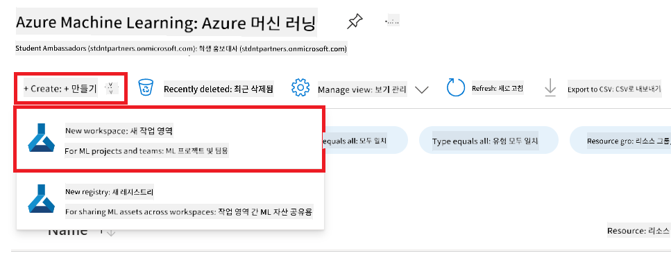
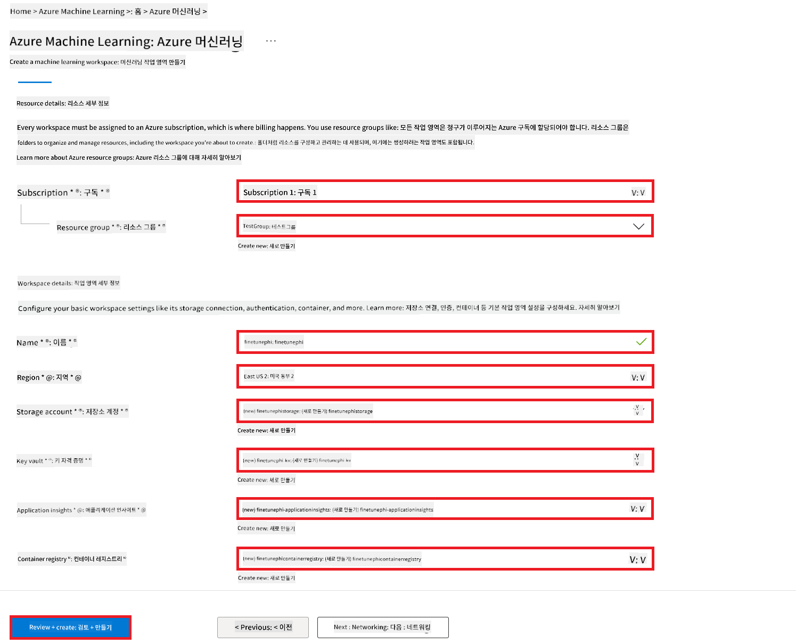
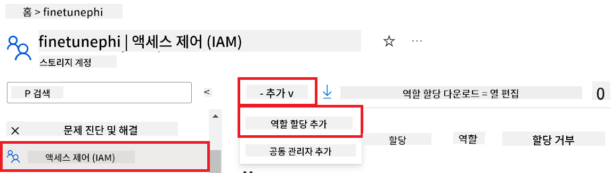
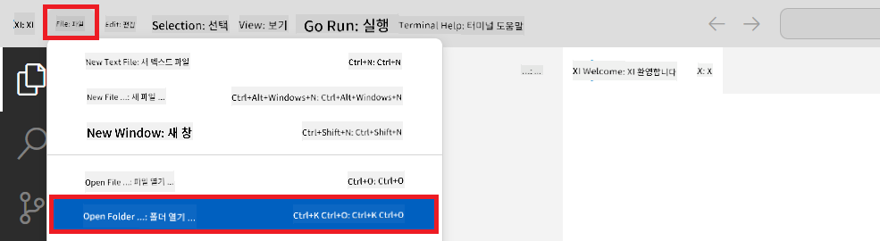
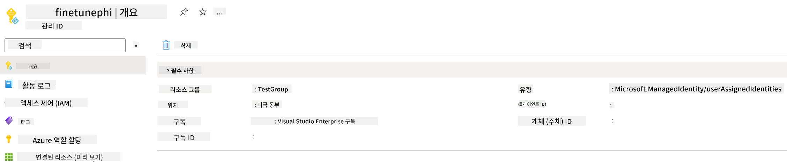
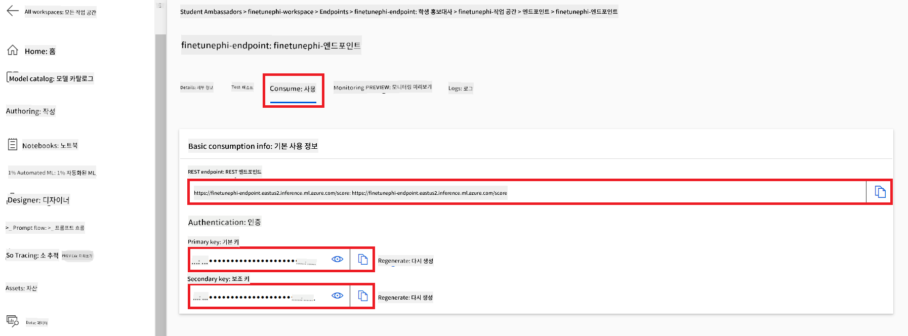

<!--
CO_OP_TRANSLATOR_METADATA:
{
  "original_hash": "7ca2c30fdb802664070e9cfbf92e24fe",
  "translation_date": "2026-01-05T01:24:52+00:00",
  "source_file": "md/02.Application/01.TextAndChat/Phi3/E2E_Phi-3-FineTuning_PromptFlow_Integration.md",
  "language_code": "ko"
}
-->
# Prompt flow로 사용자 지정 Phi-3 모델 미세 조정 및 통합

이 종단 간(E2E) 샘플은 Microsoft Tech Community의 가이드 "[Prompt Flow로 사용자 지정 Phi-3 모델을 미세 조정하고 통합하기: 단계별 가이드](https://techcommunity.microsoft.com/t5/educator-developer-blog/fine-tune-and-integrate-custom-phi-3-models-with-prompt-flow/ba-p/4178612?WT.mc_id=aiml-137032-kinfeylo)"를 기반으로 합니다. 이 샘플은 Phi-3 모델의 미세 조정, 배포 및 Prompt flow와의 통합 과정을 소개합니다.

## 개요

이 E2E 샘플에서는 Phi-3 모델을 미세 조정하고 Prompt flow와 통합하는 방법을 학습합니다. Azure Machine Learning 및 Prompt flow를 활용하여 사용자 지정 AI 모델을 배포하고 활용하는 워크플로를 구축합니다. 이 E2E 샘플은 세 가지 시나리오로 나뉩니다:

**시나리오 1: Azure 리소스 설정 및 미세 조정 준비**

**시나리오 2: Phi-3 모델 미세 조정 및 Azure Machine Learning Studio에 배포**

**시나리오 3: Prompt flow와 통합하고 사용자 지정 모델과 채팅**

다음은 이 E2E 샘플의 개요입니다.


### 목차

1. **[시나리오 1: Azure 리소스 설정 및 미세 조정 준비](../../../../../../md/02.Application/01.TextAndChat/Phi3)**
    - [Azure Machine Learning 작업 영역 만들기](../../../../../../md/02.Application/01.TextAndChat/Phi3)
    - [Azure 구독에서 GPU 쿼터 요청](../../../../../../md/02.Application/01.TextAndChat/Phi3)
    - [역할 할당 추가](../../../../../../md/02.Application/01.TextAndChat/Phi3)
    - [프로젝트 설정](../../../../../../md/02.Application/01.TextAndChat/Phi3)
    - [미세 조정을 위한 데이터셋 준비](../../../../../../md/02.Application/01.TextAndChat/Phi3)

1. **[시나리오 2: Phi-3 모델 미세 조정 및 Azure Machine Learning Studio에 배포](../../../../../../md/02.Application/01.TextAndChat/Phi3)**
    - [Azure CLI 설정](../../../../../../md/02.Application/01.TextAndChat/Phi3)
    - [Phi-3 모델 미세 조정](../../../../../../md/02.Application/01.TextAndChat/Phi3)
    - [미세 조정된 모델 배포](../../../../../../md/02.Application/01.TextAndChat/Phi3)

1. **[시나리오 3: Prompt flow와 통합하고 사용자 지정 모델과 채팅](../../../../../../md/02.Application/01.TextAndChat/Phi3)**
    - [사용자 지정 Phi-3 모델을 Prompt flow와 통합](../../../../../../md/02.Application/01.TextAndChat/Phi3)
    - [사용자 지정 모델과 채팅](../../../../../../md/02.Application/01.TextAndChat/Phi3)

## 시나리오 1: Azure 리소스 설정 및 미세 조정 준비

### Azure Machine Learning 작업 영역 만들기

1. 포털 페이지 상단의 **검색 표시줄**에 *azure machine learning*을 입력하고 나타나는 옵션에서 **Azure Machine Learning**을 선택합니다.

    

1. 탐색 메뉴에서 **+ 만들기**를 선택합니다.

1. 탐색 메뉴에서 **새 작업 영역**을 선택합니다.

    

1. 다음 작업을 수행합니다:

    - Azure **구독**을 선택합니다.
    - 사용할 **리소스 그룹**을 선택합니다(필요한 경우 새로 만드세요).
    - **작업 영역 이름**을 입력합니다. 고유한 값이어야 합니다.
    - 사용할 **지역(Region)**을 선택합니다.
    - 사용할 **스토리지 계정**을 선택합니다(필요한 경우 새로 만드세요).
    - 사용할 **Key vault**를 선택합니다(필요한 경우 새로 만드세요).
    - 사용할 **Application insights**를 선택합니다(필요한 경우 새로 만드세요).
    - 사용할 **컨테이너 레지스트리**를 선택합니다(필요한 경우 새로 만드세요).

    

1. **검토 + 만들기(Review + Create)**를 선택합니다.

1. **만들기(Create)**를 선택합니다.

### Azure 구독에서 GPU 쿼터 요청

이 E2E 샘플에서는 미세 조정을 위해 *Standard_NC24ads_A100_v4 GPU*를 사용하며 이 GPU는 쿼터 요청이 필요합니다. 배포에는 쿨 필요없는 *Standard_E4s_v3* CPU를 사용합니다.

> [!NOTE]
>
> Pay-As-You-Go 구독(표준 구독 유형)만 GPU 할당 대상이며, 혜택 구독은 현재 지원되지 않습니다.
>
> Visual Studio Enterprise Subscription과 같은 혜택 구독을 사용 중이거나 미세 조정 및 배포 프로세스를 빠르게 테스트하려는 경우, 이 튜토리얼은 CPU로 최소 데이터셋을 사용하여 미세 조정하는 방법도 안내합니다. 다만 GPU와 더 큰 데이터셋을 사용할 때 미세 조정 결과가 훨씬 좋다는 점을 유의하세요.

1. [Azure ML Studio](https://ml.azure.com/home?wt.mc_id=studentamb_279723)에 방문합니다.

1. *Standard NCADSA100v4 Family* 쿼터를 요청하려면 다음 작업을 수행합니다:

    - 왼쪽 탭에서 **쿼터(Quota)**를 선택합니다.
    - 사용할 **가상 머신 패밀리(Virtual machine family)**를 선택합니다. 예: *Standard NCADSA100v4 Family Cluster Dedicated vCPUs* (여기에는 *Standard_NC24ads_A100_v4* GPU가 포함됩니다).
    - 탐색 메뉴에서 **쿼터 요청(Request quota)**을 선택합니다.

        

    - 요청 쿼터 페이지에서 원하는 **새 코어 제한(New cores limit)**을 입력합니다. 예: 24.
    - 요청 쿼터 페이지에서 **제출(Submit)**을 선택하여 GPU 쿼터를 요청합니다.

> [!NOTE]
> 필요에 따라 적절한 GPU 또는 CPU를 선택하려면 [Sizes for Virtual Machines in Azure](https://learn.microsoft.com/azure/virtual-machines/sizes/overview?tabs=breakdownseries%2Cgeneralsizelist%2Ccomputesizelist%2Cmemorysizelist%2Cstoragesizelist%2Cgpusizelist%2Cfpgasizelist%2Chpcsizelist) 문서를 참조하세요.

### 역할 할당 추가

모델을 미세 조정하고 배포하려면 먼저 사용자 할당 관리 ID(User Assigned Managed Identity, UAI)를 만들고 적절한 권한을 할당해야 합니다. 이 UAI는 배포 중 인증에 사용됩니다.

#### 사용자 할당 관리 ID(UAI) 생성

1. 포털 페이지 상단의 **검색 표시줄**에 *managed identities*를 입력하고 나타나는 옵션에서 **Managed Identities**를 선택합니다.

    

1. **+ 만들기(Create)**를 선택합니다.

    

1. 다음 작업을 수행합니다:

    - Azure **구독**을 선택합니다.
    - 사용할 **리소스 그룹**을 선택합니다(필요한 경우 새로 만드세요).
    - 사용할 **지역(Region)**을 선택합니다.
    - **이름(Name)**을 입력합니다. 고유한 값이어야 합니다.

1. **검토 + 만들기(Review + create)**를 선택합니다.

1. **+ 만들기(Create)**를 선택합니다.

#### Managed Identity에 기여자(Contributor) 역할 할당 추가

1. 생성한 Managed Identity 리소스로 이동합니다.

1. 왼쪽 탭에서 **Azure 역할 할당(Azure role assignments)**을 선택합니다.

1. 탐색 메뉴에서 **+ 역할 할당 추가(+Add role assignment)**를 선택합니다.

1. 역할 할당 추가 페이지에서 다음 작업을 수행합니다:
    - **범위(Scope)**를 **리소스 그룹(Resource group)**으로 선택합니다.
    - Azure **구독**을 선택합니다.
    - 사용할 **리소스 그룹**을 선택합니다.
    - **역할(Role)**을 **기여자(Contributor)**로 선택합니다.

    

1. **저장(Save)**을 선택합니다.

#### Managed Identity에 Storage Blob Data Reader 역할 할당 추가

1. 포털 페이지 상단의 **검색 표시줄**에 *storage accounts*를 입력하고 나타나는 옵션에서 **Storage accounts**를 선택합니다.

    

1. 생성한 Azure Machine Learning 작업 영역과 연결된 스토리지 계정을 선택합니다. 예: *finetunephistorage*.

1. 역할 할당 추가 페이지로 이동하려면 다음 작업을 수행합니다:

    - 생성한 Azure Storage 계정으로 이동합니다.
    - 왼쪽 탭에서 **액세스 제어(IAM)(Access Control (IAM))**을 선택합니다.
    - 탐색 메뉴에서 **+ 추가(+ Add)**를 선택합니다.
    - 탐색 메뉴에서 **역할 할당 추가(Add role assignment)**를 선택합니다.

    

1. 역할 할당 추가 페이지에서 다음 작업을 수행합니다:

    - 역할 페이지의 **검색 표시줄**에 *Storage Blob Data Reader*를 입력하고 나타나는 옵션에서 **Storage Blob Data Reader**를 선택합니다.
    - 역할 페이지에서 **다음(Next)**을 선택합니다.
    - 멤버 페이지에서 **권한 할당 대상(Assign access to)**을 **Managed identity**로 선택합니다.
    - 멤버 페이지에서 **+ 멤버 선택(+ Select members)**을 선택합니다.
    - 관리 ID 선택 페이지에서 Azure **구독**을 선택합니다.
    - 관리 ID 선택 페이지에서 **Managed identity**를 **Manage Identity**로 선택합니다.
    - 관리 ID 선택 페이지에서 생성한 Manage Identity를 선택합니다. 예: *finetunephi-managedidentity*.
    - 관리 ID 선택 페이지에서 **선택(Select)**을 선택합니다.

    

1. **검토 + 할당(Review + assign)**을 선택합니다.

#### Managed Identity에 AcrPull 역할 할당 추가

1. 포털 페이지 상단의 **검색 표시줄**에 *container registries*를 입력하고 나타나는 옵션에서 **Container registries**를 선택합니다.

    

1. Azure Machine Learning 작업 영역과 연결된 컨테이너 레지스트리를 선택합니다. 예: *finetunephicontainerregistries*

1. 역할 할당 추가 페이지로 이동하려면 다음 작업을 수행합니다:

    - 왼쪽 탭에서 **액세스 제어(IAM)(Access Control (IAM))**을 선택합니다.
    - 탐색 메뉴에서 **+ 추가(+ Add)**를 선택합니다.
    - 탐색 메뉴에서 **역할 할당 추가(Add role assignment)**를 선택합니다.

1. 역할 할당 추가 페이지에서 다음 작업을 수행합니다:

    - 역할 페이지의 **검색 표시줄**에 *AcrPull*을 입력하고 나타나는 옵션에서 **AcrPull**을 선택합니다.
    - 역할 페이지에서 **다음(Next)**을 선택합니다.
    - 멤버 페이지에서 **권한 할당 대상(Assign access to)**을 **Managed identity**로 선택합니다.
    - 멤버 페이지에서 **+ 멤버 선택(+ Select members)**을 선택합니다.
    - 관리 ID 선택 페이지에서 Azure **구독**을 선택합니다.
    - 관리 ID 선택 페이지에서 **Managed identity**를 **Manage Identity**로 선택합니다.
    - 관리 ID 선택 페이지에서 생성한 Manage Identity를 선택합니다. 예: *finetunephi-managedidentity*.
    - 관리 ID 선택 페이지에서 **선택(Select)**을 선택합니다.
    - **검토 + 할당(Review + assign)**을 선택합니다.

### 프로젝트 설정

이제 작업할 폴더를 만들고 가상 환경을 설정하여 사용자와 상호작용하고 Azure Cosmos DB에 저장된 채팅 기록을 사용해 응답을 개선하는 프로그램을 개발할 준비를 합니다.

#### 작업할 폴더 생성

1. 터미널 창을 열고 기본 경로에 *finetune-phi*라는 폴더를 만들려면 다음 명령을 입력합니다.

    ```console
    mkdir finetune-phi
    ```

1. 터미널에서 방금 생성한 *finetune-phi* 폴더로 이동하려면 다음 명령을 입력합니다.

    ```console
    cd finetune-phi
    ```

#### 가상 환경 생성

1. 터미널에서 *.venv*라는 이름의 가상 환경을 만들려면 다음 명령을 입력합니다.

    ```console
    python -m venv .venv
    ```

1. 터미널에서 가상 환경을 활성화하려면 다음 명령을 입력합니다.

    ```console
    .venv\Scripts\activate.bat
    ```

> [!NOTE]
>
> 작동하면 명령 프롬프트 앞에 *(.venv)*가 표시됩니다.

#### 필요한 패키지 설치

1. 터미널에서 필요한 패키지를 설치하려면 다음 명령을 입력합니다.

    ```console
    pip install datasets==2.19.1
    pip install transformers==4.41.1
    pip install azure-ai-ml==1.16.0
    pip install torch==2.3.1
    pip install trl==0.9.4
    pip install promptflow==1.12.0
    ```

#### 프로젝트 파일 생성
In this 연습에서는 프로젝트에 필요한 필수 파일들을 생성합니다. 이 파일들에는 데이터셋을 다운로드하는 스크립트, Azure Machine Learning 환경을 설정하는 스크립트, Phi-3 모델을 파인튜닝하는 스크립트 및 파인튜닝된 모델을 배포하는 스크립트가 포함됩니다. 또한 파인튜닝 환경을 설정하기 위한 *conda.yml* 파일도 생성합니다.

이 연습에서 수행할 작업:

- *download_dataset.py* 파일을 생성하여 데이터셋을 다운로드합니다.
- *setup_ml.py* 파일을 생성하여 Azure Machine Learning 환경을 설정합니다.
- *finetuning_dir* 폴더에 *fine_tune.py* 파일을 생성하여 데이터셋을 사용해 Phi-3 모델을 파인튜닝합니다.
- 파인튜닝 환경을 설정하기 위한 *conda.yml* 파일을 생성합니다.
- 파인튜닝된 모델을 배포하기 위한 *deploy_model.py* 파일을 생성합니다.
- 파인튜닝된 모델을 Prompt flow와 통합하고 실행하기 위한 *integrate_with_promptflow.py* 파일을 생성합니다.
- Prompt flow의 워크플로 구조를 설정하기 위한 flow.dag.yml 파일을 생성합니다.
- Azure 정보를 입력할 *config.py* 파일을 생성합니다.

> [!NOTE]
>
> Complete folder structure:
>
> ```text
> └── YourUserName
> .    └── finetune-phi
> .        ├── finetuning_dir
> .        │      └── fine_tune.py
> .        ├── conda.yml
> .        ├── config.py
> .        ├── deploy_model.py
> .        ├── download_dataset.py
> .        ├── flow.dag.yml
> .        ├── integrate_with_promptflow.py
> .        └── setup_ml.py
> ```

1. Open **Visual Studio Code**.

1. Select **File** from the menu bar.

1. Select **Open Folder**.

1. Select the *finetune-phi* folder that you created, which is located at *C:\Users\yourUserName\finetune-phi*.

    

1. In the left pane of Visual Studio Code, right-click and select **New File** to create a new file named *download_dataset.py*.

1. In the left pane of Visual Studio Code, right-click and select **New File** to create a new file named *setup_ml.py*.

1. In the left pane of Visual Studio Code, right-click and select **New File** to create a new file named *deploy_model.py*.

    

1. In the left pane of Visual Studio Code, right-click and select **New Folder** to create a new forder named *finetuning_dir*.

1. In the *finetuning_dir* folder, create a new file named *fine_tune.py*.

#### Create and Configure *conda.yml* file

1. In the left pane of Visual Studio Code, right-click and select **New File** to create a new file named *conda.yml*.

1. Add the following code to the *conda.yml* file to set up the fine-tuning environment for the Phi-3 model.

    ```yml
    name: phi-3-training-env
    channels:
      - defaults
      - conda-forge
    dependencies:
      - python=3.10
      - pip
      - numpy<2.0
      - pip:
          - torch==2.4.0
          - torchvision==0.19.0
          - trl==0.8.6
          - transformers==4.41
          - datasets==2.21.0
          - azureml-core==1.57.0
          - azure-storage-blob==12.19.0
          - azure-ai-ml==1.16
          - azure-identity==1.17.1
          - accelerate==0.33.0
          - mlflow==2.15.1
          - azureml-mlflow==1.57.0
    ```

#### Create and Configure *config.py* file

1. In the left pane of Visual Studio Code, right-click and select **New File** to create a new file named *config.py*.

1. Add the following code to the *config.py* file to include your Azure information.

    ```python
    # Azure 설정
    AZURE_SUBSCRIPTION_ID = "your_subscription_id"
    AZURE_RESOURCE_GROUP_NAME = "your_resource_group_name" # "TestGroup"

    # Azure Machine Learning 설정
    AZURE_ML_WORKSPACE_NAME = "your_workspace_name" # "finetunephi-workspace"

    # Azure 관리형 ID 설정
    AZURE_MANAGED_IDENTITY_CLIENT_ID = "your_azure_managed_identity_client_id"
    AZURE_MANAGED_IDENTITY_NAME = "your_azure_managed_identity_name" # "finetunephi-mangedidentity"
    AZURE_MANAGED_IDENTITY_RESOURCE_ID = f"/subscriptions/{AZURE_SUBSCRIPTION_ID}/resourceGroups/{AZURE_RESOURCE_GROUP_NAME}/providers/Microsoft.ManagedIdentity/userAssignedIdentities/{AZURE_MANAGED_IDENTITY_NAME}"

    # 데이터셋 파일 경로
    TRAIN_DATA_PATH = "data/train_data.jsonl"
    TEST_DATA_PATH = "data/test_data.jsonl"

    # 파인튜닝된 모델 설정
    AZURE_MODEL_NAME = "your_fine_tuned_model_name" # "finetune-phi-model"
    AZURE_ENDPOINT_NAME = "your_fine_tuned_model_endpoint_name" # "finetune-phi-endpoint"
    AZURE_DEPLOYMENT_NAME = "your_fine_tuned_model_deployment_name" # "finetune-phi-deployment"

    AZURE_ML_API_KEY = "your_fine_tuned_model_api_key"
    AZURE_ML_ENDPOINT = "your_fine_tuned_model_endpoint_uri" # "https://{your-endpoint-name}.{your-region}.inference.ml.azure.com/score"
    ```

#### Add Azure environment variables

1. Perform the following tasks to add the Azure Subscription ID:

    - Type *subscriptions* in the **search bar** at the top of the portal page and select **Subscriptions** from the options that appear.
    - Select the Azure Subscription you are currently using.
    - Copy and paste your Subscription ID into the *config.py* file.

    

1. Perform the following tasks to add the Azure Workspace Name:

    - Navigate to the Azure Machine Learning resource that you created.
    - Copy and paste your account name into the *config.py* file.

    

1. Perform the following tasks to add the Azure Resource Group Name:

    - Navigate to the Azure Machine Learning resource that you created.
    - Copy and paste your Azure Resource Group Name into the *config.py* file.

    

2. Perform the following tasks to add the Azure Managed Identity name

    - Navigate to the Managed Identities resource that you created.
    - Copy and paste your Azure Managed Identity name into the *config.py* file.

    

### Prepare dataset for fine-tuning

In this 연습에서는 *download_dataset.py* 파일을 실행하여 *ULTRACHAT_200k* 데이터셋을 로컬 환경으로 다운로드합니다. 그런 다음 이 데이터셋을 사용하여 Azure Machine Learning에서 Phi-3 모델을 파인튜닝합니다.

#### Download your dataset using *download_dataset.py*

1. Open the *download_dataset.py* file in Visual Studio Code.

1. Add the following code into *download_dataset.py*.

    ```python
    import json
    import os
    from datasets import load_dataset
    from config import (
        TRAIN_DATA_PATH,
        TEST_DATA_PATH)

    def load_and_split_dataset(dataset_name, config_name, split_ratio):
        """
        Load and split a dataset.
        """
        # 지정된 이름, 구성, 및 분할 비율로 데이터셋을 로드합니다
        dataset = load_dataset(dataset_name, config_name, split=split_ratio)
        print(f"Original dataset size: {len(dataset)}")
        
        # 데이터셋을 학습용과 테스트용으로 분할합니다 (학습 80%, 테스트 20%)
        split_dataset = dataset.train_test_split(test_size=0.2)
        print(f"Train dataset size: {len(split_dataset['train'])}")
        print(f"Test dataset size: {len(split_dataset['test'])}")
        
        return split_dataset

    def save_dataset_to_jsonl(dataset, filepath):
        """
        Save a dataset to a JSONL file.
        """
        # 디렉토리가 존재하지 않으면 생성합니다
        os.makedirs(os.path.dirname(filepath), exist_ok=True)
        
        # 파일을 쓰기 모드로 엽니다
        with open(filepath, 'w', encoding='utf-8') as f:
            # 데이터셋의 각 레코드를 순회합니다
            for record in dataset:
                # 레코드를 JSON 객체로 덤프하여 파일에 씁니다
                json.dump(record, f)
                # 레코드를 구분하기 위해 줄바꿈 문자를 씁니다
                f.write('\n')
        
        print(f"Dataset saved to {filepath}")

    def main():
        """
        Main function to load, split, and save the dataset.
        """
        # 특정 구성과 분할 비율로 ULTRACHAT_200k 데이터셋을 로드하고 분할합니다
        dataset = load_and_split_dataset("HuggingFaceH4/ultrachat_200k", 'default', 'train_sft[:1%]')
        
        # 분할에서 학습용 및 테스트용 데이터셋을 추출합니다
        train_dataset = dataset['train']
        test_dataset = dataset['test']

        # 학습용 데이터셋을 JSONL 파일로 저장합니다
        save_dataset_to_jsonl(train_dataset, TRAIN_DATA_PATH)
        
        # 테스트용 데이터셋을 별도의 JSONL 파일로 저장합니다
        save_dataset_to_jsonl(test_dataset, TEST_DATA_PATH)

    if __name__ == "__main__":
        main()

    ```

> [!TIP]
>
> **Guidance for fine-tuning with a minimal dataset using a CPU**
>
> If you want to use a CPU for fine-tuning, this approach is ideal for those with benefit subscriptions (such as Visual Studio Enterprise Subscription) or to quickly test the fine-tuning and deployment process.
>
> Replace `dataset = load_and_split_dataset("HuggingFaceH4/ultrachat_200k", 'default', 'train_sft[:1%]')` with `dataset = load_and_split_dataset("HuggingFaceH4/ultrachat_200k", 'default', 'train_sft[:10]')`
>

1. Type the following command inside your terminal to run the script and download the dataset to your local environment.

    ```console
    python download_data.py
    ```

1. Verify that the datasets were saved successfully to your local *finetune-phi/data* directory.

> [!NOTE]
>
> **Dataset size and fine-tuning time**
>
> In this E2E sample, you use only 1% of the dataset (`train_sft[:1%]`). This significantly reduces the amount of data, speeding up both the upload and fine-tuning processes. You can adjust the percentage to find the right balance between training time and model performance. Using a smaller subset of the dataset reduces the time required for fine-tuning, making the process more manageable for a E2E sample.

## Scenario 2: Fine-tune Phi-3 model and Deploy in Azure Machine Learning Studio

### Set up Azure CLI

You need to set up Azure CLI to authenticate your environment. Azure CLI allows you to manage Azure resources directly from the command line and provides the credentials necessary for Azure Machine Learning to access these resources. To get started install [Azure CLI](https://learn.microsoft.com/cli/azure/install-azure-cli)

1. Open a terminal window and type the following command to log in to your Azure account.

    ```console
    az login
    ```

1. Select your Azure account to use.

1. Select your Azure subscription to use.

    

> [!TIP]
>
> If you're having trouble signing in to Azure, try using a device code. Open a terminal window and type the following command to sign in to your Azure account:
>
> ```console
> az login --use-device-code
> ```
>

### Fine-tune the Phi-3 model

In this 연습에서는 제공된 데이터셋을 사용하여 Phi-3 모델을 파인튜닝합니다. 먼저 *fine_tune.py* 파일에서 파인튜닝 프로세스를 정의합니다. 그런 다음 Azure Machine Learning 환경을 구성하고 *setup_ml.py* 파일을 실행하여 파인튜닝을 시작합니다. 이 스크립트는 파인튜닝이 Azure Machine Learning 환경 내에서 수행되도록 합니다.

*setup_ml.py*를 실행하면 Azure Machine Learning 환경에서 파인튜닝 프로세스가 실행됩니다.

#### Add code to the *fine_tune.py* file

1. Navigate to the *finetuning_dir* folder and Open the *fine_tune.py* file in Visual Studio Code.

1. Add the following code into *fine_tune.py*.

    ```python
    import argparse
    import sys
    import logging
    import os
    from datasets import load_dataset
    import torch
    import mlflow
    from transformers import AutoModelForCausalLM, AutoTokenizer, TrainingArguments
    from trl import SFTTrainer

    # MLflow에서 INVALID_PARAMETER_VALUE 오류를 피하려면 MLflow 통합을 비활성화하세요
    os.environ["DISABLE_MLFLOW_INTEGRATION"] = "True"

    # 로깅 설정
    logging.basicConfig(
        format="%(asctime)s - %(levelname)s - %(name)s - %(message)s",
        datefmt="%Y-%m-%d %H:%M:%S",
        handlers=[logging.StreamHandler(sys.stdout)],
        level=logging.WARNING
    )
    logger = logging.getLogger(__name__)

    def initialize_model_and_tokenizer(model_name, model_kwargs):
        """
        Initialize the model and tokenizer with the given pretrained model name and arguments.
        """
        model = AutoModelForCausalLM.from_pretrained(model_name, **model_kwargs)
        tokenizer = AutoTokenizer.from_pretrained(model_name)
        tokenizer.model_max_length = 2048
        tokenizer.pad_token = tokenizer.unk_token
        tokenizer.pad_token_id = tokenizer.convert_tokens_to_ids(tokenizer.pad_token)
        tokenizer.padding_side = 'right'
        return model, tokenizer

    def apply_chat_template(example, tokenizer):
        """
        Apply a chat template to tokenize messages in the example.
        """
        messages = example["messages"]
        if messages[0]["role"] != "system":
            messages.insert(0, {"role": "system", "content": ""})
        example["text"] = tokenizer.apply_chat_template(
            messages, tokenize=False, add_generation_prompt=False
        )
        return example

    def load_and_preprocess_data(train_filepath, test_filepath, tokenizer):
        """
        Load and preprocess the dataset.
        """
        train_dataset = load_dataset('json', data_files=train_filepath, split='train')
        test_dataset = load_dataset('json', data_files=test_filepath, split='train')
        column_names = list(train_dataset.features)

        train_dataset = train_dataset.map(
            apply_chat_template,
            fn_kwargs={"tokenizer": tokenizer},
            num_proc=10,
            remove_columns=column_names,
            desc="Applying chat template to train dataset",
        )

        test_dataset = test_dataset.map(
            apply_chat_template,
            fn_kwargs={"tokenizer": tokenizer},
            num_proc=10,
            remove_columns=column_names,
            desc="Applying chat template to test dataset",
        )

        return train_dataset, test_dataset

    def train_and_evaluate_model(train_dataset, test_dataset, model, tokenizer, output_dir):
        """
        Train and evaluate the model.
        """
        training_args = TrainingArguments(
            bf16=True,
            do_eval=True,
            output_dir=output_dir,
            eval_strategy="epoch",
            learning_rate=5.0e-06,
            logging_steps=20,
            lr_scheduler_type="cosine",
            num_train_epochs=3,
            overwrite_output_dir=True,
            per_device_eval_batch_size=4,
            per_device_train_batch_size=4,
            remove_unused_columns=True,
            save_steps=500,
            seed=0,
            gradient_checkpointing=True,
            gradient_accumulation_steps=1,
            warmup_ratio=0.2,
        )

        trainer = SFTTrainer(
            model=model,
            args=training_args,
            train_dataset=train_dataset,
            eval_dataset=test_dataset,
            max_seq_length=2048,
            dataset_text_field="text",
            tokenizer=tokenizer,
            packing=True
        )

        train_result = trainer.train()
        trainer.log_metrics("train", train_result.metrics)

        mlflow.transformers.log_model(
            transformers_model={"model": trainer.model, "tokenizer": tokenizer},
            artifact_path=output_dir,
        )

        tokenizer.padding_side = 'left'
        eval_metrics = trainer.evaluate()
        eval_metrics["eval_samples"] = len(test_dataset)
        trainer.log_metrics("eval", eval_metrics)

    def main(train_file, eval_file, model_output_dir):
        """
        Main function to fine-tune the model.
        """
        model_kwargs = {
            "use_cache": False,
            "trust_remote_code": True,
            "torch_dtype": torch.bfloat16,
            "device_map": None,
            "attn_implementation": "eager"
        }

        # pretrained_model_name = "microsoft/Phi-3-mini-4k-instruct"
        pretrained_model_name = "microsoft/Phi-3.5-mini-instruct"

        with mlflow.start_run():
            model, tokenizer = initialize_model_and_tokenizer(pretrained_model_name, model_kwargs)
            train_dataset, test_dataset = load_and_preprocess_data(train_file, eval_file, tokenizer)
            train_and_evaluate_model(train_dataset, test_dataset, model, tokenizer, model_output_dir)

    if __name__ == "__main__":
        parser = argparse.ArgumentParser()
        parser.add_argument("--train-file", type=str, required=True, help="Path to the training data")
        parser.add_argument("--eval-file", type=str, required=True, help="Path to the evaluation data")
        parser.add_argument("--model_output_dir", type=str, required=True, help="Directory to save the fine-tuned model")
        args = parser.parse_args()
        main(args.train_file, args.eval_file, args.model_output_dir)

    ```

1. Save and close the *fine_tune.py* file.

> [!TIP]
> **You can fine-tune Phi-3.5 model**
>
> In *fine_tune.py* file, you can change the `pretrained_model_name` from `"microsoft/Phi-3-mini-4k-instruct"` to any model you want to fine-tune. For example, if you change it to `"microsoft/Phi-3.5-mini-instruct"`, you'll be using the Phi-3.5-mini-instruct model for fine-tuning. To find and use the model name you prefer, visit [Hugging Face](https://huggingface.co/), search for the model you're interested in, and then copy and paste its name into the `pretrained_model_name` field in your script.
>
> <image type="content" src="../../../../imgs/02/FineTuning-PromptFlow/finetunephi3.5.png" alt-text="Phi-3.5 미세 조정.">
>

#### Add code to the *setup_ml.py* file

1. Open the *setup_ml.py* file in Visual Studio Code.

1. Add the following code into *setup_ml.py*.

    ```python
    import logging
    from azure.ai.ml import MLClient, command, Input
    from azure.ai.ml.entities import Environment, AmlCompute
    from azure.identity import AzureCliCredential
    from config import (
        AZURE_SUBSCRIPTION_ID,
        AZURE_RESOURCE_GROUP_NAME,
        AZURE_ML_WORKSPACE_NAME,
        TRAIN_DATA_PATH,
        TEST_DATA_PATH
    )

    # 상수

    # 학습에 CPU 인스턴스를 사용하려면 다음 줄의 주석을 제거하세요
    # COMPUTE_INSTANCE_TYPE = "Standard_E16s_v3" # CPU
    # COMPUTE_NAME = "cpu-e16s-v3"
    # DOCKER_IMAGE_NAME = "mcr.microsoft.com/azureml/openmpi4.1.0-ubuntu20.04:latest"

    # 학습에 GPU 인스턴스를 사용하려면 다음 줄의 주석을 제거하세요
    COMPUTE_INSTANCE_TYPE = "Standard_NC24ads_A100_v4"
    COMPUTE_NAME = "gpu-nc24s-a100-v4"
    DOCKER_IMAGE_NAME = "mcr.microsoft.com/azureml/curated/acft-hf-nlp-gpu:59"

    CONDA_FILE = "conda.yml"
    LOCATION = "eastus2" # 컴퓨트 클러스터의 위치로 바꾸세요
    FINETUNING_DIR = "./finetuning_dir" # 미세조정 스크립트의 경로
    TRAINING_ENV_NAME = "phi-3-training-environment" # 학습 환경의 이름
    MODEL_OUTPUT_DIR = "./model_output" # Azure ML의 모델 출력 디렉터리 경로

    # 프로세스를 추적하기 위한 로깅 설정
    logger = logging.getLogger(__name__)
    logging.basicConfig(
        format="%(asctime)s - %(levelname)s - %(name)s - %(message)s",
        datefmt="%Y-%m-%d %H:%M:%S",
        level=logging.WARNING
    )

    def get_ml_client():
        """
        Initialize the ML Client using Azure CLI credentials.
        """
        credential = AzureCliCredential()
        return MLClient(credential, AZURE_SUBSCRIPTION_ID, AZURE_RESOURCE_GROUP_NAME, AZURE_ML_WORKSPACE_NAME)

    def create_or_get_environment(ml_client):
        """
        Create or update the training environment in Azure ML.
        """
        env = Environment(
            image=DOCKER_IMAGE_NAME,  # 환경용 도커 이미지
            conda_file=CONDA_FILE,  # Conda 환경 파일
            name=TRAINING_ENV_NAME,  # 환경 이름
        )
        return ml_client.environments.create_or_update(env)

    def create_or_get_compute_cluster(ml_client, compute_name, COMPUTE_INSTANCE_TYPE, location):
        """
        Create or update the compute cluster in Azure ML.
        """
        try:
            compute_cluster = ml_client.compute.get(compute_name)
            logger.info(f"Compute cluster '{compute_name}' already exists. Reusing it for the current run.")
        except Exception:
            logger.info(f"Compute cluster '{compute_name}' does not exist. Creating a new one with size {COMPUTE_INSTANCE_TYPE}.")
            compute_cluster = AmlCompute(
                name=compute_name,
                size=COMPUTE_INSTANCE_TYPE,
                location=location,
                tier="Dedicated",  # 컴퓨트 클러스터의 티어
                min_instances=0,  # 최소 인스턴스 수
                max_instances=1  # 최대 인스턴스 수
            )
            ml_client.compute.begin_create_or_update(compute_cluster).wait()  # 클러스터가 생성될 때까지 대기
        return compute_cluster

    def create_fine_tuning_job(env, compute_name):
        """
        Set up the fine-tuning job in Azure ML.
        """
        return command(
            code=FINETUNING_DIR,  # fine_tune.py의 경로
            command=(
                "python fine_tune.py "
                "--train-file ${{inputs.train_file}} "
                "--eval-file ${{inputs.eval_file}} "
                "--model_output_dir ${{inputs.model_output}}"
            ),
            environment=env,  # 학습 환경
            compute=compute_name,  # 사용할 컴퓨트 클러스터
            inputs={
                "train_file": Input(type="uri_file", path=TRAIN_DATA_PATH),  # 학습 데이터 파일의 경로
                "eval_file": Input(type="uri_file", path=TEST_DATA_PATH),  # 평가 데이터 파일의 경로
                "model_output": MODEL_OUTPUT_DIR
            }
        )

    def main():
        """
        Main function to set up and run the fine-tuning job in Azure ML.
        """
        # ML 클라이언트 초기화
        ml_client = get_ml_client()

        # 환경 생성
        env = create_or_get_environment(ml_client)
        
        # 컴퓨트 클러스터 생성 또는 기존 클러스터 가져오기
        create_or_get_compute_cluster(ml_client, COMPUTE_NAME, COMPUTE_INSTANCE_TYPE, LOCATION)

        # 미세조정 작업 생성 및 제출
        job = create_fine_tuning_job(env, COMPUTE_NAME)
        returned_job = ml_client.jobs.create_or_update(job)  # 작업 제출
        ml_client.jobs.stream(returned_job.name)  # 작업 로그 스트리밍
        
        # 작업 이름 캡처
        job_name = returned_job.name
        print(f"Job name: {job_name}")

    if __name__ == "__main__":
        main()

    ```

1. Replace `COMPUTE_INSTANCE_TYPE`, `COMPUTE_NAME`, and `LOCATION` with your specific details.

    ```python
   # 학습에 GPU 인스턴스를 사용하려면 아래 줄들의 주석을 제거하세요
    COMPUTE_INSTANCE_TYPE = "Standard_NC24ads_A100_v4"
    COMPUTE_NAME = "gpu-nc24s-a100-v4"
    ...
    LOCATION = "eastus2" # 사용 중인 컴퓨트 클러스터의 위치로 바꾸세요
    ```

> [!TIP]
>
> **Guidance for fine-tuning with a minimal dataset using a CPU**
>
> If you want to use a CPU for fine-tuning, this approach is ideal for those with benefit subscriptions (such as Visual Studio Enterprise Subscription) or to quickly test the fine-tuning and deployment process.
>
> 1. Open the *setup_ml* file.
> 1. Replace `COMPUTE_INSTANCE_TYPE`, `COMPUTE_NAME`, and `DOCKER_IMAGE_NAME` with the following. If you do not have access to *Standard_E16s_v3*, you can use an equivalent CPU instance or request a new quota.
> 1. Replace `LOCATION` with your specific details.
>
>    ```python
>    # Uncomment the following lines to use a CPU instance for training
>    COMPUTE_INSTANCE_TYPE = "Standard_E16s_v3" # cpu
>    COMPUTE_NAME = "cpu-e16s-v3"
>    DOCKER_IMAGE_NAME = "mcr.microsoft.com/azureml/openmpi4.1.0-ubuntu20.04:latest"
>    LOCATION = "eastus2" # Replace with the location of your compute cluster
>    ```
>

1. Type the following command to run the *setup_ml.py* script and start the fine-tuning process in Azure Machine Learning.

    ```python
    python setup_ml.py
    ```

1. In this exercise, you successfully fine-tuned the Phi-3 model using Azure Machine Learning. By running the *setup_ml.py* script, you have set up the Azure Machine Learning environment and initiated the fine-tuning process defined in *fine_tune.py* file. Please note that the fine-tuning process can take a considerable amount of time. After running the `python setup_ml.py` command, you need to wait for the process to complete. You can monitor the status of the fine-tuning job by following the link provided in the terminal to the Azure Machine Learning portal.

    

### Deploy the fine-tuned model

To integrate the fine-tuned Phi-3 model with Prompt Flow, you need to deploy the model to make it accessible for real-time inference. This process involves registering the model, creating an online endpoint, and deploying the model.

#### Set the model name, endpoint name, and deployment name for deployment

1. Open *config.py* file.

1. Replace `AZURE_MODEL_NAME = "your_fine_tuned_model_name"` with the desired name for your model.

1. Replace `AZURE_ENDPOINT_NAME = "your_fine_tuned_model_endpoint_name"` with the desired name for your endpoint.

1. Replace `AZURE_DEPLOYMENT_NAME = "your_fine_tuned_model_deployment_name"` with the desired name for your deployment.

#### Add code to the *deploy_model.py* file

Running the *deploy_model.py* file automates the entire deployment process. It registers the model, creates an endpoint, and executes the deployment based on the settings specified in the config.py file, which includes the model name, endpoint name, and deployment name.

1. Open the *deploy_model.py* file in Visual Studio Code.

1. Add the following code into *deploy_model.py*.

    ```python
    import logging
    from azure.identity import AzureCliCredential
    from azure.ai.ml import MLClient
    from azure.ai.ml.entities import Model, ProbeSettings, ManagedOnlineEndpoint, ManagedOnlineDeployment, IdentityConfiguration, ManagedIdentityConfiguration, OnlineRequestSettings
    from azure.ai.ml.constants import AssetTypes

    # 구성 가져오기
    from config import (
        AZURE_SUBSCRIPTION_ID,
        AZURE_RESOURCE_GROUP_NAME,
        AZURE_ML_WORKSPACE_NAME,
        AZURE_MANAGED_IDENTITY_RESOURCE_ID,
        AZURE_MANAGED_IDENTITY_CLIENT_ID,
        AZURE_MODEL_NAME,
        AZURE_ENDPOINT_NAME,
        AZURE_DEPLOYMENT_NAME
    )

    # 상수
    JOB_NAME = "your-job-name"
    COMPUTE_INSTANCE_TYPE = "Standard_E4s_v3"

    deployment_env_vars = {
        "SUBSCRIPTION_ID": AZURE_SUBSCRIPTION_ID,
        "RESOURCE_GROUP_NAME": AZURE_RESOURCE_GROUP_NAME,
        "UAI_CLIENT_ID": AZURE_MANAGED_IDENTITY_CLIENT_ID,
    }

    # 로깅 설정
    logging.basicConfig(
        format="%(asctime)s - %(levelname)s - %(name)s - %(message)s",
        datefmt="%Y-%m-%d %H:%M:%S",
        level=logging.DEBUG
    )
    logger = logging.getLogger(__name__)

    def get_ml_client():
        """Initialize and return the ML Client."""
        credential = AzureCliCredential()
        return MLClient(credential, AZURE_SUBSCRIPTION_ID, AZURE_RESOURCE_GROUP_NAME, AZURE_ML_WORKSPACE_NAME)

    def register_model(ml_client, model_name, job_name):
        """Register a new model."""
        model_path = f"azureml://jobs/{job_name}/outputs/artifacts/paths/model_output"
        logger.info(f"Registering model {model_name} from job {job_name} at path {model_path}.")
        run_model = Model(
            path=model_path,
            name=model_name,
            description="Model created from run.",
            type=AssetTypes.MLFLOW_MODEL,
        )
        model = ml_client.models.create_or_update(run_model)
        logger.info(f"Registered model ID: {model.id}")
        return model

    def delete_existing_endpoint(ml_client, endpoint_name):
        """Delete existing endpoint if it exists."""
        try:
            endpoint_result = ml_client.online_endpoints.get(name=endpoint_name)
            logger.info(f"Deleting existing endpoint {endpoint_name}.")
            ml_client.online_endpoints.begin_delete(name=endpoint_name).result()
            logger.info(f"Deleted existing endpoint {endpoint_name}.")
        except Exception as e:
            logger.info(f"No existing endpoint {endpoint_name} found to delete: {e}")

    def create_or_update_endpoint(ml_client, endpoint_name, description=""):
        """Create or update an endpoint."""
        delete_existing_endpoint(ml_client, endpoint_name)
        logger.info(f"Creating new endpoint {endpoint_name}.")
        endpoint = ManagedOnlineEndpoint(
            name=endpoint_name,
            description=description,
            identity=IdentityConfiguration(
                type="user_assigned",
                user_assigned_identities=[ManagedIdentityConfiguration(resource_id=AZURE_MANAGED_IDENTITY_RESOURCE_ID)]
            )
        )
        endpoint_result = ml_client.online_endpoints.begin_create_or_update(endpoint).result()
        logger.info(f"Created new endpoint {endpoint_name}.")
        return endpoint_result

    def create_or_update_deployment(ml_client, endpoint_name, deployment_name, model):
        """Create or update a deployment."""

        logger.info(f"Creating deployment {deployment_name} for endpoint {endpoint_name}.")
        deployment = ManagedOnlineDeployment(
            name=deployment_name,
            endpoint_name=endpoint_name,
            model=model.id,
            instance_type=COMPUTE_INSTANCE_TYPE,
            instance_count=1,
            environment_variables=deployment_env_vars,
            request_settings=OnlineRequestSettings(
                max_concurrent_requests_per_instance=3,
                request_timeout_ms=180000,
                max_queue_wait_ms=120000
            ),
            liveness_probe=ProbeSettings(
                failure_threshold=30,
                success_threshold=1,
                period=100,
                initial_delay=500,
            ),
            readiness_probe=ProbeSettings(
                failure_threshold=30,
                success_threshold=1,
                period=100,
                initial_delay=500,
            ),
        )
        deployment_result = ml_client.online_deployments.begin_create_or_update(deployment).result()
        logger.info(f"Created deployment {deployment.name} for endpoint {endpoint_name}.")
        return deployment_result

    def set_traffic_to_deployment(ml_client, endpoint_name, deployment_name):
        """Set traffic to the specified deployment."""
        try:
            # 현재 엔드포인트 세부 정보 가져오기
            endpoint = ml_client.online_endpoints.get(name=endpoint_name)
            
            # 디버깅을 위해 현재 트래픽 할당 기록
            logger.info(f"Current traffic allocation: {endpoint.traffic}")
            
            # 배포의 트래픽 할당 설정
            endpoint.traffic = {deployment_name: 100}
            
            # 엔드포인트를 새 트래픽 할당으로 업데이트
            endpoint_poller = ml_client.online_endpoints.begin_create_or_update(endpoint)
            updated_endpoint = endpoint_poller.result()
            
            # 디버깅을 위해 업데이트된 트래픽 할당 기록
            logger.info(f"Updated traffic allocation: {updated_endpoint.traffic}")
            logger.info(f"Set traffic to deployment {deployment_name} at endpoint {endpoint_name}.")
            return updated_endpoint
        except Exception as e:
            # 프로세스 중 발생하는 모든 오류 기록
            logger.error(f"Failed to set traffic to deployment: {e}")
            raise


    def main():
        ml_client = get_ml_client()

        registered_model = register_model(ml_client, AZURE_MODEL_NAME, JOB_NAME)
        logger.info(f"Registered model ID: {registered_model.id}")

        endpoint = create_or_update_endpoint(ml_client, AZURE_ENDPOINT_NAME, "Endpoint for finetuned Phi-3 model")
        logger.info(f"Endpoint {AZURE_ENDPOINT_NAME} is ready.")

        try:
            deployment = create_or_update_deployment(ml_client, AZURE_ENDPOINT_NAME, AZURE_DEPLOYMENT_NAME, registered_model)
            logger.info(f"Deployment {AZURE_DEPLOYMENT_NAME} is created for endpoint {AZURE_ENDPOINT_NAME}.")

            set_traffic_to_deployment(ml_client, AZURE_ENDPOINT_NAME, AZURE_DEPLOYMENT_NAME)
            logger.info(f"Traffic is set to deployment {AZURE_DEPLOYMENT_NAME} at endpoint {AZURE_ENDPOINT_NAME}.")
        except Exception as e:
            logger.error(f"Failed to create or update deployment: {e}")

    if __name__ == "__main__":
        main()

    ```

1. Perform the following tasks to get the `JOB_NAME`:

    - Navigate to Azure Machine Learning resource that you created.
    - Select **Studio web URL** to open the Azure Machine Learning workspace.
    - Select **Jobs** from the left side tab.
    - Select the experiment for fine-tuning. For example, *finetunephi*.
    - Select the job that you created.
    - deploy_model.py 파일의 `JOB_NAME = "your-job-name"`에 작업 이름을 복사하여 붙여넣으세요.

1. `COMPUTE_INSTANCE_TYPE`를 자신의 세부 정보로 바꾸세요.

1. 다음 명령을 입력하여 *deploy_model.py* 스크립트를 실행하고 Azure Machine Learning에서 배포 프로세스를 시작하세요.

    ```python
    python deploy_model.py
    ```

> [!WARNING]
> 추가 요금이 부과되지 않도록 Azure Machine Learning 작업 공간에서 생성한 엔드포인트를 삭제했는지 확인하세요.
>

#### Azure Machine Learning 작업 영역에서 배포 상태 확인

1. [Azure ML Studio](https://ml.azure.com/home?wt.mc_id=studentamb_279723)에 방문하세요.

1. 생성한 Azure Machine Learning 작업 영역으로 이동하세요.

1. Azure Machine Learning 작업 영역을 열려면 **Studio web URL**을 선택하세요.

1. 왼쪽 탭에서 **Endpoints**를 선택하세요.

    

2. 생성한 엔드포인트를 선택하세요.

    

3. 이 페이지에서 배포 과정 중에 생성된 엔드포인트를 관리할 수 있습니다.

## 시나리오 3: Prompt flow와 통합하고 사용자 지정 모델로 채팅하기

### 사용자 지정 Phi-3 모델을 Prompt flow와 통합하기

파인튜닝된 모델을 성공적으로 배포한 후에는 Prompt flow와 통합하여 실시간 애플리케이션에서 모델을 사용할 수 있으며, 이를 통해 사용자 지정 Phi-3 모델로 다양한 상호작용 작업을 수행할 수 있습니다.

#### 파인튜닝된 Phi-3 모델의 API 키 및 엔드포인트 URI 설정

1. 생성한 Azure Machine Learning 작업 영역으로 이동하세요.
1. 왼쪽 탭에서 **Endpoints**를 선택하세요.
1. 생성한 엔드포인트를 선택하세요.
1. 네비게이션 메뉴에서 **Consume**을 선택하세요.
1. *config.py* 파일에 **REST endpoint**를 복사하여 붙여넣고 `AZURE_ML_ENDPOINT = "your_fine_tuned_model_endpoint_uri"`를 해당 **REST endpoint**로 바꿉니다.
1. *config.py* 파일에 **Primary key**를 복사하여 붙여넣고 `AZURE_ML_API_KEY = "your_fine_tuned_model_api_key"`를 해당 **Primary key**로 바꿉니다.

    

#### *flow.dag.yml* 파일에 코드 추가

1. Visual Studio Code에서 *flow.dag.yml* 파일을 엽니다.

1. 다음 코드를 *flow.dag.yml*에 추가합니다.

    ```yml
    inputs:
      input_data:
        type: string
        default: "Who founded Microsoft?"

    outputs:
      answer:
        type: string
        reference: ${integrate_with_promptflow.output}

    nodes:
    - name: integrate_with_promptflow
      type: python
      source:
        type: code
        path: integrate_with_promptflow.py
      inputs:
        input_data: ${inputs.input_data}
    ```

#### *integrate_with_promptflow.py* 파일에 코드 추가

1. Visual Studio Code에서 *integrate_with_promptflow.py* 파일을 엽니다.

1. 다음 코드를 *integrate_with_promptflow.py*에 추가합니다.

    ```python
    import logging
    import requests
    from promptflow.core import tool
    import asyncio
    import platform
    from config import (
        AZURE_ML_ENDPOINT,
        AZURE_ML_API_KEY
    )

    # 로깅 설정
    logging.basicConfig(
        format="%(asctime)s - %(levelname)s - %(name)s - %(message)s",
        datefmt="%Y-%m-%d %H:%M:%S",
        level=logging.DEBUG
    )
    logger = logging.getLogger(__name__)

    def query_azml_endpoint(input_data: list, endpoint_url: str, api_key: str) -> str:
        """
        Send a request to the Azure ML endpoint with the given input data.
        """
        headers = {
            "Content-Type": "application/json",
            "Authorization": f"Bearer {api_key}"
        }
        data = {
            "input_data": [input_data],
            "params": {
                "temperature": 0.7,
                "max_new_tokens": 128,
                "do_sample": True,
                "return_full_text": True
            }
        }
        try:
            response = requests.post(endpoint_url, json=data, headers=headers)
            response.raise_for_status()
            result = response.json()[0]
            logger.info("Successfully received response from Azure ML Endpoint.")
            return result
        except requests.exceptions.RequestException as e:
            logger.error(f"Error querying Azure ML Endpoint: {e}")
            raise

    def setup_asyncio_policy():
        """
        Setup asyncio event loop policy for Windows.
        """
        if platform.system() == 'Windows':
            asyncio.set_event_loop_policy(asyncio.WindowsSelectorEventLoopPolicy())
            logger.info("Set Windows asyncio event loop policy.")

    @tool
    def my_python_tool(input_data: str) -> str:
        """
        Tool function to process input data and query the Azure ML endpoint.
        """
        setup_asyncio_policy()
        return query_azml_endpoint(input_data, AZURE_ML_ENDPOINT, AZURE_ML_API_KEY)

    ```

### 사용자 지정 모델과 채팅하기

1. 다음 명령을 입력하여 *deploy_model.py* 스크립트를 실행하고 Azure Machine Learning에서 배포 프로세스를 시작하세요.

    ```python
    pf flow serve --source ./ --port 8080 --host localhost
    ```

1. 결과 예시는 다음과 같습니다: 이제 사용자 지정 Phi-3 모델과 채팅할 수 있습니다. 파인튜닝에 사용된 데이터를 기반으로 질문하는 것을 권장합니다.

    

---

<!-- CO-OP TRANSLATOR DISCLAIMER START -->
면책 조항:
이 문서는 AI 번역 서비스 Co-op Translator (https://github.com/Azure/co-op-translator)를 사용하여 번역되었습니다. 정확성을 위해 노력하고 있으나 자동 번역에는 오류나 부정확성이 포함될 수 있음을 유의하시기 바랍니다. 원문(원어) 문서를 권위 있는 출처로 간주해야 합니다. 중요한 정보의 경우 전문적인 인간 번역을 권장합니다. 이 번역의 사용으로 인해 발생하는 오해나 잘못된 해석에 대해 당사는 책임을 지지 않습니다.
<!-- CO-OP TRANSLATOR DISCLAIMER END -->