# Azure AI Foundry의 Prompt flow와 함께 맞춤형 Phi-3 모델 미세 조정 및 통합

이 종단 간(E2E) 샘플은 Microsoft Tech Community의 "[Fine-Tune and Integrate Custom Phi-3 Models with Prompt Flow in Azure AI Foundry](https://techcommunity.microsoft.com/t5/educator-developer-blog/fine-tune-and-integrate-custom-phi-3-models-with-prompt-flow-in/ba-p/4191726?WT.mc_id=aiml-137032-kinfeylo)" 가이드를 기반으로 합니다. 여기서는 Azure AI Foundry에서 Prompt flow와 함께 맞춤형 Phi-3 모델을 미세 조정, 배포 및 통합하는 프로세스를 소개합니다.
E2E 샘플 "[Fine-Tune and Integrate Custom Phi-3 Models with Prompt Flow](./E2E_Phi-3-FineTuning_PromptFlow_Integration.md)"에서는 코드를 로컬에서 실행하는 작업이 있었던 반면, 이 튜토리얼은 Azure AI / ML Studio 내에서 모델을 미세 조정하고 통합하는 데 집중합니다.

## 개요

이 E2E 샘플에서는 Phi-3 모델을 미세 조정하고 Azure AI Foundry의 Prompt flow와 통합하는 방법을 배웁니다. Azure AI / ML Studio를 활용하여 맞춤형 AI 모델을 배포하고 활용하는 워크플로를 구축할 것입니다. 이 E2E 샘플은 세 가지 시나리오로 나뉩니다:

**시나리오 1: Azure 리소스 설정 및 미세 조정 준비**

**시나리오 2: Phi-3 모델 미세 조정 및 Azure Machine Learning Studio에서 배포**

**시나리오 3: Prompt flow와 통합하고 Azure AI Foundry에서 맞춤형 모델과 채팅**

이 E2E 샘플의 개요는 다음과 같습니다.


### 목차

1. **[시나리오 1: Azure 리소스 설정 및 미세 조정 준비](../../../../../../md/02.Application/01.TextAndChat/Phi3)**
    - [Azure Machine Learning 작업 영역 만들기](../../../../../../md/02.Application/01.TextAndChat/Phi3)
    - [Azure 구독의 GPU 할당량 요청](../../../../../../md/02.Application/01.TextAndChat/Phi3)
    - [역할 할당 추가](../../../../../../md/02.Application/01.TextAndChat/Phi3)
    - [프로젝트 설정](../../../../../../md/02.Application/01.TextAndChat/Phi3)
    - [미세 조정을 위한 데이터셋 준비](../../../../../../md/02.Application/01.TextAndChat/Phi3)

1. **[시나리오 2: Phi-3 모델 미세 조정 및 Azure Machine Learning Studio에서 배포](../../../../../../md/02.Application/01.TextAndChat/Phi3)**
    - [Phi-3 모델 미세 조정](../../../../../../md/02.Application/01.TextAndChat/Phi3)
    - [미세 조정된 Phi-3 모델 배포](../../../../../../md/02.Application/01.TextAndChat/Phi3)

1. **[시나리오 3: Prompt flow와 통합하고 Azure AI Foundry에서 맞춤형 모델과 채팅](../../../../../../md/02.Application/01.TextAndChat/Phi3)**
    - [맞춤형 Phi-3 모델을 Prompt flow와 통합](../../../../../../md/02.Application/01.TextAndChat/Phi3)
    - [맞춤형 Phi-3 모델과 채팅](../../../../../../md/02.Application/01.TextAndChat/Phi3)

## 시나리오 1: Azure 리소스 설정 및 미세 조정 준비

### Azure Machine Learning 작업 영역 만들기

1. 포털 페이지 상단의 **검색창**에 *azure machine learning*을 입력하고 표시되는 옵션 중 **Azure Machine Learning**을 선택합니다.

    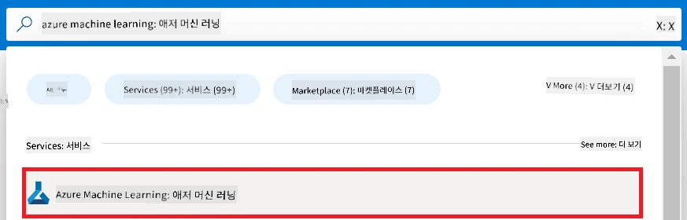

2. 네비게이션 메뉴에서 **+ 만들기**를 선택합니다.

3. 네비게이션 메뉴에서 **새 작업 영역**을 선택합니다.

    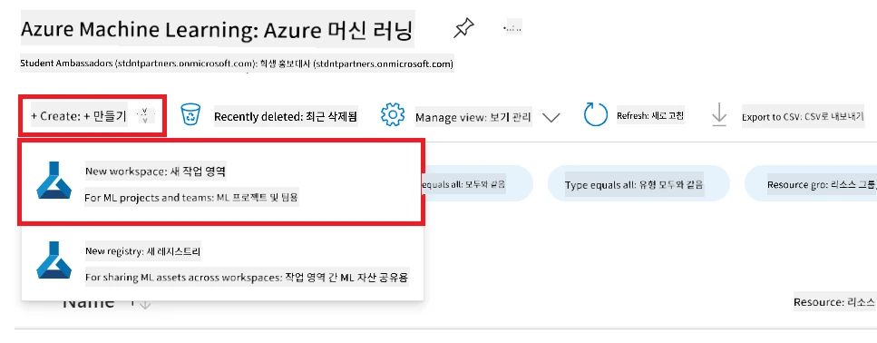

4. 다음 작업을 수행합니다:

    - Azure **구독**을 선택합니다.
    - 사용할 **리소스 그룹**을 선택합니다(필요 시 새로 만듦).
    - **작업 영역 이름**을 입력합니다. 고유한 값이어야 합니다.
    - 사용할 **지역**을 선택합니다.
    - 사용할 **스토리지 계정**을 선택합니다(필요 시 새로 만듦).
    - 사용할 **키 자격 증명 저장소(Key vault)**를 선택합니다(필요 시 새로 만듦).
    - 사용할 **응용 프로그램 인사이트(Application insights)**를 선택합니다(필요 시 새로 만듦).
    - 사용할 **컨테이너 레지스트리**를 선택합니다(필요 시 새로 만듦).

    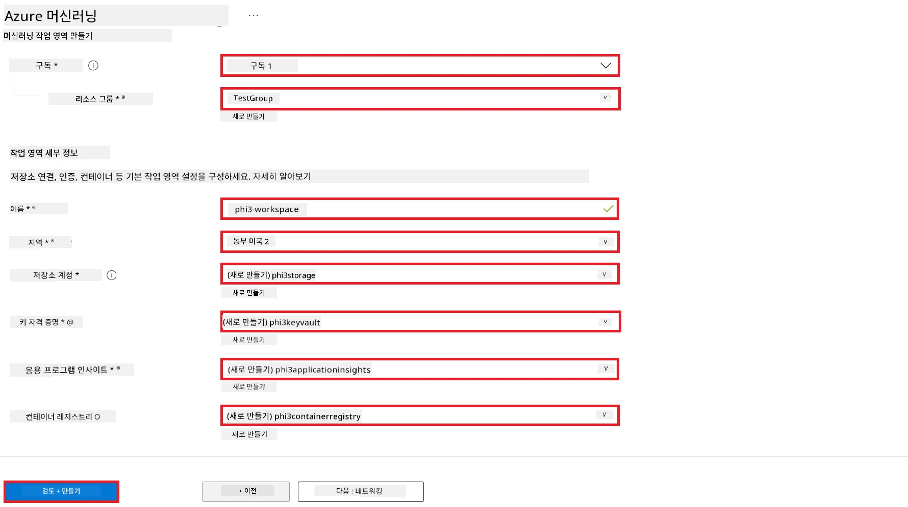

5. **검토 + 만들기**를 선택합니다.

6. **만들기**를 선택합니다.

### Azure 구독에서 GPU 할당량 요청

이 튜토리얼에서는 GPU를 사용하여 Phi-3 모델을 미세 조정하고 배포하는 방법을 배웁니다. 미세 조정을 위해서는 *Standard_NC24ads_A100_v4* GPU를 사용하며, 이 GPU는 할당량 요청이 필요합니다. 배포 시에는 *Standard_NC6s_v3* GPU를 사용하며, 이 또한 할당량 요청이 필요합니다.

> [!NOTE]
>
> Pay-As-You-Go 구독(표준 구독 유형)만 GPU 할당 대상이며, 혜택 구독은 현재 지원되지 않습니다.
>

1. [Azure ML Studio](https://ml.azure.com/home?wt.mc_id=studentamb_279723)에 접속합니다.

1. *Standard NCADSA100v4 Family* 할당량 요청을 위해 다음 작업을 수행합니다:

    - 왼쪽 탭에서 **할당량(Quota)**을 선택합니다.
    - 사용할 **가상 머신 패밀리**를 선택합니다. 예를 들어, *Standard NCADSA100v4 Family Cluster Dedicated vCPUs* (여기에는 *Standard_NC24ads_A100_v4* GPU가 포함됨)를 선택합니다.
    - 네비게이션 메뉴에서 **할당량 요청(Request quota)**을 선택합니다.

        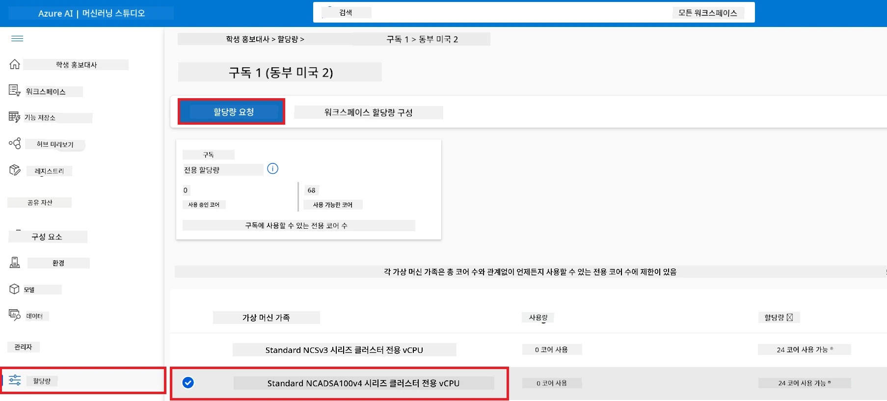

    - 할당량 요청 페이지에서 사용할 **새 코어 제한(New cores limit)**을 입력합니다. 예: 24.
    - 할당량 요청 페이지에서 **제출(Submit)**을 선택하여 GPU 할당량을 요청합니다.

1. *Standard NCSv3 Family* 할당량 요청을 위해 다음 작업을 수행합니다:

    - 왼쪽 탭에서 **할당량(Quota)**을 선택합니다.
    - 사용할 **가상 머신 패밀리**를 선택합니다. 예를 들어, *Standard NCSv3 Family Cluster Dedicated vCPUs* (여기에는 *Standard_NC6s_v3* GPU가 포함됨)를 선택합니다.
    - 네비게이션 메뉴에서 **할당량 요청(Request quota)**을 선택합니다.
    - 할당량 요청 페이지에서 사용할 **새 코어 제한(New cores limit)**을 입력합니다. 예: 24.
    - 할당량 요청 페이지에서 **제출(Submit)**을 선택하여 GPU 할당량을 요청합니다.

### 역할 할당 추가

모델을 미세 조정하고 배포하려면 먼저 사용자 할당 관리 ID(User Assigned Managed Identity, UAI)를 생성하고 적절한 권한을 할당해야 합니다. 이 UAI는 배포 중 인증에 사용됩니다.

#### 사용자 할당 관리 ID(UAI) 만들기

1. 포털 페이지 상단의 **검색창**에 *managed identities*를 입력하고 표시되는 옵션 중 **Managed Identities**를 선택합니다.

    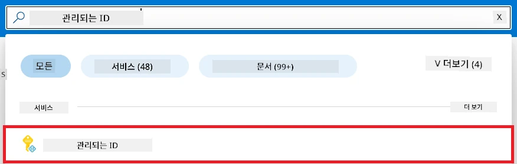

1. **+ 만들기**를 선택합니다.

    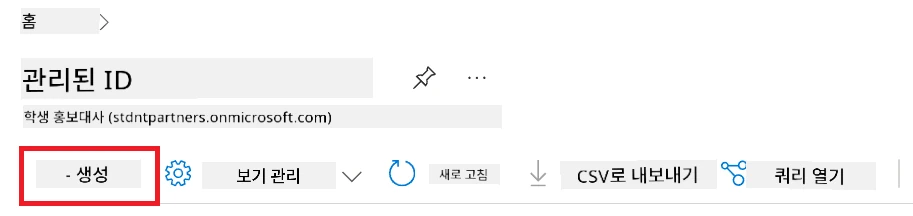

1. 다음 작업을 수행합니다:

    - Azure **구독**을 선택합니다.
    - 사용할 **리소스 그룹**을 선택합니다(필요 시 새로 만듦).
    - 사용할 **지역**을 선택합니다.
    - **이름**을 입력합니다. 고유한 값이어야 합니다.

    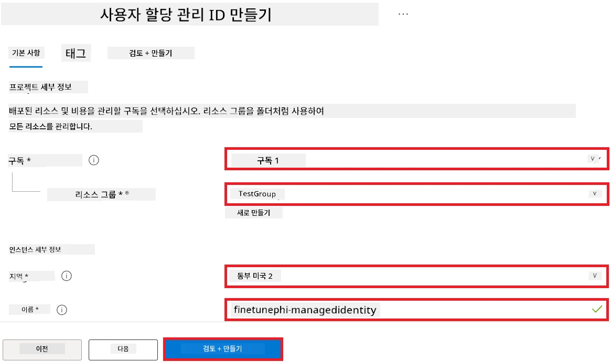

1. **검토 + 만들기**를 선택합니다.

1. **+ 만들기**를 선택합니다.

#### 관리 ID에 Contributor 역할 할당 추가

1. 생성한 관리 ID 리소스에 이동합니다.

1. 왼쪽 탭에서 **Azure 역할 할당(Azure role assignments)**을 선택합니다.

1. 네비게이션 메뉴에서 **+ 역할 할당 추가(+Add role assignment)**를 선택합니다.

1. 역할 할당 추가 페이지에서 다음 작업을 수행합니다:
    - **범위(Scope)**를 **리소스 그룹(Resource group)**으로 선택합니다.
    - Azure **구독**을 선택합니다.
    - 사용할 **리소스 그룹**을 선택합니다.
    - **역할(Role)**을 **기여자(Contributor)**로 선택합니다.

    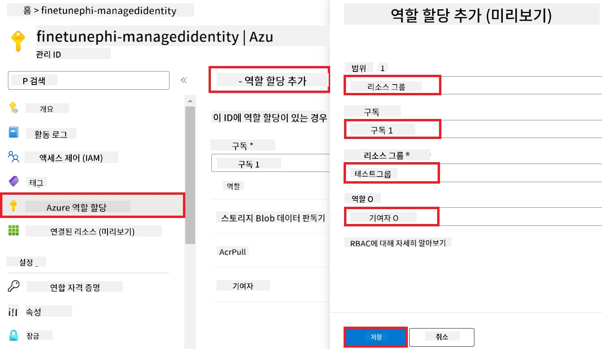

2. **저장(Save)**을 선택합니다.

#### 관리 ID에 Storage Blob Data Reader 역할 할당 추가

1. 포털 페이지 상단의 **검색창**에 *storage accounts*를 입력하고 표시되는 옵션 중 **Storage accounts**를 선택합니다.

    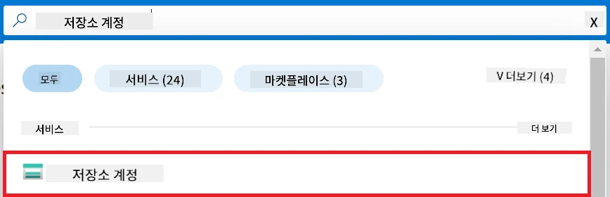

1. 생성한 Azure Machine Learning 작업 영역과 연결된 스토리지 계정을 선택합니다. 예: *finetunephistorage*.

1. 역할 할당 추가 페이지로 이동하기 위해 다음을 수행합니다:

    - 생성한 Azure 스토리지 계정으로 이동합니다.
    - 왼쪽 탭에서 **액세스 제어(IAM)**를 선택합니다.
    - 네비게이션 메뉴에서 **+ 추가**를 선택합니다.
    - **역할 할당 추가**를 선택합니다.

    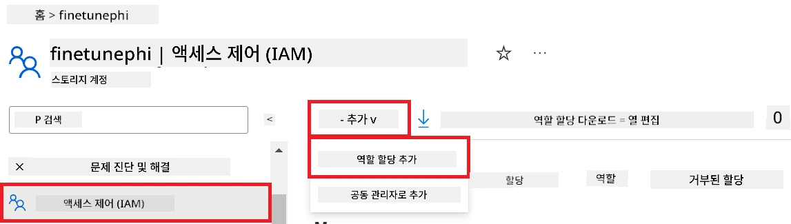

1. 역할 할당 추가 페이지에서 다음 작업을 수행합니다:

    - 역할 페이지 내 **검색창**에 *Storage Blob Data Reader*를 입력하고 표시되는 옵션 중 **Storage Blob Data Reader**를 선택합니다.
    - 역할 페이지에서 **다음(NEXT)**을 선택합니다.
    - 멤버 페이지에서 **액세스 할당 대상(Assign access to)**을 **Managed identity**로 선택합니다.
    - 멤버 페이지에서 **+ 멤버 선택(+ Select members)**을 선택합니다.
    - 관리 ID 선택 페이지에서 Azure **구독**을 선택합니다.
    - 관리 ID 선택 페이지에서 **Managed identity**를 선택합니다.
    - 관리 ID 선택 페이지에서 생성한 관리 ID를 선택합니다. 예: *finetunephi-managedidentity*.
    - 관리 ID 선택 페이지에서 **선택(Select)**을 선택합니다.

    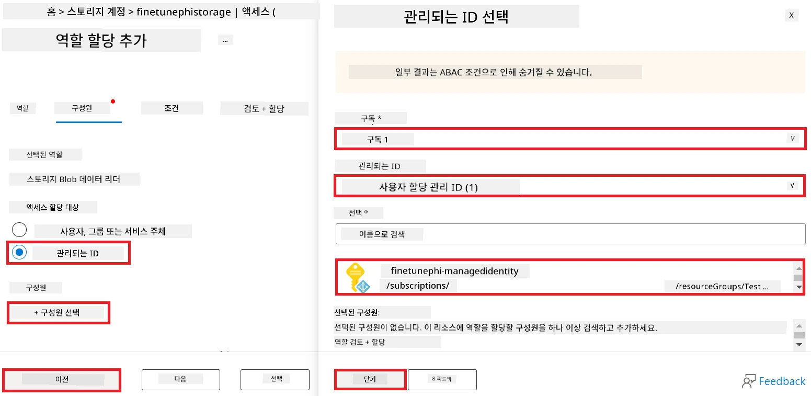

1. **검토 + 할당(Review + assign)**을 선택합니다.

#### 관리 ID에 AcrPull 역할 할당 추가

1. 포털 페이지 상단의 **검색창**에 *container registries*를 입력하고 표시되는 옵션 중 **Container registries**를 선택합니다.

    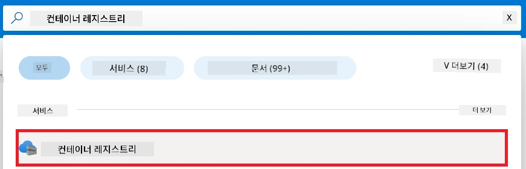

1. Azure Machine Learning 작업 영역과 연결된 컨테이너 레지스트리를 선택합니다. 예: *finetunephicontainerregistry*

1. 역할 할당 추가 페이지로 이동하기 위해 다음을 수행합니다:

    - 왼쪽 탭에서 **액세스 제어(IAM)**를 선택합니다.
    - 네비게이션 메뉴에서 **+ 추가**를 선택합니다.
    - **역할 할당 추가**를 선택합니다.

1. 역할 할당 추가 페이지에서 다음 작업을 수행합니다:

    - 역할 페이지 내 **검색창**에 *AcrPull*을 입력하고 표시되는 옵션 중 **AcrPull**을 선택합니다.
    - 역할 페이지에서 **다음(NEXT)**을 선택합니다.
    - 멤버 페이지에서 **액세스 할당 대상(Assign access to)**을 **Managed identity**로 선택합니다.
    - 멤버 페이지에서 **+ 멤버 선택(+ Select members)**을 선택합니다.
    - 관리 ID 선택 페이지에서 Azure **구독**을 선택합니다.
    - 관리 ID 선택 페이지에서 **Managed identity**를 선택합니다.
    - 관리 ID 선택 페이지에서 생성한 관리 ID를 선택합니다. 예: *finetunephi-managedidentity*.
    - 관리 ID 선택 페이지에서 **선택(Select)**을 선택합니다.
    - **검토 + 할당(Review + assign)**을 선택합니다.

### 프로젝트 설정

미세 조정에 필요한 데이터셋을 다운로드하려면 로컬 환경을 설정해야 합니다.

이 작업에서 다음을 수행합니다:

- 작업할 폴더를 생성합니다.
- 가상 환경을 만듭니다.
- 필요한 패키지를 설치합니다.
- 데이터셋을 다운로드하는 *download_dataset.py* 파일을 만듭니다.

#### 작업할 폴더 생성

1. 터미널 창을 열고 기본 경로에 *finetune-phi*라는 폴더를 생성하기 위해 다음 명령어를 입력합니다.

    ```console
    mkdir finetune-phi
    ```

2. 터미널에 다음 명령어를 입력하여 생성한 *finetune-phi* 폴더로 이동합니다.

    ```console
    cd finetune-phi
    ```

#### 가상 환경 생성

1. 터미널에 다음 명령어를 입력하여 *.venv*라는 이름의 가상 환경을 생성합니다.

    ```console
    python -m venv .venv
    ```

2. 터미널에 다음 명령어를 입력하여 가상 환경을 활성화합니다.

    ```console
    .venv\Scripts\activate.bat
    ```

> [!NOTE]
> 제대로 작동했다면 명령 프롬프트 앞에 *(.venv)*가 표시됩니다.

#### 필수 패키지 설치

1. 터미널에 다음 명령어를 입력하여 필수 패키지를 설치합니다.

    ```console
    pip install datasets==2.19.1
    ```

#### `download_dataset.py` 파일 생성

> [!NOTE]
> 완성된 폴더 구조:
>
> ```text
> └── YourUserName
> .    └── finetune-phi
> .        └── download_dataset.py
> ```

1. **Visual Studio Code**를 엽니다.

1. 메뉴 바에서 **파일**을 선택합니다.

1. **폴더 열기**를 선택합니다.

1. *C:\Users\yourUserName\finetune-phi* 경로에 생성한 *finetune-phi* 폴더를 선택합니다.

    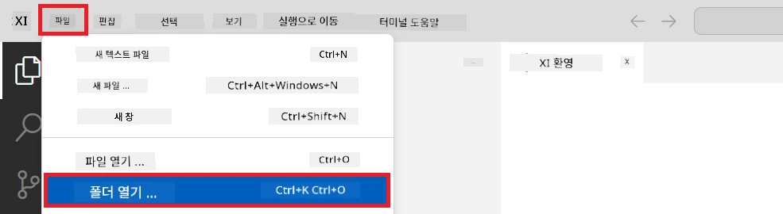

1. Visual Studio Code 왼쪽 창에서 마우스 오른쪽 버튼을 클릭 후 **새 파일**을 선택하여 *download_dataset.py*라는 새 파일을 생성합니다.

    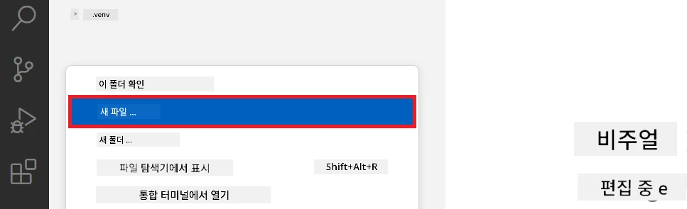

### 파인튜닝용 데이터셋 준비

이번 실습에서는 *download_dataset.py* 파일을 실행하여 *ultrachat_200k* 데이터셋을 로컬 환경에 다운로드합니다. 이후 Azure Machine Learning에서 Phi-3 모델을 파인튜닝할 때 이 데이터셋을 사용합니다.

이번 실습에서는 다음 작업을 수행합니다:

- *download_dataset.py* 파일에 데이터셋 다운로드 코드를 추가합니다.
- *download_dataset.py* 파일을 실행하여 데이터셋을 로컬 환경으로 다운로드합니다.

#### *download_dataset.py*를 사용하여 데이터셋 다운로드

1. Visual Studio Code에서 *download_dataset.py* 파일을 엽니다.

1. 다음 코드를 *download_dataset.py* 파일에 추가합니다.

    ```python
    import json
    import os
    from datasets import load_dataset

    def load_and_split_dataset(dataset_name, config_name, split_ratio):
        """
        Load and split a dataset.
        """
        # 지정된 이름, 구성 및 분할 비율로 데이터셋을 로드합니다
        dataset = load_dataset(dataset_name, config_name, split=split_ratio)
        print(f"Original dataset size: {len(dataset)}")
        
        # 데이터셋을 학습 세트와 테스트 세트로 분할합니다 (학습 80%, 테스트 20%)
        split_dataset = dataset.train_test_split(test_size=0.2)
        print(f"Train dataset size: {len(split_dataset['train'])}")
        print(f"Test dataset size: {len(split_dataset['test'])}")
        
        return split_dataset

    def save_dataset_to_jsonl(dataset, filepath):
        """
        Save a dataset to a JSONL file.
        """
        # 디렉토리가 없으면 생성합니다
        os.makedirs(os.path.dirname(filepath), exist_ok=True)
        
        # 파일을 쓰기 모드로 엽니다
        with open(filepath, 'w', encoding='utf-8') as f:
            # 데이터셋의 각 레코드를 반복합니다
            for record in dataset:
                # 레코드를 JSON 객체로 덤프하여 파일에 씁니다
                json.dump(record, f)
                # 레코드를 구분하기 위해 줄 바꿈 문자를 씁니다
                f.write('\n')
        
        print(f"Dataset saved to {filepath}")

    def main():
        """
        Main function to load, split, and save the dataset.
        """
        # 특정 구성과 분할 비율로 ULTRACHAT_200k 데이터셋을 로드하고 분할합니다
        dataset = load_and_split_dataset("HuggingFaceH4/ultrachat_200k", 'default', 'train_sft[:1%]')
        
        # 분할한 데이터셋에서 학습 데이터와 테스트 데이터를 추출합니다
        train_dataset = dataset['train']
        test_dataset = dataset['test']

        # 학습 데이터를 JSONL 파일로 저장합니다
        save_dataset_to_jsonl(train_dataset, "data/train_data.jsonl")
        
        # 테스트 데이터를 별도의 JSONL 파일로 저장합니다
        save_dataset_to_jsonl(test_dataset, "data/test_data.jsonl")

    if __name__ == "__main__":
        main()

    ```

1. 터미널에 다음 명령어를 입력하여 스크립트를 실행하고 데이터셋을 로컬 환경에 다운로드합니다.

    ```console
    python download_dataset.py
    ```

1. 데이터셋이 로컬 *finetune-phi/data* 디렉터리에 성공적으로 저장되었는지 확인합니다.

> [!NOTE]
>
> #### 데이터셋 크기 및 파인튜닝 시간 관련 참고
>
> 본 튜토리얼에서는 데이터셋의 1%(`split='train[:1%]'`)만 사용합니다. 이는 데이터 양을 대폭 줄여 업로드와 파인튜닝 시간을 단축시키며, 사용자가 적절한 훈련 시간과 모델 성능 간의 균형을 조절할 수 있도록 합니다. 데이터셋의 일부만 사용하는 것은 파인튜닝 시간을 줄여 튜토리얼 진행을 용이하게 합니다.

## 시나리오 2: Phi-3 모델 파인튜닝 및 Azure Machine Learning Studio에서 배포

### Phi-3 모델 파인튜닝

이번 실습에서는 Azure Machine Learning Studio에서 Phi-3 모델을 파인튜닝합니다.

이번 실습에서는 다음 작업을 수행합니다:

- 파인튜닝을 위한 컴퓨트 클러스터 생성.
- Azure Machine Learning Studio에서 Phi-3 모델 파인튜닝.

#### 파인튜닝용 컴퓨트 클러스터 생성

1. [Azure ML Studio](https://ml.azure.com/home?wt.mc_id=studentamb_279723) 방문합니다.

1. 좌측 탭에서 **Compute**를 선택합니다.

1. 내비게이션 메뉴에서 **Compute clusters**를 선택합니다.

1. **+ 새로 만들기**를 선택합니다.

    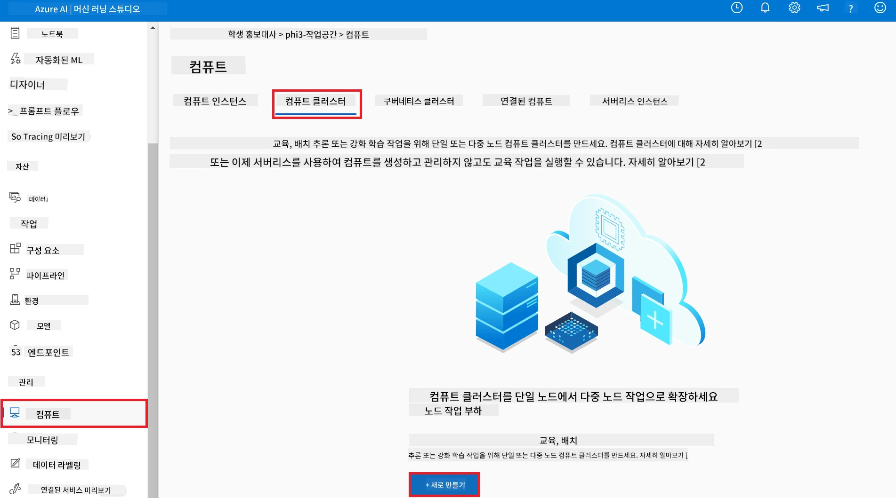

1. 다음 작업을 수행합니다:

    - 사용할 **지역**을 선택합니다.
    - **가상 머신 등급**을 **Dedicated**로 선택합니다.
    - **가상 머신 유형**을 **GPU**로 선택합니다.
    - **가상 머신 크기** 필터를 **모든 옵션에서 선택**으로 설정합니다.
    - **가상 머신 크기**를 **Standard_NC24ads_A100_v4**로 선택합니다.

    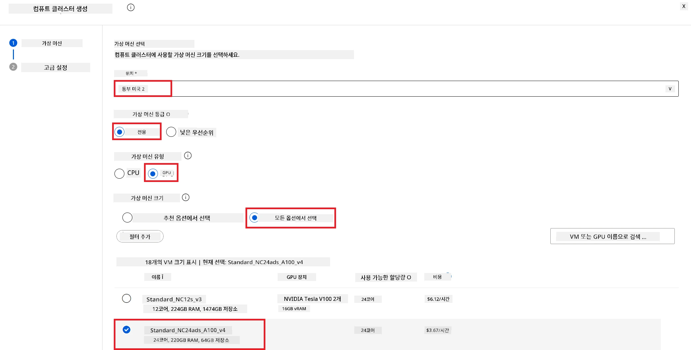

1. **다음**을 선택합니다.

1. 다음 내용을 입력합니다:

    - **컴퓨트 이름**을 입력합니다. 고유한 값이어야 합니다.
    - **최소 노드 수**를 **0**으로 설정합니다.
    - **최대 노드 수**를 **1**로 설정합니다.
    - **스케일 다운 전 유휴 시간(초)**를 **120**으로 설정합니다.

    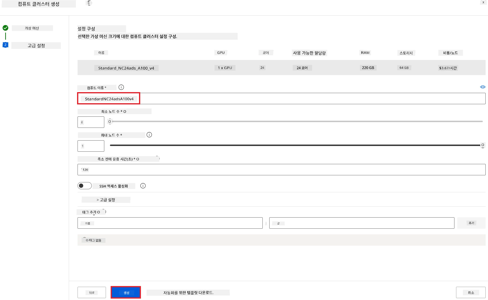

1. **만들기**를 선택합니다.

#### Phi-3 모델 파인튜닝

1. [Azure ML Studio](https://ml.azure.com/home?wt.mc_id=studentamb_279723) 방문합니다.

1. 생성한 Azure Machine Learning 작업 영역을 선택합니다.

    

1. 다음 작업을 수행합니다:

    - 좌측 탭에서 **모델 카탈로그**를 선택합니다.
    - **검색 창**에 *phi-3-mini-4k*를 입력하고 나타나는 옵션 중 **Phi-3-mini-4k-instruct**를 선택합니다.

    

1. 내비게이션 메뉴에서 **파인튜닝**을 선택합니다.

    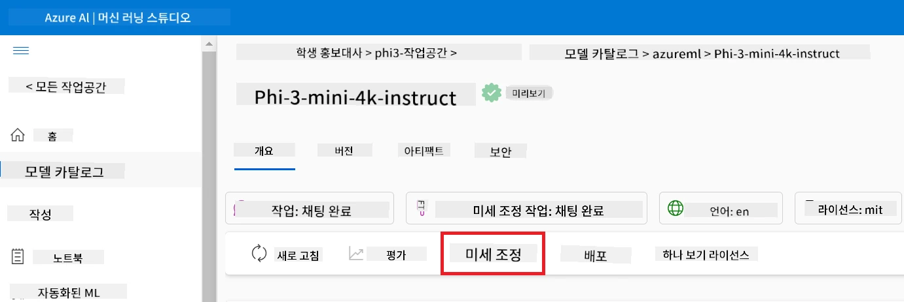

1. 다음 작업을 수행합니다:

    - **작업 유형 선택**에서 **채팅 완성(Chat completion)**을 선택합니다.
    - **+ 데이터 선택**을 클릭하여 **학습 데이터**를 업로드합니다.
    - 검증 데이터 업로드 유형을 **다른 검증 데이터 제공**으로 설정합니다.
    - **+ 데이터 선택**을 클릭하여 **검증 데이터**를 업로드합니다.

    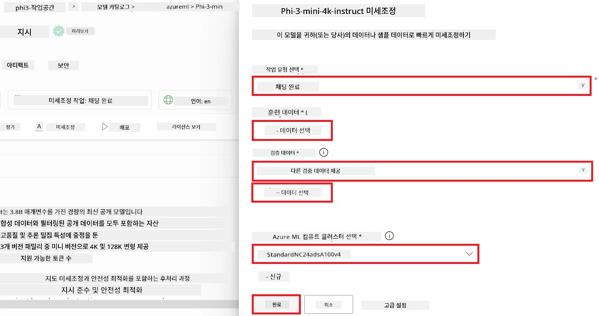

> [!TIP]
>
> **고급 설정**을 선택하면 **learning_rate**와 **lr_scheduler_type** 같은 구성 옵션을 조정하여 파인튜닝 과정을 최적화할 수 있습니다.

1. **마침**을 선택합니다.

1. 이 실습에서는 Azure Machine Learning을 사용하여 Phi-3 모델을 성공적으로 파인튜닝했습니다. 파인튜닝 작업은 상당한 시간이 걸릴 수 있으니 작업이 완료될 때까지 기다려야 합니다. 작업 상태는 Azure Machine Learning 작업 영역 왼쪽 탭의 작업 탭에서 모니터링할 수 있습니다. 다음 시리즈에서는 파인튜닝된 모델을 배포하고 Prompt flow와 통합할 예정입니다.

    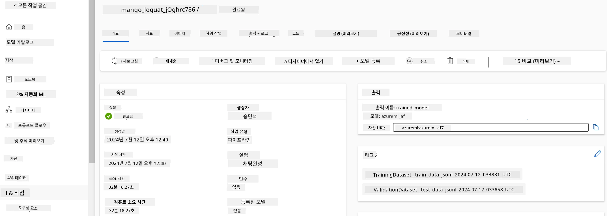

### 파인튜닝된 Phi-3 모델 배포

파인튜닝된 Phi-3 모델을 Prompt flow와 통합하기 위해 실시간 추론에 접근할 수 있도록 모델을 배포해야 합니다. 이 과정은 모델 등록, 온라인 엔드포인트 생성, 모델 배포를 포함합니다.

이번 실습에서는 다음 작업을 수행합니다:

- Azure Machine Learning 작업 영역에 파인튜닝된 모델 등록.
- 온라인 엔드포인트 생성.
- 등록된 파인튜닝된 Phi-3 모델 배포.

#### 파인튜닝된 모델 등록

1. [Azure ML Studio](https://ml.azure.com/home?wt.mc_id=studentamb_279723) 방문합니다.

1. 생성한 Azure Machine Learning 작업 영역을 선택합니다.

    

1. 좌측 탭에서 **모델**을 선택합니다.
1. **+ 등록**을 선택합니다.
1. **작업 출력에서**를 선택합니다.

    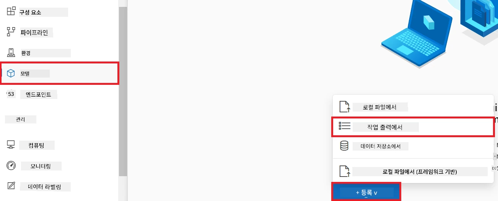

1. 생성한 작업을 선택합니다.

    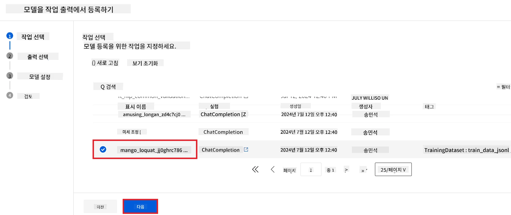

1. **다음**을 선택합니다.

1. **모델 유형**을 **MLflow**로 선택합니다.

1. **작업 출력**이 자동으로 선택되어 있는지 확인합니다.

    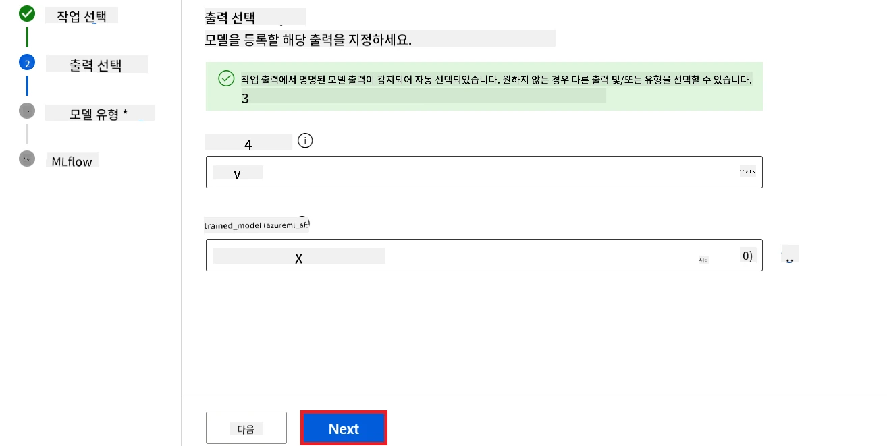

2. **다음**을 선택합니다.

3. **등록**을 선택합니다.

    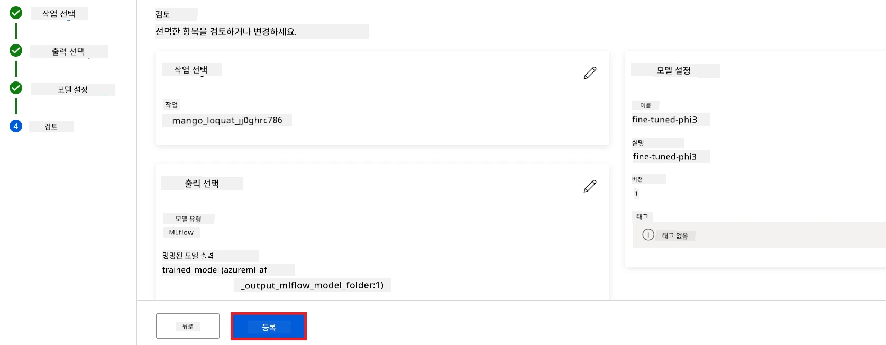

4. 좌측 탭의 **모델** 메뉴에서 등록된 모델을 조회할 수 있습니다.

    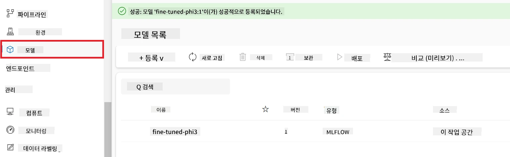

#### 파인튜닝된 모델 배포

1. 생성한 Azure Machine Learning 작업 영역으로 이동합니다.

1. 좌측 탭에서 **엔드포인트**를 선택합니다.

1. 내비게이션 메뉴에서 **실시간 엔드포인트**를 선택합니다.

    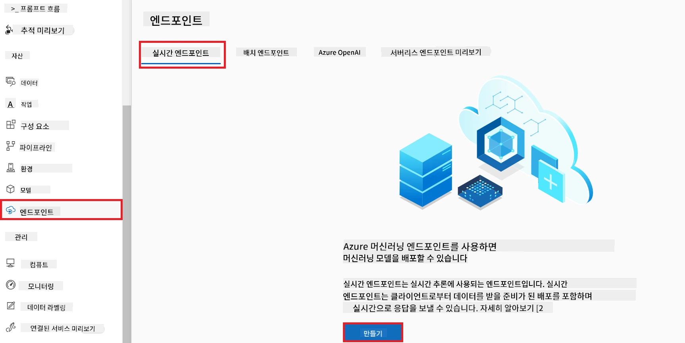

1. **생성**을 선택합니다.

1. 생성한 등록 모델을 선택합니다.

    

1. **선택**을 클릭합니다.

1. 다음 내용을 입력합니다:

    - **가상 머신**을 *Standard_NC6s_v3*로 선택합니다.
    - 원하는 **인스턴스 수**를 선택합니다. 예: *1*.
    - **엔드포인트**를 **새로 만들기**로 선택합니다.
    - **엔드포인트 이름**을 입력합니다. 고유한 값이어야 합니다.
    - **배포 이름**을 입력합니다. 고유한 값이어야 합니다.

    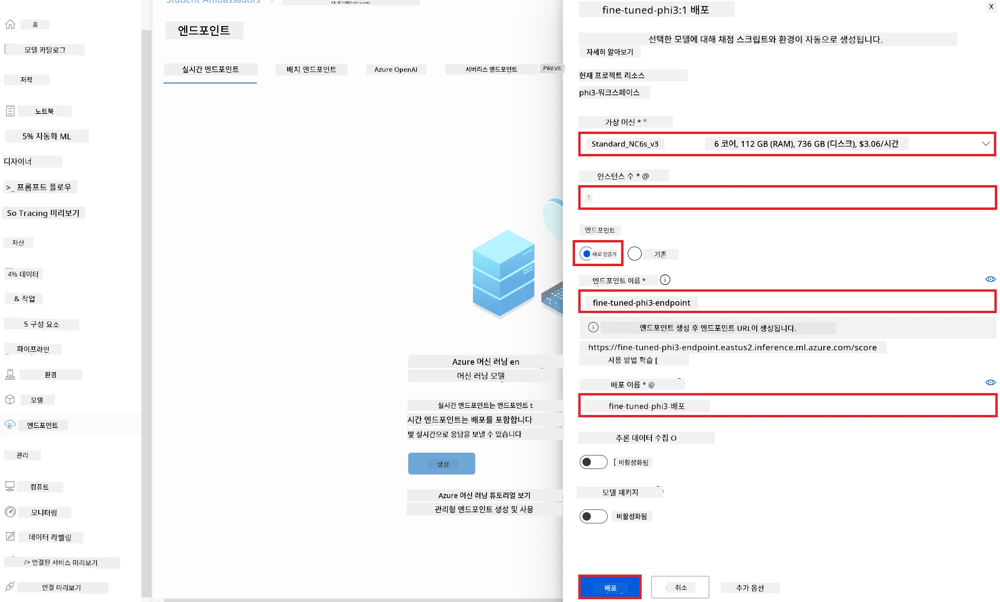

1. **배포**를 선택합니다.

> [!WARNING]
> 추가 요금 발생을 방지하려면, Azure Machine Learning 작업 영역에서 생성한 엔드포인트를 반드시 삭제하십시오.
>

#### Azure Machine Learning 작업 영역에서 배포 상태 확인

1. 생성한 Azure Machine Learning 작업 영역으로 이동합니다.

1. 좌측 탭에서 **엔드포인트**를 선택합니다.

1. 생성한 엔드포인트를 선택합니다.

    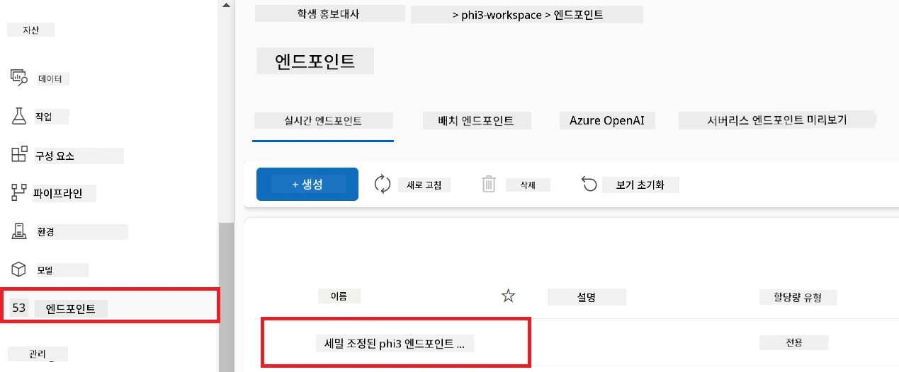

1. 이 페이지에서 배포 과정 중 엔드포인트를 관리할 수 있습니다.

> [!NOTE]
> 배포가 완료되면 **라이브 트래픽**이 **100%**로 설정되어 있는지 확인하세요. 그렇지 않으면 **트래픽 업데이트**를 선택하여 설정을 조정해야 합니다. 트래픽이 0%이면 모델 테스트가 불가능합니다.
>
> 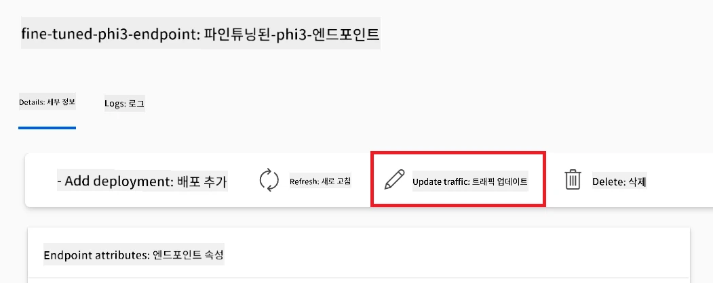
>

## 시나리오 3: Prompt flow와 통합하여 Azure AI Foundry에서 커스텀 모델과 대화하기

### 커스텀 Phi-3 모델을 Prompt flow와 통합

파인튜닝된 모델을 성공적으로 배포한 후, 이제 Prompt Flow와 통합하여 실시간 애플리케이션에서 모델을 활용하고 커스텀 Phi-3 모델을 이용한 다양한 대화형 작업을 수행할 수 있습니다.

이번 실습에서는 다음 작업을 수행합니다:

- Azure AI Foundry 허브 생성.
- Azure AI Foundry 프로젝트 생성.
- Prompt flow 생성.
- 파인튜닝된 Phi-3 모델을 위한 커스텀 연결 추가.
- 커스텀 Phi-3 모델과 대화하기 위한 Prompt flow 설정.

> [!NOTE]
> Azure ML Studio에서 Promptflow와 통합하는 방법도 있습니다. 동일한 통합 프로세스가 Azure ML Studio에도 적용 가능합니다.

#### Azure AI Foundry 허브 생성

프로젝트 생성 전에 허브를 만들어야 합니다. 허브는 리소스 그룹 역할을 하여 Azure AI Foundry 내에서 여러 프로젝트를 관리하고 구성할 수 있게 합니다.

1. [Azure AI Foundry](https://ai.azure.com/?WT.mc_id=aiml-137032-kinfeylo) 방문합니다.

1. 좌측 탭에서 **모든 허브**를 선택합니다.

1. 내비게이션 메뉴에서 **+ 새 허브**를 선택합니다.
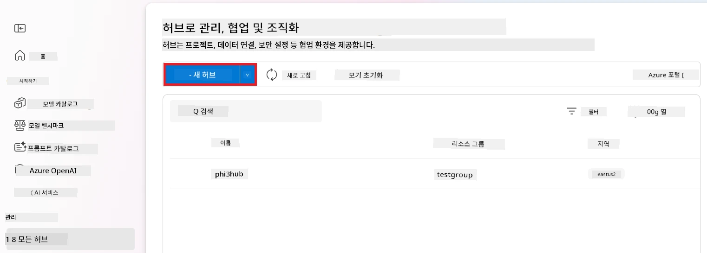

1. 다음 작업을 수행합니다:

    - **Hub name**을 입력합니다. 고유한 값이어야 합니다.
    - Azure **Subscription**을 선택합니다.
    - 사용할 **Resource group**을 선택합니다(필요한 경우 새로 만듭니다).
    - 사용할 **Location**을 선택합니다.
    - 사용할 **Connect Azure AI Services**를 선택합니다(필요한 경우 새로 만듭니다).
    - **Connect Azure AI Search**는 **Skip connecting**을 선택합니다.

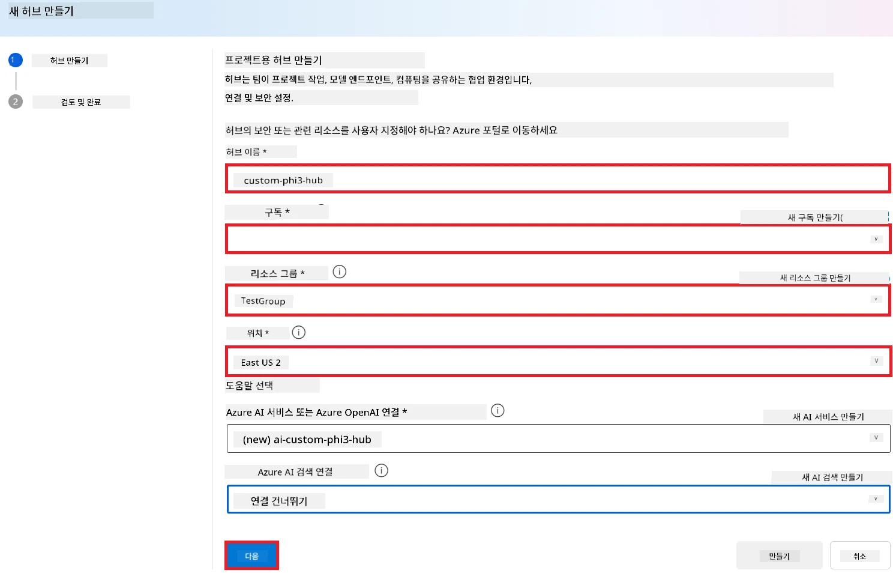

1. **Next**를 선택합니다.

#### Azure AI Foundry 프로젝트 생성

1. 생성한 Hub에서 왼쪽 탭에서 **All projects**를 선택합니다.

1. 네비게이션 메뉴에서 **+ New project**를 선택합니다.

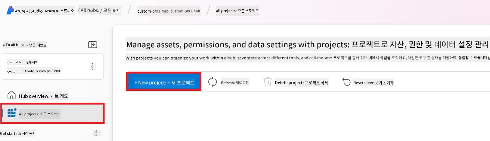

1. **Project name**을 입력합니다. 고유한 값이어야 합니다.

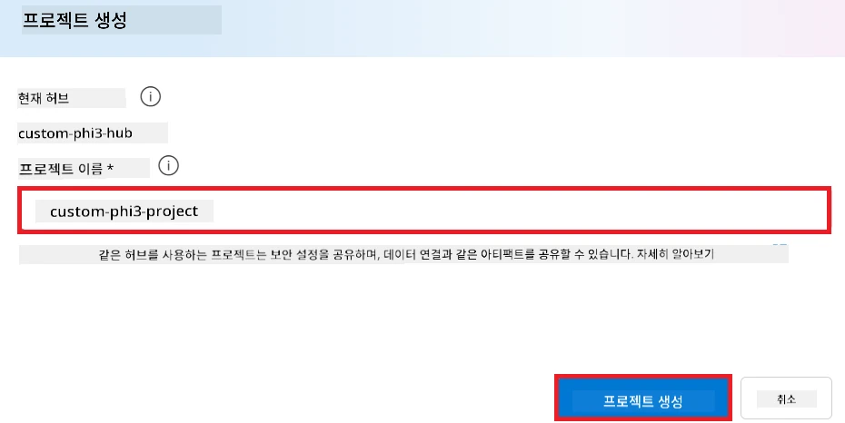

1. **Create a project**를 선택합니다.

#### fine-tuned Phi-3 모델을 위한 사용자 지정 연결 추가

사용자 지정 Phi-3 모델을 Prompt flow와 통합하려면 모델의 엔드포인트와 키를 사용자 지정 연결에 저장해야 합니다. 이 설정으로 Prompt flow에서 사용자 지정 Phi-3 모델에 액세스할 수 있습니다.

#### fine-tuned Phi-3 모델의 api key 및 endpoint uri 설정

1. [Azure ML Studio](https://ml.azure.com/home?WT.mc_id=aiml-137032-kinfeylo)를 방문합니다.

1. 생성한 Azure Machine learning 작업 영역으로 이동합니다.

1. 왼쪽 탭에서 **Endpoints**를 선택합니다.

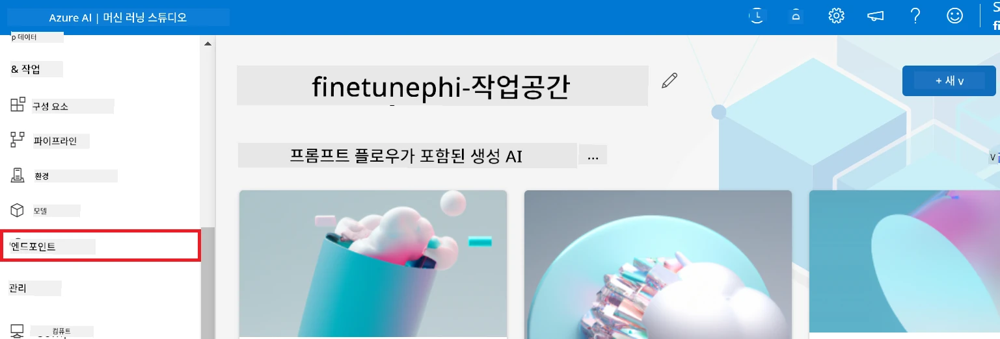

1. 생성한 엔드포인트를 선택합니다.


1. 네비게이션 메뉴에서 **Consume**을 선택합니다.

1. **REST endpoint**와 **Primary key**를 복사합니다.

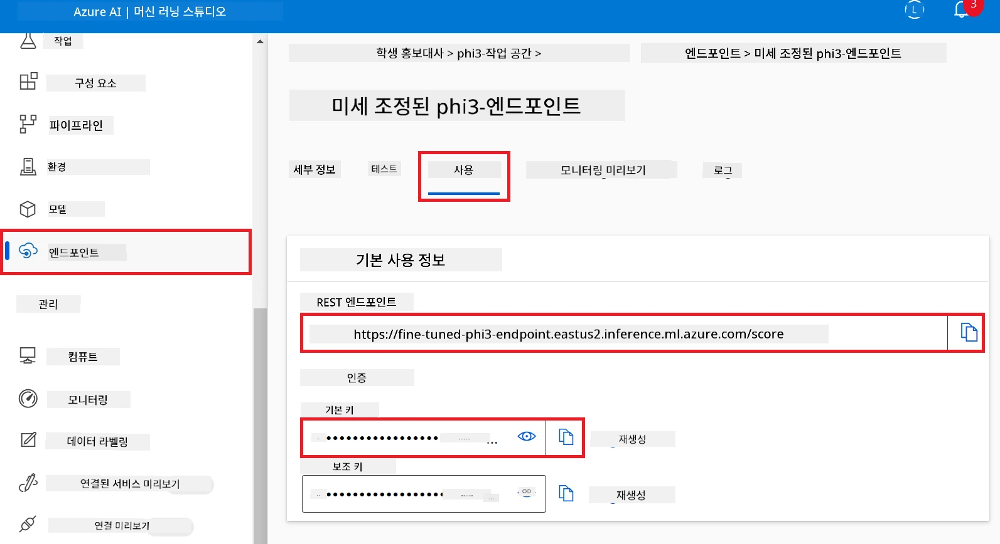

#### 사용자 지정 연결 추가

1. [Azure AI Foundry](https://ai.azure.com/?WT.mc_id=aiml-137032-kinfeylo)를 방문합니다.

1. 생성한 Azure AI Foundry 프로젝트로 이동합니다.

1. 생성한 프로젝트에서 왼쪽 탭의 **Settings**를 선택합니다.

1. **+ New connection**을 선택합니다.

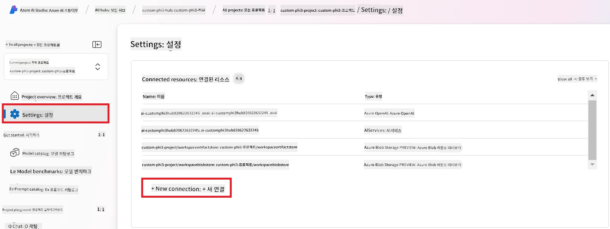

1. 네비게이션 메뉴에서 **Custom keys**를 선택합니다.

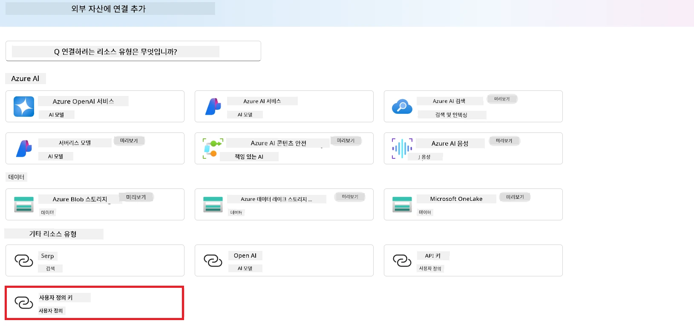

1. 다음 작업을 수행합니다:

    - **+ Add key value pairs**를 선택합니다.
    - 키 이름에 **endpoint**를 입력하고 Azure ML Studio에서 복사한 엔드포인트를 값 필드에 붙여넣기 합니다.
    - 다시 **+ Add key value pairs**를 선택합니다.
    - 키 이름에 **key**를 입력하고 Azure ML Studio에서 복사한 키를 값 필드에 붙여넣기 합니다.
    - 키를 추가한 후, 키가 노출되지 않도록 **is secret**를 선택합니다.

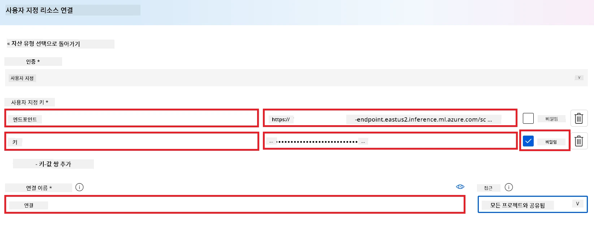

1. **Add connection**을 선택합니다.

#### Prompt flow 생성

Azure AI Foundry에서 사용자 지정 연결을 추가했습니다. 이제 다음 단계에 따라 Prompt flow를 생성합니다. 그런 다음 이 Prompt flow를 사용자 지정 연결에 연결하여 fine-tuned 모델을 Prompt flow 내에서 사용할 수 있도록 합니다.

1. 생성한 Azure AI Foundry 프로젝트로 이동합니다.

1. 왼쪽 탭에서 **Prompt flow**를 선택합니다.

1. 네비게이션 메뉴에서 **+ Create**를 선택합니다.


1. 네비게이션 메뉴에서 **Chat flow**를 선택합니다.

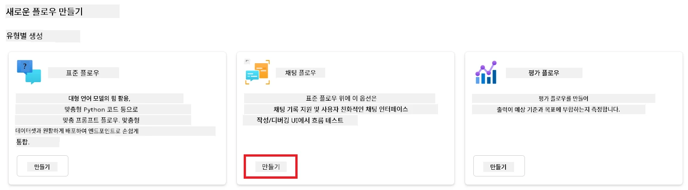

1. 사용할 **Folder name**을 입력합니다.

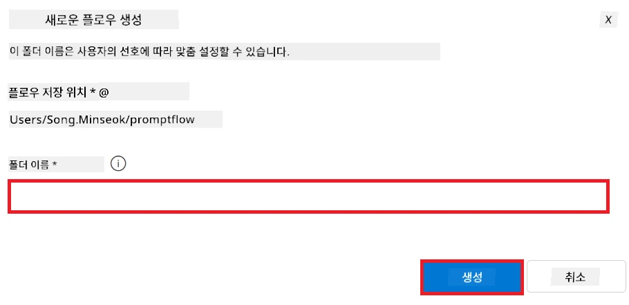

2. **Create**를 선택합니다.

#### 커스텀 Phi-3 모델과 채팅하기 위한 Prompt flow 구성

fine-tuned Phi-3 모델을 Prompt flow에 통합해야 합니다. 하지만 기존에 제공된 Prompt flow는 이 목적에 적합하지 않으므로, 사용자 지정 모델 통합을 위해 Prompt flow를 재설계해야 합니다.

1. Prompt flow에서 기존 플로우를 재구성하려면 다음 작업을 수행합니다:

    - **Raw file mode**를 선택합니다.
    - *flow.dag.yml* 파일 내 기존 코드를 모두 삭제합니다.
    - *flow.dag.yml* 파일에 아래 코드를 추가합니다.

        ```yml
        inputs:
          input_data:
            type: string
            default: "Who founded Microsoft?"

        outputs:
          answer:
            type: string
            reference: ${integrate_with_promptflow.output}

        nodes:
        - name: integrate_with_promptflow
          type: python
          source:
            type: code
            path: integrate_with_promptflow.py
          inputs:
            input_data: ${inputs.input_data}
        ```

    - **Save**를 선택합니다.

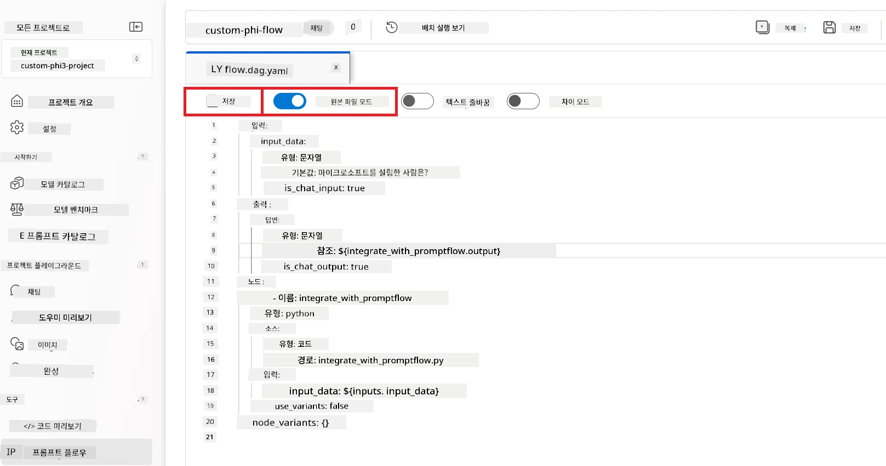

1. Prompt flow에서 커스텀 Phi-3 모델을 사용하려면 *integrate_with_promptflow.py* 파일에 아래 코드를 추가합니다.

    ```python
    import logging
    import requests
    from promptflow import tool
    from promptflow.connections import CustomConnection

    # 로깅 설정
    logging.basicConfig(
        format="%(asctime)s - %(levelname)s - %(name)s - %(message)s",
        datefmt="%Y-%m-%d %H:%M:%S",
        level=logging.DEBUG
    )
    logger = logging.getLogger(__name__)

    def query_phi3_model(input_data: str, connection: CustomConnection) -> str:
        """
        Send a request to the Phi-3 model endpoint with the given input data using Custom Connection.
        """

        # "connection"은 사용자 정의 연결의 이름이고, "endpoint", "key"는 사용자 정의 연결의 키입니다
        endpoint_url = connection.endpoint
        api_key = connection.key

        headers = {
            "Content-Type": "application/json",
            "Authorization": f"Bearer {api_key}"
        }
        data = {
            "input_data": {
                "input_string": [
                    {"role": "user", "content": input_data}
                ],
                "parameters": {
                    "temperature": 0.7,
                    "max_new_tokens": 128
                }
            }
        }
        try:
            response = requests.post(endpoint_url, json=data, headers=headers)
            response.raise_for_status()
            
            # 전체 JSON 응답을 기록합니다
            logger.debug(f"Full JSON response: {response.json()}")

            result = response.json()["output"]
            logger.info("Successfully received response from Azure ML Endpoint.")
            return result
        except requests.exceptions.RequestException as e:
            logger.error(f"Error querying Azure ML Endpoint: {e}")
            raise

    @tool
    def my_python_tool(input_data: str, connection: CustomConnection) -> str:
        """
        Tool function to process input data and query the Phi-3 model.
        """
        return query_phi3_model(input_data, connection)

    ```

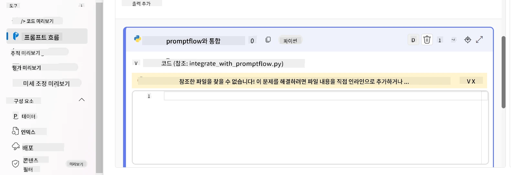

> [!NOTE]
> Azure AI Foundry에서 Prompt flow 사용에 관한 자세한 내용은 [Prompt flow in Azure AI Foundry](https://learn.microsoft.com/azure/ai-studio/how-to/prompt-flow) 문서를 참조하세요.

1. **Chat input**, **Chat output**을 선택하여 모델과 채팅을 활성화합니다.

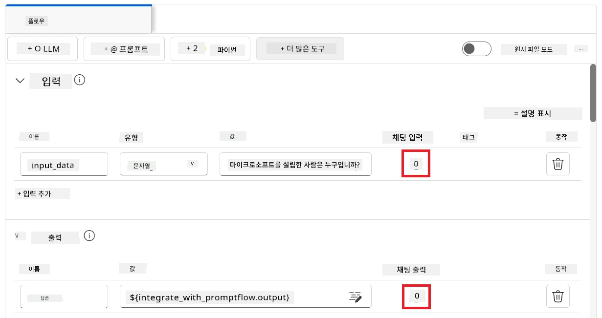

1. 이제 사용자 지정 Phi-3 모델과 채팅할 준비가 되었습니다. 다음 연습에서는 Prompt flow를 시작하고 fine-tuned Phi-3 모델과 채팅하는 방법을 배웁니다.

> [!NOTE]
>
> 재구성된 플로우는 아래 이미지와 유사해야 합니다:
>
> 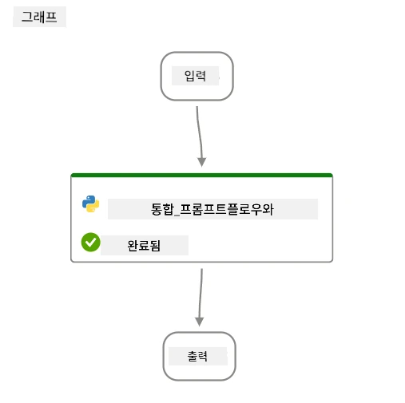
>

### 사용자 지정 Phi-3 모델과 채팅하기

이제 fine-tuning 완료 후 사용자 지정 Phi-3 모델을 Prompt flow에 통합했습니다. 이 연습에서는 모델과 상호작용을 시작하고 설정하는 과정을 안내합니다. 이 단계를 따라 모델의 다양한 작업 및 대화 기능을 최대한 활용할 수 있습니다.

- Prompt flow를 사용하여 사용자 지정 Phi-3 모델과 채팅하기.

#### Prompt flow 시작하기

1. **Start compute sessions**를 선택하여 Prompt flow를 시작합니다.

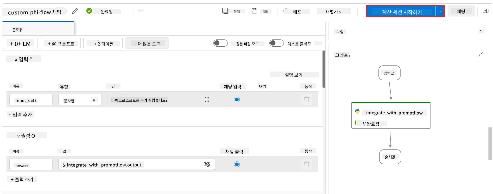

1. **Validate and parse input**을 선택하여 매개변수를 갱신합니다.

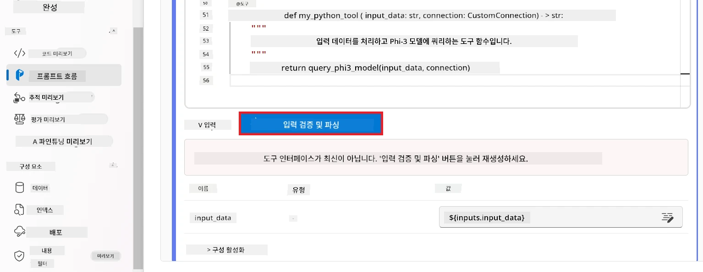

1. 생성한 사용자 지정 연결의 **connection** 값을 선택합니다. 예: *connection*.

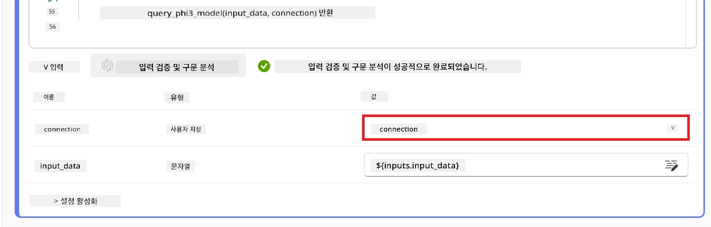

#### 사용자 지정 모델과 채팅하기

1. **Chat**을 선택합니다.


1. 결과 예시는 다음과 같습니다: 이제 사용자 지정 Phi-3 모델과 채팅할 수 있습니다. fine-tuning에 사용된 데이터를 기반으로 질문하는 것이 좋습니다.

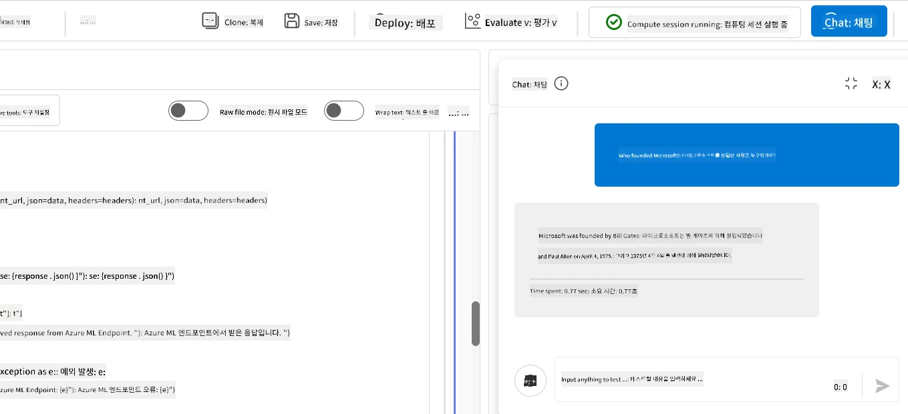

---

<!-- CO-OP TRANSLATOR DISCLAIMER START -->
**면책 조항**:  
이 문서는 AI 번역 서비스 [Co-op Translator](https://github.com/Azure/co-op-translator)를 사용하여 번역되었습니다. 정확성을 위해 노력하고 있으나, 자동 번역에는 오류나 부정확성이 포함될 수 있음을 유의해 주시기 바랍니다. 원본 문서의 원어가 권위 있는 출처로 간주되어야 합니다. 중요한 정보의 경우 전문 인력에 의한 번역을 권장합니다. 본 번역물 사용으로 인한 오해나 잘못된 해석에 대해 당사는 책임을 지지 않습니다.
<!-- CO-OP TRANSLATOR DISCLAIMER END -->