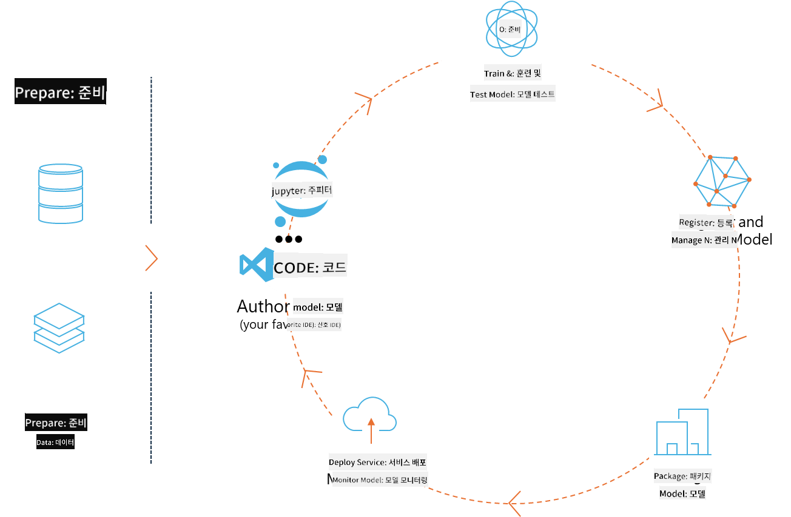
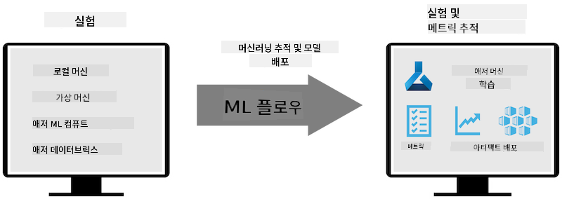

<!--
CO_OP_TRANSLATOR_METADATA:
{
  "original_hash": "1e42c399dcc2fa477925d3ef4038d403",
  "translation_date": "2025-04-04T06:30:11+00:00",
  "source_file": "md\\02.Application\\01.TextAndChat\\Phi3\\E2E_Phi-3-MLflow.md",
  "language_code": "ko"
}
-->
# MLflow

[MLflow](https://mlflow.org/)는 머신 러닝 라이프사이클의 끝에서 끝까지 관리하기 위해 설계된 오픈 소스 플랫폼입니다.



MLFlow는 실험, 재현성, 배포 및 중앙 모델 레지스트리를 포함하여 ML 라이프사이클을 관리하는 데 사용됩니다. 현재 MLFlow는 네 가지 구성 요소를 제공합니다.

- **MLflow Tracking:** 실험, 코드, 데이터 구성 및 결과를 기록하고 조회합니다.
- **MLflow Projects:** 데이터 과학 코드를 패키징하여 어떤 플랫폼에서도 실행을 재현할 수 있는 형식으로 제공합니다.
- **Mlflow Models:** 다양한 서빙 환경에서 머신 러닝 모델을 배포합니다.
- **Model Registry:** 중앙 저장소에서 모델을 저장, 주석 추가 및 관리합니다.

MLFlow는 실험 추적, 코드를 재현 가능한 실행으로 패키징, 모델 공유 및 배포 기능을 포함합니다. Databricks와 통합되어 있으며 다양한 머신 러닝 라이브러리를 지원하여 라이브러리 독립적으로 사용할 수 있습니다. REST API와 CLI를 제공하므로 어떤 머신 러닝 라이브러리와 프로그래밍 언어에서도 사용할 수 있습니다.



MLFlow의 주요 기능은 다음과 같습니다:

- **실험 추적:** 매개변수와 결과를 기록하고 비교합니다.
- **모델 관리:** 다양한 서빙 및 추론 플랫폼에 모델을 배포합니다.
- **모델 레지스트리:** 버전 관리 및 주석을 포함하여 MLFlow 모델의 라이프사이클을 협업적으로 관리합니다.
- **프로젝트:** ML 코드를 공유하거나 프로덕션 환경에서 사용할 수 있도록 패키징합니다.

MLFlow는 데이터 준비, 모델 등록 및 관리, 실행을 위한 모델 패키징, 서비스 배포, 모델 모니터링을 포함하는 MLOps 루프를 지원합니다. 특히 클라우드 및 엣지 환경에서 프로토타입에서 프로덕션 워크플로로 이동하는 과정을 간소화하는 것을 목표로 합니다.

## E2E 시나리오 - 래퍼를 구축하고 Phi-3를 MLFlow 모델로 사용하기

이 E2E 샘플에서는 두 가지 접근 방식을 사용하여 Phi-3 소형 언어 모델(SLM)을 래퍼로 구축한 다음 로컬 또는 클라우드(예: Azure Machine Learning 워크스페이스)에서 MLFlow 모델로 실행하는 방법을 시연합니다.


| 프로젝트 | 설명 | 위치 |
| ------------ | ----------- | -------- |
| Transformer Pipeline | Transformer Pipeline은 HuggingFace 모델을 MLFlow의 실험적인 Transformers flavor와 함께 사용하려는 경우 래퍼를 구축하는 가장 쉬운 옵션입니다. | [**TransformerPipeline.ipynb**](../../../../../../code/06.E2E/E2E_Phi-3-MLflow_TransformerPipeline.ipynb) |
| Custom Python Wrapper | 작성 시점에서 Transformer Pipeline은 HuggingFace 모델의 ONNX 형식에 대한 MLFlow 래퍼 생성을 지원하지 않았습니다. 이러한 경우를 위해 MLFlow 모드를 위한 사용자 정의 Python 래퍼를 구축할 수 있습니다. | [**CustomPythonWrapper.ipynb**](../../../../../../code/06.E2E/E2E_Phi-3-MLflow_CustomPythonWrapper.ipynb) |

## 프로젝트: Transformer Pipeline

1. MLFlow 및 HuggingFace에서 필요한 Python 패키지를 설치해야 합니다:

    ``` Python
    import mlflow
    import transformers
    ```

2. 다음으로 HuggingFace 레지스트리에서 대상 Phi-3 모델을 참조하여 Transformer Pipeline을 초기화해야 합니다. _Phi-3-mini-4k-instruct_ 모델 카드에서 볼 수 있듯이 이 모델의 작업 유형은 "텍스트 생성"입니다:

    ``` Python
    pipeline = transformers.pipeline(
        task = "text-generation",
        model = "microsoft/Phi-3-mini-4k-instruct"
    )
    ```

3. 이제 Phi-3 모델의 Transformer Pipeline을 MLFlow 형식으로 저장하고 대상 아티팩트 경로, 특정 모델 구성 설정 및 추론 API 유형과 같은 추가 세부 정보를 제공할 수 있습니다:

    ``` Python
    model_info = mlflow.transformers.log_model(
        transformers_model = pipeline,
        artifact_path = "phi3-mlflow-model",
        model_config = model_config,
        task = "llm/v1/chat"
    )
    ```

## 프로젝트: Custom Python Wrapper

1. Microsoft의 [ONNX Runtime generate() API](https://github.com/microsoft/onnxruntime-genai)를 사용하여 ONNX 모델의 추론 및 토큰 인코딩/디코딩을 수행할 수 있습니다. 아래 예는 CPU를 대상으로 _onnxruntime_genai_ 패키지를 선택하는 예입니다:

    ``` Python
    import mlflow
    from mlflow.models import infer_signature
    import onnxruntime_genai as og
    ```

1. 사용자 정의 클래스는 두 가지 메서드를 구현합니다: _load_context()_는 **Phi-3 Mini 4K Instruct의 ONNX 모델**, **생성기 매개변수**, **토크나이저**를 초기화하고, _predict()_는 제공된 프롬프트에 대한 출력 토큰을 생성합니다:

    ``` Python
    class Phi3Model(mlflow.pyfunc.PythonModel):
        def load_context(self, context):
            # Retrieving model from the artifacts
            model_path = context.artifacts["phi3-mini-onnx"]
            model_options = {
                 "max_length": 300,
                 "temperature": 0.2,         
            }
        
            # Defining the model
            self.phi3_model = og.Model(model_path)
            self.params = og.GeneratorParams(self.phi3_model)
            self.params.set_search_options(**model_options)
            
            # Defining the tokenizer
            self.tokenizer = og.Tokenizer(self.phi3_model)
    
        def predict(self, context, model_input):
            # Retrieving prompt from the input
            prompt = model_input["prompt"][0]
            self.params.input_ids = self.tokenizer.encode(prompt)
    
            # Generating the model's response
            response = self.phi3_model.generate(self.params)
    
            return self.tokenizer.decode(response[0][len(self.params.input_ids):])
    ```

1. 이제 _mlflow.pyfunc.log_model()_ 함수를 사용하여 Phi-3 모델에 대한 사용자 정의 Python 래퍼(피클 형식), 원래 ONNX 모델 및 필요한 종속성을 생성할 수 있습니다:

    ``` Python
    model_info = mlflow.pyfunc.log_model(
        artifact_path = artifact_path,
        python_model = Phi3Model(),
        artifacts = {
            "phi3-mini-onnx": "cpu_and_mobile/cpu-int4-rtn-block-32-acc-level-4",
        },
        input_example = input_example,
        signature = infer_signature(input_example, ["Run"]),
        extra_pip_requirements = ["torch", "onnxruntime_genai", "numpy"],
    )
    ```

## 생성된 MLFlow 모델의 서명

1. 위 Transformer Pipeline 프로젝트의 3단계에서 MLFlow 모델의 작업을 "_llm/v1/chat_"로 설정했습니다. 이러한 설정은 아래와 같이 OpenAI의 Chat API와 호환되는 모델 API 래퍼를 생성합니다:

    ``` Python
    {inputs: 
      ['messages': Array({content: string (required), name: string (optional), role: string (required)}) (required), 'temperature': double (optional), 'max_tokens': long (optional), 'stop': Array(string) (optional), 'n': long (optional), 'stream': boolean (optional)],
    outputs: 
      ['id': string (required), 'object': string (required), 'created': long (required), 'model': string (required), 'choices': Array({finish_reason: string (required), index: long (required), message: {content: string (required), name: string (optional), role: string (required)} (required)}) (required), 'usage': {completion_tokens: long (required), prompt_tokens: long (required), total_tokens: long (required)} (required)],
    params: 
      None}
    ```

1. 결과적으로 프롬프트를 다음 형식으로 제출할 수 있습니다:

    ``` Python
    messages = [{"role": "user", "content": "What is the capital of Spain?"}]
    ```

1. 그런 다음 OpenAI API와 호환되는 후처리, 예를 들어 _response[0][‘choices’][0][‘message’][‘content’]_를 사용하여 출력을 다음과 같이 정리할 수 있습니다:

    ``` JSON
    Question: What is the capital of Spain?
    
    Answer: The capital of Spain is Madrid. It is the largest city in Spain and serves as the political, economic, and cultural center of the country. Madrid is located in the center of the Iberian Peninsula and is known for its rich history, art, and architecture, including the Royal Palace, the Prado Museum, and the Plaza Mayor.
    
    Usage: {'prompt_tokens': 11, 'completion_tokens': 73, 'total_tokens': 84}
    ```

1. 위 Custom Python Wrapper 프로젝트의 3단계에서 제공된 입력 예제를 기반으로 MLFlow 패키지가 모델의 서명을 생성하도록 허용했습니다. 우리의 MLFlow 래퍼 서명은 다음과 같이 보일 것입니다:

    ``` Python
    {inputs: 
      ['prompt': string (required)],
    outputs: 
      [string (required)],
    params: 
      None}
    ```

1. 따라서 프롬프트에는 "prompt"라는 딕셔너리 키가 포함되어야 하며, 이는 다음과 같습니다:

    ``` Python
    {"prompt": "<|system|>You are a stand-up comedian.<|end|><|user|>Tell me a joke about atom<|end|><|assistant|>",}
    ```

1. 모델의 출력은 문자열 형식으로 제공됩니다:

    ``` JSON
    Alright, here's a little atom-related joke for you!
    
    Why don't electrons ever play hide and seek with protons?
    
    Because good luck finding them when they're always "sharing" their electrons!
    
    Remember, this is all in good fun, and we're just having a little atomic-level humor!
    ```

**면책 조항**:  
이 문서는 AI 번역 서비스 [Co-op Translator](https://github.com/Azure/co-op-translator)를 사용하여 번역되었습니다. 정확성을 위해 노력하고 있지만, 자동 번역은 오류나 부정확한 내용이 포함될 수 있음을 유의하시기 바랍니다. 원문이 작성된 원어 문서를 신뢰할 수 있는 권위 있는 출처로 간주해야 합니다. 중요한 정보에 대해서는 전문적인 인간 번역을 권장합니다. 이 번역을 사용함으로 인해 발생하는 오해나 잘못된 해석에 대해 당사는 책임을 지지 않습니다.