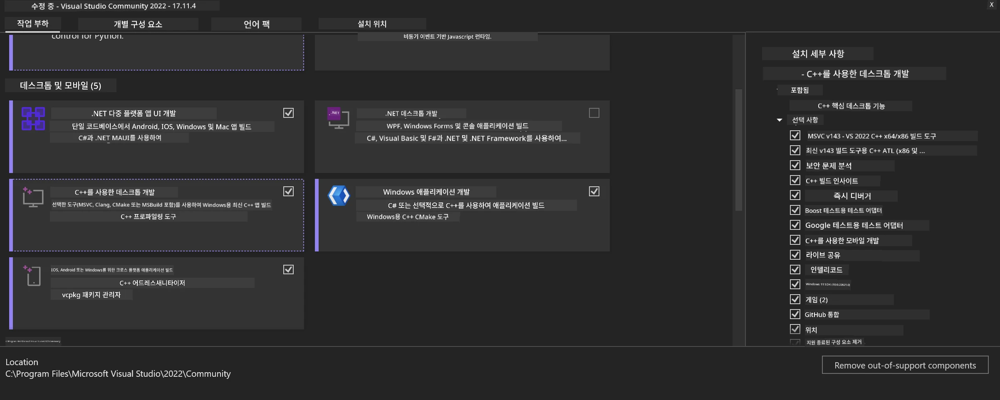
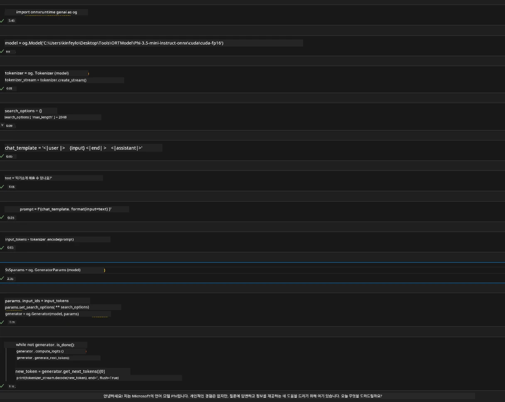
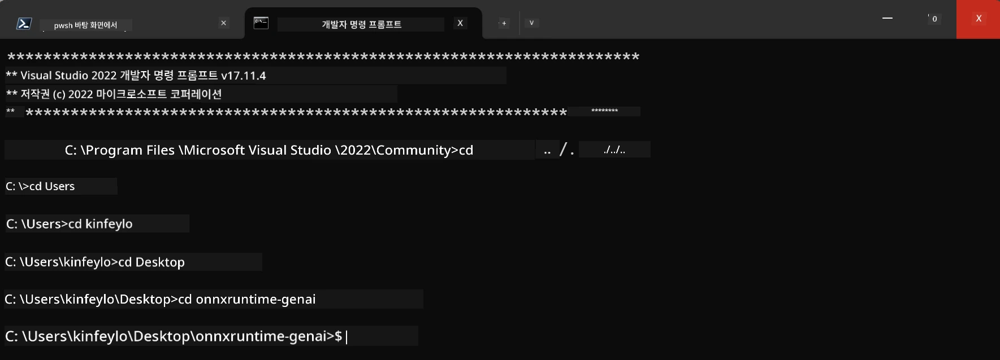

# **OnnxRuntime GenAI Windows GPU 가이드라인**

이 가이드라인은 Windows에서 GPU를 사용하여 ONNX Runtime(ORT)을 설정하고 사용하는 방법을 안내합니다. GPU 가속을 활용해 모델의 성능과 효율성을 높이는 데 도움을 주기 위해 작성되었습니다.

문서에서는 다음 내용을 다룹니다:

- 환경 설정: CUDA, cuDNN, ONNX Runtime 등 필요한 의존성 설치 방법
- 구성: GPU 자원을 효과적으로 활용하기 위한 환경 및 ONNX Runtime 설정 방법
- 최적화 팁: GPU 설정을 최적화하여 성능을 극대화하는 방법

### **1. Python 3.10.x /3.11.8**

   ***Note*** Python 환경으로 [miniforge](https://github.com/conda-forge/miniforge/releases/latest/download/Miniforge3-Windows-x86_64.exe) 사용을 권장합니다.

   ```bash

   conda create -n pydev python==3.11.8

   conda activate pydev

   ```

   ***Reminder*** Python ONNX 라이브러리를 설치한 적이 있다면 반드시 제거하세요.

### **2. winget으로 CMake 설치하기**

   ```bash

   winget install -e --id Kitware.CMake

   ```

### **3. Visual Studio 2022 - C++ 데스크톱 개발 설치**

   ***Note*** 컴파일하지 않을 경우 이 단계는 건너뛰어도 됩니다.



### **4. NVIDIA 드라이버 설치**

1. **NVIDIA GPU 드라이버**  [https://www.nvidia.com/en-us/drivers/](https://www.nvidia.com/en-us/drivers/)

2. **NVIDIA CUDA 12.4** [https://developer.nvidia.com/cuda-12-4-0-download-archive](https://developer.nvidia.com/cuda-12-4-0-download-archive)

3. **NVIDIA CUDNN 9.4**  [https://developer.nvidia.com/cudnn-downloads](https://developer.nvidia.com/cudnn-downloads)

***Reminder*** 설치 과정에서는 기본 설정을 사용하세요.

### **5. NVIDIA 환경 설정**

NVIDIA CUDNN 9.4의 lib, bin, include 폴더를 NVIDIA CUDA 12.4의 lib, bin, include 폴더에 복사합니다.

- *'C:\Program Files\NVIDIA\CUDNN\v9.4\bin\12.6'*의 파일들을 *'C:\Program Files\NVIDIA GPU Computing Toolkit\CUDA\v12.4\bin'*에 복사

- *'C:\Program Files\NVIDIA\CUDNN\v9.4\include\12.6'*의 파일들을 *'C:\Program Files\NVIDIA GPU Computing Toolkit\CUDA\v12.4\include'*에 복사

- *'C:\Program Files\NVIDIA\CUDNN\v9.4\lib\12.6'*의 파일들을 *'C:\Program Files\NVIDIA GPU Computing Toolkit\CUDA\v12.4\lib\x64'*에 복사

### **6. Phi-3.5-mini-instruct-onnx 다운로드**

   ```bash

   winget install -e --id Git.Git

   winget install -e --id GitHub.GitLFS

   git lfs install

   git clone https://huggingface.co/microsoft/Phi-3.5-mini-instruct-onnx

   ```

### **7. InferencePhi35Instruct.ipynb 실행하기**

   [노트북](../../../../../../code/09.UpdateSamples/Aug/ortgpu-phi35-instruct.ipynb)을 열고 실행하세요.



### **8. ORT GenAI GPU 컴파일**

   ***Note*** 
   
   1. 먼저 onnx, onnxruntime, onnxruntime-genai 관련 모든 패키지를 제거하세요.

   
   ```bash

   pip list 
   
   ```

   이후 모든 onnxruntime 라이브러리를 제거합니다.

   ```bash

   pip uninstall onnxruntime

   pip uninstall onnxruntime-genai

   pip uninstall onnxruntume-genai-cuda
   
   ```

   2. Visual Studio 확장 기능 지원 확인

   C:\Program Files\NVIDIA GPU Computing Toolkit\CUDA\v12.4\extras 경로에서 C:\Program Files\NVIDIA GPU Computing Toolkit\CUDA\v12.4\extras\visual_studio_integration 폴더가 있는지 확인하세요. 

   없으면 다른 CUDA 툴킷 드라이버 폴더에서 visual_studio_integration 폴더와 내용을 찾아 C:\Program Files\NVIDIA GPU Computing Toolkit\CUDA\v12.4\extras\visual_studio_integration 경로에 복사하세요.

   - 컴파일하지 않을 경우 이 단계는 건너뛰어도 됩니다.

   ```bash

   git clone https://github.com/microsoft/onnxruntime-genai

   ```

   - [https://github.com/microsoft/onnxruntime/releases/download/v1.19.2/onnxruntime-win-x64-gpu-1.19.2.zip](https://github.com/microsoft/onnxruntime/releases/download/v1.19.2/onnxruntime-win-x64-gpu-1.19.2.zip) 다운로드

   - onnxruntime-win-x64-gpu-1.19.2.zip 압축 해제 후 폴더 이름을 **ort**로 변경하고 onnxruntime-genai 폴더에 복사

   - Windows Terminal에서 VS 2022용 Developer Command Prompt를 열고 onnxruntime-genai 폴더로 이동



   - Python 환경에서 컴파일 실행

   
   ```bash

   cd onnxruntime-genai

   python build.py --use_cuda  --cuda_home "C:\Program Files\NVIDIA GPU Computing Toolkit\CUDA\v12.4" --config Release
 

   cd build/Windows/Release/Wheel

   pip install .whl

   ```

**면책 조항**:  
이 문서는 AI 번역 서비스 [Co-op Translator](https://github.com/Azure/co-op-translator)를 사용하여 번역되었습니다. 정확성을 위해 최선을 다하고 있으나, 자동 번역에는 오류나 부정확한 부분이 있을 수 있음을 유의해 주시기 바랍니다. 원문은 해당 언어의 원본 문서가 권위 있는 출처로 간주되어야 합니다. 중요한 정보의 경우 전문적인 인간 번역을 권장합니다. 본 번역 사용으로 인해 발생하는 오해나 잘못된 해석에 대해 당사는 책임을 지지 않습니다.