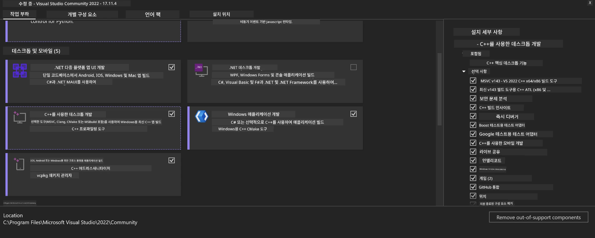
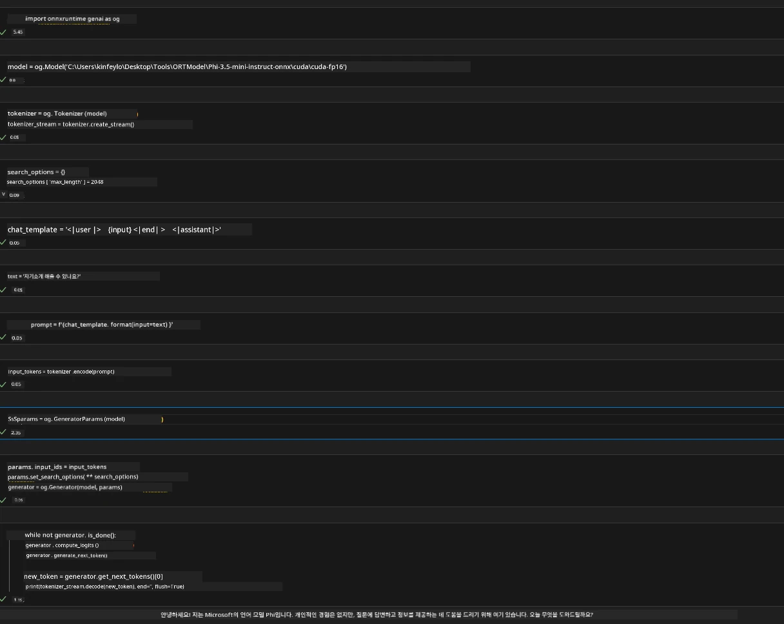
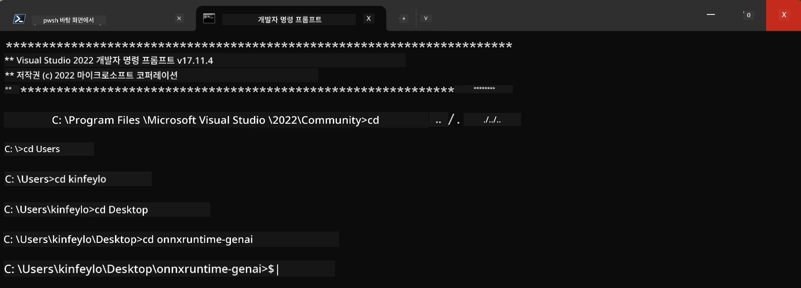

# **OnnxRuntime GenAI Windows GPU 가이드라인**

이 가이드라인은 Windows에서 GPU를 사용하여 ONNX Runtime(ORT)을 설정하고 사용하는 단계들을 제공합니다. 모델의 GPU 가속을 활용하여 성능과 효율성을 향상시키는 데 도움을 주기 위해 설계되었습니다.

문서에서는 다음에 대한 안내를 제공합니다:

- 환경 설정: CUDA, cuDNN, ONNX Runtime 등 필요한 종속성 설치 지침.
- 구성: GPU 자원을 효과적으로 활용할 수 있도록 환경과 ONNX Runtime을 구성하는 방법.
- 최적화 팁: 최적의 성능을 위한 GPU 설정 조정에 관한 조언.

### **1. Python 3.10.x /3.11.8**

   <strong><em>참고</em></strong> Python 환경으로 [miniforge](https://github.com/conda-forge/miniforge/releases/latest/download/Miniforge3-Windows-x86_64.exe) 사용을 권장합니다

   ```bash

   conda create -n pydev python==3.11.8

   conda activate pydev

   ```

   <strong><em>알림</em></strong> Python ONNX 라이브러리를 설치한 경우 반드시 제거하세요

### **2. winget을 이용한 CMake 설치**


   ```bash

   winget install -e --id Kitware.CMake

   ```

### **3. Visual Studio 2022 - C++ 데스크톱 개발 설치**

   <strong><em>참고</em></strong> 컴파일하지 않을 경우 이 단계는 건너뛸 수 있습니다




### **4. NVIDIA 드라이버 설치**

1. **NVIDIA GPU 드라이버**  [https://www.nvidia.com/en-us/drivers/](https://www.nvidia.com/en-us/drivers/)

2. **NVIDIA CUDA 12.4** [https://developer.nvidia.com/cuda-12-4-0-download-archive](https://developer.nvidia.com/cuda-12-4-0-download-archive)

3. **NVIDIA CUDNN 9.4**  [https://developer.nvidia.com/cudnn-downloads](https://developer.nvidia.com/cudnn-downloads)

<strong><em>알림</em></strong> 설치 과정에서는 기본 설정을 사용하세요

### **5. NVIDIA 환경 설정**

NVIDIA CUDNN 9.4 의 lib, bin, include 폴더를 NVIDIA CUDA 12.4의 lib, bin, include 폴더에 복사하세요

- *'C:\Program Files\NVIDIA\CUDNN\v9.4\bin\12.6'* 파일들을 *'C:\Program Files\NVIDIA GPU Computing Toolkit\CUDA\v12.4\bin'* 로 복사

- *'C:\Program Files\NVIDIA\CUDNN\v9.4\include\12.6'* 파일들을 *'C:\Program Files\NVIDIA GPU Computing Toolkit\CUDA\v12.4\include'* 로 복사

- *'C:\Program Files\NVIDIA\CUDNN\v9.4\lib\12.6'* 파일들을 *'C:\Program Files\NVIDIA GPU Computing Toolkit\CUDA\v12.4\lib\x64'* 로 복사


### **6. Phi-3.5-mini-instruct-onnx 다운로드**


   ```bash

   winget install -e --id Git.Git

   winget install -e --id GitHub.GitLFS

   git lfs install

   git clone https://huggingface.co/microsoft/Phi-3.5-mini-instruct-onnx

   ```

### **7. InferencePhi35Instruct.ipynb 실행**

   [노트북](../../../../code/09.UpdateSamples/Aug/ortgpu-phi35-instruct.ipynb) 열고 실행하세요





### **8. ORT GenAI GPU 컴파일**


   <strong><em>참고</em></strong> 
   
   1. onnx, onnxruntime, onnxruntime-genai 관련 모든 패키지를 우선 제거하세요

   
   ```bash

   pip list 
   
   ```

   그리고 모든 onnxruntime 라이브러리를 제거하세요 예를 들면


   ```bash

   pip uninstall onnxruntime

   pip uninstall onnxruntime-genai

   pip uninstall onnxruntume-genai-cuda
   
   ```

   2. Visual Studio 확장 지원 확인

   C:\Program Files\NVIDIA GPU Computing Toolkit\CUDA\v12.4\extras 경로에서 C:\Program Files\NVIDIA GPU Computing Toolkit\CUDA\v12.4\extras\visual_studio_integration 폴더가 있는지 확인하세요.
   
   없다면 다른 CUDA 툴킷 드라이버 폴더를 확인해 visual_studio_integration 폴더와 내용을 C:\Program Files\NVIDIA GPU Computing Toolkit\CUDA\v12.4\extras\visual_studio_integration 으로 복사하세요


   - 컴파일하지 않을 경우 이 단계는 건너뛸 수 있습니다


   ```bash

   git clone https://github.com/microsoft/onnxruntime-genai

   ```

   - [https://github.com/microsoft/onnxruntime/releases/download/v1.19.2/onnxruntime-win-x64-gpu-1.19.2.zip](https://github.com/microsoft/onnxruntime/releases/download/v1.19.2/onnxruntime-win-x64-gpu-1.19.2.zip) 에서 다운로드

   - onnxruntime-win-x64-gpu-1.19.2.zip 압축 해제 후 **ort** 로 폴더 이름 변경, 그 후 onnxruntime-genai 폴더에 복사

   - Windows 터미널을 사용하여 VS 2022용 Developer Command Prompt 로 이동 후 onnxruntime-genai 폴더로 이동하세요



   - Python 환경에서 컴파일하세요

   
   ```bash

   cd onnxruntime-genai

   python build.py --use_cuda  --cuda_home "C:\Program Files\NVIDIA GPU Computing Toolkit\CUDA\v12.4" --config Release
 

   cd build/Windows/Release/Wheel

   pip install .whl

   ```

---

<!-- CO-OP TRANSLATOR DISCLAIMER START -->
**면책 조항**:
이 문서는 AI 번역 서비스 [Co-op Translator](https://github.com/Azure/co-op-translator)를 사용하여 번역되었습니다. 정확성을 기하기 위해 노력하고 있으나, 자동 번역은 오류나 부정확한 부분이 있을 수 있음을 유의하시기 바랍니다. 원본 문서의 원어본이 권위 있는 자료로 간주되어야 합니다. 중요한 정보의 경우, 전문가의 인간 번역을 권장합니다. 이 번역 사용으로 인해 발생하는 오해나 잘못된 해석에 대해 당사는 책임을 지지 않습니다.
<!-- CO-OP TRANSLATOR DISCLAIMER END -->