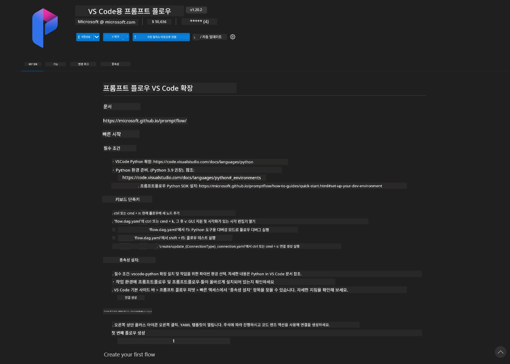
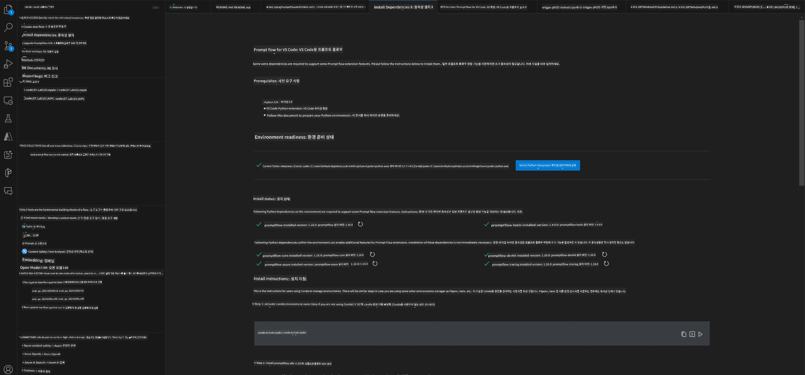
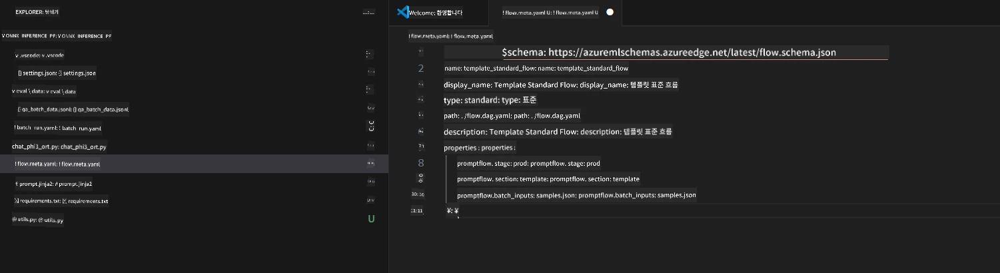
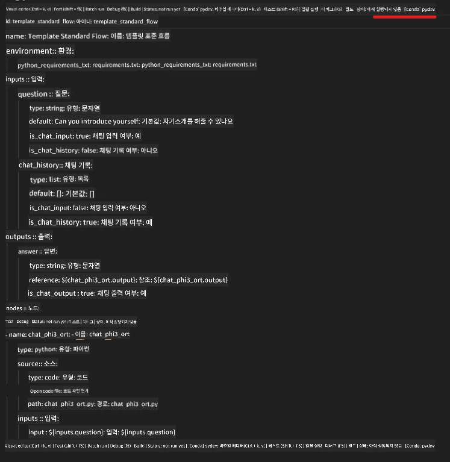
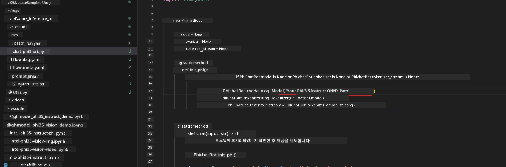
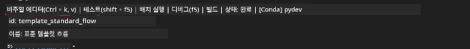
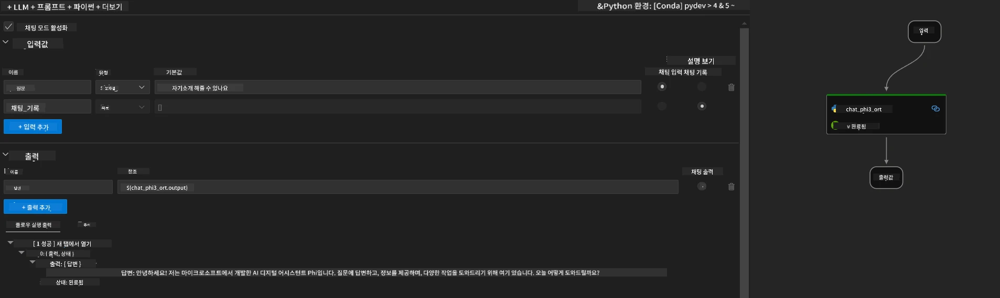

<!--
CO_OP_TRANSLATOR_METADATA:
{
  "original_hash": "92e7dac1e5af0dd7c94170fdaf6860fe",
  "translation_date": "2025-07-17T02:58:29+00:00",
  "source_file": "md/02.Application/01.TextAndChat/Phi3/UsingPromptFlowWithONNX.md",
  "language_code": "ko"
}
-->
# Windows GPU를 사용하여 Phi-3.5-Instruct ONNX로 Prompt flow 솔루션 만들기

다음 문서는 Phi-3 모델을 기반으로 한 AI 애플리케이션 개발을 위해 ONNX(Open Neural Network Exchange)와 함께 PromptFlow를 사용하는 방법에 대한 예시입니다.

PromptFlow는 아이디어 구상, 프로토타이핑부터 테스트 및 평가에 이르기까지 LLM 기반(대형 언어 모델) AI 애플리케이션의 전체 개발 주기를 간소화하기 위해 설계된 개발 도구 모음입니다.

PromptFlow와 ONNX를 통합함으로써 개발자는 다음을 할 수 있습니다:

- 모델 성능 최적화: ONNX를 활용하여 효율적인 모델 추론 및 배포를 지원합니다.
- 개발 간소화: PromptFlow를 사용해 워크플로우를 관리하고 반복 작업을 자동화합니다.
- 협업 강화: 통합 개발 환경을 제공하여 팀원 간의 협업을 원활하게 합니다.

**Prompt flow**는 아이디어 구상, 프로토타이핑, 테스트, 평가부터 프로덕션 배포 및 모니터링까지 LLM 기반 AI 애플리케이션의 전체 개발 주기를 간소화하는 개발 도구 모음입니다. 프롬프트 엔지니어링을 훨씬 쉽게 만들어주며, 프로덕션 품질의 LLM 앱을 구축할 수 있게 해줍니다.

Prompt flow는 OpenAI, Azure OpenAI Service, 그리고 커스터마이징 가능한 모델(Huggingface, 로컬 LLM/SLM)과 연결할 수 있습니다. Phi-3.5의 양자화된 ONNX 모델을 로컬 애플리케이션에 배포하는 것을 목표로 합니다. Prompt flow는 비즈니스 계획을 더 잘 세우고 Phi-3.5 기반의 로컬 솔루션을 완성하는 데 도움을 줄 수 있습니다. 이 예제에서는 ONNX Runtime GenAI 라이브러리를 결합하여 Windows GPU 기반의 Prompt flow 솔루션을 완성할 것입니다.

## **설치**

### **Windows GPU용 ONNX Runtime GenAI**

Windows GPU용 ONNX Runtime GenAI 설정 가이드를 읽으려면 [여기 클릭](./ORTWindowGPUGuideline.md)

### **VSCode에서 Prompt flow 설정하기**

1. Prompt flow VS Code 확장 프로그램 설치



2. Prompt flow VS Code 확장 프로그램 설치 후, 확장 프로그램을 클릭하고 **Installation dependencies**를 선택하여 이 가이드에 따라 환경에 Prompt flow SDK를 설치하세요.



3. [샘플 코드](../../../../../../code/09.UpdateSamples/Aug/pf/onnx_inference_pf)를 다운로드하고 VS Code로 열기



4. **flow.dag.yaml**을 열어 Python 환경을 선택하세요.



   **chat_phi3_ort.py**를 열어 Phi-3.5-instruct ONNX 모델 위치를 변경하세요.



5. 프롬프트 플로우를 실행하여 테스트하기

**flow.dag.yaml**을 열고 시각적 편집기를 클릭하세요.



클릭 후 실행하여 테스트합니다.



1. 터미널에서 배치 실행하여 더 많은 결과를 확인할 수 있습니다.


```bash

pf run create --file batch_run.yaml --stream --name 'Your eval qa name'    

```

기본 브라우저에서 결과를 확인할 수 있습니다.


**면책 조항**:  
이 문서는 AI 번역 서비스 [Co-op Translator](https://github.com/Azure/co-op-translator)를 사용하여 번역되었습니다. 정확성을 위해 노력하고 있으나, 자동 번역에는 오류나 부정확한 부분이 있을 수 있음을 유의하시기 바랍니다. 원문은 해당 언어의 원본 문서가 권위 있는 출처로 간주되어야 합니다. 중요한 정보의 경우 전문적인 인간 번역을 권장합니다. 본 번역 사용으로 인해 발생하는 오해나 잘못된 해석에 대해 당사는 책임을 지지 않습니다.