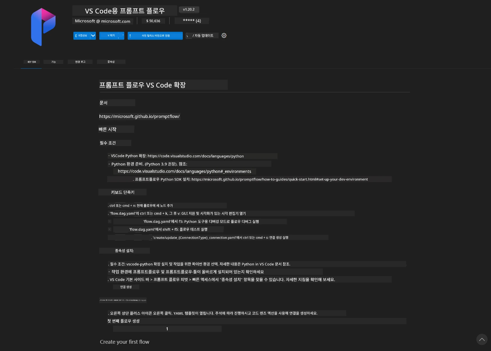
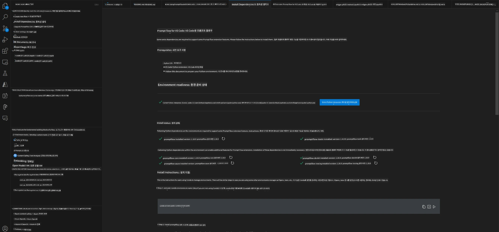
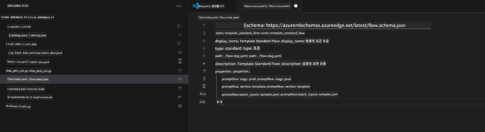
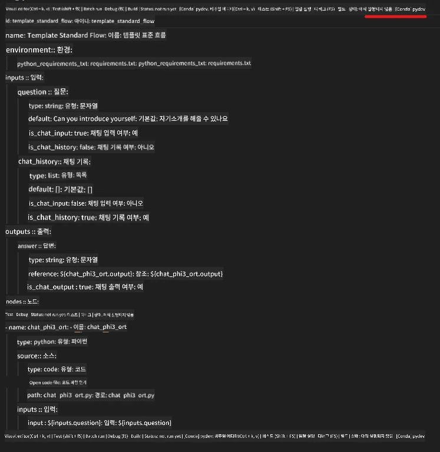
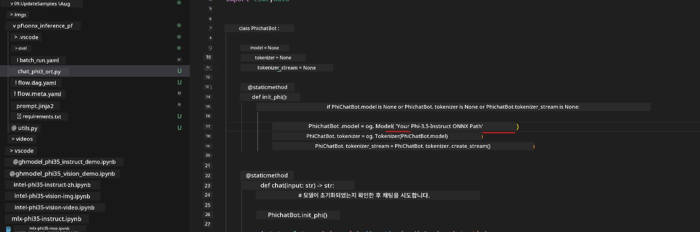
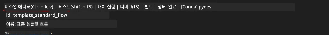
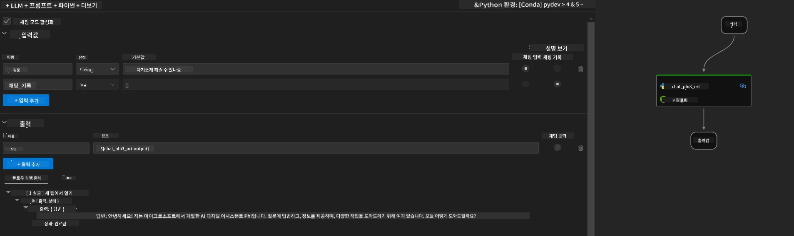
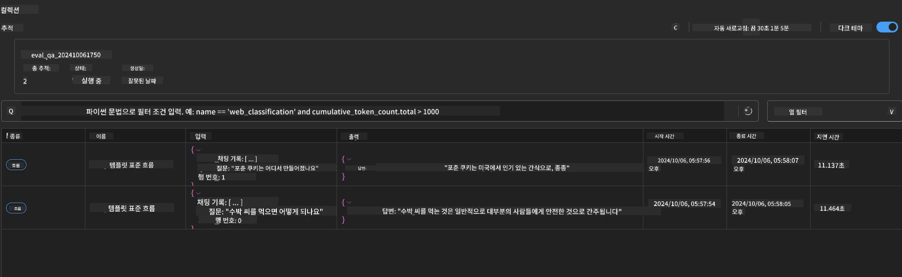

# Phi-3.5-Instruct ONNX로 Windows GPU를 사용하여 Prompt flow 솔루션 만들기

다음 문서는 Phi-3 모델을 기반으로 AI 애플리케이션을 개발하기 위해 ONNX(Open Neural Network Exchange)와 함께 PromptFlow를 사용하는 예시입니다.

PromptFlow는 아이디어 구상, 프로토타이핑부터 테스트 및 평가까지 LLM(대형 언어 모델) 기반 AI 애플리케이션의 엔드투엔드 개발 주기를 간소화하도록 설계된 개발 도구 모음입니다.

PromptFlow를 ONNX와 통합함으로써 개발자는:

- 모델 성능 최적화: ONNX를 활용하여 효율적인 모델 추론 및 배포를 할 수 있습니다.
- 개발 단순화: PromptFlow를 사용하여 워크플로우를 관리하고 반복 작업을 자동화할 수 있습니다.
- 협업 강화: 통합 개발 환경을 제공하여 팀원 간 협업을 원활하게 할 수 있습니다.

<strong>Prompt flow</strong>는 LLM 기반 AI 애플리케이션의 아이디어 구상, 프로토타이핑, 테스트, 평가, 프로덕션 배포 및 모니터링까지 엔드투엔드 개발 주기를 간소화하도록 설계된 개발 도구 모음입니다. 프롬프트 엔지니어링을 훨씬 쉽게 하며, 프로덕션 품질의 LLM 애플리케이션을 구축할 수 있게 합니다.

Prompt flow는 OpenAI, Azure OpenAI Service 및 맞춤형 모델(Huggingface, 로컬 LLM/SLM)과 연결할 수 있습니다. 우리는 Phi-3.5의 양자화된 ONNX 모델을 로컬 애플리케이션에 배포하려 합니다. Prompt flow는 비즈니스 계획을 더 잘 수립하고 Phi-3.5를 기반으로 한 로컬 솔루션을 완성하는 데 도움이 됩니다. 이 예제에서는 ONNX Runtime GenAI 라이브러리를 결합하여 Windows GPU 기반 Prompt flow 솔루션을 완성합니다.

## <strong>설치</strong>

### **Windows GPU용 ONNX Runtime GenAI**

Windows GPU용 ONNX Runtime GenAI 설정 지침을 읽으려면 [여기 클릭](./ORTWindowGPUGuideline.md)

### **VSCode에서 Prompt flow 설정**

1. Prompt flow VS Code 확장 프로그램 설치



2. Prompt flow VS Code 확장 프로그램 설치 후 확장 프로그램을 클릭하고 <strong>설치 종속성</strong>을 선택하여 이 지침에 따라 환경에 Prompt flow SDK를 설치하세요.



3. [샘플 코드](../../../../../../code/09.UpdateSamples/Aug/pf/onnx_inference_pf)를 다운로드하고 VS Code로 이 샘플을 엽니다.



4. <strong>flow.dag.yaml</strong>을 열어 Python 환경을 선택합니다.



   <strong>chat_phi3_ort.py</strong>를 열어 Phi-3.5-Instruct ONNX 모델 위치를 변경하세요.



5. 프롬프트 플로우를 실행해 테스트합니다.

<strong>flow.dag.yaml</strong>을 열고 시각적 편집기를 클릭하세요.



이 버튼을 클릭한 후 실행하여 테스트합니다.



1. 터미널에서 배치 실행하여 더 많은 결과를 확인할 수 있습니다.


```bash

pf run create --file batch_run.yaml --stream --name 'Your eval qa name'    

```

기본 브라우저에서 결과를 확인할 수 있습니다.




---

<!-- CO-OP TRANSLATOR DISCLAIMER START -->
**면책 조항**:
이 문서는 AI 번역 서비스 [Co-op Translator](https://github.com/Azure/co-op-translator)를 사용하여 번역되었습니다. 정확성을 기하기 위해 노력하고 있으나, 자동 번역은 오류나 부정확한 부분이 있을 수 있음을 유의하시기 바랍니다. 원본 문서의 원어본이 권위 있는 자료로 간주되어야 합니다. 중요한 정보의 경우, 전문가의 인간 번역을 권장합니다. 이 번역 사용으로 인해 발생하는 오해나 잘못된 해석에 대해 당사는 책임을 지지 않습니다.
<!-- CO-OP TRANSLATOR DISCLAIMER END -->