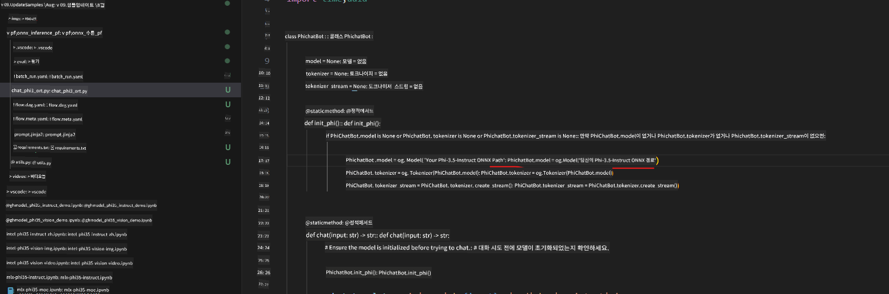
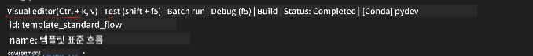

<!--
CO_OP_TRANSLATOR_METADATA:
{
  "original_hash": "92e7dac1e5af0dd7c94170fdaf6860fe",
  "translation_date": "2025-05-08T05:36:55+00:00",
  "source_file": "md/02.Application/01.TextAndChat/Phi3/UsingPromptFlowWithONNX.md",
  "language_code": "ko"
}
-->
# Phi-3.5-Instruct ONNX를 사용한 Windows GPU 기반 Prompt flow 솔루션 만들기

다음 문서는 Phi-3 모델을 기반으로 한 AI 애플리케이션 개발을 위해 ONNX(Open Neural Network Exchange)와 함께 PromptFlow를 사용하는 예시입니다.

PromptFlow는 아이디어 구상, 프로토타이핑, 테스트, 평가에 이르기까지 LLM(대형 언어 모델) 기반 AI 애플리케이션의 전체 개발 주기를 간소화하도록 설계된 개발 도구 모음입니다.

PromptFlow와 ONNX를 통합함으로써 개발자는 다음을 할 수 있습니다:

- 모델 성능 최적화: ONNX를 활용하여 효율적인 모델 추론 및 배포를 지원합니다.
- 개발 간소화: PromptFlow를 사용해 워크플로우를 관리하고 반복 작업을 자동화합니다.
- 협업 강화: 통합된 개발 환경을 제공해 팀원 간 협업을 촉진합니다.

**Prompt flow**는 아이디어 구상, 프로토타이핑, 테스트, 평가부터 프로덕션 배포 및 모니터링까지 LLM 기반 AI 애플리케이션의 전체 개발 주기를 간소화하는 개발 도구 모음입니다. 프롬프트 엔지니어링을 훨씬 쉽게 만들고, 프로덕션 품질의 LLM 앱을 구축할 수 있게 해줍니다.

Prompt flow는 OpenAI, Azure OpenAI 서비스, 그리고 사용자 정의 모델(Huggingface, 로컬 LLM/SLM)과 연결할 수 있습니다. Phi-3.5의 양자화된 ONNX 모델을 로컬 애플리케이션에 배포하는 것을 목표로 합니다. Prompt flow는 비즈니스 계획 수립과 Phi-3.5 기반 로컬 솔루션 완성에 도움을 줄 수 있습니다. 이 예제에서는 ONNX Runtime GenAI 라이브러리를 결합해 Windows GPU 기반의 Prompt flow 솔루션을 완성합니다.

## **설치**

### **Windows GPU용 ONNX Runtime GenAI**

Windows GPU용 ONNX Runtime GenAI 설정 방법은 [여기](./ORTWindowGPUGuideline.md)를 참고하세요.

### **VSCode에서 Prompt flow 설정**

1. Prompt flow VS Code 확장 프로그램 설치


2. Prompt flow VS Code 확장 프로그램 설치 후, 확장 프로그램을 클릭하고 **Installation dependencies**를 선택해 이 가이드에 따라 환경에 Prompt flow SDK를 설치하세요.


3. [샘플 코드](../../../../../../code/09.UpdateSamples/Aug/pf/onnx_inference_pf)를 다운로드하고 VS Code로 샘플을 엽니다.


4. **flow.dag.yaml** 파일을 열어 사용할 Python 환경을 선택하세요.


   **chat_phi3_ort.py** 파일을 열어 Phi-3.5-instruct ONNX 모델 위치를 변경하세요.



5. Prompt flow를 실행해 테스트합니다.

**flow.dag.yaml**을 열고 비주얼 에디터를 클릭하세요.



클릭 후 실행하여 테스트합니다.


1. 터미널에서 배치 실행하여 더 많은 결과를 확인할 수 있습니다.

```bash

pf run create --file batch_run.yaml --stream --name 'Your eval qa name'    

```

기본 브라우저에서 결과를 확인할 수 있습니다.


**면책 조항**:  
이 문서는 AI 번역 서비스 [Co-op Translator](https://github.com/Azure/co-op-translator)를 사용하여 번역되었습니다. 정확성을 위해 노력하고 있으나, 자동 번역에는 오류나 부정확성이 포함될 수 있음을 유의하시기 바랍니다. 원본 문서는 해당 언어로 작성된 원문이 권위 있는 자료로 간주되어야 합니다. 중요한 정보의 경우, 전문적인 인간 번역을 권장합니다. 이 번역의 사용으로 인한 오해나 잘못된 해석에 대해 당사는 책임을 지지 않습니다.