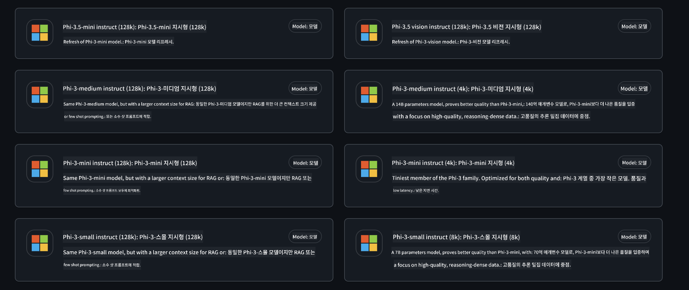
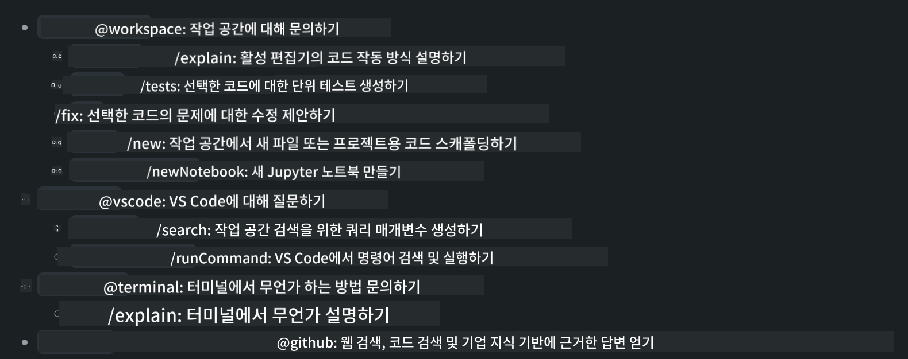
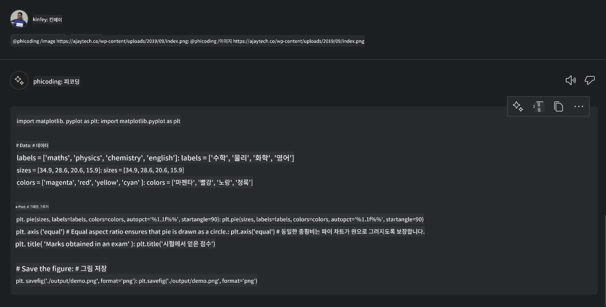

<!--
CO_OP_TRANSLATOR_METADATA:
{
  "original_hash": "35bf81388ac6917277b8d9a0c39bdc70",
  "translation_date": "2025-07-17T03:23:19+00:00",
  "source_file": "md/02.Application/02.Code/Phi3/CreateVSCodeChatAgentWithGitHubModels.md",
  "language_code": "ko"
}
-->
# **GitHub Models의 Phi-3.5로 나만의 Visual Studio Code Chat Copilot 에이전트 만들기**

Visual Studio Code Copilot을 사용하고 계신가요? 특히 Chat에서는 다양한 에이전트를 활용해 Visual Studio Code에서 프로젝트를 생성, 작성, 유지보수하는 능력을 향상시킬 수 있습니다. Visual Studio Code는 기업과 개인이 각자의 비즈니스에 맞는 다양한 에이전트를 만들어 특정 분야에서 기능을 확장할 수 있도록 API를 제공합니다. 이 글에서는 GitHub Models의 **Phi-3.5-mini-instruct (128k)**와 **Phi-3.5-vision-instruct (128k)**를 중심으로 나만의 Visual Studio Code 에이전트를 만드는 방법을 다룹니다.

## **GitHub Models의 Phi-3.5 소개**

Phi-3/3.5 Family의 Phi-3/3.5-mini-instruct는 강력한 코드 이해 및 생성 능력을 갖추고 있으며, Gemma-2-9b와 Mistral-Nemo-12B-instruct-2407보다 우위에 있습니다.


최신 GitHub Models는 이미 Phi-3.5-mini-instruct (128k)와 Phi-3.5-vision-instruct (128k) 모델에 접근할 수 있도록 지원합니다. 개발자는 OpenAI SDK, Azure AI Inference SDK, REST API를 통해 이 모델들을 사용할 수 있습니다.



***Note: *** 운영 환경에서 Azure Model Catalog와 원활하게 전환할 수 있기 때문에 Azure AI Inference SDK 사용을 권장합니다.

아래는 GitHub Models와 연동한 후 코드 생성 시나리오에서의 **Phi-3.5-mini-instruct (128k)**와 **Phi-3.5-vision-instruct (128k)** 결과이며, 이후 예제 준비를 위한 내용입니다.

**데모: GitHub Models Phi-3.5-mini-instruct (128k)로 프롬프트에서 코드 생성하기** ([여기 클릭](../../../../../../code/09.UpdateSamples/Aug/ghmodel_phi35_instruct_demo.ipynb))

**데모: GitHub Models Phi-3.5-vision-instruct (128k)로 이미지에서 코드 생성하기** ([여기 클릭](../../../../../../code/09.UpdateSamples/Aug/ghmodel_phi35_vision_demo.ipynb))


## **GitHub Copilot Chat 에이전트 소개**

GitHub Copilot Chat 에이전트는 코드 기반으로 다양한 프로젝트 시나리오에서 여러 작업을 수행할 수 있습니다. 시스템에는 workspace, github, terminal, vscode 총 네 가지 에이전트가 있습니다.



에이전트 이름 앞에 ‘@’를 붙여 호출하면 해당 작업을 빠르게 수행할 수 있습니다. 기업의 경우 요구사항, 코딩, 테스트 명세, 릴리스 등 비즈니스 관련 내용을 추가하면 GitHub Copilot 기반의 더욱 강력한 기업 전용 기능을 활용할 수 있습니다.

Visual Studio Code Chat 에이전트는 이제 공식 API를 공개하여, 기업이나 기업 개발자가 다양한 소프트웨어 비즈니스 생태계에 맞춰 에이전트를 개발할 수 있게 되었습니다. Visual Studio Code Extension 개발 방식을 기반으로 Visual Studio Code Chat 에이전트 API 인터페이스에 쉽게 접근할 수 있습니다. 이 과정을 통해 개발할 수 있습니다.


개발 시나리오는 GitHub Models, Azure Model Catalog, 오픈소스 모델 기반 자체 구축 서비스 등 서드파티 모델 API 접근을 지원하며, GitHub Copilot이 제공하는 gpt-35-turbo, gpt-4, gpt-4o 모델도 사용할 수 있습니다.

## **Phi-3.5 기반 @phicoding 에이전트 추가하기**

Phi-3.5의 프로그래밍 능력을 통합해 코드 작성, 이미지 생성 코드 등 다양한 작업을 수행하는 에이전트 @PHI를 완성해 봅니다. 주요 기능은 다음과 같습니다.

1. **@phicoding /help** 명령어를 통해 GitHub Copilot이 제공하는 GPT-4o 기반 자기소개 생성

2. **@phicoding /gen** 명령어로 **Phi-3.5-mini-instruct (128k)** 기반 다양한 프로그래밍 언어 코드 생성

3. **@phicoding /image** 명령어로 **Phi-3.5-vision-instruct (128k)** 기반 이미지 분석 및 코드 생성


## **관련 단계**

1. npm을 사용해 Visual Studio Code Extension 개발 지원 설치

```bash

npm install --global yo generator-code 

```

2. Visual Studio Code Extension 플러그인 생성 (Typescript 개발 모드, 이름은 phiext)

```bash

yo code 

```

3. 생성한 프로젝트를 열고 package.json 수정. 관련 지침과 설정, GitHub Models 설정 포함. GitHub Models 토큰을 반드시 추가해야 합니다.

```json

{
  "name": "phiext",
  "displayName": "phiext",
  "description": "",
  "version": "0.0.1",
  "engines": {
    "vscode": "^1.93.0"
  },
  "categories": [
    "AI",
    "Chat"
  ],
  "activationEvents": [],
  "enabledApiProposals": [
      "chatVariableResolver"
  ],
  "main": "./dist/extension.js",
  "contributes": {
    "chatParticipants": [
        {
            "id": "chat.phicoding",
            "name": "phicoding",
            "description": "Hey! I am Microsoft Phi-3.5, She can help me with coding problems, such as generation code with your natural language, or even generation code about chart from images. Just ask me anything!",
            "isSticky": true,
            "commands": [
                {
                    "name": "help",
                    "description": "Introduce myself to you"
                },
                {
                    "name": "gen",
                    "description": "Generate code for you with Microsoft Phi-3.5-mini-instruct"
                },
                {
                    "name": "image",
                    "description": "Generate code for chart from image(png or jpg) with Microsoft Phi-3.5-vision-instruct, please add image url like this : https://ajaytech.co/wp-content/uploads/2019/09/index.png"
                }
            ]
        }
    ],
    "commands": [
        {
            "command": "phicoding.namesInEditor",
            "title": "Use Microsoft Phi 3.5 in Editor"
        }
    ],
    "configuration": {
      "type": "object",
      "title": "githubmodels",
      "properties": {
        "githubmodels.endpoint": {
          "type": "string",
          "default": "https://models.inference.ai.azure.com",
          "description": "Your GitHub Models Endpoint",
          "order": 0
        },
        "githubmodels.api_key": {
          "type": "string",
          "default": "Your GitHub Models Token",
          "description": "Your GitHub Models Token",
          "order": 1
        },
        "githubmodels.phi35instruct": {
          "type": "string",
          "default": "Phi-3.5-mini-instruct",
          "description": "Your Phi-35-Instruct Model",
          "order": 2
        },
        "githubmodels.phi35vision": {
          "type": "string",
          "default": "Phi-3.5-vision-instruct",
          "description": "Your Phi-35-Vision Model",
          "order": 3
        }
      }
    }
  },
  "scripts": {
    "vscode:prepublish": "npm run package",
    "compile": "webpack",
    "watch": "webpack --watch",
    "package": "webpack --mode production --devtool hidden-source-map",
    "compile-tests": "tsc -p . --outDir out",
    "watch-tests": "tsc -p . -w --outDir out",
    "pretest": "npm run compile-tests && npm run compile && npm run lint",
    "lint": "eslint src",
    "test": "vscode-test"
  },
  "devDependencies": {
    "@types/vscode": "^1.93.0",
    "@types/mocha": "^10.0.7",
    "@types/node": "20.x",
    "@typescript-eslint/eslint-plugin": "^8.3.0",
    "@typescript-eslint/parser": "^8.3.0",
    "eslint": "^9.9.1",
    "typescript": "^5.5.4",
    "ts-loader": "^9.5.1",
    "webpack": "^5.94.0",
    "webpack-cli": "^5.1.4",
    "@vscode/test-cli": "^0.0.10",
    "@vscode/test-electron": "^2.4.1"
  },
  "dependencies": {
    "@types/node-fetch": "^2.6.11",
    "node-fetch": "^3.3.2",
    "@azure-rest/ai-inference": "latest",
    "@azure/core-auth": "latest",
    "@azure/core-sse": "latest"
  }
}


```

4. src/extension.ts 수정

```typescript

// The module 'vscode' contains the VS Code extensibility API
// Import the module and reference it with the alias vscode in your code below
import * as vscode from 'vscode';
import ModelClient from "@azure-rest/ai-inference";
import { AzureKeyCredential } from "@azure/core-auth";


interface IPhiChatResult extends vscode.ChatResult {
    metadata: {
        command: string;
    };
}


const MODEL_SELECTOR: vscode.LanguageModelChatSelector = { vendor: 'copilot', family: 'gpt-4o' };

function isValidImageUrl(url: string): boolean {
    const regex = /^(https?:\/\/.*\.(?:png|jpg))$/i;
    return regex.test(url);
}
  

// This method is called when your extension is activated
// Your extension is activated the very first time the command is executed
export function activate(context: vscode.ExtensionContext) {

    const codinghandler: vscode.ChatRequestHandler = async (request: vscode.ChatRequest, context: vscode.ChatContext, stream: vscode.ChatResponseStream, token: vscode.CancellationToken): Promise<IPhiChatResult> => {


        const config : any = vscode.workspace.getConfiguration('githubmodels');
        const endPoint: string = config.get('endpoint');
        const apiKey: string = config.get('api_key');
        const phi35instruct: string = config.get('phi35instruct');
        const phi35vision: string = config.get('phi35vision');
        
        if (request.command === 'help') {

            const content = "Welcome to Coding assistant with Microsoft Phi-3.5"; 
            stream.progress(content);


            try {
                const [model] = await vscode.lm.selectChatModels(MODEL_SELECTOR);
                if (model) {
                    const messages = [
                        vscode.LanguageModelChatMessage.User("Please help me express this content in a humorous way: I am a programming assistant who can help you convert natural language into code and generate code based on the charts in the images. output format like this : Hey I am Phi ......")
                    ];
                    const chatResponse = await model.sendRequest(messages, {}, token);
                    for await (const fragment of chatResponse.text) {
                        stream.markdown(fragment);
                    }
                }
            } catch(err) {
                console.log(err);
            }


            return { metadata: { command: 'help' } };

        }

        
        if (request.command === 'gen') {

            const content = "Welcome to use phi-3.5 to generate code";

            stream.progress(content);

            const client = new ModelClient(endPoint, new AzureKeyCredential(apiKey));

            const response = await client.path("/chat/completions").post({
              body: {
                messages: [
                  { role:"system", content: "You are a coding assistant.Help answer all code generation questions." },
                  { role:"user", content: request.prompt }
                ],
                model: phi35instruct,
                temperature: 0.4,
                max_tokens: 1000,
                top_p: 1.
              }
            });

            stream.markdown(response.body.choices[0].message.content);

            return { metadata: { command: 'gen' } };

        }


        
        if (request.command === 'image') {


            const content = "Welcome to use phi-3.5 to generate code from image(png or jpg),image url like this:https://ajaytech.co/wp-content/uploads/2019/09/index.png";

            stream.progress(content);

            if (!isValidImageUrl(request.prompt)) {
                stream.markdown('Please provide a valid image URL');
                return { metadata: { command: 'image' } };
            }
            else
            {

                const client = new ModelClient(endPoint, new AzureKeyCredential(apiKey));
    
                const response = await client.path("/chat/completions").post({
                    body: {
                      messages: [
                        { role: "system", content: "You are a helpful assistant that describes images in details." },
                        { role: "user", content: [
                            { type: "text", text: "Please generate code according to the chart in the picture according to the following requirements\n1. Keep all information in the chart, including data and text\n2. Do not generate additional information that is not included in the chart\n3. Please extract data from the picture, do not generate it from csv\n4. Please save the regenerated chart as a chart and save it to ./output/demo.png"},
                            { type: "image_url", image_url: {url: request.prompt}
                            }
                          ]
                        }
                      ],
                      model: phi35vision,
                      temperature: 0.4,
                      max_tokens: 2048,
                      top_p: 1.
                    }
                  });
    
                
                stream.markdown(response.body.choices[0].message.content);
    
                return { metadata: { command: 'image' } };
            }


        }


        return { metadata: { command: '' } };
    };


    const phi_ext = vscode.chat.createChatParticipant("chat.phicoding", codinghandler);

    phi_ext.iconPath = new vscode.ThemeIcon('sparkle');


    phi_ext.followupProvider = {
        provideFollowups(result: IPhiChatResult, context: vscode.ChatContext, token: vscode.CancellationToken) {
            return [{
                prompt: 'Let us coding with Phi-3.5 😋😋😋😋',
                label: vscode.l10n.t('Enjoy coding with Phi-3.5'),
                command: 'help'
            } satisfies vscode.ChatFollowup];
        }
    };

    context.subscriptions.push(phi_ext);
}

// This method is called when your extension is deactivated
export function deactivate() {}


```

6. 실행

***/help***


***@phicoding /help***


***@phicoding /gen***


***@phicoding /image***



샘플 코드는 여기서 다운로드할 수 있습니다 :[클릭](../../../../../../code/09.UpdateSamples/Aug/vscode)

## **참고 자료**

1. GitHub Models 가입 [https://gh.io/models](https://gh.io/models)

2. Visual Studio Code Extension 개발 배우기 [https://code.visualstudio.com/api/get-started/your-first-extension](https://code.visualstudio.com/api/get-started/your-first-extension)

3. Visual Studio Code Copilot Chat API 알아보기 [https://code.visualstudio.com/api/extension-guides/chat](https://code.visualstudio.com/api/extension-guides/chat)

**면책 조항**:  
이 문서는 AI 번역 서비스 [Co-op Translator](https://github.com/Azure/co-op-translator)를 사용하여 번역되었습니다. 정확성을 위해 최선을 다하고 있으나, 자동 번역에는 오류나 부정확한 부분이 있을 수 있음을 유의해 주시기 바랍니다. 원문은 해당 언어의 원본 문서가 권위 있는 출처로 간주되어야 합니다. 중요한 정보의 경우 전문적인 인간 번역을 권장합니다. 본 번역의 사용으로 인해 발생하는 오해나 잘못된 해석에 대해 당사는 책임을 지지 않습니다.