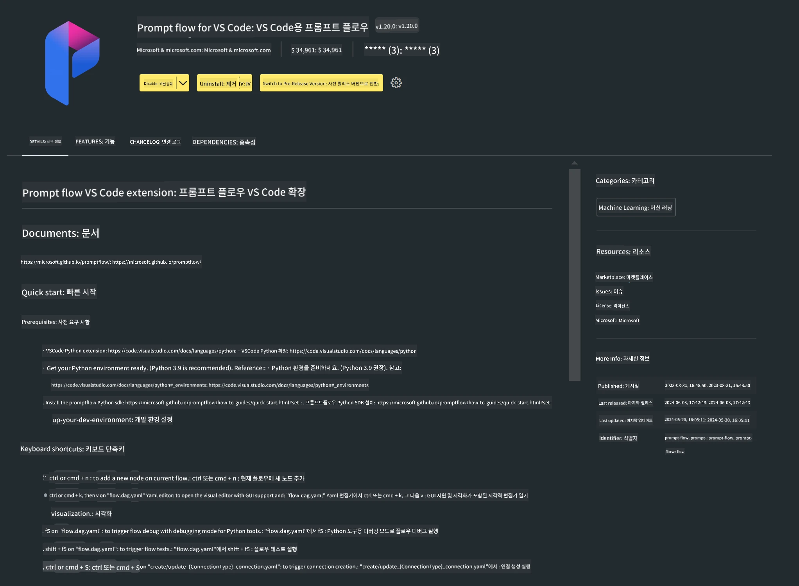

<!--
CO_OP_TRANSLATOR_METADATA:
{
  "original_hash": "a4ef39027902e82f2c33d568d2a2259a",
  "translation_date": "2025-07-17T03:48:58+00:00",
  "source_file": "md/02.Application/02.Code/Phi3/VSCodeExt/HOL/AIPC/01.Installations.md",
  "language_code": "ko"
}
-->
# **Lab 0 - 설치**

랩에 들어가면 관련 환경을 설정해야 합니다:


### **1. Python 3.11+**

Python 환경 설정에는 miniforge 사용을 권장합니다.

miniforge 설정 방법은 [https://github.com/conda-forge/miniforge](https://github.com/conda-forge/miniforge)를 참고하세요.

miniforge 설정 후, Power Shell에서 다음 명령어를 실행하세요.

```bash

conda create -n pyenv python==3.11.8 -y

conda activate pyenv

```


### **2. Prompt flow SDK 설치**

Lab 1에서는 Prompt flow를 사용하므로 Prompt flow SDK를 설정해야 합니다.

```bash

pip install promptflow --upgrade

```

다음 명령어로 promptflow sdk가 설치되었는지 확인할 수 있습니다.

```bash

pf --version

```

### **3. Visual Studio Code Prompt flow 확장 프로그램 설치**




### **4. Intel NPU 가속 라이브러리**

Intel의 차세대 프로세서는 NPU를 지원합니다. 로컬에서 LLMs / SLMs를 NPU로 실행하려면 ***Intel NPU 가속 라이브러리***를 사용할 수 있습니다. 자세한 내용은 [https://github.com/microsoft/PhiCookBook/blob/main/md/01.Introduction/03/AIPC_Inference.md](https://github.com/microsoft/PhiCookBook/blob/main/md/01.Introduction/03/AIPC_Inference.md)를 참고하세요.

bash에서 Intel NPU 가속 라이브러리를 설치하세요.

```bash

pip install intel-npu-acceleration-library

```

***Note***: 이 라이브러리는 transformers ***4.40.2*** 버전을 지원하니 버전을 꼭 확인하세요.


### **5. 기타 Python 라이브러리**

requirements.txt 파일을 만들고 다음 내용을 추가하세요.

```txt

notebook
numpy 
scipy 
scikit-learn 
matplotlib 
pandas 
pillow 
graphviz

```


### **6. NVM 설치**

PowerShell에서 nvm을 설치하세요.

```bash

winget install -e --id CoreyButler.NVMforWindows

```

nodejs 18.20 버전을 설치하세요.

```bash

nvm install 18.20.0

nvm use 18.20.0

```

### **7. Visual Studio Code 개발 지원 설치**

```bash

npm install --global yo generator-code

```

축하합니다! SDK 설정이 완료되었습니다. 다음으로 실습 단계로 진행하세요.

**면책 조항**:  
이 문서는 AI 번역 서비스 [Co-op Translator](https://github.com/Azure/co-op-translator)를 사용하여 번역되었습니다. 정확성을 위해 최선을 다하고 있으나, 자동 번역에는 오류나 부정확한 부분이 있을 수 있음을 유의하시기 바랍니다. 원문은 해당 언어의 원본 문서가 권위 있는 출처로 간주되어야 합니다. 중요한 정보의 경우 전문적인 인간 번역을 권장합니다. 본 번역 사용으로 인해 발생하는 오해나 잘못된 해석에 대해 당사는 책임을 지지 않습니다.