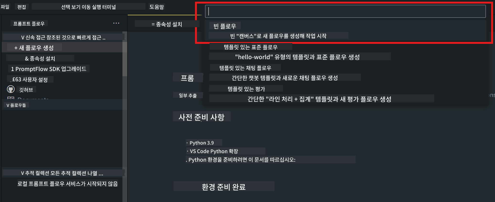
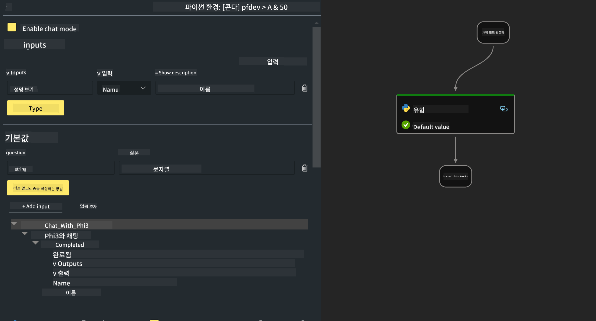

<!--
CO_OP_TRANSLATOR_METADATA:
{
  "original_hash": "b65fb1164cd818b78a83ac6b8021e4b4",
  "translation_date": "2025-04-04T06:39:56+00:00",
  "source_file": "md\\02.Application\\02.Code\\Phi3\\VSCodeExt\\HOL\\AIPC\\02.PromptflowWithNPU.md",
  "language_code": "ko"
}
-->
# **Lab 2 - Phi-3-mini를 사용하여 AIPC에서 Prompt flow 실행하기**

## **Prompt flow란 무엇인가**

Prompt flow는 LLM 기반 AI 애플리케이션의 아이디어 구상, 프로토타입 제작, 테스트, 평가, 배포 및 모니터링까지의 전체 개발 주기를 간소화하기 위해 설계된 개발 도구 모음입니다. 이를 통해 프롬프트 엔지니어링이 훨씬 쉬워지고, 생산 품질을 갖춘 LLM 애플리케이션을 구축할 수 있습니다.

Prompt flow를 사용하면 다음을 수행할 수 있습니다:

- LLM, 프롬프트, Python 코드 및 기타 도구를 실행 가능한 워크플로우로 연결하는 흐름을 생성합니다.

- 특히 LLM과의 상호작용을 쉽게 디버깅하고 반복 작업을 수행할 수 있습니다.

- 흐름을 평가하고, 더 큰 데이터 세트를 사용하여 품질 및 성능 지표를 계산합니다.

- CI/CD 시스템에 테스트 및 평가를 통합하여 흐름의 품질을 보장합니다.

- 선택한 서비스 플랫폼에 흐름을 배포하거나 애플리케이션 코드베이스에 쉽게 통합합니다.

- (선택 사항이지만 적극 권장됨) Azure AI의 클라우드 버전을 활용하여 팀과 협업합니다.

## **AIPC란 무엇인가**

AI PC는 각각 특정 AI 가속 기능을 가진 CPU, GPU, NPU를 갖추고 있습니다. NPU(신경 처리 장치)는 클라우드에서 데이터를 처리하는 대신 PC에서 직접 인공지능(AI) 및 머신 러닝(ML) 작업을 처리하는 전문 가속기입니다. GPU와 CPU도 이러한 작업을 처리할 수 있지만, NPU는 특히 저전력 AI 계산에 뛰어납니다. AI PC는 컴퓨터 운영 방식의 근본적인 변화를 나타냅니다. 이는 이전에 존재하지 않았던 문제에 대한 해결책이 아니라, 일상적인 PC 사용에 대한 큰 개선을 약속하는 것입니다.

그렇다면 이것이 어떻게 작동할까요? 대량의 공개 데이터를 기반으로 훈련된 대규모 언어 모델(LLM) 및 생성 AI와 비교할 때, PC에서 실행되는 AI는 거의 모든 면에서 더 접근 가능하게 됩니다. 개념이 더 쉽게 이해되며, 클라우드에 액세스할 필요 없이 개인 데이터를 기반으로 훈련되기 때문에 더 넓은 사용자층에 즉각적으로 매력적인 혜택을 제공합니다.

단기적으로 AI PC 세계는 개인 비서와 더 작은 AI 모델이 PC에서 직접 실행되며, 개인 데이터를 사용하여 더 개인적이고, 비공개적이며, 더 안전한 AI 개선을 제공합니다. 예를 들어, 회의 기록 작성, 판타지 풋볼 리그 조직, 사진 및 비디오 편집 자동화, 가족 모임의 일정 조정 등 일상적으로 수행하는 작업을 개선하는 데 도움을 줄 수 있습니다.

## **AIPC에서 코드 생성 흐름 구축하기**

***Note*** ：환경 설치를 완료하지 않았다면 [Lab 0 - Installations](./01.Installations.md)을 방문하세요.

1. Visual Studio Code에서 Prompt flow 확장을 열고 빈 흐름 프로젝트를 생성합니다.



2. 입력 및 출력 매개변수를 추가하고 Python 코드를 새 흐름으로 추가합니다.



이 구조(flow.dag.yaml)를 참조하여 흐름을 구성할 수 있습니다.

```yaml

inputs:
  question:
    type: string
    default: how to write Bubble Algorithm
outputs:
  answer:
    type: string
    reference: ${Chat_With_Phi3.output}
nodes:
- name: Chat_With_Phi3
  type: python
  source:
    type: code
    path: Chat_With_Phi3.py
  inputs:
    question: ${inputs.question}


```

3. ***Chat_With_Phi3.py***에 코드를 추가합니다.

```python


from promptflow.core import tool

# import torch
from transformers import AutoTokenizer, pipeline,TextStreamer
import intel_npu_acceleration_library as npu_lib

import warnings

import asyncio
import platform

class Phi3CodeAgent:
    
    model = None
    tokenizer = None
    text_streamer = None
    
    model_id = "microsoft/Phi-3-mini-4k-instruct"

    @staticmethod
    def init_phi3():
        
        if Phi3CodeAgent.model is None or Phi3CodeAgent.tokenizer is None or Phi3CodeAgent.text_streamer is None:
            Phi3CodeAgent.model = npu_lib.NPUModelForCausalLM.from_pretrained(
                                    Phi3CodeAgent.model_id,
                                    torch_dtype="auto",
                                    dtype=npu_lib.int4,
                                    trust_remote_code=True
                                )
            Phi3CodeAgent.tokenizer = AutoTokenizer.from_pretrained(Phi3CodeAgent.model_id)
            Phi3CodeAgent.text_streamer = TextStreamer(Phi3CodeAgent.tokenizer, skip_prompt=True)

    

    @staticmethod
    def chat_with_phi3(prompt):
        
        Phi3CodeAgent.init_phi3()

        messages = "<|system|>You are a AI Python coding assistant. Please help me to generate code in Python.The answer only genertated Python code, but any comments and instructions do not need to be generated<|end|><|user|>" + prompt +"<|end|><|assistant|>"


        generation_args = {
            "max_new_tokens": 1024,
            "return_full_text": False,
            "temperature": 0.3,
            "do_sample": False,
            "streamer": Phi3CodeAgent.text_streamer,
        }

        pipe = pipeline(
            "text-generation",
            model=Phi3CodeAgent.model,
            tokenizer=Phi3CodeAgent.tokenizer,
            # **generation_args
        )

        result = ''

        with warnings.catch_warnings():
            warnings.simplefilter("ignore")
            response = pipe(messages, **generation_args)
            result =response[0]['generated_text']
            return result


@tool
def my_python_tool(question: str) -> str:
    if platform.system() == 'Windows':
        asyncio.set_event_loop_policy(asyncio.WindowsSelectorEventLoopPolicy())
    return Phi3CodeAgent.chat_with_phi3(question)


```

4. Debug 또는 Run을 통해 흐름을 테스트하여 코드 생성이 제대로 이루어졌는지 확인합니다.


5. 터미널에서 개발 API로 흐름을 실행합니다.

```

pf flow serve --source ./ --port 8080 --host localhost   

```

Postman / Thunder Client에서 테스트할 수 있습니다.

### **참고사항**

1. 첫 실행은 시간이 오래 걸립니다. Hugging Face CLI를 통해 phi-3 모델을 다운로드하는 것을 권장합니다.

2. Intel NPU의 제한된 계산 능력을 고려하여 Phi-3-mini-4k-instruct를 사용하는 것을 추천합니다.

3. Intel NPU 가속화를 사용하여 INT4 변환을 양자화하지만, 서비스를 다시 실행하려면 캐시와 nc_workshop 폴더를 삭제해야 합니다.

## **리소스**

1. Promptflow 학습 [https://microsoft.github.io/promptflow/](https://microsoft.github.io/promptflow/)

2. Intel NPU 가속화 학습 [https://github.com/intel/intel-npu-acceleration-library](https://github.com/intel/intel-npu-acceleration-library)

3. 샘플 코드 다운로드 [Local NPU Agent Sample Code](../../../../../../../../../code/07.Lab/01/AIPC)

**면책 조항**:  
이 문서는 AI 번역 서비스 [Co-op Translator](https://github.com/Azure/co-op-translator)를 사용하여 번역되었습니다. 정확성을 위해 최선을 다하고 있지만, 자동 번역에는 오류나 부정확한 내용이 포함될 수 있습니다. 원본 문서의 모국어 버전이 신뢰할 수 있는 권위 있는 출처로 간주되어야 합니다. 중요한 정보의 경우, 전문적인 인간 번역을 권장합니다. 이 번역을 사용함으로 인해 발생하는 오해나 잘못된 해석에 대해 책임을 지지 않습니다.