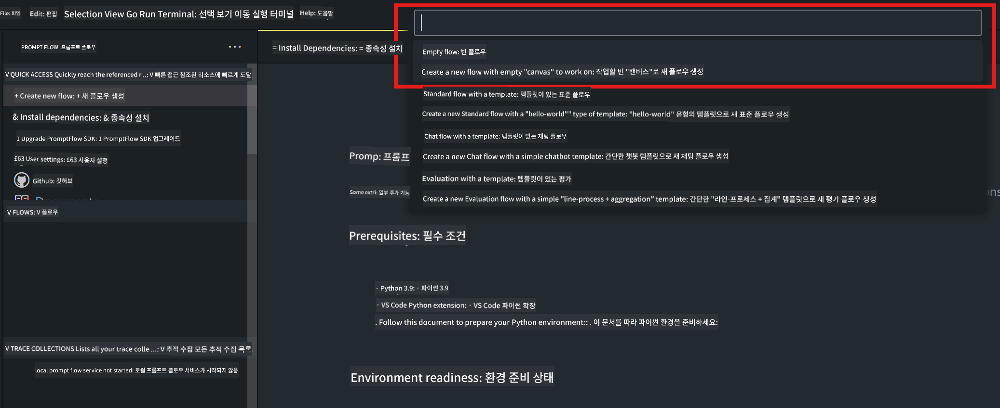
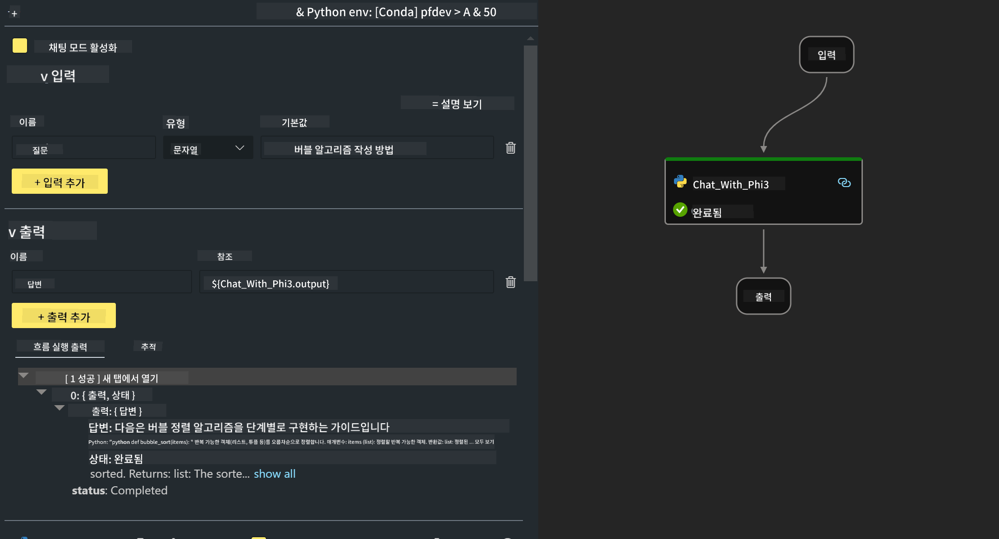

<!--
CO_OP_TRANSLATOR_METADATA:
{
  "original_hash": "bc29f7fe7fc16bed6932733eac8c81b8",
  "translation_date": "2025-05-08T05:31:08+00:00",
  "source_file": "md/02.Application/02.Code/Phi3/VSCodeExt/HOL/AIPC/02.PromptflowWithNPU.md",
  "language_code": "ko"
}
-->
# **Lab 2 - Phi-3-mini를 사용한 AIPC에서 Prompt flow 실행하기**

## **Prompt flow란?**

Prompt flow는 아이디어 구상, 프로토타입 제작, 테스트, 평가부터 프로덕션 배포 및 모니터링까지 LLM 기반 AI 애플리케이션의 전체 개발 주기를 간소화하기 위해 설계된 개발 도구 모음입니다. 이를 통해 프롬프트 엔지니어링이 훨씬 쉬워지고, 프로덕션 품질의 LLM 앱을 구축할 수 있습니다.

Prompt flow를 사용하면 다음과 같은 작업이 가능합니다:

- LLM, 프롬프트, Python 코드 및 기타 도구들을 연결해 실행 가능한 워크플로우를 만들 수 있습니다.

- 특히 LLM과의 상호작용을 쉽게 디버깅하고 반복 개선할 수 있습니다.

- 더 큰 데이터셋으로 워크플로우를 평가하고 품질 및 성능 지표를 계산할 수 있습니다.

- 테스트와 평가를 CI/CD 시스템에 통합해 워크플로우의 품질을 보장할 수 있습니다.

- 선택한 서빙 플랫폼에 워크플로우를 배포하거나 앱 코드베이스에 쉽게 통합할 수 있습니다.

- (선택 사항이지만 강력히 권장) Azure AI의 클라우드 버전을 활용해 팀과 협업할 수 있습니다.

## **AIPC란?**

AI PC는 CPU, GPU, 그리고 각각 고유한 AI 가속 기능을 갖춘 NPU를 포함합니다. NPU(신경망 처리 장치)는 데이터를 클라우드로 보내 처리하는 대신 PC 내에서 인공지능(AI) 및 머신러닝(ML) 작업을 처리하는 특수 가속기입니다. GPU와 CPU도 이러한 작업을 처리할 수 있지만, NPU는 특히 저전력 AI 계산에 뛰어납니다. AI PC는 컴퓨터 작동 방식에 근본적인 변화를 가져옵니다. 이는 이전에 없던 문제에 대한 해결책이 아니라, 일상적인 PC 사용에서 큰 개선을 약속합니다.

그렇다면 어떻게 작동할까요? 방대한 공개 데이터로 훈련된 생성 AI와 대규모 LLM과 비교할 때, PC에서 실행되는 AI는 거의 모든 면에서 더 접근하기 쉽습니다. 개념도 이해하기 쉽고, 클라우드 접근 없이 자신의 데이터로 훈련되기 때문에, 더 넓은 사용자층에게 즉각적인 이점을 제공합니다.

단기적으로 AI PC 환경은 개인 비서와 소규모 AI 모델이 PC에서 직접 실행되며, 일상 업무에 개인적이고 사적인, 더 안전한 AI 향상을 제공합니다. 예를 들어 회의록 작성, 판타지 풋볼 리그 관리, 사진 및 동영상 편집 자동화, 가족 모임 참석자 도착 및 출발 시간에 맞춘 완벽한 일정 짜기 등이 가능합니다.

## **AIPC에서 생성 코드 플로우 구축하기**

***Note*** ：환경 설치를 완료하지 않았다면 [Lab 0 - Installations](./01.Installations.md)를 참고하세요.

1. Visual Studio Code에서 Prompt flow 확장 프로그램을 열고 빈 플로우 프로젝트를 만듭니다.



2. 입력 및 출력 파라미터를 추가하고 Python 코드를 새로운 플로우로 추가합니다.



다음 구조(flow.dag.yaml)를 참고해 플로우를 구성할 수 있습니다.

```yaml

inputs:
  question:
    type: string
    default: how to write Bubble Algorithm
outputs:
  answer:
    type: string
    reference: ${Chat_With_Phi3.output}
nodes:
- name: Chat_With_Phi3
  type: python
  source:
    type: code
    path: Chat_With_Phi3.py
  inputs:
    question: ${inputs.question}


```

3. ***Chat_With_Phi3.py***에 코드를 추가합니다.

```python


from promptflow.core import tool

# import torch
from transformers import AutoTokenizer, pipeline,TextStreamer
import intel_npu_acceleration_library as npu_lib

import warnings

import asyncio
import platform

class Phi3CodeAgent:
    
    model = None
    tokenizer = None
    text_streamer = None
    
    model_id = "microsoft/Phi-3-mini-4k-instruct"

    @staticmethod
    def init_phi3():
        
        if Phi3CodeAgent.model is None or Phi3CodeAgent.tokenizer is None or Phi3CodeAgent.text_streamer is None:
            Phi3CodeAgent.model = npu_lib.NPUModelForCausalLM.from_pretrained(
                                    Phi3CodeAgent.model_id,
                                    torch_dtype="auto",
                                    dtype=npu_lib.int4,
                                    trust_remote_code=True
                                )
            Phi3CodeAgent.tokenizer = AutoTokenizer.from_pretrained(Phi3CodeAgent.model_id)
            Phi3CodeAgent.text_streamer = TextStreamer(Phi3CodeAgent.tokenizer, skip_prompt=True)

    

    @staticmethod
    def chat_with_phi3(prompt):
        
        Phi3CodeAgent.init_phi3()

        messages = "<|system|>You are a AI Python coding assistant. Please help me to generate code in Python.The answer only genertated Python code, but any comments and instructions do not need to be generated<|end|><|user|>" + prompt +"<|end|><|assistant|>"


        generation_args = {
            "max_new_tokens": 1024,
            "return_full_text": False,
            "temperature": 0.3,
            "do_sample": False,
            "streamer": Phi3CodeAgent.text_streamer,
        }

        pipe = pipeline(
            "text-generation",
            model=Phi3CodeAgent.model,
            tokenizer=Phi3CodeAgent.tokenizer,
            # **generation_args
        )

        result = ''

        with warnings.catch_warnings():
            warnings.simplefilter("ignore")
            response = pipe(messages, **generation_args)
            result =response[0]['generated_text']
            return result


@tool
def my_python_tool(question: str) -> str:
    if platform.system() == 'Windows':
        asyncio.set_event_loop_policy(asyncio.WindowsSelectorEventLoopPolicy())
    return Phi3CodeAgent.chat_with_phi3(question)


```

4. Debug 또는 Run에서 플로우를 실행해 생성 코드가 정상 작동하는지 테스트할 수 있습니다.


5. 터미널에서 개발용 API로 플로우를 실행합니다.

```

pf flow serve --source ./ --port 8080 --host localhost   

```

Postman이나 Thunder Client에서 테스트할 수 있습니다.

### **Note**

1. 첫 실행은 시간이 오래 걸립니다. Hugging face CLI에서 phi-3 모델을 다운로드하는 것을 권장합니다.

2. Intel NPU의 제한된 연산 능력을 고려해 Phi-3-mini-4k-instruct 사용을 권장합니다.

3. Intel NPU 가속을 사용해 INT4 양자화 변환을 수행하지만, 서비스를 다시 실행할 경우 캐시 및 nc_workshop 폴더를 삭제해야 합니다.

## **자료**

1. Promptflow 배우기 [https://microsoft.github.io/promptflow/](https://microsoft.github.io/promptflow/)

2. Intel NPU 가속 배우기 [https://github.com/intel/intel-npu-acceleration-library](https://github.com/intel/intel-npu-acceleration-library)

3. 샘플 코드 다운로드 [Local NPU Agent Sample Code](../../../../../../../../../code/07.Lab/01/AIPC)

**면책 조항**:  
이 문서는 AI 번역 서비스 [Co-op Translator](https://github.com/Azure/co-op-translator)를 사용하여 번역되었습니다. 정확성을 위해 노력하고 있으나, 자동 번역에는 오류나 부정확한 부분이 있을 수 있음을 양지해 주시기 바랍니다. 원문 문서가 권위 있는 출처로 간주되어야 합니다. 중요한 정보의 경우, 전문적인 인간 번역을 권장합니다. 본 번역 사용으로 인해 발생하는 오해나 잘못된 해석에 대해 당사는 책임을 지지 않습니다.