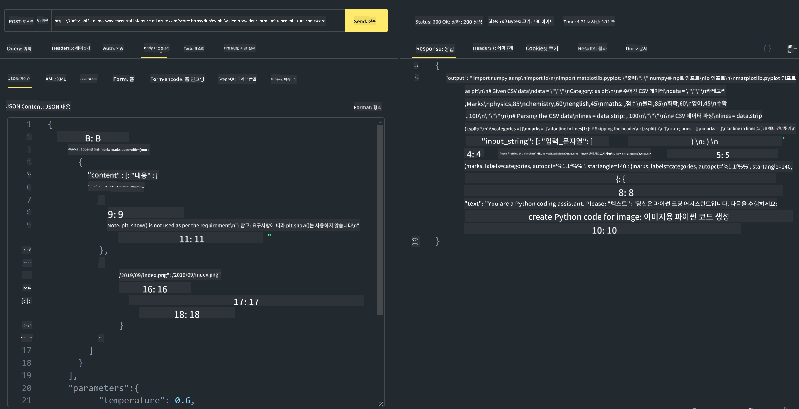

<!--
CO_OP_TRANSLATOR_METADATA:
{
  "original_hash": "20cb4e6ac1686248e8be913ccf6c2bc2",
  "translation_date": "2025-05-08T05:32:21+00:00",
  "source_file": "md/02.Application/02.Code/Phi3/VSCodeExt/HOL/AIPC/03.DeployPhi3VisionOnAzure.md",
  "language_code": "ko"
}
-->
# **Lab 3 - Azure Machine Learning Service에 Phi-3-vision 배포하기**

로컬 코드의 프로덕션 배포를 NPU를 사용해 완료한 후, 이를 통해 PHI-3-VISION을 도입하여 이미지로부터 코드를 생성하는 기능을 추가하려고 합니다.

이번 소개에서는 Azure Machine Learning Service에서 Model As Service 형태로 Phi-3 Vision 서비스를 빠르게 구축하는 방법을 다룹니다.

***Note***： Phi-3 Vision은 빠른 콘텐츠 생성을 위해 높은 연산 능력이 필요합니다. 이를 위해 클라우드 컴퓨팅 파워를 활용해야 합니다.


### **1. Azure Machine Learning Service 생성하기**

Azure 포털에서 Azure Machine Learning Service를 생성해야 합니다. 생성 방법이 궁금하다면, 이 링크를 참고하세요 [https://learn.microsoft.com/azure/machine-learning/quickstart-create-resources?view=azureml-api-2](https://learn.microsoft.com/azure/machine-learning/quickstart-create-resources?view=azureml-api-2)


### **2. Azure Machine Learning Service에서 Phi-3 Vision 선택하기**


### **3. Azure에 Phi-3-Vision 배포하기**


### **4. Postman에서 엔드포인트 테스트하기**





***Note***

1. 전송하는 파라미터에는 Authorization, azureml-model-deployment, Content-Type이 반드시 포함되어야 합니다. 배포 정보를 확인하여 값을 얻으세요.

2. Phi-3-Vision에 파라미터를 전송할 때는 이미지 링크를 포함해야 합니다. GPT-4-Vision 방식의 파라미터 전송 방법을 참고하세요, 예를 들어

```json

{
  "input_data":{
    "input_string":[
      {
        "role":"user",
        "content":[ 
          {
            "type": "text",
            "text": "You are a Python coding assistant.Please create Python code for image "
          },
          {
              "type": "image_url",
              "image_url": {
                "url": "https://ajaytech.co/wp-content/uploads/2019/09/index.png"
              }
          }
        ]
      }
    ],
    "parameters":{
          "temperature": 0.6,
          "top_p": 0.9,
          "do_sample": false,
          "max_new_tokens": 2048
    }
  }
}

```

3. Post 메서드를 사용해 **/score**를 호출하세요

**축하합니다**! 빠른 PHI-3-VISION 배포를 완료하고 이미지로부터 코드를 생성하는 방법을 체험했습니다. 다음 단계로 NPU와 클라우드를 결합해 애플리케이션을 구축할 수 있습니다.

**면책 조항**:  
이 문서는 AI 번역 서비스 [Co-op Translator](https://github.com/Azure/co-op-translator)를 사용하여 번역되었습니다. 정확성을 위해 노력하고 있으나, 자동 번역에는 오류나 부정확성이 포함될 수 있음을 유의하시기 바랍니다. 원본 문서의 원어 버전이 권위 있는 출처로 간주되어야 합니다. 중요한 정보의 경우 전문적인 인간 번역을 권장합니다. 본 번역 사용으로 인해 발생하는 오해나 잘못된 해석에 대해 당사는 책임을 지지 않습니다.