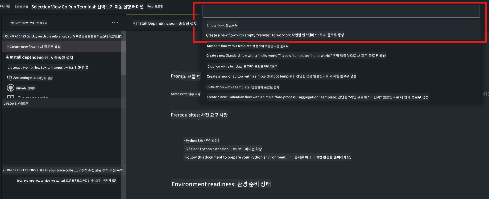

<!--
CO_OP_TRANSLATOR_METADATA:
{
  "original_hash": "3dbbf568625b1ee04b354c2dc81d3248",
  "translation_date": "2025-07-17T04:24:10+00:00",
  "source_file": "md/02.Application/02.Code/Phi3/VSCodeExt/HOL/Apple/02.PromptflowWithMLX.md",
  "language_code": "ko"
}
-->
# **Lab 2 - Phi-3-mini와 함께 AIPC에서 Prompt flow 실행하기**

## **Prompt flow란?**

Prompt flow는 아이디어 구상, 프로토타입 제작, 테스트, 평가부터 실제 배포 및 모니터링까지 LLM 기반 AI 애플리케이션의 전체 개발 주기를 간소화하기 위해 설계된 개발 도구 모음입니다. 이를 통해 프롬프트 엔지니어링이 훨씬 쉬워지고, 생산 품질의 LLM 앱을 구축할 수 있습니다.

Prompt flow를 사용하면 다음을 할 수 있습니다:

- LLM, 프롬프트, Python 코드 및 기타 도구를 연결하여 실행 가능한 워크플로우를 만들 수 있습니다.

- 특히 LLM과의 상호작용을 쉽게 디버깅하고 반복 개선할 수 있습니다.

- 더 큰 데이터셋으로 워크플로우를 평가하고 품질 및 성능 지표를 계산할 수 있습니다.

- 테스트와 평가를 CI/CD 시스템에 통합하여 워크플로우의 품질을 보장할 수 있습니다.

- 선택한 서빙 플랫폼에 워크플로우를 배포하거나 앱 코드베이스에 쉽게 통합할 수 있습니다.

- (선택 사항이지만 강력히 권장) Azure AI의 클라우드 버전 Prompt flow를 활용해 팀과 협업할 수 있습니다.


## **Apple Silicon에서 생성 코드 플로우 구축하기**

***Note*** ：환경 설치를 완료하지 않았다면 [Lab 0 -Installations](./01.Installations.md) 을 참고하세요.

1. Visual Studio Code에서 Prompt flow 확장 프로그램을 열고 빈 플로우 프로젝트를 생성합니다.



2. Inputs와 Outputs 파라미터를 추가하고 Python 코드를 새 플로우로 추가합니다.


아래 구조(flow.dag.yaml)를 참고하여 플로우를 구성할 수 있습니다.

```yaml

inputs:
  prompt:
    type: string
    default: Write python code for Fibonacci serie. Please use markdown as output
outputs:
  result:
    type: string
    reference: ${gen_code_by_phi3.output}
nodes:
- name: gen_code_by_phi3
  type: python
  source:
    type: code
    path: gen_code_by_phi3.py
  inputs:
    prompt: ${inputs.prompt}


```

3. phi-3-mini 양자화하기

로컬 장치에서 SLM을 더 잘 실행하기 위해 모델을 양자화합니다 (INT4, FP16, FP32).

```bash

python -m mlx_lm.convert --hf-path microsoft/Phi-3-mini-4k-instruct

```

**Note:** 기본 폴더는 mlx_model 입니다.

4. ***Chat_With_Phi3.py***에 코드를 추가합니다.

```python


from promptflow import tool

from mlx_lm import load, generate


# The inputs section will change based on the arguments of the tool function, after you save the code
# Adding type to arguments and return value will help the system show the types properly
# Please update the function name/signature per need
@tool
def my_python_tool(prompt: str) -> str:

    model_id = './mlx_model_phi3_mini'

    model, tokenizer = load(model_id)

    # <|user|>\nWrite python code for Fibonacci serie. Please use markdown as output<|end|>\n<|assistant|>

    response = generate(model, tokenizer, prompt="<|user|>\n" + prompt  + "<|end|>\n<|assistant|>", max_tokens=2048, verbose=True)

    return response


```

4. Debug 또는 Run에서 플로우를 테스트하여 생성 코드가 정상 작동하는지 확인할 수 있습니다.


5. 터미널에서 개발용 API로 플로우를 실행합니다.

```

pf flow serve --source ./ --port 8080 --host localhost   

```

Postman 또는 Thunder Client에서 테스트할 수 있습니다.


### **Note**

1. 첫 실행은 시간이 오래 걸립니다. Hugging face CLI를 통해 phi-3 모델을 미리 다운로드하는 것을 권장합니다.

2. Intel NPU의 제한된 연산 능력을 고려해 Phi-3-mini-4k-instruct 사용을 권장합니다.

3. INT4 변환 양자화를 위해 Intel NPU 가속을 사용하지만, 서비스를 재실행할 경우 캐시와 nc_workshop 폴더를 삭제해야 합니다.


## **자료**

1. Promptflow 학습 [https://microsoft.github.io/promptflow/](https://microsoft.github.io/promptflow/)

2. Intel NPU 가속 학습 [https://github.com/intel/intel-npu-acceleration-library](https://github.com/intel/intel-npu-acceleration-library)

3. 샘플 코드 다운로드 [Local NPU Agent Sample Code](../../../../../../../../../code/07.Lab/01/AIPC/local-npu-agent)

**면책 조항**:  
이 문서는 AI 번역 서비스 [Co-op Translator](https://github.com/Azure/co-op-translator)를 사용하여 번역되었습니다. 정확성을 위해 최선을 다하고 있으나, 자동 번역에는 오류나 부정확한 부분이 있을 수 있음을 유의해 주시기 바랍니다. 원문은 해당 언어의 원본 문서가 권위 있는 출처로 간주되어야 합니다. 중요한 정보의 경우 전문적인 인간 번역을 권장합니다. 본 번역 사용으로 인해 발생하는 오해나 잘못된 해석에 대해 당사는 책임을 지지 않습니다.