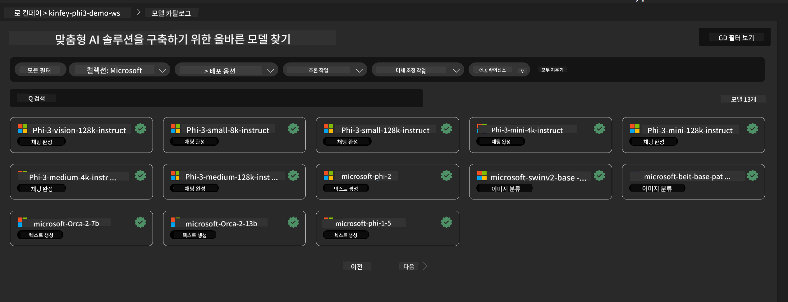
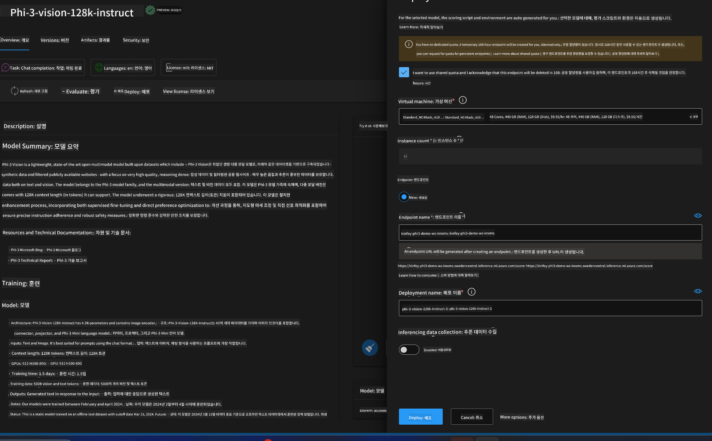
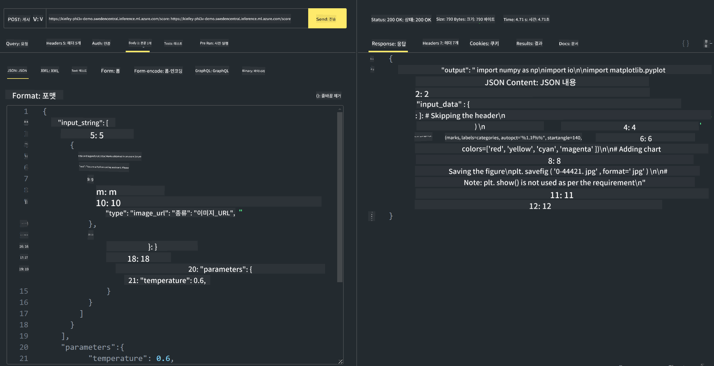

<!--
CO_OP_TRANSLATOR_METADATA:
{
  "original_hash": "594a3b553655c2ebbc0efdeb0b5040c9",
  "translation_date": "2025-04-04T06:44:59+00:00",
  "source_file": "md\\02.Application\\02.Code\\Phi3\\VSCodeExt\\HOL\\Apple\\03.DeployPhi3VisionOnAzure.md",
  "language_code": "ko"
}
-->
# **랩 3 - Azure Machine Learning Service에 Phi-3-Vision 배포**

우리는 NPU를 사용하여 로컬 코드의 프로덕션 배포를 완료하고, 이를 통해 PHI-3-VISION 기능을 도입하여 이미지를 코드로 변환하는 작업을 수행하고자 합니다.

이 가이드를 통해 Azure Machine Learning Service에서 빠르게 Model As Service Phi-3 Vision 서비스를 구축할 수 있습니다.

***참고***: Phi-3 Vision은 더 빠른 속도로 콘텐츠를 생성하기 위해 계산 성능이 필요합니다. 이를 위해 클라우드 컴퓨팅 자원이 필요합니다.

### **1. Azure Machine Learning Service 생성**

Azure Portal에서 Azure Machine Learning Service를 생성해야 합니다. 생성 방법에 대한 자세한 내용은 [https://learn.microsoft.com/azure/machine-learning/quickstart-create-resources?view=azureml-api-2](https://learn.microsoft.com/azure/machine-learning/quickstart-create-resources?view=azureml-api-2)를 방문하세요.

### **2. Azure Machine Learning Service에서 Phi-3 Vision 선택**



### **3. Azure에 Phi-3-Vision 배포**



### **4. Postman에서 엔드포인트 테스트**



***참고***

1. 전송해야 하는 매개변수에는 Authorization, azureml-model-deployment, Content-Type이 포함되어야 합니다. 배포 정보를 확인하여 이 값을 얻어야 합니다.

2. 매개변수를 전송하려면 Phi-3-Vision에 이미지 링크를 전달해야 합니다. 매개변수 전송 방법은 GPT-4-Vision 방법을 참조하세요. 예:

```json

{
  "input_data":{
    "input_string":[
      {
        "role":"user",
        "content":[ 
          {
            "type": "text",
            "text": "You are a Python coding assistant.Please create Python code for image "
          },
          {
              "type": "image_url",
              "image_url": {
                "url": "https://ajaytech.co/wp-content/uploads/2019/09/index.png"
              }
          }
        ]
      }
    ],
    "parameters":{
          "temperature": 0.6,
          "top_p": 0.9,
          "do_sample": false,
          "max_new_tokens": 2048
    }
  }
}

```

3. Post 메서드를 사용하여 **/score**를 호출합니다.

**축하합니다!** 빠르게 PHI-3-VISION을 배포하고 이미지를 사용하여 코드를 생성하는 방법을 시도해 보았습니다. 이제 NPU와 클라우드를 결합하여 애플리케이션을 구축할 수 있습니다.

**면책 조항**:  
이 문서는 AI 번역 서비스 [Co-op Translator](https://github.com/Azure/co-op-translator)를 사용하여 번역되었습니다. 최대한 정확성을 기하기 위해 노력하고 있으나, 자동 번역에는 오류나 부정확성이 포함될 수 있습니다. 원본 문서의 원어 버전이 권위 있는 출처로 간주되어야 합니다. 중요한 정보에 대해서는 전문적인 인간 번역을 권장합니다. 이 번역 사용으로 인해 발생할 수 있는 오해나 잘못된 해석에 대해 당사는 책임을 지지 않습니다.