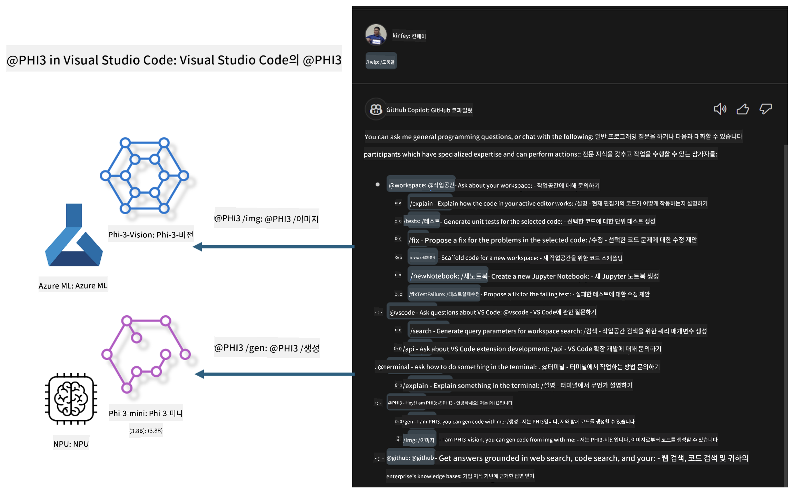

<!--
CO_OP_TRANSLATOR_METADATA:
{
  "original_hash": "00b7a699de8ac405fa821f4c0f7fc0ab",
  "translation_date": "2025-05-08T05:29:33+00:00",
  "source_file": "md/02.Application/02.Code/Phi3/VSCodeExt/README.md",
  "language_code": "ko"
}
-->
# **Microsoft Phi-3 패밀리로 나만의 Visual Studio Code GitHub Copilot Chat 만들기**

GitHub Copilot Chat에서 workspace agent를 사용해 본 적 있나요? 팀 전용 코드 에이전트를 직접 만들어 보고 싶나요? 이 실습에서는 오픈 소스 모델을 활용해 기업용 코드 비즈니스 에이전트를 구축하는 방법을 다룹니다.

## **기본 개념**

### **왜 Microsoft Phi-3를 선택해야 할까**

Phi-3는 phi-3-mini, phi-3-small, phi-3-medium 등 다양한 훈련 파라미터를 기반으로 한 텍스트 생성, 대화 완성, 코드 생성용 모델 시리즈입니다. Vision 기반의 phi-3-vision도 포함되어 있어, 기업이나 팀이 오프라인 생성 AI 솔루션을 구축하는 데 적합합니다.

추천 읽기 링크 [https://github.com/microsoft/PhiCookBook/blob/main/md/01.Introduction/01/01.PhiFamily.md](https://github.com/microsoft/PhiCookBook/blob/main/md/01.Introduction/01/01.PhiFamily.md)

### **Microsoft GitHub Copilot Chat**

GitHub Copilot Chat 확장 기능은 VS Code 내에서 GitHub Copilot과 대화하며 코딩 관련 질문에 답변을 받을 수 있는 채팅 인터페이스를 제공합니다. 별도로 문서를 찾아보거나 온라인 포럼을 검색할 필요가 없습니다.

Copilot Chat은 문법 강조, 들여쓰기 등 다양한 포맷팅 기능을 활용해 생성된 응답을 더 명확하게 보여줍니다. 사용자의 질문 유형에 따라, Copilot이 참조한 소스 코드 파일이나 문서 링크, VS Code 기능에 접근할 수 있는 버튼 등이 포함될 수 있습니다.

- Copilot Chat은 개발 흐름에 자연스럽게 통합되어 필요한 곳에서 도움을 줍니다:

- 편집기나 터미널에서 바로 인라인 채팅을 시작해 코딩 중 도움 받기

- 언제든 옆에 두고 사용할 수 있는 AI 비서 역할의 Chat 뷰 활용

- Quick Chat을 실행해 빠른 질문 후 바로 작업으로 복귀

GitHub Copilot Chat은 다음과 같은 상황에서 유용합니다:

- 문제 해결을 위한 코딩 질문 답변

- 다른 사람 코드 설명 및 개선 제안

- 코드 수정 제안

- 단위 테스트 케이스 생성

- 코드 문서화 생성

추천 읽기 링크 [https://code.visualstudio.com/docs/copilot/copilot-chat](https://code.visualstudio.com/docs/copilot/copilot-chat?WT.mc_id=aiml-137032-kinfeylo)

### **Microsoft GitHub Copilot Chat @workspace**

Copilot Chat에서 **@workspace**를 참조하면 전체 코드베이스에 대해 질문할 수 있습니다. 질문에 따라 Copilot이 관련 파일과 심볼을 지능적으로 찾아내고, 이를 링크와 코드 예제로 답변에 포함합니다.

질문에 답하기 위해 **@workspace**는 VS Code에서 개발자가 코드베이스를 탐색할 때 사용하는 다음 소스들을 검색합니다:

- .gitignore에 의해 무시되지 않은 워크스페이스 내 모든 파일

- 중첩된 폴더와 파일 이름을 포함한 디렉터리 구조

- 워크스페이스가 GitHub 저장소이고 코드 검색 인덱스가 활성화된 경우 GitHub 코드 검색 인덱스

- 워크스페이스 내 심볼과 정의

- 현재 선택된 텍스트나 활성 편집기에서 보이는 텍스트

참고: 무시된 파일이라도 해당 파일을 열었거나 텍스트를 선택한 경우 .gitignore는 무시됩니다.

추천 읽기 링크 [[https://code.visualstudio.com/docs/copilot/copilot-chat](https://code.visualstudio.com/docs/copilot/workspace-context?WT.mc_id=aiml-137032-kinfeylo)]

## **이 실습에 대해 더 알아보기**

GitHub Copilot은 기업의 프로그래밍 효율성을 크게 향상시켰으며, 많은 기업이 GitHub Copilot의 관련 기능을 맞춤화하기를 원합니다. 여러 기업에서는 자체 비즈니스 시나리오와 오픈 소스 모델을 기반으로 GitHub Copilot과 유사한 맞춤형 Extension을 개발해 사용합니다. 기업용 맞춤 Extension은 관리가 용이하지만, 사용자 경험에 영향을 줄 수 있습니다. GitHub Copilot은 일반적인 시나리오와 전문성 면에서 더 강력한 기능을 제공하기 때문에, 경험을 일관되게 유지하면서 기업 맞춤형 Extension을 만드는 것이 이상적입니다. GitHub Copilot Chat은 기업이 채팅 경험을 확장할 수 있는 관련 API를 제공합니다. 일관된 경험 유지와 맞춤 기능 제공이 더 나은 사용자 경험을 만듭니다.

이 실습에서는 Phi-3 모델을 로컬 NPU와 Azure 하이브리드 환경과 결합해 GitHub Copilot Chat 내에 맞춤형 Agent ***@PHI3***를 구축합니다. 이 에이전트는 기업 개발자의 코드 생성***(@PHI3 /gen)***과 이미지 기반 코드 생성***(@PHI3 /img)***을 지원합니다.

### ***참고:***

이 실습은 현재 Intel CPU와 Apple Silicon 기반 AIPC에서 구현되어 있으며, Qualcomm 버전 NPU도 계속 업데이트할 예정입니다.

## **실습**

| 이름 | 설명 | AIPC | Apple |
| ------------ | ----------- | -------- |-------- |
| Lab0 - 설치(✅) | 관련 환경과 설치 도구 설정 및 설치 | [Go](./HOL/AIPC/01.Installations.md) |[Go](./HOL/Apple/01.Installations.md) |
| Lab1 - Phi-3-mini로 Prompt flow 실행(✅) | AIPC / Apple Silicon과 연동, 로컬 NPU를 이용해 Phi-3-mini로 코드 생성 | [Go](./HOL/AIPC/02.PromptflowWithNPU.md) |  [Go](./HOL/Apple/02.PromptflowWithMLX.md) |
| Lab2 - Azure Machine Learning Service에 Phi-3-vision 배포(✅) | Azure Machine Learning Service의 모델 카탈로그 - Phi-3-vision 이미지 배포 후 코드 생성 | [Go](./HOL/AIPC/03.DeployPhi3VisionOnAzure.md) |[Go](./HOL/Apple/03.DeployPhi3VisionOnAzure.md) |
| Lab3 - GitHub Copilot Chat에 @phi-3 에이전트 생성(✅)  | GitHub Copilot Chat에 맞춤형 Phi-3 에이전트 생성해 코드 생성, 그래프 생성 코드, RAG 등 완성 | [Go](./HOL/AIPC/04.CreatePhi3AgentInVSCode.md) | [Go](./HOL/Apple/04.CreatePhi3AgentInVSCode.md) |
| 샘플 코드 (✅)  | 샘플 코드 다운로드 | [Go](../../../../../../../code/07.Lab/01/AIPC) | [Go](../../../../../../../code/07.Lab/01/Apple) |

## **자료**

1. Phi-3 Cookbook [https://github.com/microsoft/Phi-3CookBook](https://github.com/microsoft/Phi-3CookBook)

2. GitHub Copilot 자세히 알아보기 [https://learn.microsoft.com/training/paths/copilot/](https://learn.microsoft.com/training/paths/copilot/?WT.mc_id=aiml-137032-kinfeylo)

3. GitHub Copilot Chat 자세히 알아보기 [https://learn.microsoft.com/training/paths/accelerate-app-development-using-github-copilot/](https://learn.microsoft.com/training/paths/accelerate-app-development-using-github-copilot/?WT.mc_id=aiml-137032-kinfeylo)

4. GitHub Copilot Chat API 자세히 알아보기 [https://code.visualstudio.com/api/extension-guides/chat](https://code.visualstudio.com/api/extension-guides/chat?WT.mc_id=aiml-137032-kinfeylo)

5. Azure AI Foundry 자세히 알아보기 [https://learn.microsoft.com/training/paths/create-custom-copilots-ai-studio/](https://learn.microsoft.com/training/paths/create-custom-copilots-ai-studio/?WT.mc_id=aiml-137032-kinfeylo)

6. Azure AI Foundry 모델 카탈로그 자세히 알아보기 [https://learn.microsoft.com/azure/ai-studio/how-to/model-catalog-overview](https://learn.microsoft.com/azure/ai-studio/how-to/model-catalog-overview)

**면책 조항**:  
이 문서는 AI 번역 서비스 [Co-op Translator](https://github.com/Azure/co-op-translator)를 사용하여 번역되었습니다. 정확성을 위해 노력하고 있으나, 자동 번역은 오류나 부정확성이 포함될 수 있음을 유의하시기 바랍니다. 원문 문서는 해당 언어의 권위 있는 출처로 간주되어야 합니다. 중요한 정보의 경우 전문 인간 번역을 권장합니다. 본 번역 사용으로 인해 발생하는 오해나 잘못된 해석에 대해 당사는 책임을 지지 않습니다.