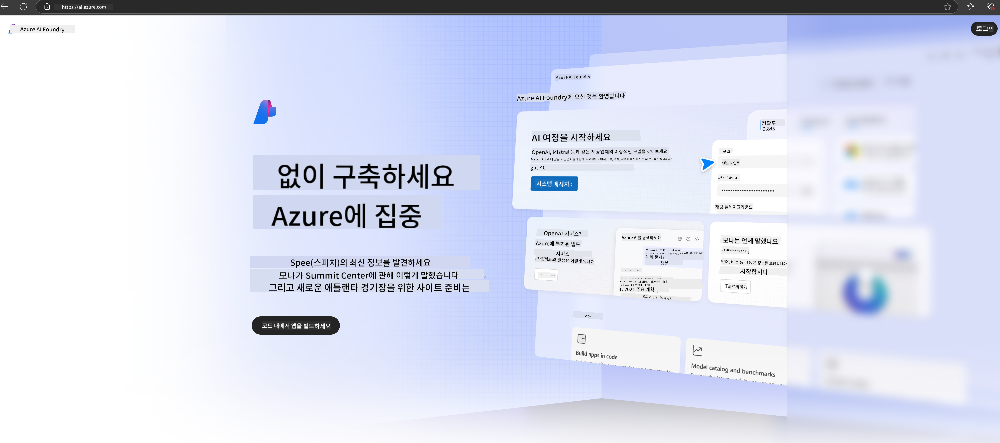

<!--
CO_OP_TRANSLATOR_METADATA:
{
  "original_hash": "6525689374197af33b41a93811e473a2",
  "translation_date": "2025-04-04T06:54:04+00:00",
  "source_file": "md\\02.QuickStart\\AzureAIFoundry_QuickStart.md",
  "language_code": "ko"
}
-->
# **Azure AI Foundry에서 Phi-3 사용하기**

생성형 AI의 발전과 함께, 우리는 다양한 LLM 및 SLM, 기업 데이터 통합, 미세 조정/RAG 작업, LLM 및 SLM 통합 후 다양한 기업 비즈니스 평가 등을 관리하기 위해 통합 플랫폼을 사용하고자 합니다. 이를 통해 생성형 AI의 스마트한 애플리케이션이 더 효과적으로 구현될 수 있습니다. [Azure AI Foundry](https://ai.azure.com)는 기업 수준의 생성형 AI 애플리케이션 플랫폼입니다.

Azure AI Foundry를 통해 대규모 언어 모델(LLM)의 응답을 평가하고, 프롬프트 플로우를 사용하여 프롬프트 애플리케이션 구성 요소를 조율하여 성능을 개선할 수 있습니다. 이 플랫폼은 개념 증명을 완전한 프로덕션으로 쉽게 전환할 수 있도록 확장성을 제공합니다. 지속적인 모니터링과 개선은 장기적인 성공을 지원합니다.

간단한 단계로 Azure AI Foundry에서 Phi-3 모델을 신속하게 배포하고, Azure AI Foundry를 사용하여 Phi-3 관련 Playground/Chat, 미세 조정, 평가 등 관련 작업을 완료할 수 있습니다.

## **1. 준비**

[Azure Developer CLI](https://learn.microsoft.com/azure/developer/azure-developer-cli/overview?WT.mc_id=aiml-138114-kinfeylo)가 이미 컴퓨터에 설치되어 있다면, 새 디렉토리에서 간단히 이 명령어를 실행하여 템플릿을 사용할 수 있습니다.

## 수동 생성

Microsoft Azure AI Foundry 프로젝트와 허브를 생성하면 AI 작업을 체계적으로 관리할 수 있습니다. 다음은 시작을 위한 단계별 가이드입니다:

### Azure AI Foundry에서 프로젝트 생성하기

1. **Azure AI Foundry로 이동**: Azure AI Foundry 포털에 로그인합니다.
2. **프로젝트 생성**:
   - 프로젝트 페이지에 있다면, 페이지 왼쪽 상단의 "Azure AI Foundry"를 선택하여 홈 페이지로 이동합니다.
   - "+ 프로젝트 생성"을 선택합니다.
   - 프로젝트 이름을 입력합니다.
   - 허브가 있다면 기본적으로 선택됩니다. 여러 허브에 접근할 수 있다면 드롭다운에서 다른 허브를 선택할 수 있습니다. 새 허브를 생성하려면 "새 허브 생성"을 선택하고 이름을 입력합니다.
   - "생성"을 선택합니다.

### Azure AI Foundry에서 허브 생성하기

1. **Azure AI Foundry로 이동**: Azure 계정으로 로그인합니다.
2. **허브 생성**:
   - 왼쪽 메뉴에서 관리 센터를 선택합니다.
   - "모든 리소스"를 선택한 후, "+ 새 프로젝트" 옆의 아래 화살표를 선택하고 "+ 새 허브"를 선택합니다.
   - "새 허브 생성" 대화 상자에서 허브 이름(예: contoso-hub)을 입력하고 나머지 필드를 원하는 대로 수정합니다.
   - "다음"을 선택하고 정보를 검토한 후 "생성"을 선택합니다.

자세한 지침은 공식 [Microsoft 문서](https://learn.microsoft.com/azure/ai-studio/how-to/create-projects)를 참고하세요.

생성이 완료되면 [ai.azure.com](https://ai.azure.com/)을 통해 생성한 스튜디오에 접근할 수 있습니다.

하나의 AI Foundry에 여러 프로젝트를 생성할 수 있습니다. AI Foundry에서 프로젝트를 생성하여 준비를 완료하세요.

Azure AI Foundry [빠른 시작](https://learn.microsoft.com/azure/ai-studio/quickstarts/get-started-code)

## **2. Azure AI Foundry에서 Phi 모델 배포하기**

프로젝트의 탐색 옵션을 클릭하여 모델 카탈로그로 이동한 후 Phi-3을 선택합니다.

Phi-3-mini-4k-instruct를 선택합니다.

'배포'를 클릭하여 Phi-3-mini-4k-instruct 모델을 배포합니다.

> [!NOTE]
>
> 배포 시 컴퓨팅 성능을 선택할 수 있습니다.

## **3. Azure AI Foundry에서 Phi와 Playground Chat**

배포 페이지로 이동하여 Playground를 선택하고 Azure AI Foundry의 Phi-3과 채팅합니다.

## **4. Azure AI Foundry에서 모델 배포하기**

Azure 모델 카탈로그에서 모델을 배포하려면 다음 단계를 따르세요:

- Azure AI Foundry에 로그인합니다.
- Azure AI Foundry 모델 카탈로그에서 배포하려는 모델을 선택합니다.
- 모델의 세부 정보 페이지에서 "배포"를 선택한 다음 "Azure AI Content Safety가 포함된 서버리스 API"를 선택합니다.
- 모델을 배포할 프로젝트를 선택합니다. 서버리스 API 제공을 사용하려면 워크스페이스가 East US 2 또는 Sweden Central 지역에 속해야 합니다. 배포 이름을 사용자 정의할 수 있습니다.
- 배포 마법사에서 가격 및 이용 약관을 확인합니다.
- "배포"를 선택합니다. 배포가 완료될 때까지 기다린 후 배포 페이지로 리디렉션됩니다.
- "Playground에서 열기"를 선택하여 모델과 상호작용을 시작합니다.
- 배포 페이지로 돌아가 배포를 선택하고, 엔드포인트의 Target URL 및 Secret Key를 확인하여 배포를 호출하고 결과를 생성할 수 있습니다.
- "빌드" 탭으로 이동하여 "구성 요소" 섹션의 "배포"를 선택하면 언제든지 엔드포인트의 세부 정보, URL 및 액세스 키를 확인할 수 있습니다.

> [!NOTE]
> 이러한 단계를 수행하려면 계정에 Resource Group에 대한 Azure AI Developer 역할 권한이 있어야 합니다.

## **5. Azure AI Foundry에서 Phi API 사용하기**

Postman의 GET을 통해 https://{Your project name}.region.inference.ml.azure.com/swagger.json에 접속하고 Key를 결합하여 제공된 인터페이스를 확인할 수 있습니다.

요청 매개변수와 응답 매개변수를 매우 편리하게 확인할 수 있습니다.

**면책 조항**:  
이 문서는 AI 번역 서비스 [Co-op Translator](https://github.com/Azure/co-op-translator)를 사용하여 번역되었습니다. 정확성을 위해 노력하고 있지만, 자동 번역에는 오류나 부정확성이 포함될 수 있음을 유의하시기 바랍니다. 원본 문서의 모국어 버전이 권위 있는 자료로 간주되어야 합니다. 중요한 정보에 대해서는 전문적인 인간 번역을 권장합니다. 이 번역 사용으로 인해 발생하는 오해나 잘못된 해석에 대해 당사는 책임을 지지 않습니다.