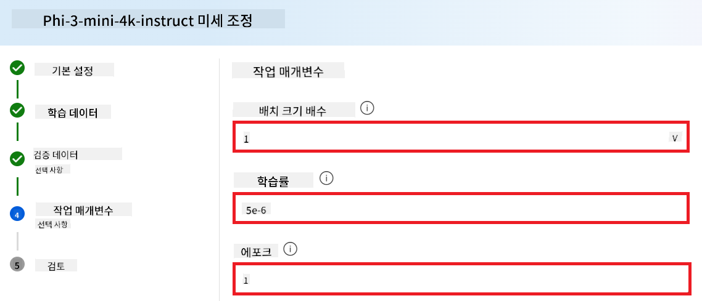

<!--
CO_OP_TRANSLATOR_METADATA:
{
  "original_hash": "c1559c5af6caccf6f623fd43a6b3a9a3",
  "translation_date": "2025-07-17T05:59:00+00:00",
  "source_file": "md/03.FineTuning/FineTuning_AIFoundry.md",
  "language_code": "ko"
}
-->
# Azure AI Foundry로 Phi-3 미니 미세 조정하기

Microsoft의 Phi-3 Mini 언어 모델을 Azure AI Foundry를 사용해 미세 조정하는 방법을 살펴보겠습니다. 미세 조정을 통해 Phi-3 Mini를 특정 작업에 맞게 조정하여 더욱 강력하고 상황에 맞는 모델로 만들 수 있습니다.

## 고려 사항

- **기능:** 어떤 모델들이 미세 조정이 가능한가요? 기본 모델을 어떤 작업에 맞게 조정할 수 있나요?
- **비용:** 미세 조정의 가격 모델은 어떻게 되나요?
- **맞춤화 가능성:** 기본 모델을 얼마나, 어떤 방식으로 수정할 수 있나요?
- **편의성:** 미세 조정은 실제로 어떻게 진행되나요? 별도의 코드를 작성해야 하나요? 직접 컴퓨팅 자원을 준비해야 하나요?
- **안전성:** 미세 조정된 모델은 안전성 위험이 알려져 있습니다. 의도치 않은 피해를 방지하기 위한 안전장치가 있나요?


## 미세 조정 준비

### 사전 조건

> [!NOTE]
> Phi-3 계열 모델의 경우, 종량제(pay-as-you-go) 미세 조정 기능은 **East US 2** 지역에 생성된 허브에서만 제공됩니다.

- Azure 구독이 필요합니다. 구독이 없다면 [유료 Azure 계정](https://azure.microsoft.com/pricing/purchase-options/pay-as-you-go)을 생성하세요.

- [AI Foundry 프로젝트](https://ai.azure.com?WT.mc_id=aiml-138114-kinfeylo).
- Azure 역할 기반 액세스 제어(Azure RBAC)를 통해 Azure AI Foundry 내 작업 권한이 부여됩니다. 이 문서의 단계를 수행하려면 사용자 계정에 리소스 그룹에 대한 __Azure AI Developer 역할__이 할당되어 있어야 합니다.

### 구독 공급자 등록

구독이 `Microsoft.Network` 리소스 공급자에 등록되어 있는지 확인하세요.

1. [Azure 포털](https://portal.azure.com)에 로그인합니다.
1. 왼쪽 메뉴에서 **구독**을 선택합니다.
1. 사용할 구독을 선택합니다.
1. 왼쪽 메뉴에서 **AI 프로젝트 설정** > **리소스 공급자**를 선택합니다.
1. **Microsoft.Network**가 리소스 공급자 목록에 있는지 확인하고, 없으면 추가합니다.

### 데이터 준비

모델을 미세 조정하기 위해 학습 및 검증 데이터를 준비하세요. 학습 데이터와 검증 데이터는 모델이 수행하기 원하는 작업에 대한 입력과 출력 예시로 구성됩니다.

모든 학습 예시가 추론에 적합한 형식을 따르는지 확인하세요. 효과적인 미세 조정을 위해서는 균형 잡히고 다양한 데이터셋이 필요합니다.

이는 데이터 균형 유지, 다양한 시나리오 포함, 그리고 실제 기대치에 맞게 주기적으로 학습 데이터를 개선하는 과정을 포함하며, 결과적으로 더 정확하고 균형 잡힌 모델 응답을 이끌어냅니다.

모델 유형에 따라 요구되는 학습 데이터 형식이 다릅니다.

### 채팅 완성(Chat Completion)

사용하는 학습 및 검증 데이터는 반드시 JSON Lines(JSONL) 형식이어야 합니다. `Phi-3-mini-128k-instruct`의 경우, 미세 조정 데이터셋은 Chat completions API에서 사용하는 대화 형식이어야 합니다.

### 예시 파일 형식

```json
    {"messages": [{"role": "system", "content": "You are an Xbox customer support agent whose primary goal is to help users with issues they are experiencing with their Xbox devices. You are friendly and concise. You only provide factual answers to queries, and do not provide answers that are not related to Xbox."}, {"role": "user", "content": "Is Xbox better than PlayStation?"}, {"role": "assistant", "content": "I apologize, but I cannot provide personal opinions. My primary job is to assist you with any issues related to your Xbox device. Do you have any Xbox-related issues that need addressing?"}]}
    {"messages": [{"role": "system", "content": "You are an Xbox customer support agent whose primary goal is to help users with issues they are experiencing with their Xbox devices. You are friendly and concise. You only provide factual answers to queries, and do not provide answers that are not related to Xbox."}, {"role": "user", "content": "Can I play PC games on my Xbox?"}, {"role": "assistant", "content": "While Xbox consoles don't natively support PC games, they can play an array of Xbox games, many of which are also available on PC. Can I assist you with finding games compatible with your Xbox device?"}]}
    {"messages": [{"role": "system", "content": "You are an Xbox customer support agent whose primary goal is to help users with issues they are experiencing with their Xbox devices. You are friendly and concise. You only provide factual answers to queries, and do not provide answers that are not related to Xbox."}, {"role": "user", "content": "I'm having trouble connecting my Xbox to the Wi-Fi."}, {"role": "assistant", "content": "No worries, let's go through the network settings on your Xbox. Can you please tell me what happens when you try to connect it to the Wi-Fi?"}]}
```

지원되는 파일 형식은 JSON Lines입니다. 파일은 기본 데이터 저장소에 업로드되어 프로젝트에서 사용할 수 있습니다.

## Azure AI Foundry로 Phi-3 미세 조정하기

Azure AI Foundry는 미세 조정이라는 과정을 통해 대형 언어 모델을 개인 데이터셋에 맞게 맞춤화할 수 있게 해줍니다. 미세 조정은 특정 작업과 애플리케이션에 맞게 최적화 및 커스터마이징할 수 있어 성능 향상, 비용 효율성, 지연 시간 감소, 맞춤형 출력 제공 등 큰 가치를 제공합니다.


### 새 프로젝트 만들기

1. [Azure AI Foundry](https://ai.azure.com)에 로그인합니다.

1. **+New project**를 선택해 새 프로젝트를 만듭니다.

    

1. 다음 작업을 수행합니다:

    - 프로젝트 **Hub 이름**을 입력합니다. 고유한 값이어야 합니다.
    - 사용할 **Hub**를 선택합니다(필요 시 새로 만듭니다).

    

1. 새 허브를 만들기 위해 다음 작업을 수행합니다:

    - **Hub 이름**을 입력합니다. 고유한 값이어야 합니다.
    - Azure **구독**을 선택합니다.
    - 사용할 **리소스 그룹**을 선택합니다(필요 시 새로 만듭니다).
    - 사용할 **지역(Location)**을 선택합니다.
    - 사용할 **Connect Azure AI Services**를 선택합니다(필요 시 새로 만듭니다).
    - **Connect Azure AI Search**는 **연결 건너뛰기**를 선택합니다.

    

1. **Next**를 선택합니다.
1. **Create a project**를 선택합니다.

### 데이터 준비

미세 조정 전에, 채팅 지침, 질문-답변 쌍 또는 기타 관련 텍스트 데이터 등 작업에 적합한 데이터셋을 수집하거나 생성하세요. 노이즈 제거, 결측값 처리, 토큰화 등으로 데이터를 정제하고 전처리합니다.

### Azure AI Foundry에서 Phi-3 모델 미세 조정하기

> [!NOTE]
> Phi-3 모델의 미세 조정은 현재 East US 2 지역에 위치한 프로젝트에서만 지원됩니다.

1. 왼쪽 탭에서 **Model catalog**를 선택합니다.

1. **검색창**에 *phi-3*를 입력하고 원하는 phi-3 모델을 선택합니다.

    

1. **Fine-tune**을 선택합니다.

    

1. **Fine-tuned model name**을 입력합니다.

    

1. **Next**를 선택합니다.

1. 다음 작업을 수행합니다:

    - **작업 유형(task type)**을 **Chat completion**으로 선택합니다.
    - 사용할 **학습 데이터**를 선택합니다. Azure AI Foundry의 데이터 또는 로컬 환경에서 업로드할 수 있습니다.

    

1. **Next**를 선택합니다.

1. 사용할 **검증 데이터**를 업로드하거나, **학습 데이터 자동 분할**을 선택할 수 있습니다.

    

1. **Next**를 선택합니다.

1. 다음 작업을 수행합니다:

    - 사용할 **배치 크기 배수기(Batch size multiplier)**를 선택합니다.
    - 사용할 **학습률(Learning rate)**을 선택합니다.
    - 사용할 **에포크(Epochs)** 수를 선택합니다.

    

1. **Submit**을 선택해 미세 조정 프로세스를 시작합니다.

    

1. 모델 미세 조정이 완료되면 상태가 **Completed**로 표시됩니다. 이제 모델을 배포하여 자체 애플리케이션, 플레이그라운드 또는 프롬프트 플로우에서 사용할 수 있습니다. 자세한 내용은 [Azure AI Foundry로 Phi-3 계열 소형 언어 모델 배포하기](https://learn.microsoft.com/azure/ai-studio/how-to/deploy-models-phi-3?tabs=phi-3-5&pivots=programming-language-python)를 참고하세요.

    

> [!NOTE]
> Phi-3 미세 조정에 대한 자세한 정보는 [Azure AI Foundry에서 Phi-3 모델 미세 조정하기](https://learn.microsoft.com/azure/ai-studio/how-to/fine-tune-phi-3?tabs=phi-3-mini)를 방문하세요.

## 미세 조정된 모델 정리하기

[Azure AI Foundry](https://ai.azure.com)의 미세 조정 모델 목록 또는 모델 상세 페이지에서 미세 조정된 모델을 삭제할 수 있습니다. 미세 조정 페이지에서 삭제할 모델을 선택한 후 삭제 버튼을 눌러 삭제하세요.

> [!NOTE]
> 기존에 배포된 커스텀 모델은 삭제할 수 없습니다. 커스텀 모델을 삭제하려면 먼저 모델 배포를 삭제해야 합니다.

## 비용 및 할당량

### 서비스로서 미세 조정된 Phi-3 모델의 비용 및 할당량 고려사항

서비스로서 미세 조정된 Phi 모델은 Microsoft에서 제공하며 Azure AI Foundry와 통합되어 사용됩니다. 모델을 [배포](https://learn.microsoft.com/azure/ai-studio/how-to/deploy-models-phi-3?tabs=phi-3-5&pivots=programming-language-python)하거나 미세 조정할 때 배포 마법사의 가격 및 조건 탭에서 가격 정보를 확인할 수 있습니다.

## 콘텐츠 필터링

종량제 서비스로 배포된 모델은 Azure AI Content Safety로 보호됩니다. 실시간 엔드포인트에 배포 시 이 기능을 선택 해제할 수 있습니다. Azure AI Content Safety가 활성화되면, 프롬프트와 완성 결과 모두 유해 콘텐츠를 탐지하고 차단하는 분류 모델 앙상블을 통과합니다. 콘텐츠 필터링 시스템은 입력 프롬프트와 출력 완성물 모두에서 잠재적으로 유해한 특정 카테고리의 콘텐츠를 탐지하고 조치를 취합니다. 자세한 내용은 [Azure AI Content Safety](https://learn.microsoft.com/azure/ai-studio/concepts/content-filtering)를 참고하세요.

**미세 조정 구성**

학습률, 배치 크기, 학습 에포크 수 등 하이퍼파라미터를 정의합니다.

**손실 함수**

작업에 적합한 손실 함수(예: 교차 엔트로피)를 선택합니다.

**최적화기**

학습 중 그래디언트 업데이트를 위한 최적화기(예: Adam)를 선택합니다.

**미세 조정 과정**

- 사전 학습된 모델 불러오기: Phi-3 Mini 체크포인트를 불러옵니다.
- 맞춤 레이어 추가: 작업별 레이어(예: 채팅 지침용 분류 헤드)를 추가합니다.

**모델 학습**

준비한 데이터셋으로 모델을 미세 조정합니다. 학습 진행 상황을 모니터링하고 필요에 따라 하이퍼파라미터를 조정하세요.

**평가 및 검증**

검증 세트: 데이터를 학습용과 검증용으로 분할합니다.

**성능 평가**

정확도, F1 점수, 혼란도(perplexity) 등의 지표를 사용해 모델 성능을 평가합니다.

## 미세 조정된 모델 저장

**체크포인트**

미세 조정된 모델 체크포인트를 저장해 나중에 사용할 수 있습니다.

## 배포

- 웹 서비스로 배포: 미세 조정된 모델을 Azure AI Foundry에서 웹 서비스로 배포합니다.
- 엔드포인트 테스트: 배포된 엔드포인트에 테스트 쿼리를 보내 기능을 확인합니다.

## 반복 및 개선

반복: 성능이 만족스럽지 않으면 하이퍼파라미터 조정, 데이터 추가, 추가 에포크 미세 조정 등을 통해 반복 개선하세요.

## 모니터링 및 정제

모델 동작을 지속적으로 모니터링하고 필요에 따라 정제합니다.

## 맞춤화 및 확장

맞춤 작업: Phi-3 Mini는 채팅 지침 외에도 다양한 작업에 맞게 미세 조정할 수 있습니다. 다른 활용 사례도 탐색해 보세요!
실험: 다양한 아키텍처, 레이어 조합, 기법을 시도해 성능을 향상시켜 보세요.

> [!NOTE]
> 미세 조정은 반복적인 과정입니다. 실험하고 배우며 모델을 조정해 특정 작업에 최적의 결과를 얻으세요!

**면책 조항**:  
이 문서는 AI 번역 서비스 [Co-op Translator](https://github.com/Azure/co-op-translator)를 사용하여 번역되었습니다. 정확성을 위해 최선을 다하고 있으나, 자동 번역에는 오류나 부정확한 부분이 있을 수 있음을 유의하시기 바랍니다. 원문은 해당 언어의 원본 문서가 권위 있는 출처로 간주되어야 합니다. 중요한 정보의 경우 전문적인 인간 번역을 권장합니다. 본 번역 사용으로 인해 발생하는 오해나 잘못된 해석에 대해 당사는 책임을 지지 않습니다.