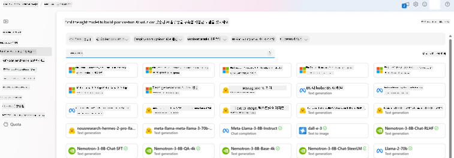
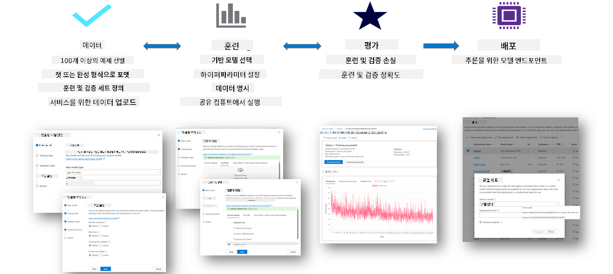
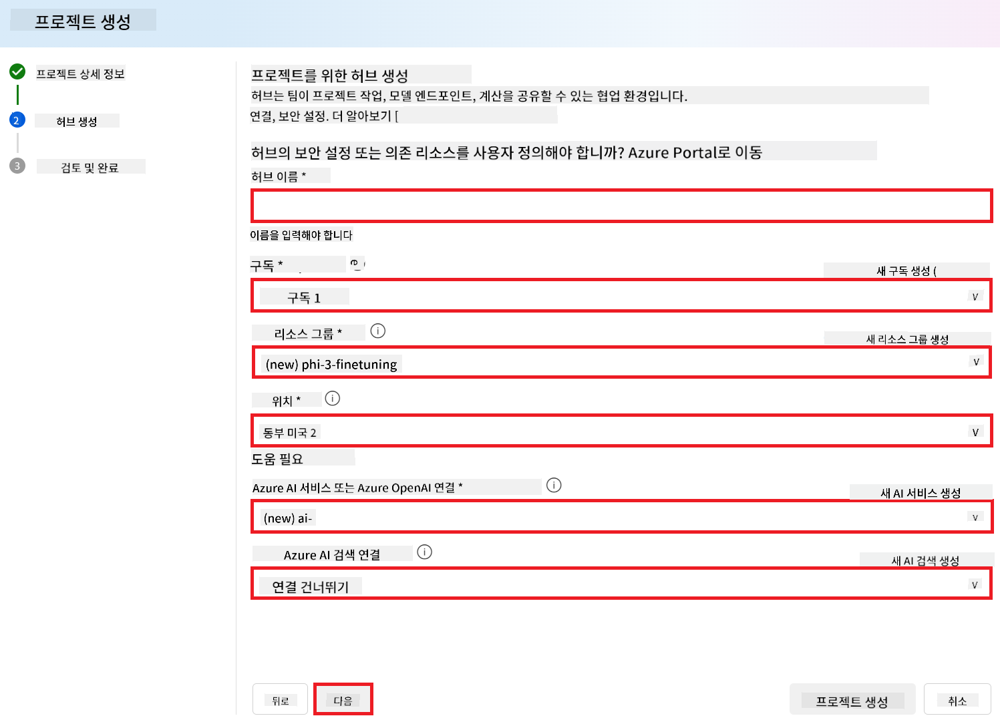
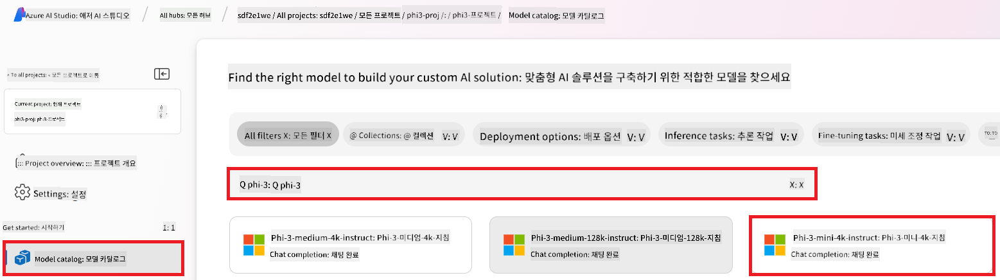
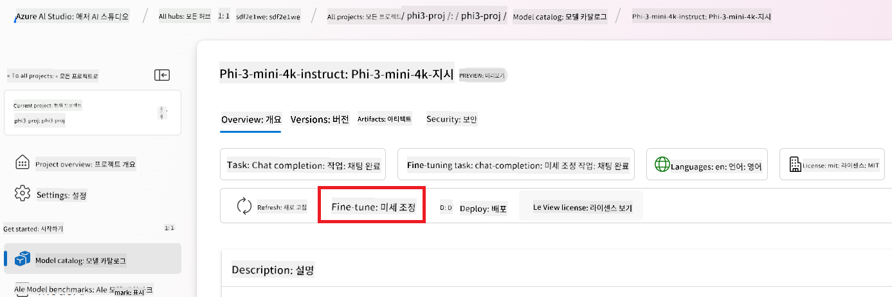
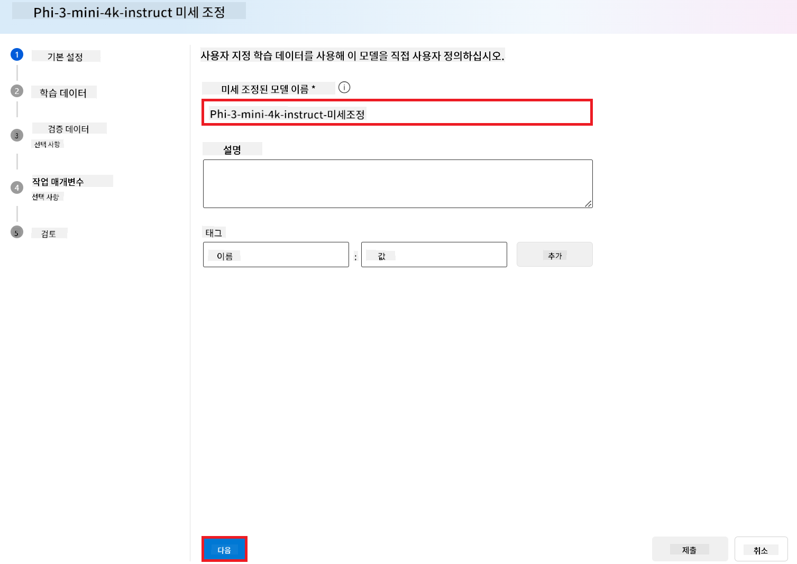
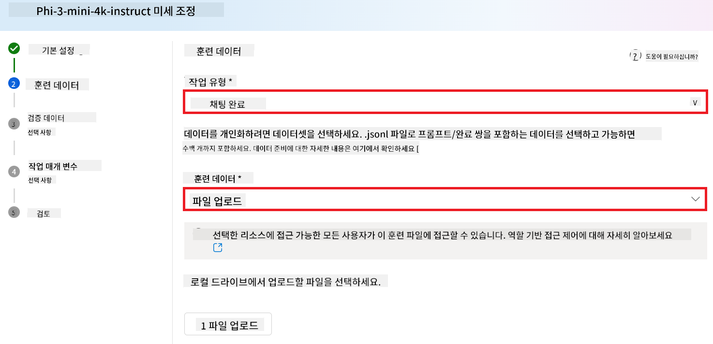
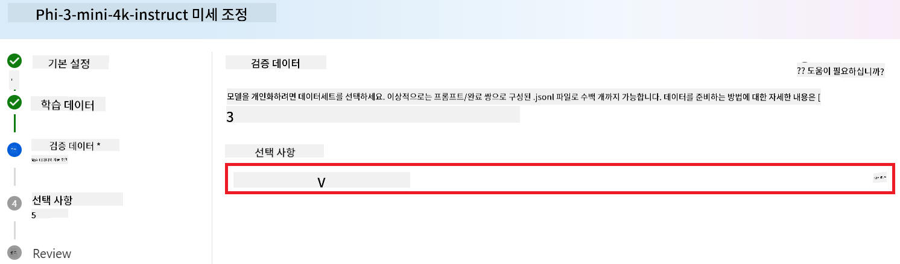
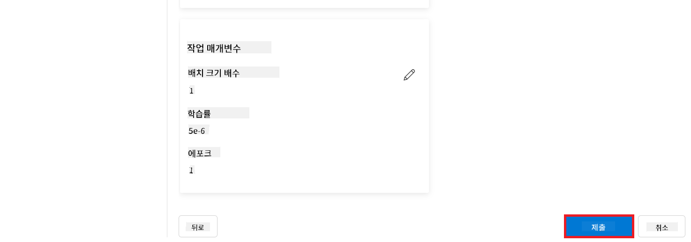
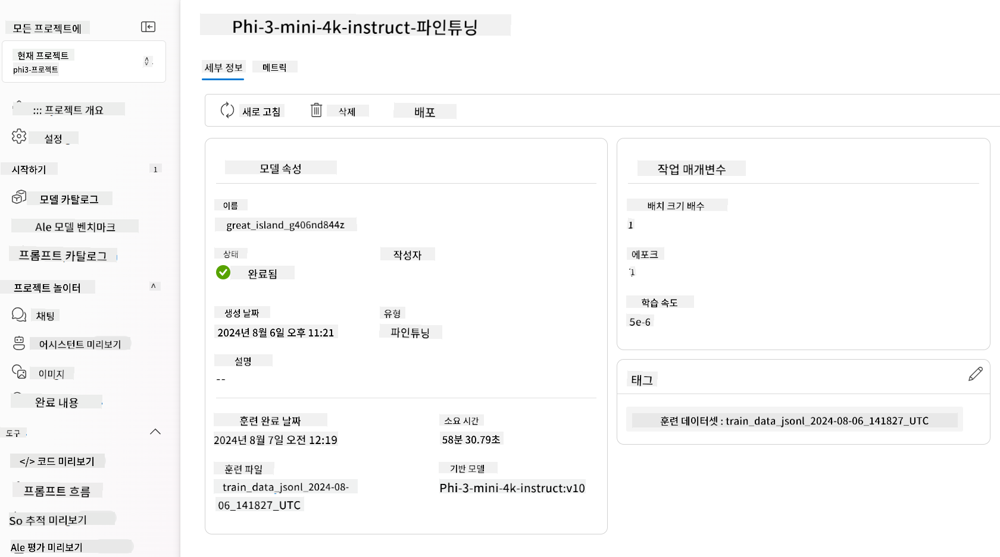

<!--
CO_OP_TRANSLATOR_METADATA:
{
  "original_hash": "94e7d7ab455720bab75ead5c28521c97",
  "translation_date": "2025-04-04T06:57:52+00:00",
  "source_file": "md\\03.FineTuning\\FineTuning_AIFoundry.md",
  "language_code": "ko"
}
-->
# Phi-3 미니 모델 Azure AI Foundry에서 세부 조정하기

Microsoft의 Phi-3 미니 언어 모델을 Azure AI Foundry를 사용해 세부 조정하는 방법을 알아봅시다. 세부 조정을 통해 Phi-3 미니 모델을 특정 작업에 맞게 최적화하여 더 강력하고 상황에 적합한 모델로 만들 수 있습니다.

## 고려사항

- **기능:** 어떤 모델이 세부 조정이 가능한가요? 기본 모델은 어떤 작업을 수행하도록 조정할 수 있나요?
- **비용:** 세부 조정의 가격 모델은 어떻게 되나요?
- **커스터마이징:** 기본 모델을 얼마나 수정할 수 있나요? 어떤 방식으로 수정이 가능한가요?
- **편리성:** 세부 조정은 실제로 어떻게 이루어지나요? 커스텀 코드를 작성해야 하나요? 자체 컴퓨팅 리소스를 준비해야 하나요?
- **안전성:** 세부 조정된 모델은 안전성 문제를 가질 수 있습니다. 의도치 않은 피해를 방지하기 위한 보호 장치가 있나요?



## 세부 조정을 위한 준비

### 사전 요구사항

> [!NOTE]
> Phi-3 모델군의 경우, 사용량 기반 요금제 세부 조정은 **East US 2** 지역에서 생성된 허브에서만 가능합니다.

- Azure 구독. Azure 구독이 없다면 [유료 Azure 계정 생성](https://azure.microsoft.com/pricing/purchase-options/pay-as-you-go)을 통해 시작하세요.

- [AI Foundry 프로젝트](https://ai.azure.com?WT.mc_id=aiml-138114-kinfeylo).
- Azure 역할 기반 액세스 제어(Azure RBAC)는 Azure AI Foundry에서 작업을 수행하기 위한 액세스를 부여하는 데 사용됩니다. 이 문서의 단계를 수행하려면 사용자 계정이 리소스 그룹에서 __Azure AI 개발자 역할__로 지정되어야 합니다.

### 구독 제공자 등록

구독이 `Microsoft.Network` 리소스 제공자에 등록되어 있는지 확인하세요.

1. [Azure 포털](https://portal.azure.com)에 로그인하세요.
1. 왼쪽 메뉴에서 **구독**을 선택하세요.
1. 사용할 구독을 선택하세요.
1. 왼쪽 메뉴에서 **AI 프로젝트 설정** > **리소스 제공자**를 선택하세요.
1. **Microsoft.Network**가 리소스 제공자 목록에 있는지 확인하세요. 없다면 추가하세요.

### 데이터 준비

모델을 세부 조정하기 위한 학습 데이터와 검증 데이터를 준비하세요. 학습 데이터와 검증 데이터 세트는 모델이 수행하기를 원하는 입력 및 출력 예제를 포함합니다.

모든 학습 예제가 추론에 대한 예상 형식을 따르도록 하세요. 모델을 효과적으로 세부 조정하려면 균형 잡히고 다양한 데이터 세트를 준비해야 합니다.

이는 데이터 균형을 유지하고 다양한 시나리오를 포함하며, 학습 데이터를 주기적으로 조정하여 실제 기대치에 맞추는 과정을 포함합니다. 이로써 모델의 응답이 더욱 정확하고 균형 있게 됩니다.

다른 모델 유형은 서로 다른 형식의 학습 데이터를 요구합니다.

### 채팅 완료

사용하는 학습 데이터와 검증 데이터는 **JSON Lines(JSONL)** 형식으로 작성되어야 합니다. `Phi-3-mini-128k-instruct`의 세부 조정 데이터 세트는 Chat completions API에서 사용하는 대화 형식으로 구성되어야 합니다.

### 예제 파일 형식

```json
    {"messages": [{"role": "system", "content": "You are an Xbox customer support agent whose primary goal is to help users with issues they are experiencing with their Xbox devices. You are friendly and concise. You only provide factual answers to queries, and do not provide answers that are not related to Xbox."}, {"role": "user", "content": "Is Xbox better than PlayStation?"}, {"role": "assistant", "content": "I apologize, but I cannot provide personal opinions. My primary job is to assist you with any issues related to your Xbox device. Do you have any Xbox-related issues that need addressing?"}]}
    {"messages": [{"role": "system", "content": "You are an Xbox customer support agent whose primary goal is to help users with issues they are experiencing with their Xbox devices. You are friendly and concise. You only provide factual answers to queries, and do not provide answers that are not related to Xbox."}, {"role": "user", "content": "Can I play PC games on my Xbox?"}, {"role": "assistant", "content": "While Xbox consoles don't natively support PC games, they can play an array of Xbox games, many of which are also available on PC. Can I assist you with finding games compatible with your Xbox device?"}]}
    {"messages": [{"role": "system", "content": "You are an Xbox customer support agent whose primary goal is to help users with issues they are experiencing with their Xbox devices. You are friendly and concise. You only provide factual answers to queries, and do not provide answers that are not related to Xbox."}, {"role": "user", "content": "I'm having trouble connecting my Xbox to the Wi-Fi."}, {"role": "assistant", "content": "No worries, let's go through the network settings on your Xbox. Can you please tell me what happens when you try to connect it to the Wi-Fi?"}]}
```

지원되는 파일 형식은 JSON Lines입니다. 파일은 기본 데이터 저장소에 업로드되어 프로젝트에서 사용할 수 있습니다.

## Azure AI Foundry를 사용한 Phi-3 세부 조정

Azure AI Foundry를 사용하면 세부 조정이라는 프로세스를 통해 대규모 언어 모델을 개인 데이터 세트에 맞게 조정할 수 있습니다. 세부 조정은 특정 작업과 애플리케이션에 맞춰 커스터마이징 및 최적화를 가능하게 해줍니다. 이를 통해 성능 향상, 비용 효율성, 지연 시간 감소, 맞춤형 출력이라는 주요 가치를 제공합니다.



### 새 프로젝트 생성

1. [Azure AI Foundry](https://ai.azure.com)에 로그인하세요.

1. **+새 프로젝트**를 선택하여 Azure AI Foundry에서 새 프로젝트를 생성하세요.

    

1. 다음 작업을 수행하세요:

    - 프로젝트 **허브 이름**. 고유한 값이어야 합니다.
    - 사용할 **허브**를 선택하세요(필요한 경우 새로 생성).

    

1. 새 허브를 생성하기 위해 다음 작업을 수행하세요:

    - **허브 이름**을 입력하세요. 고유한 값이어야 합니다.
    - Azure **구독**을 선택하세요.
    - 사용할 **리소스 그룹**을 선택하세요(필요한 경우 새로 생성).
    - 사용할 **위치**를 선택하세요.
    - 사용할 **Azure AI 서비스 연결**을 선택하세요(필요한 경우 새로 생성).
    - **Azure AI 검색 연결**을 **연결 건너뛰기**로 설정하세요.

    

1. **다음**을 선택하세요.
1. **프로젝트 생성**을 선택하세요.

### 데이터 준비

세부 조정 전에 채팅 지침, 질문-답변 쌍 또는 기타 관련 텍스트 데이터와 같은 작업과 관련된 데이터 세트를 수집하거나 생성하세요. 데이터의 노이즈를 제거하고 누락된 값을 처리하며 텍스트를 토큰화하여 데이터를 정리하고 전처리하세요.

### Azure AI Foundry에서 Phi-3 모델 세부 조정

> [!NOTE]
> Phi-3 모델의 세부 조정은 현재 East US 2 지역의 프로젝트에서 지원됩니다.

1. 왼쪽 탭에서 **모델 카탈로그**를 선택하세요.

1. **검색창**에 *phi-3*를 입력하고 사용할 phi-3 모델을 선택하세요.

    

1. **세부 조정**을 선택하세요.

    

1. **세부 조정된 모델 이름**을 입력하세요.

    

1. **다음**을 선택하세요.

1. 다음 작업을 수행하세요:

    - **작업 유형**을 **채팅 완료**로 선택하세요.
    - 사용할 **학습 데이터**를 선택하세요. Azure AI Foundry의 데이터를 통해 업로드하거나 로컬 환경에서 업로드할 수 있습니다.

    

1. **다음**을 선택하세요.

1. 사용할 **검증 데이터**를 업로드하거나 **학습 데이터의 자동 분할**을 선택할 수 있습니다.

    

1. **다음**을 선택하세요.

1. 다음 작업을 수행하세요:

    - 사용할 **배치 크기 배율**을 선택하세요.
    - 사용할 **학습률**을 선택하세요.
    - 사용할 **에포크**를 선택하세요.

    

1. **제출**을 선택하여 세부 조정 프로세스를 시작하세요.

    

1. 모델이 세부 조정되면 상태가 **완료됨**으로 표시됩니다. 이제 모델을 배포하여 애플리케이션, 플레이그라운드 또는 프롬프트 흐름에서 사용할 수 있습니다. 자세한 내용은 [Azure AI Foundry에서 Phi-3 소형 언어 모델 배포 방법](https://learn.microsoft.com/azure/ai-studio/how-to/deploy-models-phi-3?tabs=phi-3-5&pivots=programming-language-python)을 참조하세요.

    

> [!NOTE]
> Phi-3 세부 조정에 대한 자세한 정보는 [Azure AI Foundry에서 Phi-3 모델 세부 조정](https://learn.microsoft.com/azure/ai-studio/how-to/fine-tune-phi-3?tabs=phi-3-mini)을 참조하세요.

## 세부 조정된 모델 정리

세부 조정된 모델은 [Azure AI Foundry](https://ai.azure.com)의 세부 조정 모델 목록 또는 모델 세부 정보 페이지에서 삭제할 수 있습니다. 세부 조정 페이지에서 삭제하려는 세부 조정 모델을 선택한 다음 삭제 버튼을 선택하여 모델을 삭제하세요.

> [!NOTE]
> 기존 배포가 있는 커스텀 모델은 삭제할 수 없습니다. 먼저 모델 배포를 삭제한 후 커스텀 모델을 삭제해야 합니다.

## 비용 및 할당량

### 서비스로 세부 조정된 Phi-3 모델의 비용 및 할당량 고려사항

서비스로 세부 조정된 Phi 모델은 Microsoft에서 제공되며 Azure AI Foundry와 통합되어 사용됩니다. 모델을 [배포](https://learn.microsoft.com/azure/ai-studio/how-to/deploy-models-phi-3?tabs=phi-3-5&pivots=programming-language-python)하거나 세부 조정할 때 배포 마법사의 가격 및 약관 탭에서 가격 정보를 확인할 수 있습니다.

## 콘텐츠 필터링

사용량 기반 요금제로 서비스로 배포된 모델은 Azure AI 콘텐츠 안전으로 보호됩니다. 실시간 엔드포인트에 배포할 때 이 기능을 선택적으로 비활성화할 수 있습니다. Azure AI 콘텐츠 안전이 활성화되면 프롬프트와 완료 모두 유해 콘텐츠 출력을 감지하고 방지하기 위한 분류 모델 집합을 통해 처리됩니다. 콘텐츠 필터링 시스템은 입력 프롬프트와 출력 완료에서 잠재적으로 유해한 콘텐츠의 특정 카테고리를 감지하고 조치를 취합니다. 자세한 내용은 [Azure AI 콘텐츠 안전](https://learn.microsoft.com/azure/ai-studio/concepts/content-filtering)을 참조하세요.

**세부 조정 구성**

하이퍼파라미터: 학습률, 배치 크기, 학습 에포크 수와 같은 하이퍼파라미터를 정의하세요.

**손실 함수**

작업에 적합한 손실 함수(예: 교차 엔트로피)를 선택하세요.

**최적화 도구**

학습 중 경사 업데이트를 위한 최적화 도구(예: Adam)를 선택하세요.

**세부 조정 프로세스**

- 사전 학습된 모델 로드: Phi-3 미니 체크포인트를 로드하세요.
- 커스텀 레이어 추가: 작업별 레이어 추가(예: 채팅 지침을 위한 분류 헤드).

**모델 학습**
준비된 데이터 세트를 사용하여 모델을 세부 조정하세요. 학습 진행 상황을 모니터링하고 필요에 따라 하이퍼파라미터를 조정하세요.

**평가 및 검증**

검증 세트: 데이터를 학습 세트와 검증 세트로 분할하세요.

**성능 평가**

정확성, F1 점수, 또는 퍼플렉시티와 같은 지표를 사용하여 모델 성능을 평가하세요.

## 세부 조정된 모델 저장

**체크포인트**
세부 조정된 모델 체크포인트를 저장하여 나중에 사용할 수 있도록 하세요.

## 배포

- 웹 서비스로 배포: 세부 조정된 모델을 Azure AI Foundry에서 웹 서비스로 배포하세요.
- 엔드포인트 테스트: 배포된 엔드포인트에 테스트 쿼리를 보내 기능을 확인하세요.

## 반복 및 개선

반복: 성능이 만족스럽지 않다면 하이퍼파라미터를 조정하거나 데이터를 추가하거나 추가 에포크를 통해 세부 조정을 반복하세요.

## 모니터링 및 조정

모델의 동작을 지속적으로 모니터링하고 필요에 따라 조정하세요.

## 커스터마이징 및 확장

커스텀 작업: Phi-3 미니는 채팅 지침 외에도 다양한 작업에 맞게 세부 조정할 수 있습니다. 다른 사용 사례를 탐색해보세요!
실험: 성능을 향상시키기 위해 다양한 아키텍처, 레이어 조합, 기술을 시도해보세요.

> [!NOTE]
> 세부 조정은 반복적인 프로세스입니다. 실험하고, 배우고, 모델을 적응시켜 특정 작업에서 최상의 결과를 얻으세요!

**면책 조항**:  
이 문서는 AI 번역 서비스 [Co-op Translator](https://github.com/Azure/co-op-translator)를 사용하여 번역되었습니다. 정확성을 위해 최선을 다하고 있지만, 자동 번역에는 오류나 부정확한 내용이 포함될 수 있습니다. 원본 문서(원어로 작성된 문서)를 신뢰할 수 있는 권위 있는 자료로 간주해야 합니다. 중요한 정보의 경우, 전문 번역사의 번역을 권장합니다. 이 번역을 사용함으로써 발생할 수 있는 오해나 잘못된 해석에 대해 당사는 책임을 지지 않습니다.