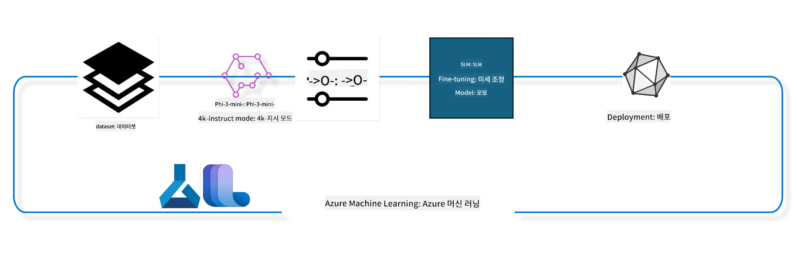

## Azure ML 시스템 레지스트리의 채팅 완성 컴포넌트를 사용하여 모델 미세 조정하는 방법

이 예제에서는 ultrachat_200k 데이터셋을 사용하여 Phi-3-mini-4k-instruct 모델을 두 사람 간 대화 완료 작업에 맞춰 미세 조정하는 과정을 다룹니다.



이 예제에서는 Azure ML SDK와 Python을 사용하여 미세 조정을 수행하는 방법을 보여주고, 그 후 미세 조정된 모델을 온라인 엔드포인트에 배포하여 실시간 추론에 활용하는 방법을 설명합니다.

### 학습 데이터

ultrachat_200k 데이터셋을 사용합니다. 이 데이터셋은 UltraChat 데이터셋을 엄격하게 필터링한 버전으로, 최첨단 7B 채팅 모델인 Zephyr-7B-β를 훈련하는 데 사용되었습니다.

### 모델

채팅 완성 작업을 위해 사용자가 모델을 미세 조정하는 방법을 보여주기 위해 Phi-3-mini-4k-instruct 모델을 사용합니다. 특정 모델 카드에서 이 노트북을 열었다면 해당 모델 이름으로 교체하는 것을 잊지 마세요.

### 작업

- 미세 조정할 모델 선택
- 학습 데이터 선택 및 탐색
- 미세 조정 작업 구성
- 미세 조정 작업 실행
- 학습 및 평가 지표 검토
- 미세 조정된 모델 등록
- 실시간 추론용 미세 조정 모델 배포
- 리소스 정리

## 1. 사전 요구 사항 설정

- 종속성 설치
- AzureML 워크스페이스에 연결. SDK 인증 설정에 대해 자세히 알아보세요. 아래에서 <WORKSPACE_NAME>, <RESOURCE_GROUP>, <SUBSCRIPTION_ID>를 교체하세요.
- azureml 시스템 레지스트리에 연결
- 선택적 실험 이름 설정
- 컴퓨트 확인 또는 생성

> [!NOTE]
> 하나의 GPU 노드가 여러 GPU 카드를 가질 수 있습니다. 예를 들어 Standard_NC24rs_v3 노드 하나에는 NVIDIA V100 GPU 4개가 있고, Standard_NC12s_v3에는 NVIDIA V100 GPU 2개가 있습니다. 자세한 내용은 문서를 참고하세요. 노드당 GPU 카드 수는 아래 파라미터 gpus_per_node에서 설정됩니다. 이 값을 올바르게 설정하면 노드 내 모든 GPU를 활용할 수 있습니다. 권장 GPU 컴퓨트 SKU는 여기와 여기에서 확인할 수 있습니다.

### Python 라이브러리

아래 셀을 실행하여 종속성을 설치하세요. 새 환경에서 실행할 경우 이 단계는 선택사항이 아닙니다.

```bash
pip install azure-ai-ml
pip install azure-identity
pip install datasets==2.9.0
pip install mlflow
pip install azureml-mlflow
```

### Azure ML과 상호작용

1. 이 Python 스크립트는 Azure Machine Learning(Azure ML) 서비스와 상호작용하는 데 사용됩니다. 주요 내용은 다음과 같습니다:

    - azure.ai.ml, azure.identity, azure.ai.ml.entities 패키지에서 필요한 모듈을 가져오고 time 모듈도 불러옵니다.

    - DefaultAzureCredential()을 사용해 인증을 시도하며, 이것은 Azure 클라우드에서 빠르게 개발을 시작하는 간편한 인증 방법입니다. 실패 시 대화형 로그인 프롬프트를 띄우는 InteractiveBrowserCredential()로 대체합니다.

    - 기본 config 파일(config.json)에서 설정을 읽어 MLClient 인스턴스를 from_config 메서드로 생성하려 시도하며, 실패하면 subscription_id, resource_group_name, workspace_name을 수동으로 전달해 MLClient를 생성합니다.

    - "azureml"이라는 이름의 Azure ML 레지스트리에 대한 MLClient 인스턴스를 별도로 생성하며, 이 레지스트리는 모델, 미세 조정 파이프라인, 환경 등이 저장되는 곳입니다.

    - experiment_name을 "chat_completion_Phi-3-mini-4k-instruct"로 설정합니다.

    - 현재 시간을 정수로 변환해 문자열로 만들어 고유한 타임스탬프를 만듭니다. 이 타임스탬프는 고유한 이름 및 버전을 생성하는 데 사용할 수 있습니다.

    ```python
    # Azure ML 및 Azure Identity에서 필요한 모듈을 가져오기
    from azure.ai.ml import MLClient
    from azure.identity import (
        DefaultAzureCredential,
        InteractiveBrowserCredential,
    )
    from azure.ai.ml.entities import AmlCompute
    import time  # 시간 모듈 가져오기
    
    # DefaultAzureCredential을 사용하여 인증 시도
    try:
        credential = DefaultAzureCredential()
        credential.get_token("https://management.azure.com/.default")
    except Exception as ex:  # DefaultAzureCredential이 실패하면 InteractiveBrowserCredential 사용
        credential = InteractiveBrowserCredential()
    
    # 기본 구성 파일을 사용하여 MLClient 인스턴스 생성 시도
    try:
        workspace_ml_client = MLClient.from_config(credential=credential)
    except:  # 실패하면 세부 정보를 수동으로 제공하여 MLClient 인스턴스 생성
        workspace_ml_client = MLClient(
            credential,
            subscription_id="<SUBSCRIPTION_ID>",
            resource_group_name="<RESOURCE_GROUP>",
            workspace_name="<WORKSPACE_NAME>",
        )
    
    # "azureml"이라는 이름의 Azure ML 레지스트리용 MLClient 인스턴스 또 생성
    # 이 레지스트리는 모델, 미세 조정 파이프라인, 환경이 저장되는 장소
    registry_ml_client = MLClient(credential, registry_name="azureml")
    
    # 실험 이름 설정
    experiment_name = "chat_completion_Phi-3-mini-4k-instruct"
    
    # 고유해야 하는 이름과 버전에 사용할 수 있는 고유한 타임스탬프 생성
    timestamp = str(int(time.time()))
    ```

## 2. 미세 조정할 기본 모델 선택

1. Phi-3-mini-4k-instruct는 3.8B 파라미터의 경량급 최첨단 오픈 모델로 Phi-2에서 사용한 데이터셋을 기반으로 만들어졌습니다. 이 모델은 Phi-3 모델 계열에 속하며, Mini 버전은 4K 및 128K 두 가지 변형이 있으며 이는 지원 가능한 컨텍스트 길이(토큰 단위)를 의미합니다. 우리는 특정 용도를 위해 모델을 미세 조정해야 합니다. AzureML Studio의 모델 카탈로그에서 채팅 완성 작업 필터를 사용하여 이러한 모델을 탐색할 수 있습니다. 이 예제에서는 Phi-3-mini-4k-instruct 모델을 사용하며, 다른 모델로 이 노트북을 열었다면 모델 이름과 버전을 적절히 교체하세요.

> [!NOTE]
> 모델의 id 속성은 미세 조정 작업의 입력으로 전달됩니다. 이는 AzureML Studio 모델 카탈로그의 모델 상세 페이지에서 자산 ID 필드로도 확인할 수 있습니다.

2. 이 Python 스크립트는 Azure Machine Learning(Azure ML) 서비스와 상호작용합니다. 주요 내용은 다음과 같습니다:

    - model_name을 "Phi-3-mini-4k-instruct"로 설정합니다.

    - registry_ml_client 객체의 models 속성에서 get 메서드를 호출, 지정한 이름의 최신 버전 모델을 Azure ML 레지스트리에서 가져옵니다. get 메서드는 모델 이름과 최신 버전임을 지정하는 레이블 두 인수를 받습니다.

    - 콘솔에 미세 조정에 사용할 모델 이름, 버전, id를 출력합니다. 이는 문자열의 format 메서드로 삽입하며, 해당 속성은 foundation_model 객체에서 가져옵니다.

    ```python
    # 모델 이름 설정
    model_name = "Phi-3-mini-4k-instruct"
    
    # Azure ML 레지스트리에서 모델의 최신 버전 가져오기
    foundation_model = registry_ml_client.models.get(model_name, label="latest")
    
    # 모델 이름, 버전 및 ID 출력
    # 이 정보는 추적 및 디버깅에 유용합니다
    print(
        "\n\nUsing model name: {0}, version: {1}, id: {2} for fine tuning".format(
            foundation_model.name, foundation_model.version, foundation_model.id
        )
    )
    ```

## 3. 작업에 사용할 컴퓨트 생성

미세 조정 작업은 GPU 컴퓨트에서만 작동합니다. 컴퓨트 크기는 모델 크기에 따라 달라지며, 적절한 컴퓨트를 선정하는 것이 쉽지 않은 경우가 많습니다. 이 셀에서는 사용자가 작업에 맞는 컴퓨트를 선택하도록 가이드합니다.

> [!NOTE]
> 아래 나열된 컴퓨트는 가장 최적화된 구성으로 동작합니다. 구성을 변경하면 Cuda Out Of Memory 오류가 발생할 수 있습니다. 이런 경우 더 큰 컴퓨트 크기로 업그레이드하세요.

> [!NOTE]
> compute_cluster_size 선택 시 컴퓨트가 해당 리소스 그룹에 존재하는지 반드시 확인하세요. 특정 컴퓨트가 없으면 컴퓨트 리소스 접근 권한 요청을 해야 합니다.

### 미세 조정 지원 여부 확인

1. 이 Python 스크립트는 Azure Machine Learning(Azure ML) 모델과 상호작용합니다. 주요 내용은 다음과 같습니다:

    - Python 구문 트리를 처리하기 위한 ast 모듈을 가져옵니다.

    - foundation_model 객체가 finetune_compute_allow_list라는 태그를 가지고 있는지 확인합니다. Azure ML의 태그는 필터 및 정렬에 사용하는 키-값 쌍입니다.

    - finetune_compute_allow_list 태그가 있으면 ast.literal_eval 함수를 사용해 태그 값을 문자열에서 안전하게 파이썬 리스트로 변환하여 computes_allow_list 변수에 할당합니다. 그런 뒤 리스트에서 컴퓨트를 생성해야 한다는 메시지를 출력합니다.

    - 태그가 없으면 computes_allow_list를 None으로 설정하고 해당 태그가 모델 태그에 없다는 메시지를 출력합니다.

    - 요약하면, 모델 메타데이터에 특정 태그가 있는지 확인하고 있다면 그 값을 리스트로 변환하며 사용자에게 상황을 알리는 스크립트입니다.

    ```python
    # Python 추상 구문 문법 트리 처리를 위한 함수를 제공하는 ast 모듈을 가져옵니다
    import ast
    
    # 모델의 태그에 'finetune_compute_allow_list' 태그가 존재하는지 확인합니다
    if "finetune_compute_allow_list" in foundation_model.tags:
        # 태그가 존재하면 ast.literal_eval을 사용해 태그의 값(문자열)을 안전하게 Python 리스트로 구문 분석합니다
        computes_allow_list = ast.literal_eval(
            foundation_model.tags["finetune_compute_allow_list"]
        )  # 문자열을 파이썬 리스트로 변환합니다
        # 리스트로부터 컴퓨트를 생성해야 한다는 메시지를 출력합니다
        print(f"Please create a compute from the above list - {computes_allow_list}")
    else:
        # 태그가 없으면 computes_allow_list를 None으로 설정합니다
        computes_allow_list = None
        # 'finetune_compute_allow_list' 태그가 모델 태그에 포함되어 있지 않다는 메시지를 출력합니다
        print("`finetune_compute_allow_list` is not part of model tags")
    ```

### 컴퓨트 인스턴스 확인

1. 이 Python 스크립트는 Azure Machine Learning(Azure ML) 서비스와 상호작용하며 컴퓨트 인스턴스를 점검합니다. 주요 내용은 다음과 같습니다:

    - compute_cluster에 저장된 이름의 컴퓨트 인스턴스를 Azure ML 워크스페이스에서 가져오려 시도합니다. 프로비저닝 상태가 "failed"이면 ValueError를 발생시킵니다.

    - computes_allow_list가 None이 아니면 리스트 내 모든 컴퓨트 크기를 소문자로 변환 후 현재 컴퓨트 크기가 포함되어 있는지 확인하고, 포함되지 않으면 ValueError를 발생시킵니다.

    - computes_allow_list가 None이라면 현재 컴퓨트 크기가 지원하지 않는 GPU VM 크기 목록에 있는지 확인하고, 있으면 ValueError를 발생시킵니다.

    - 워크스페이스의 모든 사용 가능한 컴퓨트 크기 목록을 가져옵니다. 리스트를 반복하며 현재 컴퓨트 크기와 이름이 일치하는 경우 해당 컴퓨트 크기의 GPU 수를 조회해 gpu_count_found를 True로 설정합니다.

    - gpu_count_found가 True면 컴퓨트 인스턴스의 GPU 수를 출력하고, False면 ValueError를 발생시킵니다.

    - 요약하면, 이 스크립트는 Azure ML 워크스페이스 내 컴퓨트 인스턴스를 여러 조건으로 점검합니다: 프로비저닝 상태, 허용 목록 및 거부 목록 크기, GPU 수 확인 등이 포함됩니다.

    
    ```python
    # 예외 메시지를 출력합니다
    print(e)
    # 작업 영역에 사용 가능한 컴퓨트 크기가 없으면 ValueError를 발생시킵니다
    raise ValueError(
        f"WARNING! Compute size {compute_cluster_size} not available in workspace"
    )
    
    # Azure ML 작업 영역에서 컴퓨트 인스턴스를 가져옵니다
    compute = workspace_ml_client.compute.get(compute_cluster)
    # 컴퓨트 인스턴스의 프로비저닝 상태가 "failed"(실패)인지 확인합니다
    if compute.provisioning_state.lower() == "failed":
        # 프로비저닝 상태가 "failed"(실패)인 경우 ValueError를 발생시킵니다
        raise ValueError(
            f"Provisioning failed, Compute '{compute_cluster}' is in failed state. "
            f"please try creating a different compute"
        )
    
    # computes_allow_list가 None이 아닌지 확인합니다
    if computes_allow_list is not None:
        # computes_allow_list의 모든 컴퓨트 크기를 소문자로 변환합니다
        computes_allow_list_lower_case = [x.lower() for x in computes_allow_list]
        # 컴퓨트 인스턴스의 크기가 computes_allow_list_lower_case에 있는지 확인합니다
        if compute.size.lower() not in computes_allow_list_lower_case:
            # 컴퓨트 인스턴스의 크기가 computes_allow_list_lower_case에 없으면 ValueError를 발생시킵니다
            raise ValueError(
                f"VM size {compute.size} is not in the allow-listed computes for finetuning"
            )
    else:
        # 지원되지 않는 GPU VM 크기 목록을 정의합니다
        unsupported_gpu_vm_list = [
            "standard_nc6",
            "standard_nc12",
            "standard_nc24",
            "standard_nc24r",
        ]
        # 컴퓨트 인스턴스의 크기가 unsupported_gpu_vm_list에 있는지 확인합니다
        if compute.size.lower() in unsupported_gpu_vm_list:
            # 컴퓨트 인스턴스의 크기가 unsupported_gpu_vm_list에 있으면 ValueError를 발생시킵니다
            raise ValueError(
                f"VM size {compute.size} is currently not supported for finetuning"
            )
    
    # 컴퓨트 인스턴스에서 GPU 수를 찾았는지 확인하는 플래그를 초기화합니다
    gpu_count_found = False
    # 작업 영역에서 사용 가능한 모든 컴퓨트 크기 목록을 가져옵니다
    workspace_compute_sku_list = workspace_ml_client.compute.list_sizes()
    available_sku_sizes = []
    # 사용 가능한 컴퓨트 크기 목록을 반복합니다
    for compute_sku in workspace_compute_sku_list:
        available_sku_sizes.append(compute_sku.name)
        # 컴퓨트 크기 이름이 컴퓨트 인스턴스 크기와 일치하는지 확인합니다
        if compute_sku.name.lower() == compute.size.lower():
            # 일치하면 해당 컴퓨트 크기의 GPU 수를 가져오고 gpu_count_found를 True로 설정합니다
            gpus_per_node = compute_sku.gpus
            gpu_count_found = True
    # gpu_count_found가 True이면 컴퓨트 인스턴스의 GPU 수를 출력합니다
    if gpu_count_found:
        print(f"Number of GPU's in compute {compute.size}: {gpus_per_node}")
    else:
        # gpu_count_found가 False이면 ValueError를 발생시킵니다
        raise ValueError(
            f"Number of GPU's in compute {compute.size} not found. Available skus are: {available_sku_sizes}."
            f"This should not happen. Please check the selected compute cluster: {compute_cluster} and try again."
        )
    ```

## 4. 모델 미세 조정을 위한 데이터셋 선택

1. ultrachat_200k 데이터셋을 사용합니다. 이 데이터셋은 Supervised fine-tuning(sft)에 적합한 네 가지 분할(split)을 포함하고 있습니다.
생성 랭킹(gen). 분할 당 예제 수는 아래와 같습니다:

    ```bash
    train_sft test_sft  train_gen  test_gen
    207865  23110  256032  28304
    ```

1. 다음 셀들은 미세 조정을 위한 기본 데이터 준비를 보여줍니다:

### 일부 데이터 행 시각화

빠르게 샘플 실행을 원하므로 이미 다듬어진 행의 5%가 포함된 train_sft, test_sft 파일을 저장합니다. 따라서 미세 조정된 모델의 정확도가 낮아 실사용에는 부적절할 수 있습니다.
download-dataset.py 스크립트는 ultrachat_200k 데이터셋을 다운로드하고 파인튜닝 파이프라인 컴포넌트가 사용할 수 있는 형식으로 변환하는 데 사용합니다. 데이터셋이 크기 때문에 이 예제에서는 데이터 전부가 아니라 일부만 활용합니다.

1. 아래 스크립트를 실행하면 데이터의 5%만 다운로드됩니다. dataset_split_pc 파라미터를 변경해 원하는 비율로 늘릴 수 있습니다.

> [!NOTE]
> 일부 언어 모델은 언어 코드가 달라서 데이터셋의 열 이름도 달라야 할 수 있습니다.

1. 데이터가 어떻게 생겼는지 예시입니다.
채팅 완성 데이터셋은 parquet 형식으로 저장되며 각 항목은 아래 스키마를 따릅니다:

    - JSON(JavaScript Object Notation) 문서입니다. 실행 가능한 코드는 아니며 데이터를 저장하고 전송하기 위한 포맷입니다. 구조는 다음과 같습니다:

    - "prompt": AI 어시스턴트에 제시된 작업 또는 질문을 나타내는 문자열입니다.

    - "messages": 배열 형태이며, 각 객체는 사용자와 AI 어시스턴트 간 대화에서 한 메시지를 의미합니다. 각 메시지 객체는 두 가지 키를 가집니다:

    - "content": 메시지 내용 문자열
    - "role": 메시지를 보낸 주체 역할 문자열로, "user" 또는 "assistant"입니다.
    - "prompt_id": 프롬프트 고유 식별자 문자열

1. 이 특정 JSON 문서는 사용자가 AI 어시스턴트에게 디스토피아 이야기를 위한 주인공 캐릭터 만들기를 요청하고, 어시스턴트가 답변하며 사용자가 추가 세부사항을 묻고 어시스턴트가 동의하는 대화를 나타냅니다. 전체 대화는 특정 프롬프트 ID에 연관되어 있습니다.

    ```python
    {
        // The task or question posed to an AI assistant
        "prompt": "Create a fully-developed protagonist who is challenged to survive within a dystopian society under the rule of a tyrant. ...",
        
        // An array of objects, each representing a message in a conversation between a user and an AI assistant
        "messages":[
            {
                // The content of the user's message
                "content": "Create a fully-developed protagonist who is challenged to survive within a dystopian society under the rule of a tyrant. ...",
                // The role of the entity that sent the message
                "role": "user"
            },
            {
                // The content of the assistant's message
                "content": "Name: Ava\n\n Ava was just 16 years old when the world as she knew it came crashing down. The government had collapsed, leaving behind a chaotic and lawless society. ...",
                // The role of the entity that sent the message
                "role": "assistant"
            },
            {
                // The content of the user's message
                "content": "Wow, Ava's story is so intense and inspiring! Can you provide me with more details.  ...",
                // The role of the entity that sent the message
                "role": "user"
            }, 
            {
                // The content of the assistant's message
                "content": "Certainly! ....",
                // The role of the entity that sent the message
                "role": "assistant"
            }
        ],
        
        // A unique identifier for the prompt
        "prompt_id": "d938b65dfe31f05f80eb8572964c6673eddbd68eff3db6bd234d7f1e3b86c2af"
    }
    ```

### 데이터 다운로드

1. 이 Python 스크립트는 download-dataset.py 도우미 스크립트를 사용하여 데이터셋을 다운로드합니다. 주요 내용은 다음과 같습니다:

    - 운영 체제 관련 기능을 제공하는 os 모듈을 가져옵니다.

    - os.system 함수를 사용해 셸에서 download-dataset.py 스크립트를 실행하며, 특정 명령줄 인수를 전달합니다. 인수는 다운로드할 데이터셋(HuggingFaceH4/ultrachat_200k), 다운로드 디렉터리(ultrachat_200k_dataset), 데이터셋 분할 비율(5%)을 지정합니다. os.system은 실행한 명령의 종료 상태를 반환하며, 이를 exit_status 변수에 저장합니다.

    - exit_status가 0이 아니면(Unix 계열에서 0은 정상 종료를 의미) 데이터셋 다운로드 오류가 발생했다는 예외를 발생시킵니다.

    - 요약하면, 이 스크립트는 도우미 스크립트를 통해 데이터셋을 다운로드하며, 실패 시 예외를 발생시킵니다.

    
    ```python
    # 운영 체제 의존적 기능을 사용할 수 있는 방법을 제공하는 os 모듈을 가져옵니다
    import os
    
    # 특정 명령줄 인수와 함께 셸에서 download-dataset.py 스크립트를 실행하기 위해 os.system 함수를 사용합니다
    # 인수는 다운로드할 데이터셋(HuggingFaceH4/ultrachat_200k), 다운로드할 디렉토리(ultrachat_200k_dataset), 데이터셋을 분할할 비율(5)을 지정합니다
    # os.system 함수는 실행한 명령의 종료 상태를 반환하며; 이 상태는 exit_status 변수에 저장됩니다
    exit_status = os.system(
        "python ./download-dataset.py --dataset HuggingFaceH4/ultrachat_200k --download_dir ultrachat_200k_dataset --dataset_split_pc 5"
    )
    
    # exit_status가 0이 아닌지 확인합니다
    # 유닉스 계열 운영 체제에서는 0의 종료 상태가 명령이 성공했음을 나타내며, 다른 모든 숫자는 오류를 나타냅니다
    # exit_status가 0이 아니면, 데이터셋 다운로드 중 오류가 있었음을 나타내는 메시지와 함께 Exception을 발생시킵니다
    if exit_status != 0:
        raise Exception("Error downloading dataset")
    ```

### 데이터를 DataFrame에 로드

1. 이 Python 스크립트는 JSON Lines 파일을 pandas DataFrame으로 로드하고 상위 5개 행을 표시합니다. 주요 내용은 다음과 같습니다:

    - 강력한 데이터 조작 및 분석 라이브러리인 pandas를 가져옵니다.

    - pandas 출력 옵션에서 최대 열 너비를 0으로 설정하여 DataFrame을 출력할 때 열 내용이 잘리지 않고 전부 표시되도록 합니다.
    - pd.read_json 함수를 사용하여 ultrachat_200k_dataset 디렉터리에서 train_sft.jsonl 파일을 DataFrame으로 불러옵니다. lines=True 인수는 파일이 JSON Lines 형식임을 나타내며, 각 줄이 별도의 JSON 객체임을 의미합니다.

    - head 메서드를 사용하여 DataFrame의 처음 5개 행을 표시합니다. DataFrame의 행이 5개 미만인 경우 모두 표시됩니다.

    - 요약하면, 이 스크립트는 JSON Lines 파일을 DataFrame으로 불러온 후 전체 열 텍스트와 함께 처음 5개 행을 표시합니다.
    
    ```python
    # 강력한 데이터 조작 및 분석 라이브러리인 pandas 라이브러리를 임포트합니다
    import pandas as pd
    
    # pandas의 표시 옵션에서 최대 열 너비를 0으로 설정합니다
    # 이는 DataFrame이 출력될 때 각 열의 전체 텍스트가 잘리지 않고 표시된다는 의미입니다
    pd.set_option("display.max_colwidth", 0)
    
    # pd.read_json 함수를 사용하여 ultrachat_200k_dataset 디렉토리의 train_sft.jsonl 파일을 DataFrame으로 로드합니다
    # lines=True 인수는 파일이 각 줄이 별도의 JSON 객체인 JSON Lines 형식임을 나타냅니다
    df = pd.read_json("./ultrachat_200k_dataset/train_sft.jsonl", lines=True)
    
    # head 메서드를 사용하여 DataFrame의 처음 5개 행을 표시합니다
    # DataFrame의 행이 5개 미만인 경우에는 모두 표시합니다
    df.head()
    ```

## 5. 모델과 데이터를 입력으로 사용하여 파인튜닝 작업 제출하기

chat-completion 파이프라인 컴포넌트를 사용하는 작업을 생성합니다. 파인튜닝에 지원되는 모든 매개변수에 대해 자세히 알아보세요.

### 파인튜닝 매개변수 정의하기

1. 파인튜닝 매개변수는 두 가지 범주로 나눌 수 있습니다 - 학습 매개변수와 최적화 매개변수

1. 학습 매개변수는 다음과 같은 학습 측면을 정의합니다 -

    - 사용할 옵티마이저, 스케줄러
    - 파인튜닝에서 최적화할 메트릭
    - 학습 단계 수, 배치 크기 등
    - 최적화 매개변수는 GPU 메모리 최적화와 컴퓨팅 자원의 효율적인 사용에 도움을 줍니다.

1. 다음은 이 범주에 속하는 몇 가지 매개변수입니다. 최적화 매개변수는 모델마다 다르며, 이러한 변화를 처리하기 위해 모델과 함께 패키징되어 있습니다.

    - deepspeed 및 LoRA 활성화
    - 혼합 정밀도 학습 활성화
    - 다중 노드 학습 활성화

> [!NOTE]
> 감독 학습 파인튜닝은 정렬 손실 또는 치명적인 망각을 발생시킬 수 있습니다. 이 문제를 확인하고 파인튜닝 후 정렬 단계를 실행할 것을 권장합니다.

### 파인튜닝 매개변수

1. 이 Python 스크립트는 머신러닝 모델 파인튜닝을 위한 매개변수를 설정합니다. 다음은 그 내용입니다:

    - 학습 에포크 수, 학습 및 평가 배치 크기, 학습 속도, 학습 속도 스케줄러 유형 등 기본 학습 매개변수를 설정합니다.

    - Layer-wise Relevance Propagation (LoRa) 및 DeepSpeed 적용 여부, DeepSpeed 단계 등 기본 최적화 매개변수를 설정합니다.

    - 학습 및 최적화 매개변수를 finetune_parameters라는 단일 사전으로 결합합니다.

    - foundation_model이 모델별 기본 매개변수를 가진 경우, 경고 메시지를 표시하고 ast.literal_eval 함수를 사용해 문자열로 된 모델별 기본값을 Python 사전으로 변환한 후 finetune_parameters 사전을 업데이트합니다.

    - 실행에 사용할 최종 파인튜닝 매개변수를 출력합니다.

    - 요약하면, 이 스크립트는 머신러닝 모델 파인튜닝을 위한 매개변수를 설정 및 표시하며, 기본 매개변수를 모델별 값으로 덮어쓸 수 있습니다.

    ```python
    # 기본 훈련 매개변수 설정, 예를 들어 훈련 에포크 수, 훈련 및 평가 배치 크기, 학습률, 학습률 스케줄러 유형
    training_parameters = dict(
        num_train_epochs=3,
        per_device_train_batch_size=1,
        per_device_eval_batch_size=1,
        learning_rate=5e-6,
        lr_scheduler_type="cosine",
    )
    
    # 기본 최적화 매개변수 설정, 예를 들어 Layer-wise Relevance Propagation (LoRa) 및 DeepSpeed 적용 여부, 그리고 DeepSpeed 단계
    optimization_parameters = dict(
        apply_lora="true",
        apply_deepspeed="true",
        deepspeed_stage=2,
    )
    
    # 훈련 및 최적화 매개변수를 finetune_parameters라는 단일 딕셔너리로 결합
    finetune_parameters = {**training_parameters, **optimization_parameters}
    
    # foundation_model에 모델 별 기본 매개변수가 있는지 확인
    # 있다면 경고 메시지를 출력하고 모델 별 기본값으로 finetune_parameters 딕셔너리를 업데이트
    # ast.literal_eval 함수는 모델 별 기본값을 문자열에서 파이썬 딕셔너리로 변환하는 데 사용
    if "model_specific_defaults" in foundation_model.tags:
        print("Warning! Model specific defaults exist. The defaults could be overridden.")
        finetune_parameters.update(
            ast.literal_eval(  # 문자열을 파이썬 딕셔너리로 변환
                foundation_model.tags["model_specific_defaults"]
            )
        )
    
    # 실행에 사용될 최종 파인튜닝 매개변수를 출력
    print(
        f"The following finetune parameters are going to be set for the run: {finetune_parameters}"
    )
    ```

### 학습 파이프라인

1. 이 Python 스크립트는 머신러닝 학습 파이프라인의 표시 이름을 생성하는 함수를 정의하고, 이를 호출해 표시 이름을 생성 및 출력합니다. 다음은 자세한 내용입니다:

1. get_pipeline_display_name 함수가 정의됩니다. 이 함수는 학습 파이프라인과 관련된 다양한 매개변수를 기반으로 표시 이름을 생성합니다.

1. 함수 내부에서 총 배치 크기는 장치당 배치 크기, 그래디언트 누적 단계 수, 노드당 GPU 수, 파인튜닝에 사용되는 노드 수를 곱하여 계산합니다.

1. 학습 속도 스케줄러 유형, DeepSpeed 적용 여부와 단계, Layer-wise Relevance Propagation (LoRa) 적용 여부, 유지할 모델 체크포인트 수 제한, 최대 시퀀스 길이 등 다양한 매개변수를 조회합니다.

1. 이 매개변수들을 하이픈으로 구분하여 문자열로 구성합니다. DeepSpeed 또는 LoRa가 적용된 경우, 각각 "ds"와 DeepSpeed 단계, 혹은 "lora"를 포함합니다. 미적용 시에는 각각 "nods" 또는 "nolora"를 포함합니다.

1. 함수는 이 문자열을 반환하며, 이 문자열이 학습 파이프라인의 표시 이름 역할을 합니다.

1. 함수 정의 후 호출하여 표시 이름을 생성하고 출력합니다.

1. 요약하면, 이 스크립트는 다양한 매개변수에 기반해 머신러닝 학습 파이프라인의 표시 이름을 생성 및 출력합니다.

    ```python
    # 학습 파이프라인의 표시 이름을 생성하는 함수를 정의합니다
    def get_pipeline_display_name():
        # 장치당 배치 크기, 그래디언트 누적 스텝 수, 노드당 GPU 수, 미세 조정에 사용된 노드 수를 곱하여 전체 배치 크기를 계산합니다
        batch_size = (
            int(finetune_parameters.get("per_device_train_batch_size", 1))
            * int(finetune_parameters.get("gradient_accumulation_steps", 1))
            * int(gpus_per_node)
            * int(finetune_parameters.get("num_nodes_finetune", 1))
        )
        # 학습률 스케줄러 유형을 가져옵니다
        scheduler = finetune_parameters.get("lr_scheduler_type", "linear")
        # DeepSpeed가 적용되었는지 여부를 가져옵니다
        deepspeed = finetune_parameters.get("apply_deepspeed", "false")
        # DeepSpeed 단계를 가져옵니다
        ds_stage = finetune_parameters.get("deepspeed_stage", "2")
        # DeepSpeed가 적용된 경우 표시 이름에 "ds"와 DeepSpeed 단계를 포함하고, 적용되지 않은 경우 "nods"를 포함합니다
        if deepspeed == "true":
            ds_string = f"ds{ds_stage}"
        else:
            ds_string = "nods"
        # Layer-wise Relevance Propagation (LoRa) 적용 여부를 가져옵니다
        lora = finetune_parameters.get("apply_lora", "false")
        # LoRa가 적용된 경우 표시 이름에 "lora"를 포함하고, 적용되지 않은 경우 "nolora"를 포함합니다
        if lora == "true":
            lora_string = "lora"
        else:
            lora_string = "nolora"
        # 유지할 모델 체크포인트 수 제한을 가져옵니다
        save_limit = finetune_parameters.get("save_total_limit", -1)
        # 최대 시퀀스 길이를 가져옵니다
        seq_len = finetune_parameters.get("max_seq_length", -1)
        # 모든 매개변수를 하이픈으로 구분하여 표시 이름을 구성합니다
        return (
            model_name
            + "-"
            + "ultrachat"
            + "-"
            + f"bs{batch_size}"
            + "-"
            + f"{scheduler}"
            + "-"
            + ds_string
            + "-"
            + lora_string
            + f"-save_limit{save_limit}"
            + f"-seqlen{seq_len}"
        )
    
    # 표시 이름을 생성하는 함수를 호출합니다
    pipeline_display_name = get_pipeline_display_name()
    # 표시 이름을 출력합니다
    print(f"Display name used for the run: {pipeline_display_name}")
    ```

### 파이프라인 구성

이 Python 스크립트는 Azure Machine Learning SDK를 사용해 머신러닝 파이프라인을 정의하고 구성합니다. 다음은 그 내용입니다:

1. Azure AI ML SDK에서 필요한 모듈을 가져옵니다.

1. 레지스트리에서 "chat_completion_pipeline"이라는 이름의 파이프라인 컴포넌트를 가져옵니다.

1. `@pipeline` 데코레이터 및 함수 `create_pipeline`을 사용하여 파이프라인 작업을 정의합니다. 파이프라인 이름은 `pipeline_display_name`으로 설정됩니다.

1. `create_pipeline` 함수 내부에서 가져온 파이프라인 컴포넌트를 모델 경로, 다양한 단계용 컴퓨트 클러스터, 학습 및 테스트용 데이터셋 분할, 파인튜닝에 사용할 GPU 수 및 기타 파인튜닝 매개변수와 함께 초기화합니다.

1. 파인튜닝 작업의 출력을 파이프라인 작업 출력에 매핑합니다. 이는 파인튜닝된 모델을 쉽게 등록하기 위함이며, 온라인 또는 배치 엔드포인트에 모델을 배포하는 데 필요합니다.

1. `create_pipeline` 함수 호출로 파이프라인 인스턴스를 생성합니다.

1. 파이프라인의 `force_rerun` 설정을 `True`로 지정하여 이전 작업의 캐시된 결과를 사용하지 않도록 합니다.

1. 파이프라인의 `continue_on_step_failure` 설정을 `False`로 지정하여 어떤 단계에서든 실패하면 파이프라인 실행을 중단하도록 합니다.

1. 요약하면, 이 스크립트는 Azure Machine Learning SDK를 사용해 채팅 완성 작업 위한 머신러닝 파이프라인을 정의하고 구성합니다.

    ```python
    # Azure AI ML SDK에서 필요한 모듈을 가져옵니다
    from azure.ai.ml.dsl import pipeline
    from azure.ai.ml import Input
    
    # 레지스트리에서 "chat_completion_pipeline"라는 이름의 파이프라인 컴포넌트를 가져옵니다
    pipeline_component_func = registry_ml_client.components.get(
        name="chat_completion_pipeline", label="latest"
    )
    
    # @pipeline 데코레이터와 create_pipeline 함수를 사용하여 파이프라인 작업을 정의합니다
    # 파이프라인 이름은 pipeline_display_name으로 설정됩니다
    @pipeline(name=pipeline_display_name)
    def create_pipeline():
        # 다양한 매개변수로 가져온 파이프라인 컴포넌트를 초기화합니다
        # 여기에는 모델 경로, 단계별 컴퓨트 클러스터, 훈련 및 테스트를 위한 데이터셋 분할, 미세 조정에 사용할 GPU 수, 기타 미세 조정 매개변수가 포함됩니다
        chat_completion_pipeline = pipeline_component_func(
            mlflow_model_path=foundation_model.id,
            compute_model_import=compute_cluster,
            compute_preprocess=compute_cluster,
            compute_finetune=compute_cluster,
            compute_model_evaluation=compute_cluster,
            # 데이터셋 분할을 매개변수에 매핑합니다
            train_file_path=Input(
                type="uri_file", path="./ultrachat_200k_dataset/train_sft.jsonl"
            ),
            test_file_path=Input(
                type="uri_file", path="./ultrachat_200k_dataset/test_sft.jsonl"
            ),
            # 훈련 설정
            number_of_gpu_to_use_finetuning=gpus_per_node,  # 컴퓨트에서 사용 가능한 GPU 수로 설정합니다
            **finetune_parameters
        )
        return {
            # 미세 조정 작업의 출력을 파이프라인 작업의 출력에 매핑합니다
            # 이는 미세 조정된 모델을 쉽게 등록할 수 있도록 하기 위함입니다
            # 모델을 온라인 또는 배치 엔드포인트에 배포하려면 모델 등록이 필요합니다
            "trained_model": chat_completion_pipeline.outputs.mlflow_model_folder
        }
    
    # create_pipeline 함수를 호출하여 파이프라인 인스턴스를 생성합니다
    pipeline_object = create_pipeline()
    
    # 이전 작업의 캐시된 결과를 사용하지 않습니다
    pipeline_object.settings.force_rerun = True
    
    # 단계 실패 시 계속 진행 옵션을 False로 설정합니다
    # 이는 어떤 단계가 실패하면 파이프라인이 중지됨을 의미합니다
    pipeline_object.settings.continue_on_step_failure = False
    ```

### 작업 제출하기

1. 이 Python 스크립트는 Azure Machine Learning 작업 공간에 머신러닝 파이프라인 작업을 제출하고 작업 완료를 대기합니다. 자세한 내용은 다음과 같습니다:

    - workspace_ml_client의 jobs 객체의 create_or_update 메서드를 호출하여 파이프라인 작업을 제출합니다. 실행할 파이프라인은 pipeline_object로 지정하고, 작업이 실행될 실험 이름은 experiment_name으로 지정합니다.

    - 그 다음, workspace_ml_client의 jobs 객체의 stream 메서드를 호출하여 파이프라인 작업 완료를 대기합니다. 대기 대상 작업은 pipeline_job 객체의 name 속성으로 지정합니다.

    - 요약하면, 이 스크립트는 Azure Machine Learning 작업 공간에 머신러닝 파이프라인 작업을 제출하고 작업 완료를 대기합니다.

    ```python
    # 파이프라인 작업을 Azure Machine Learning 작업 영역에 제출합니다
    # 실행할 파이프라인은 pipeline_object로 지정됩니다
    # 작업이 실행되는 실험은 experiment_name으로 지정됩니다
    pipeline_job = workspace_ml_client.jobs.create_or_update(
        pipeline_object, experiment_name=experiment_name
    )
    
    # 파이프라인 작업이 완료될 때까지 대기합니다
    # 대기할 작업은 pipeline_job 객체의 name 속성으로 지정됩니다
    workspace_ml_client.jobs.stream(pipeline_job.name)
    ```

## 6. 파인튜닝된 모델을 워크스페이스에 등록하기

파인튜닝 작업 출력에서 모델을 등록할 것입니다. 이를 통해 파인튜닝된 모델과 파인튜닝 작업 간의 계보를 추적할 수 있습니다. 또한 파인튜닝 작업은 기본 모델, 데이터 및 학습 코드까지 계보를 추적합니다.

### ML 모델 등록하기

1. 이 Python 스크립트는 Azure Machine Learning 파이프라인에서 학습된 머신러닝 모델을 등록합니다. 다음과 같은 내용을 포함합니다:

    - Azure AI ML SDK에서 필요한 모듈을 가져옵니다.

    - workspace_ml_client의 jobs 객체의 get 메서드를 호출해 파이프라인 작업의 출력을 확인하여 trained_model 출력이 있는지 검사합니다.

    - 파이프라인 작업 이름과 출력 이름("trained_model")을 사용해 학습된 모델 경로를 만듭니다.

    - 원본 모델 이름에 "-ultrachat-200k"를 덧붙이고, 모든 슬래시(/)를 하이픈(-)으로 교체하여 파인튜닝된 모델 이름을 정의합니다.

    - 모델 경로, 모델 유형(MLflow 모델), 모델 이름 및 버전, 설명 등을 포함해 Model 객체를 생성하여 모델 등록 준비를 합니다.

    - workspace_ml_client의 models 객체의 create_or_update 메서드를 호출해 모델을 등록합니다.

    - 등록된 모델을 출력합니다.

1. 요약하면, 이 스크립트는 Azure Machine Learning 파이프라인에서 학습한 머신러닝 모델을 등록합니다.
    
    ```python
    # Azure AI ML SDK에서 필요한 모듈을 가져옵니다
    from azure.ai.ml.entities import Model
    from azure.ai.ml.constants import AssetTypes
    
    # 파이프라인 작업에서 `trained_model` 출력이 있는지 확인합니다
    print("pipeline job outputs: ", workspace_ml_client.jobs.get(pipeline_job.name).outputs)
    
    # 파이프라인 작업 이름과 출력 이름("trained_model")을 형식화하여 학습된 모델의 경로를 만듭니다
    model_path_from_job = "azureml://jobs/{0}/outputs/{1}".format(
        pipeline_job.name, "trained_model"
    )
    
    # 원본 모델 이름에 "-ultrachat-200k"를 추가하고 슬래시를 하이픈으로 변환하여 미세 조정된 모델 이름을 정의합니다
    finetuned_model_name = model_name + "-ultrachat-200k"
    finetuned_model_name = finetuned_model_name.replace("/", "-")
    
    print("path to register model: ", model_path_from_job)
    
    # 다양한 매개변수로 Model 객체를 생성하여 모델 등록을 준비합니다
    # 여기에는 모델 경로, 모델 타입(MLflow 모델), 모델 이름 및 버전, 모델 설명이 포함됩니다
    prepare_to_register_model = Model(
        path=model_path_from_job,
        type=AssetTypes.MLFLOW_MODEL,
        name=finetuned_model_name,
        version=timestamp,  # 버전 충돌을 피하기 위해 타임스탬프를 버전으로 사용합니다
        description=model_name + " fine tuned model for ultrachat 200k chat-completion",
    )
    
    print("prepare to register model: \n", prepare_to_register_model)
    
    # Model 객체를 인수로 하여 workspace_ml_client의 models 객체에서 create_or_update 메서드를 호출하여 모델을 등록합니다
    registered_model = workspace_ml_client.models.create_or_update(
        prepare_to_register_model
    )
    
    # 등록된 모델을 출력합니다
    print("registered model: \n", registered_model)
    ```

## 7. 파인튜닝된 모델을 온라인 엔드포인트에 배포하기

온라인 엔드포인트는 모델을 사용해야 하는 애플리케이션과 통합할 수 있는 내구성 있는 REST API를 제공합니다.

### 엔드포인트 관리하기

1. 이 Python 스크립트는 등록된 모델을 위해 Azure Machine Learning에서 관리형 온라인 엔드포인트를 생성합니다. 다음은 그 내용입니다:

    - Azure AI ML SDK에서 필요한 모듈을 가져옵니다.

    - "ultrachat-completion-" 문자열 뒤에 타임스탬프를 붙여 고유한 온라인 엔드포인트 이름을 정의합니다.

    - 엔드포인트 이름, 설명, 인증 모드("key") 등을 포함해 ManagedOnlineEndpoint 객체를 생성하여 온라인 엔드포인트 생성을 준비합니다.

    - workspace_ml_client의 begin_create_or_update 메서드를 호출하여 온라인 엔드포인트를 생성하고, wait 메서드로 생성 완료를 대기합니다.

1. 요약하면, 이 스크립트는 등록된 모델을 위해 Azure Machine Learning에서 관리형 온라인 엔드포인트를 생성합니다.

    ```python
    # Azure AI ML SDK에서 필요한 모듈을 가져옵니다
    from azure.ai.ml.entities import (
        ManagedOnlineEndpoint,
        ManagedOnlineDeployment,
        ProbeSettings,
        OnlineRequestSettings,
    )
    
    # "ultrachat-completion-" 문자열에 타임스탬프를 붙여 온라인 엔드포인트의 고유 이름을 정의합니다
    online_endpoint_name = "ultrachat-completion-" + timestamp
    
    # 다양한 매개변수를 사용하여 ManagedOnlineEndpoint 객체를 생성하여 온라인 엔드포인트를 만들 준비를 합니다
    # 여기에는 엔드포인트 이름, 엔드포인트 설명, 인증 모드("key")가 포함됩니다
    endpoint = ManagedOnlineEndpoint(
        name=online_endpoint_name,
        description="Online endpoint for "
        + registered_model.name
        + ", fine tuned model for ultrachat-200k-chat-completion",
        auth_mode="key",
    )
    
    # ManagedOnlineEndpoint 객체를 인수로 하여 workspace_ml_client의 begin_create_or_update 메서드를 호출하여 온라인 엔드포인트를 생성합니다
    # 그런 다음 wait 메서드를 호출하여 생성 작업이 완료될 때까지 기다립니다
    workspace_ml_client.begin_create_or_update(endpoint).wait()
    ```

> [!NOTE]
> 배포에 지원되는 SKU 목록은 다음 링크에서 확인할 수 있습니다 - [Managed online endpoints SKU list](https://learn.microsoft.com/azure/machine-learning/reference-managed-online-endpoints-vm-sku-list)

### ML 모델 배포하기

1. 이 Python 스크립트는 등록된 머신러닝 모델을 Azure Machine Learning의 관리형 온라인 엔드포인트에 배포합니다. 다음은 그 내용입니다:

    - Python 추상 구문 트리 처리 기능을 제공하는 ast 모듈을 가져옵니다.

    - 배포에 사용할 인스턴스 유형을 "Standard_NC6s_v3"로 설정합니다.

    - foundation_model에 inference_compute_allow_list 태그가 있다면, 문자열로 된 이 값을 Python 리스트로 변환하여 inference_computes_allow_list에 할당합니다. 없으면 None으로 설정합니다.

    - 지정된 인스턴스 유형이 허용 목록에 있는지 확인합니다. 없으면 허용 목록 내 인스턴스를 선택해달라는 메시지를 출력합니다.

    - 배포 이름, 엔드포인트 이름, 모델 ID, 인스턴스 유형 및 수, 생존 프로브 설정, 요청 설정 등을 포함해 ManagedOnlineDeployment 객체를 생성하여 배포 준비를 합니다.

    - workspace_ml_client의 begin_create_or_update 메서드를 호출해 배포를 시작하고 wait 메서드로 완료를 대기합니다.

    - 엔드포인트 트래픽을 100% "demo" 배포로 설정합니다.

    - workspace_ml_client의 begin_create_or_update 메서드를 호출해 엔드포인트를 갱신하고 result 메서드로 갱신 완료를 기다립니다.

1. 요약하면, 이 스크립트는 등록된 머신러닝 모델을 Azure Machine Learning의 관리형 온라인 엔드포인트에 배포합니다.

    ```python
    # Python 추상 구문 문법 트리 처리를 위한 함수를 제공하는 ast 모듈을 가져옵니다
    import ast
    
    # 배포에 사용할 인스턴스 유형을 설정합니다
    instance_type = "Standard_NC6s_v3"
    
    # 기반 모델에 `inference_compute_allow_list` 태그가 있는지 확인합니다
    if "inference_compute_allow_list" in foundation_model.tags:
        # 태그가 있으면 태그 값을 문자열에서 Python 리스트로 변환하여 `inference_computes_allow_list`에 할당합니다
        inference_computes_allow_list = ast.literal_eval(
            foundation_model.tags["inference_compute_allow_list"]
        )
        print(f"Please create a compute from the above list - {computes_allow_list}")
    else:
        # 태그가 없으면 `inference_computes_allow_list`를 `None`으로 설정합니다
        inference_computes_allow_list = None
        print("`inference_compute_allow_list` is not part of model tags")
    
    # 지정된 인스턴스 유형이 허용 목록에 있는지 확인합니다
    if (
        inference_computes_allow_list is not None
        and instance_type not in inference_computes_allow_list
    ):
        print(
            f"`instance_type` is not in the allow listed compute. Please select a value from {inference_computes_allow_list}"
        )
    
    # 여러 매개변수로 `ManagedOnlineDeployment` 객체를 생성하여 배포 준비를 합니다
    demo_deployment = ManagedOnlineDeployment(
        name="demo",
        endpoint_name=online_endpoint_name,
        model=registered_model.id,
        instance_type=instance_type,
        instance_count=1,
        liveness_probe=ProbeSettings(initial_delay=600),
        request_settings=OnlineRequestSettings(request_timeout_ms=90000),
    )
    
    # `ManagedOnlineDeployment` 객체를 인수로 하여 `workspace_ml_client`의 `begin_create_or_update` 메서드를 호출해 배포를 생성합니다
    # 그런 다음 `wait` 메서드를 호출하여 생성 작업이 완료될 때까지 기다립니다
    workspace_ml_client.online_deployments.begin_create_or_update(demo_deployment).wait()
    
    # 엔드포인트의 트래픽을 "demo" 배포로 100% 직접 전달하도록 설정합니다
    endpoint.traffic = {"demo": 100}
    
    # `endpoint` 객체를 인수로 하여 `workspace_ml_client`의 `begin_create_or_update` 메서드를 호출해 엔드포인트를 업데이트합니다
    # 그런 다음 `result` 메서드를 호출하여 업데이트 작업이 완료될 때까지 기다립니다
    workspace_ml_client.begin_create_or_update(endpoint).result()
    ```

## 8. 샘플 데이터로 엔드포인트 테스트하기

테스트 데이터셋에서 일부 샘플 데이터를 가져와 온라인 엔드포인트에 추론 요청으로 제출할 것입니다. 그리고 예측된 라벨을 실제 라벨과 함께 표시합니다.

### 결과 읽기

1. 이 Python 스크립트는 JSON Lines 파일을 pandas DataFrame으로 읽은 후, 임의 샘플을 추출하고 인덱스를 재설정합니다. 자세한 내용은 다음과 같습니다:

    - ./ultrachat_200k_dataset/test_gen.jsonl 파일을 JSON Lines 형식으로 읽기 위해 read_json 함수에 lines=True 옵션을 주어 pandas DataFrame으로 불러옵니다.

    - DataFrame에서 무작위로 1개 행을 추출합니다. sample 함수에 n=1을 지정합니다.

    - 원래 인덱스를 삭제하고 기본 정수 인덱스로 교체하기 위해 reset_index 함수에 drop=True 옵션을 사용하여 인덱스를 재설정합니다.

    - DataFrame의 처음 2개 행을 head 함수로 표시합니다. 하지만 샘플링 후 행이 1개뿐이므로 1개 행만 표시됩니다.

1. 요약하면, 이 스크립트는 JSON Lines 파일을 pandas DataFrame으로 읽고, 1개 행을 무작위 샘플링하여 인덱스를 재설정한 뒤 첫 행을 표시합니다.
    
    ```python
    # pandas 라이브러리 가져오기
    import pandas as pd
    
    # JSON Lines 파일 './ultrachat_200k_dataset/test_gen.jsonl'을 pandas DataFrame으로 읽기
    # 'lines=True' 인수는 파일이 JSON Lines 형식임을 나타내며 각 줄이 별도의 JSON 객체임
    test_df = pd.read_json("./ultrachat_200k_dataset/test_gen.jsonl", lines=True)
    
    # DataFrame에서 임의로 1행 샘플 추출
    # 'n=1' 인수는 선택할 임의 행의 수를 지정
    test_df = test_df.sample(n=1)
    
    # DataFrame의 인덱스 재설정
    # 'drop=True' 인수는 원래 인덱스를 삭제하고 기본 정수값의 새 인덱스로 교체함을 나타냄
    # 'inplace=True' 인수는 새 객체를 생성하지 않고 DataFrame을 제자리에서 수정함을 나타냄
    test_df.reset_index(drop=True, inplace=True)
    
    # DataFrame의 처음 2행 표시
    # 하지만 샘플링 후 DataFrame에 행이 1개뿐이므로 이 행만 표시됨
    test_df.head(2)
    ```

### JSON 객체 생성하기

1. 이 Python 스크립트는 특정 매개변수를 가진 JSON 객체를 생성하고 파일로 저장합니다. 자세한 내용은 다음과 같습니다:

    - JSON 데이터를 다루기 위한 json 모듈을 가져옵니다.
- 머신러닝 모델의 매개변수를 나타내는 키와 값들로 구성된 parameters 딕셔너리를 생성합니다. 키는 "temperature", "top_p", "do_sample", "max_new_tokens"이며, 각각의 값은 0.6, 0.9, True, 200입니다.

- "input_data"와 "params"라는 두 개의 키를 가진 또 다른 딕셔너리 test_json을 만듭니다. "input_data"의 값은 "input_string"과 "parameters"라는 키를 가진 딕셔너리입니다. "input_string"의 값은 test_df DataFrame의 첫 번째 메시지를 포함하는 리스트이며, "parameters"의 값은 앞서 생성한 parameters 딕셔너리입니다. "params"의 값은 빈 딕셔너리입니다.

- sample_score.json이라는 파일을 엽니다.

    ```python
    # JSON 데이터를 다루는 함수를 제공하는 json 모듈을 가져옵니다
    import json
    
    # 머신러닝 모델의 파라미터를 나타내는 키와 값을 가진 딕셔너리 `parameters`를 생성합니다
    # 키는 "temperature", "top_p", "do_sample", "max_new_tokens"이고, 해당 값들은 각각 0.6, 0.9, True, 200입니다
    parameters = {
        "temperature": 0.6,
        "top_p": 0.9,
        "do_sample": True,
        "max_new_tokens": 200,
    }
    
    # "input_data"와 "params"라는 두 개의 키를 가진 또 다른 딕셔너리 `test_json`을 생성합니다
    # "input_data"의 값은 "input_string"과 "parameters"라는 키를 가진 딕셔너리입니다
    # "input_string"의 값은 `test_df` 데이터프레임의 첫 번째 메시지를 포함하는 리스트입니다
    # "parameters"의 값은 이전에 생성한 `parameters` 딕셔너리입니다
    # "params"의 값은 빈 딕셔너리입니다
    test_json = {
        "input_data": {
            "input_string": [test_df["messages"][0]],
            "parameters": parameters,
        },
        "params": {},
    }
    
    # `./ultrachat_200k_dataset` 디렉토리 내의 `sample_score.json` 파일을 쓰기 모드로 엽니다
    with open("./ultrachat_200k_dataset/sample_score.json", "w") as f:
        # `json.dump` 함수를 사용하여 `test_json` 딕셔너리를 JSON 형식으로 파일에 기록합니다
        json.dump(test_json, f)
    ```

### 엔드포인트 호출

1. 이 Python 스크립트는 Azure Machine Learning에서 온라인 엔드포인트를 호출하여 JSON 파일을 평가합니다. 다음은 수행 동작의 개요입니다:

- workspace_ml_client 객체의 online_endpoints 속성의 invoke 메서드를 호출합니다. 이 메서드는 온라인 엔드포인트에 요청을 보내고 응답을 받는 데 사용됩니다.

- endpoint_name과 deployment_name 인수로 엔드포인트 및 배포 이름을 지정합니다. 이 경우 엔드포인트 이름은 online_endpoint_name 변수에 저장되어 있고 배포 이름은 "demo"입니다.

- request_file 인수로 평가할 JSON 파일 경로를 지정합니다. 이 경우 파일은 ./ultrachat_200k_dataset/sample_score.json 입니다.

- 엔드포인트로부터 받은 응답을 response 변수에 저장합니다.

- 원시 응답을 출력합니다.

1. 요약하면, 이 스크립트는 Azure Machine Learning에서 온라인 엔드포인트를 호출하여 JSON 파일을 평가하고 응답을 출력합니다.

    ```python
    # Azure Machine Learning의 온라인 엔드포인트를 호출하여 `sample_score.json` 파일에 점수를 매깁니다
    # `workspace_ml_client` 객체의 `online_endpoints` 속성에 있는 `invoke` 메서드는 온라인 엔드포인트에 요청을 보내고 응답을 받는 데 사용됩니다
    # `endpoint_name` 인수는 엔드포인트의 이름을 지정하며, 이는 `online_endpoint_name` 변수에 저장되어 있습니다
    # `deployment_name` 인수는 배포 이름을 지정하며, "demo" 입니다
    # `request_file` 인수는 점수를 매길 JSON 파일의 경로를 지정하며, 이는 `./ultrachat_200k_dataset/sample_score.json` 입니다
    response = workspace_ml_client.online_endpoints.invoke(
        endpoint_name=online_endpoint_name,
        deployment_name="demo",
        request_file="./ultrachat_200k_dataset/sample_score.json",
    )
    
    # 엔드포인트에서 받은 원시 응답을 출력합니다
    print("raw response: \n", response, "\n")
    ```

## 9. 온라인 엔드포인트 삭제

1. 온라인 엔드포인트를 삭제하는 것을 잊지 마세요. 그렇지 않으면 엔드포인트에서 사용한 컴퓨팅 비용이 청구됩니다. 이 Python 코드는 Azure Machine Learning에서 온라인 엔드포인트를 삭제합니다. 다음은 수행 동작의 개요입니다:

- workspace_ml_client 객체의 online_endpoints 속성의 begin_delete 메서드를 호출합니다. 이 메서드는 온라인 엔드포인트 삭제를 시작하는 데 사용됩니다.

- 삭제할 엔드포인트 이름을 name 인수로 지정합니다. 이 경우 엔드포인트 이름은 online_endpoint_name 변수에 저장되어 있습니다.

- wait 메서드를 호출하여 삭제 작업이 완료될 때까지 기다립니다. 이는 차단 작업으로, 삭제가 완료될 때까지 스크립트 실행이 멈춥니다.

- 요약하면, 이 코드는 Azure Machine Learning에서 온라인 엔드포인트의 삭제를 시작하고 작업이 완료될 때까지 기다립니다.

    ```python
    # Azure Machine Learning에서 온라인 엔드포인트를 삭제합니다
    # `workspace_ml_client` 객체의 `online_endpoints` 속성의 `begin_delete` 메서드는 온라인 엔드포인트 삭제를 시작하는 데 사용됩니다
    # `name` 인수는 삭제할 엔드포인트의 이름을 지정하며, 이는 `online_endpoint_name` 변수에 저장되어 있습니다
    # 삭제 작업이 완료될 때까지 대기하기 위해 `wait` 메서드가 호출됩니다. 이 작업은 차단 작업이며, 삭제가 완료될 때까지 스크립트가 계속 진행되는 것을 방지합니다
    workspace_ml_client.online_endpoints.begin_delete(name=online_endpoint_name).wait()
    ```

---

<!-- CO-OP TRANSLATOR DISCLAIMER START -->
**면책 조항**:  
이 문서는 AI 번역 서비스 [Co-op Translator](https://github.com/Azure/co-op-translator)를 사용하여 번역되었습니다. 정확성을 위해 최선을 다하고 있지만, 자동 번역에는 오류나 부정확성이 포함될 수 있음을 양지해 주시기 바랍니다. 원본 문서의 원어 버전이 권위 있는 출처로 간주되어야 합니다. 중요한 정보의 경우에는 전문 인간 번역을 권장합니다. 본 번역 사용으로 인해 발생하는 어떠한 오해나 잘못된 해석에 대해 저희는 책임을 지지 않습니다.
<!-- CO-OP TRANSLATOR DISCLAIMER END -->