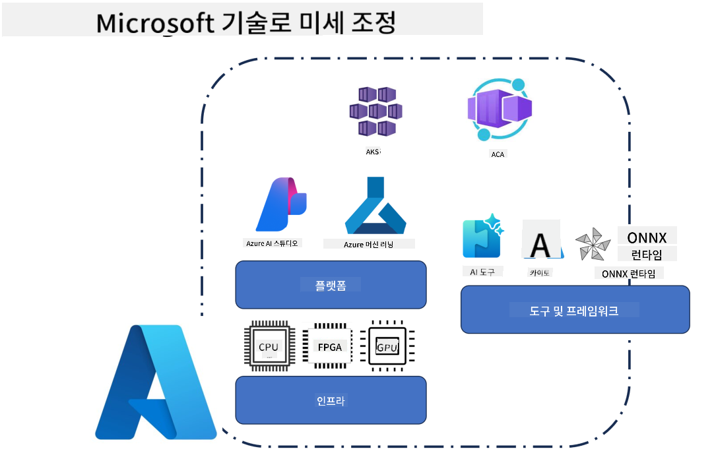
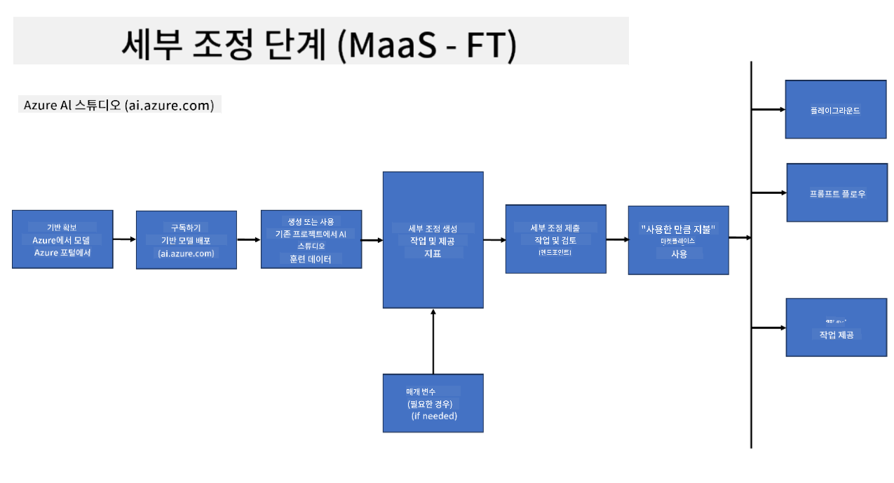
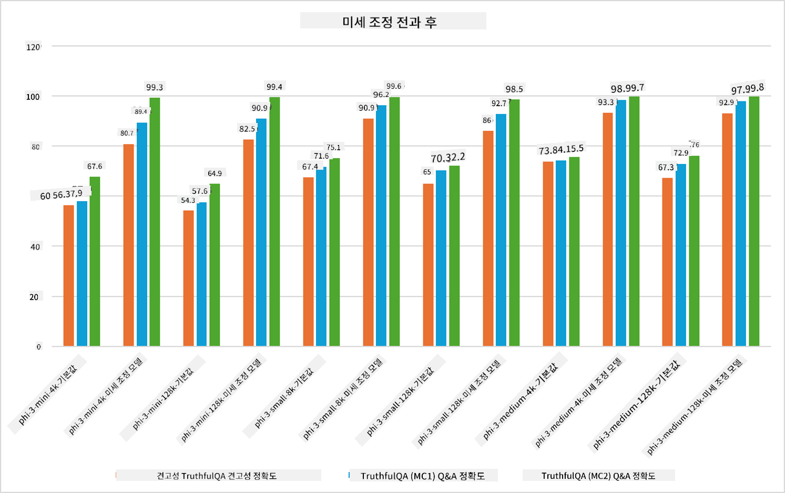

<!--
CO_OP_TRANSLATOR_METADATA:
{
  "original_hash": "cd52a3c9a424a77d2ec0470770c93846",
  "translation_date": "2025-04-04T07:13:15+00:00",
  "source_file": "md\\03.FineTuning\\FineTuning_Scenarios.md",
  "language_code": "ko"
}
-->
## 세부 조정 시나리오

**플랫폼** Azure AI Foundry, Azure Machine Learning, AI Tools, Kaito, ONNX Runtime 등 다양한 기술을 포함합니다.

**인프라** 세부 조정 과정에서 필수적인 CPU와 FPGA를 포함합니다. 각각의 기술 아이콘을 보여드리겠습니다.

**도구 및 프레임워크** ONNX Runtime을 포함합니다. 각각의 기술 아이콘을 보여드리겠습니다.  
[ONNX Runtime 아이콘 삽입]

Microsoft 기술을 활용한 세부 조정 과정은 다양한 구성 요소와 도구를 포함합니다. 이러한 기술을 이해하고 활용함으로써 애플리케이션을 효과적으로 조정하고 더 나은 솔루션을 만들 수 있습니다.

## 서비스로서의 모델

컴퓨팅을 생성하고 관리할 필요 없이 호스팅된 세부 조정을 통해 모델을 조정합니다.

서버리스 세부 조정은 Phi-3-mini와 Phi-3-medium 모델에서 사용할 수 있으며, 개발자가 클라우드 및 엣지 시나리오를 위해 컴퓨팅을 준비하지 않고도 모델을 빠르고 쉽게 맞춤화할 수 있도록 합니다. 또한 Phi-3-small 모델이 이제 모델-서비스-제공을 통해 사용 가능하다고 발표했으며, 이를 통해 개발자는 기본 인프라를 관리하지 않고도 AI 개발을 빠르게 시작할 수 있습니다.

## 플랫폼으로서의 모델

사용자가 직접 컴퓨팅을 관리하여 모델을 세부 조정합니다.

[세부 조정 샘플](https://github.com/Azure/azureml-examples/blob/main/sdk/python/foundation-models/system/finetune/chat-completion/chat-completion.ipynb)

## 세부 조정 시나리오

| | | | | | | |
|-|-|-|-|-|-|-|
|시나리오|LoRA|QLoRA|PEFT|DeepSpeed|ZeRO|DORA|
|사전 학습된 LLM을 특정 작업 또는 도메인에 맞게 조정|Yes|Yes|Yes|Yes|Yes|Yes|
|텍스트 분류, 개체명 인식, 기계 번역 등 NLP 작업을 위한 세부 조정|Yes|Yes|Yes|Yes|Yes|Yes|
|QA 작업을 위한 세부 조정|Yes|Yes|Yes|Yes|Yes|Yes|
|챗봇에서 인간과 유사한 응답 생성 작업을 위한 세부 조정|Yes|Yes|Yes|Yes|Yes|Yes|
|음악, 예술 또는 기타 창의적 형태의 콘텐츠 생성을 위한 세부 조정|Yes|Yes|Yes|Yes|Yes|Yes|
|계산 및 비용 절감|Yes|Yes|No|Yes|Yes|No|
|메모리 사용량 감소|No|Yes|No|Yes|Yes|Yes|
|효율적인 세부 조정을 위해 더 적은 매개변수 사용|No|Yes|Yes|No|No|Yes|
|데이터 병렬 처리를 통해 모든 GPU 장치의 집합적 GPU 메모리에 접근할 수 있는 메모리 효율적 형태|No|No|No|Yes|Yes|Yes|

## 세부 조정 성능 예시

**면책조항**:  
이 문서는 AI 번역 서비스 [Co-op Translator](https://github.com/Azure/co-op-translator)를 사용하여 번역되었습니다. 정확성을 위해 최선을 다하고 있지만, 자동 번역에는 오류나 부정확성이 포함될 수 있습니다. 원본 문서의 원어 버전이 권위 있는 출처로 간주되어야 합니다. 중요한 정보에 대해서는 전문적인 인간 번역을 권장합니다. 이 번역 사용으로 인해 발생하는 오해나 잘못된 해석에 대해 당사는 책임지지 않습니다.