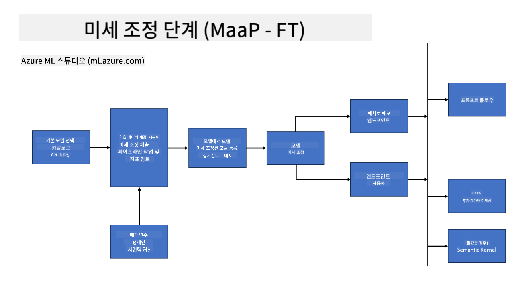
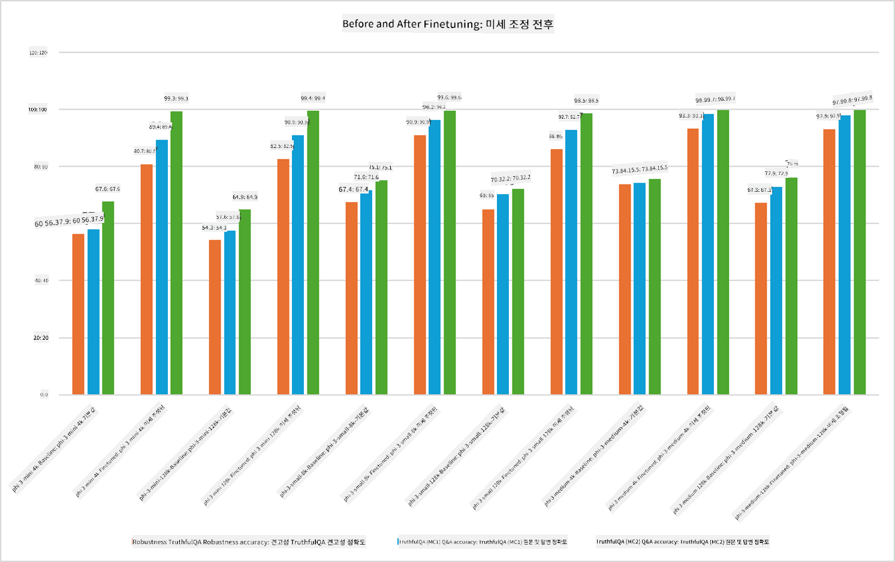

<!--
CO_OP_TRANSLATOR_METADATA:
{
  "original_hash": "cb5648935f63edc17e95ce38f23adc32",
  "translation_date": "2025-07-17T08:24:18+00:00",
  "source_file": "md/03.FineTuning/FineTuning_Scenarios.md",
  "language_code": "ko"
}
-->
## 미세 조정 시나리오

**플랫폼** Azure AI Foundry, Azure Machine Learning, AI Tools, Kaito, ONNX Runtime 등 다양한 기술을 포함합니다.

**인프라** 미세 조정 과정에 필수적인 CPU와 FPGA를 포함합니다. 각 기술의 아이콘을 보여드리겠습니다.

**도구 및 프레임워크** ONNX Runtime을 포함합니다. 각 기술의 아이콘을 보여드리겠습니다.  
[ONNX Runtime 아이콘 삽입]

마이크로소프트 기술을 활용한 미세 조정 과정은 다양한 구성 요소와 도구를 포함합니다. 이러한 기술을 이해하고 활용함으로써 효과적으로 애플리케이션을 미세 조정하고 더 나은 솔루션을 만들 수 있습니다.

## 서비스로서의 모델

호스팅된 미세 조정을 사용하여 컴퓨팅 자원을 직접 생성하거나 관리할 필요 없이 모델을 미세 조정합니다.

서버리스 미세 조정은 Phi-3-mini와 Phi-3-medium 모델에 제공되어, 개발자가 클라우드 및 엣지 시나리오에 맞게 모델을 빠르고 쉽게 맞춤화할 수 있도록 합니다. 또한 Phi-3-small 모델이 Models-as-a-Service를 통해 제공되어, 개발자가 기본 인프라를 관리하지 않고도 AI 개발을 신속하게 시작할 수 있게 되었습니다.

## 플랫폼으로서의 모델

사용자가 직접 컴퓨팅 자원을 관리하며 모델을 미세 조정합니다.

[Fine Tuning Sample](https://github.com/Azure/azureml-examples/blob/main/sdk/python/foundation-models/system/finetune/chat-completion/chat-completion.ipynb)

## 미세 조정 시나리오

| | | | | | | |
|-|-|-|-|-|-|-|
|시나리오|LoRA|QLoRA|PEFT|DeepSpeed|ZeRO|DORA|
|사전 학습된 LLM을 특정 작업이나 도메인에 맞게 조정|예|예|예|예|예|예|
|텍스트 분류, 개체명 인식, 기계 번역 등 NLP 작업을 위한 미세 조정|예|예|예|예|예|예|
|QA 작업을 위한 미세 조정|예|예|예|예|예|예|
|챗봇에서 인간과 유사한 응답 생성을 위한 미세 조정|예|예|예|예|예|예|
|음악, 예술 또는 기타 창작물 생성을 위한 미세 조정|예|예|예|예|예|예|
|계산 및 비용 절감|예|예|아니오|예|예|아니오|
|메모리 사용량 절감|아니오|예|아니오|예|예|예|
|효율적인 미세 조정을 위한 적은 수의 파라미터 사용|아니오|예|예|아니오|아니오|예|
|사용 가능한 모든 GPU 장치의 총 GPU 메모리에 접근할 수 있는 메모리 효율적인 데이터 병렬 처리 형태|아니오|아니오|아니오|예|예|예|

## 미세 조정 성능 예시

**면책 조항**:  
이 문서는 AI 번역 서비스 [Co-op Translator](https://github.com/Azure/co-op-translator)를 사용하여 번역되었습니다. 정확성을 위해 노력하고 있으나, 자동 번역에는 오류나 부정확한 부분이 있을 수 있음을 유의하시기 바랍니다. 원문은 해당 언어의 원본 문서가 권위 있는 출처로 간주되어야 합니다. 중요한 정보의 경우 전문적인 인간 번역을 권장합니다. 본 번역 사용으로 인해 발생하는 오해나 잘못된 해석에 대해 당사는 책임을 지지 않습니다.