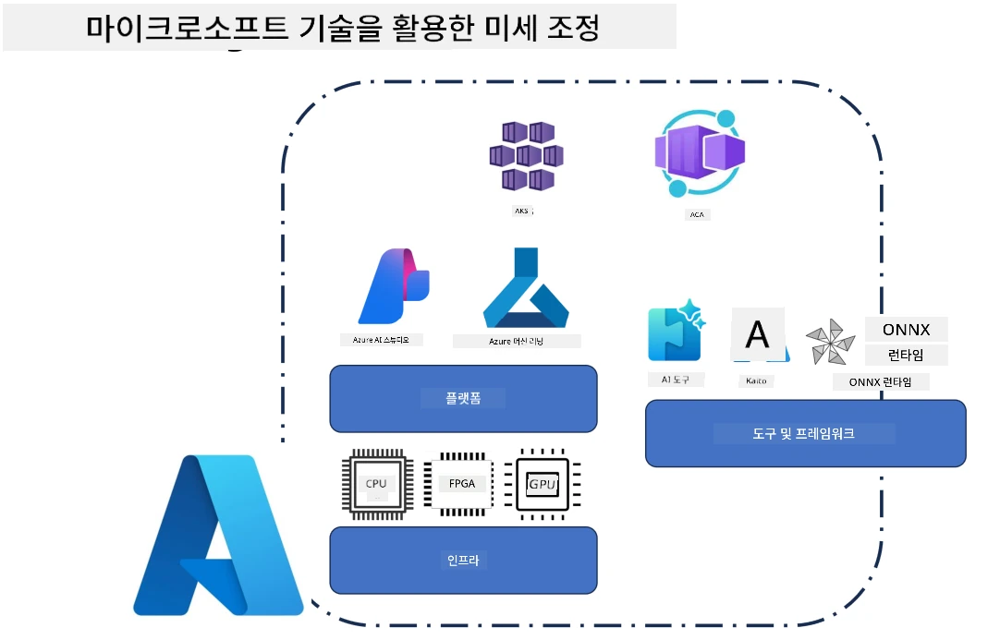
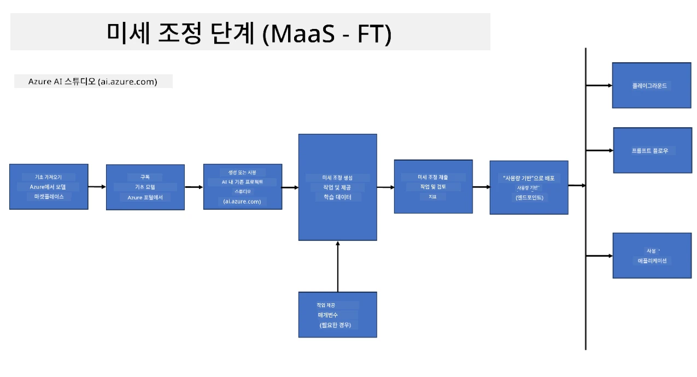
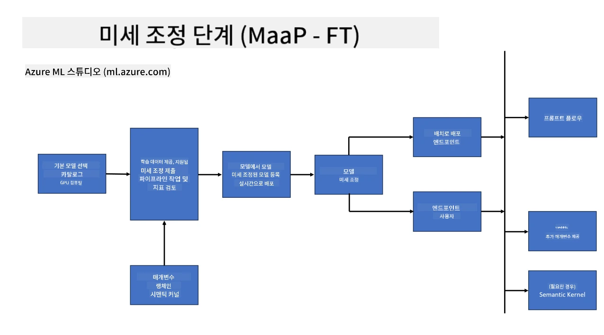
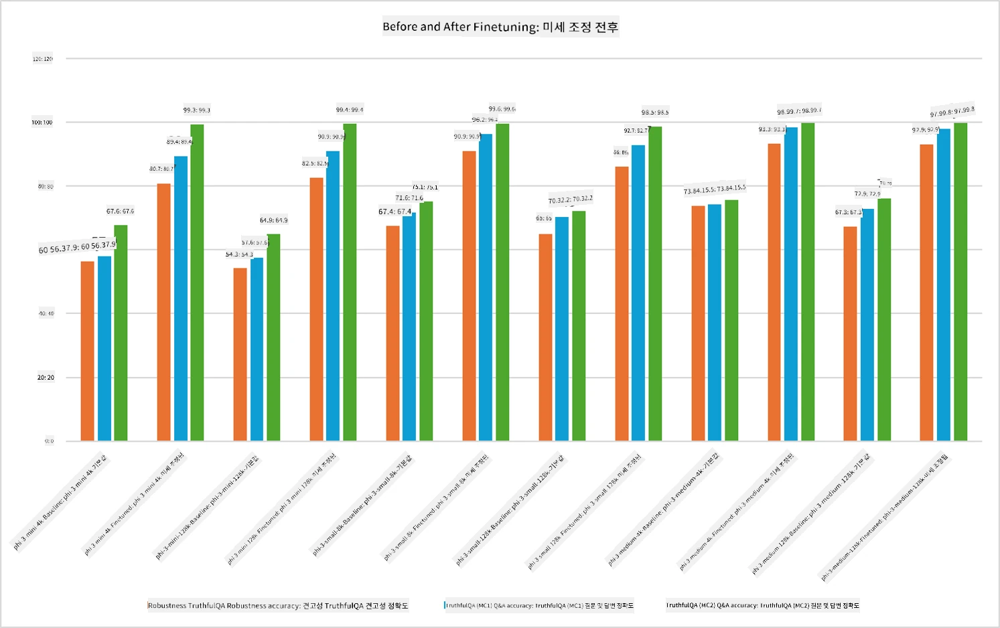

## 파인 튜닝 시나리오

이 섹션에서는 Microsoft Foundry 및 Azure 환경에서의 파인 튜닝 시나리오를 개요하며, 배포 모델, 인프라 계층, 그리고 일반적으로 사용되는 최적화 기법을 포함합니다.

**플랫폼**  
이는 Microsoft Foundry(이전 Azure AI Foundry)와 Azure Machine Learning과 같은 관리형 서비스를 포함하며, 모델 관리, 오케스트레이션, 실험 추적 및 배포 워크플로우를 제공합니다.

**인프라**  
파인 튜닝에는 확장 가능한 컴퓨팅 리소스가 필요합니다. Azure 환경에서는 일반적으로 GPU 기반 가상 머신과 가벼운 작업 부하를 위한 CPU 자원, 그리고 데이터셋 및 체크포인트를 위한 확장 가능한 스토리지를 포함합니다.

**도구 및 프레임워크**  
파인 튜닝 워크플로우는 보통 Hugging Face Transformers, DeepSpeed, PEFT(Parameter-Efficient Fine-Tuning)와 같은 프레임워크 및 최적화 라이브러리에 의존합니다.

Microsoft 기술을 사용한 파인 튜닝 프로세스는 플랫폼 서비스, 컴퓨팅 인프라, 그리고 학습 프레임워크를 아우릅니다. 이러한 구성 요소들이 어떻게 함께 작동하는지 이해함으로써, 개발자는 기초 모델을 특정 작업과 생산 시나리오에 효율적으로 적응시킬 수 있습니다.

## 모델을 서비스로 제공

호스팅된 파인 튜닝을 사용하여 컴퓨팅을 생성하고 관리할 필요 없이 모델을 파인 튜닝합니다.

Phi-3, Phi-3.5, Phi-4 모델 군에 대해 서버리스 파인 튜닝이 이제 가능하여, 개발자가 컴퓨팅을 별도로 마련하지 않고도 클라우드 및 엣지 시나리오에 맞게 모델을 빠르고 쉽게 맞춤화할 수 있습니다.

## 모델을 플랫폼으로 제공

사용자가 직접 컴퓨팅을 관리하여 자신들의 모델을 파인 튜닝합니다.

[파인 튜닝 샘플](https://github.com/Azure/azureml-examples/blob/main/sdk/python/foundation-models/system/finetune/chat-completion/chat-completion.ipynb)

## 파인 튜닝 기법 비교

|시나리오|LoRA|QLoRA|PEFT|DeepSpeed|ZeRO|DoRA|
|---|---|---|---|---|---|---|
|사전 학습된 LLM을 특정 작업이나 도메인에 적응|예|예|예|예|예|예|
|텍스트 분류, 개체명 인식, 기계 번역 같은 NLP 작업 파인 튜닝|예|예|예|예|예|예|
|질문 응답(QA) 작업 파인 튜닝|예|예|예|예|예|예|
|챗봇에서 인간과 같은 응답 생성 파인 튜닝|예|예|예|예|예|예|
|음악, 예술 또는 기타 창작물 생성 파인 튜닝|예|예|예|예|예|예|
|계산 및 비용 감소|예|예|예|예|예|예|
|메모리 사용량 감소|예|예|예|예|예|예|
|효율적인 파인 튜닝을 위한 적은 파라미터 사용|예|예|예|아니요|아니요|예|
|사용 가능한 모든 GPU 디바이스의 총 GPU 메모리에 접근할 수 있는 메모리 효율적인 데이터 병렬화 형태|아니요|아니요|아니요|예|예|아니요|

> [!NOTE]
> LoRA, QLoRA, PEFT, DoRA는 파라미터 효율적인 파인 튜닝 방법인 반면, DeepSpeed와 ZeRO는 분산 학습과 메모리 최적화에 중점을 둡니다.

## 파인 튜닝 성능 예시

---

<!-- CO-OP TRANSLATOR DISCLAIMER START -->
**면책 조항**:  
이 문서는 AI 번역 서비스 [Co-op Translator](https://github.com/Azure/co-op-translator)를 사용하여 번역되었습니다. 정확성을 위해 노력하고 있으나, 자동 번역본에는 오류나 부정확성이 포함될 수 있음을 유의해 주시기 바랍니다. 원문은 해당 언어의 원문이 권위 있는 자료로 간주되어야 합니다. 중요한 정보의 경우, 전문적인 사람에 의한 번역을 권장합니다. 이 번역본 사용으로 인해 발생하는 오해나 잘못된 해석에 대해 당사는 책임을 지지 않습니다.
<!-- CO-OP TRANSLATOR DISCLAIMER END -->