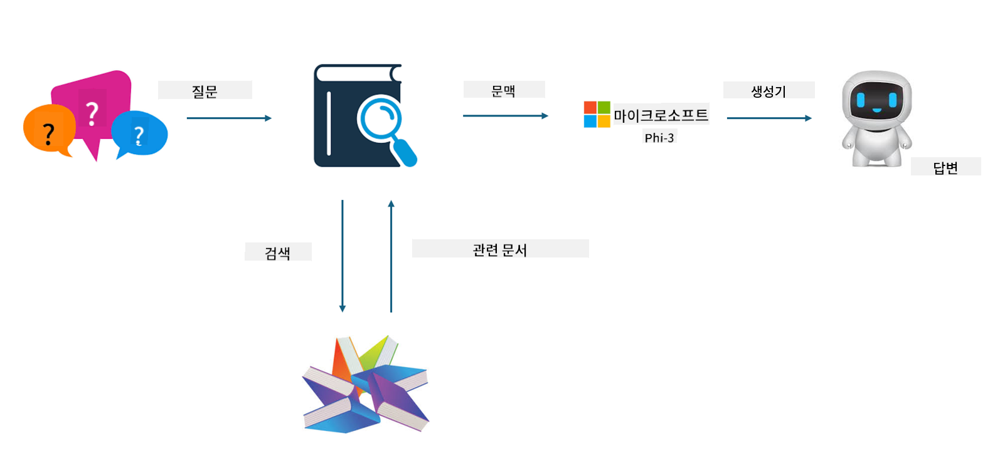

<!--
CO_OP_TRANSLATOR_METADATA:
{
  "original_hash": "e4e010400c2918557b36bb932a14004c",
  "translation_date": "2025-05-08T05:19:15+00:00",
  "source_file": "md/03.FineTuning/FineTuning_vs_RAG.md",
  "language_code": "ko"
}
-->
## Finetuning vs RAG

## Retrieval Augmented Generation

RAG는 데이터 검색과 텍스트 생성을 결합한 방식입니다. 기업의 구조화된 데이터와 비구조화된 데이터가 벡터 데이터베이스에 저장됩니다. 관련된 내용을 검색할 때, 관련 요약과 콘텐츠를 찾아 문맥을 형성하고, LLM/SLM의 텍스트 완성 기능과 결합하여 콘텐츠를 생성합니다.

## RAG Process

## Fine-tuning
Fine-tuning은 특정 모델의 성능 향상에 기반합니다. 모델 알고리즘부터 시작할 필요는 없지만, 데이터를 지속적으로 축적해야 합니다. 산업 현장에서 더 정확한 용어와 언어 표현이 필요하다면, fine-tuning이 더 좋은 선택입니다. 하지만 데이터가 자주 변경된다면, fine-tuning은 복잡해질 수 있습니다.

## How to choose
외부 데이터 도입이 필요한 답변이라면 RAG가 최선의 선택입니다.

안정적이고 정확한 산업 지식을 출력해야 한다면 fine-tuning이 좋은 선택입니다. RAG는 관련 콘텐츠를 우선적으로 가져오지만, 전문적인 뉘앙스를 항상 완벽하게 반영하지는 못할 수 있습니다.

fine-tuning은 고품질 데이터 세트가 필요하며, 데이터 범위가 작으면 큰 차이를 만들지 못합니다. RAG는 더 유연합니다.  
fine-tuning은 블랙박스 같고 메타피지컬하여 내부 메커니즘을 이해하기 어렵지만, RAG는 데이터 출처를 쉽게 찾아내어 환각이나 내용 오류를 효과적으로 조정하고 더 나은 투명성을 제공합니다.

**면책 조항**:  
이 문서는 AI 번역 서비스 [Co-op Translator](https://github.com/Azure/co-op-translator)를 사용하여 번역되었습니다. 정확성을 위해 최선을 다하고 있으나, 자동 번역에는 오류나 부정확성이 포함될 수 있음을 유의하시기 바랍니다. 원문은 해당 언어로 된 원본 문서를 권위 있는 출처로 간주해야 합니다. 중요한 정보의 경우, 전문적인 인간 번역을 권장합니다. 본 번역 사용으로 인해 발생하는 오해나 잘못된 해석에 대해 당사는 책임을 지지 않습니다.