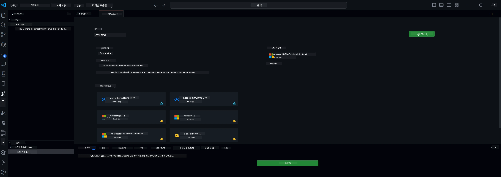

<!--
CO_OP_TRANSLATOR_METADATA:
{
  "original_hash": "c2bc0950f44919ac75a88c1a871680c2",
  "translation_date": "2025-07-17T09:05:25+00:00",
  "source_file": "md/03.FineTuning/Finetuning_VSCodeaitoolkit.md",
  "language_code": "ko"
}
-->
## VS Code용 AI Toolkit에 오신 것을 환영합니다

[AI Toolkit for VS Code](https://github.com/microsoft/vscode-ai-toolkit/tree/main)는 Azure AI Studio 카탈로그와 Hugging Face 같은 다른 카탈로그의 다양한 모델을 한데 모았습니다. 이 툴킷은 생성 AI 도구와 모델을 사용해 AI 앱을 개발하는 일반적인 작업을 다음과 같이 간소화합니다:
- 모델 탐색과 플레이그라운드로 시작하기
- 로컬 컴퓨팅 자원을 이용한 모델 미세 조정 및 추론
- Azure 자원을 이용한 원격 미세 조정 및 추론

[VSCode용 AI Toolkit 설치하기](https://marketplace.visualstudio.com/items?itemName=ms-windows-ai-studio.windows-ai-studio)



**[Private Preview]** Azure Container Apps를 원클릭으로 프로비저닝하여 클라우드에서 모델 미세 조정과 추론을 실행할 수 있습니다.

이제 AI 앱 개발을 시작해 봅시다:

- [VS Code용 AI Toolkit에 오신 것을 환영합니다](../../../../md/03.FineTuning)
- [로컬 개발](../../../../md/03.FineTuning)
  - [준비 사항](../../../../md/03.FineTuning)
  - [Conda 활성화](../../../../md/03.FineTuning)
  - [기본 모델 미세 조정만](../../../../md/03.FineTuning)
  - [모델 미세 조정 및 추론](../../../../md/03.FineTuning)
  - [모델 미세 조정](../../../../md/03.FineTuning)
  - [Microsoft Olive](../../../../md/03.FineTuning)
  - [미세 조정 샘플 및 자료](../../../../md/03.FineTuning)
- [**\[Private Preview\]** 원격 개발](../../../../md/03.FineTuning)
  - [사전 준비](../../../../md/03.FineTuning)
  - [원격 개발 프로젝트 설정](../../../../md/03.FineTuning)
  - [Azure 자원 프로비저닝](../../../../md/03.FineTuning)
  - [\[선택 사항\] Azure Container App 비밀에 Huggingface 토큰 추가](../../../../md/03.FineTuning)
  - [미세 조정 실행](../../../../md/03.FineTuning)
  - [추론 엔드포인트 프로비저닝](../../../../md/03.FineTuning)
  - [추론 엔드포인트 배포](../../../../md/03.FineTuning)
  - [고급 사용법](../../../../md/03.FineTuning)

## 로컬 개발
### 준비 사항

1. 호스트에 NVIDIA 드라이버가 설치되어 있는지 확인하세요.
2. 데이터셋 활용을 위해 HF를 사용하는 경우 `huggingface-cli login`을 실행하세요.
3. 메모리 사용량을 변경하는 설정에 대한 `Olive` 키 설명을 참고하세요.

### Conda 활성화
WSL 환경을 사용하고 공유되기 때문에 conda 환경을 수동으로 활성화해야 합니다. 이 단계를 완료하면 미세 조정이나 추론을 실행할 수 있습니다.

```bash
conda activate [conda-env-name] 
```

### 기본 모델 미세 조정만
미세 조정 없이 기본 모델을 간단히 사용해보고 싶다면 conda를 활성화한 후 다음 명령어를 실행하세요.

```bash
cd inference

# Web browser interface allows to adjust a few parameters like max new token length, temperature and so on.
# User has to manually open the link (e.g. http://0.0.0.0:7860) in a browser after gradio initiates the connections.
python gradio_chat.py --baseonly
```

### 모델 미세 조정 및 추론

개발 컨테이너에서 작업 공간을 열면 터미널을 열고(기본 경로는 프로젝트 루트) 아래 명령어를 실행해 선택한 데이터셋으로 LLM을 미세 조정할 수 있습니다.

```bash
python finetuning/invoke_olive.py 
```

체크포인트와 최종 모델은 `models` 폴더에 저장됩니다.

다음으로, 미세 조정된 모델을 사용해 `콘솔`, `웹 브라우저` 또는 `prompt flow`에서 채팅을 통해 추론을 실행하세요.

```bash
cd inference

# Console interface.
python console_chat.py

# Web browser interface allows to adjust a few parameters like max new token length, temperature and so on.
# User has to manually open the link (e.g. http://127.0.0.1:7860) in a browser after gradio initiates the connections.
python gradio_chat.py
```

VS Code에서 `prompt flow`를 사용하려면 이 [빠른 시작 가이드](https://microsoft.github.io/promptflow/how-to-guides/quick-start.html)를 참고하세요.

### 모델 미세 조정

다음으로, 장치에 GPU가 있는지 여부에 따라 아래 모델을 다운로드하세요.

QLoRA를 사용해 로컬 미세 조정 세션을 시작하려면 카탈로그에서 미세 조정할 모델을 선택하세요.
| 플랫폼 | GPU 사용 가능 여부 | 모델 이름 | 크기 (GB) |
|---------|---------|--------|--------|
| Windows | 있음 | Phi-3-mini-4k-**directml**-int4-awq-block-128-onnx | 2.13GB |
| Linux | 있음 | Phi-3-mini-4k-**cuda**-int4-onnx | 2.30GB |
| Windows<br>Linux | 없음 | Phi-3-mini-4k-**cpu**-int4-rtn-block-32-acc-level-4-onnx | 2.72GB |

**_참고_** 모델 다운로드에 Azure 계정은 필요하지 않습니다.

Phi3-mini (int4) 모델 크기는 약 2GB~3GB이며, 네트워크 속도에 따라 다운로드에 몇 분 정도 소요될 수 있습니다.

먼저 프로젝트 이름과 위치를 선택하세요.
다음으로 모델 카탈로그에서 모델을 선택하면 프로젝트 템플릿 다운로드를 요청받습니다. 이후 "프로젝트 구성"을 클릭해 다양한 설정을 조정할 수 있습니다.

### Microsoft Olive

[Olive](https://microsoft.github.io/Olive/why-olive.html)를 사용해 카탈로그의 PyTorch 모델에 대해 QLoRA 미세 조정을 실행합니다. 모든 설정은 메모리 최적화를 위해 기본값으로 미리 설정되어 있지만, 필요에 따라 조정할 수 있습니다.

### 미세 조정 샘플 및 자료

- [미세 조정 시작 가이드](https://learn.microsoft.com/windows/ai/toolkit/toolkit-fine-tune)
- [HuggingFace 데이터셋으로 미세 조정하기](https://github.com/microsoft/vscode-ai-toolkit/blob/main/archive/walkthrough-hf-dataset.md)
- [간단한 데이터셋으로 미세 조정하기](https://github.com/microsoft/vscode-ai-toolkit/blob/main/archive/walkthrough-simple-dataset.md)

## **[Private Preview]** 원격 개발

### 사전 준비

1. 원격 Azure Container App 환경에서 모델 미세 조정을 실행하려면 구독에 충분한 GPU 용량이 있는지 확인하세요. 애플리케이션에 필요한 용량을 요청하려면 [지원 티켓](https://azure.microsoft.com/support/create-ticket/)을 제출하세요. [GPU 용량에 대한 자세한 정보](https://learn.microsoft.com/azure/container-apps/workload-profiles-overview)
2. HuggingFace의 비공개 데이터셋을 사용하는 경우 [HuggingFace 계정](https://huggingface.co/?WT.mc_id=aiml-137032-kinfeylo)을 보유하고 [액세스 토큰을 생성](https://huggingface.co/docs/hub/security-tokens?WT.mc_id=aiml-137032-kinfeylo)해야 합니다.
3. VS Code용 AI Toolkit에서 원격 미세 조정 및 추론 기능 플래그를 활성화하세요.
   1. *파일 -> 기본 설정 -> 설정*을 선택해 VS Code 설정을 엽니다.
   2. *확장*에서 *AI Toolkit*을 선택합니다.
   3. *"Enable Remote Fine-tuning And Inference"* 옵션을 선택합니다.
   4. 변경 사항을 적용하려면 VS Code를 다시 로드하세요.

- [원격 미세 조정](https://github.com/microsoft/vscode-ai-toolkit/blob/main/archive/remote-finetuning.md)

### 원격 개발 프로젝트 설정
1. 명령 팔레트에서 `AI Toolkit: Focus on Resource View`를 실행하세요.
2. *Model Fine-tuning*으로 이동해 모델 카탈로그에 접근합니다. 프로젝트 이름과 위치를 지정한 후 *"Configure Project"* 버튼을 클릭하세요.
3. 프로젝트 구성
    1. *"Fine-tune locally"* 옵션은 활성화하지 마세요.
    2. Olive 구성 설정이 기본값으로 표시됩니다. 필요에 따라 설정을 조정하고 입력하세요.
    3. *Generate Project*로 진행합니다. 이 단계에서는 WSL을 활용해 새 Conda 환경을 설정하며, 향후 Dev Containers 지원을 준비합니다.
4. *"Relaunch Window In Workspace"*를 클릭해 원격 개발 프로젝트를 엽니다.

> **참고:** 현재 프로젝트는 AI Toolkit for VS Code 내에서 로컬 또는 원격 중 한 곳에서만 작동합니다. 프로젝트 생성 시 *"Fine-tune locally"*를 선택하면 WSL 내에서만 실행되며 원격 개발 기능은 지원하지 않습니다. 반대로 *"Fine-tune locally"*를 선택하지 않으면 프로젝트는 원격 Azure Container App 환경에서만 작동합니다.

### Azure 자원 프로비저닝
원격 미세 조정을 시작하려면 명령 팔레트에서 `AI Toolkit: Provision Azure Container Apps job for fine-tuning`을 실행해 Azure 자원을 프로비저닝하세요.

출력 채널에 표시되는 링크를 통해 프로비저닝 진행 상황을 확인할 수 있습니다.

### [선택 사항] Azure Container App 비밀에 Huggingface 토큰 추가
비공개 HuggingFace 데이터셋을 사용하는 경우, HuggingFace 토큰을 환경 변수로 설정해 Hugging Face Hub에 수동 로그인할 필요가 없도록 할 수 있습니다.
`AI Toolkit: Add Azure Container Apps Job secret for fine-tuning` 명령어를 사용해 비밀 이름을 [`HF_TOKEN`](https://huggingface.co/docs/huggingface_hub/package_reference/environment_variables#hftoken)으로 설정하고 Hugging Face 토큰을 비밀 값으로 입력하세요.

### 미세 조정 실행
원격 미세 조정 작업을 시작하려면 `AI Toolkit: Run fine-tuning` 명령어를 실행하세요.

시스템 및 콘솔 로그를 보려면 출력 패널에 있는 링크를 통해 Azure 포털에 접속하거나(자세한 내용은 [Azure에서 로그 보기 및 쿼리](https://aka.ms/ai-toolkit/remote-provision#view-and-query-logs-on-azure) 참고), VSCode 출력 패널에서 `AI Toolkit: Show the running fine-tuning job streaming logs` 명령어를 실행해 콘솔 로그를 직접 확인할 수 있습니다.
> **참고:** 자원이 부족해 작업이 대기열에 있을 수 있습니다. 로그가 표시되지 않으면 `AI Toolkit: Show the running fine-tuning job streaming logs` 명령어를 실행한 후 잠시 기다렸다가 다시 실행해 스트리밍 로그에 재연결하세요.

이 과정에서 QLoRA가 미세 조정에 사용되며, 추론 시 사용할 LoRA 어댑터를 생성합니다.
미세 조정 결과는 Azure Files에 저장됩니다.

### 추론 엔드포인트 프로비저닝
원격 환경에서 어댑터가 학습된 후, 간단한 Gradio 애플리케이션을 사용해 모델과 상호작용할 수 있습니다.
미세 조정 과정과 마찬가지로 명령 팔레트에서 `AI Toolkit: Provision Azure Container Apps for inference`를 실행해 원격 추론용 Azure 자원을 설정하세요.

기본적으로 추론에 사용할 구독과 리소스 그룹은 미세 조정에 사용한 것과 동일해야 합니다. 추론은 동일한 Azure Container App 환경을 사용하며, 미세 조정 단계에서 생성된 모델과 모델 어댑터가 저장된 Azure Files에 접근합니다.

### 추론 엔드포인트 배포
추론 코드를 수정하거나 추론 모델을 다시 로드하려면 `AI Toolkit: Deploy for inference` 명령어를 실행하세요. 이 명령어는 최신 코드를 Azure Container App과 동기화하고 복제본을 재시작합니다.

배포가 성공적으로 완료되면 VSCode 알림에 표시되는 "*Go to Inference Endpoint*" 버튼을 클릭해 추론 API에 접근할 수 있습니다. 또는 `./infra/inference.config.json`의 `ACA_APP_ENDPOINT`와 출력 패널에서 웹 API 엔드포인트를 확인할 수 있습니다. 이제 이 엔드포인트를 통해 모델을 평가할 준비가 완료되었습니다.

### 고급 사용법
AI Toolkit을 이용한 원격 개발에 대한 자세한 내용은 [원격으로 모델 미세 조정하기](https://aka.ms/ai-toolkit/remote-provision)와 [미세 조정된 모델로 추론하기](https://aka.ms/ai-toolkit/remote-inference) 문서를 참고하세요.

**면책 조항**:  
이 문서는 AI 번역 서비스 [Co-op Translator](https://github.com/Azure/co-op-translator)를 사용하여 번역되었습니다. 정확성을 위해 최선을 다하고 있으나, 자동 번역에는 오류나 부정확한 부분이 있을 수 있음을 유의하시기 바랍니다. 원문은 해당 언어의 원본 문서가 권위 있는 출처로 간주되어야 합니다. 중요한 정보의 경우 전문적인 인간 번역을 권장합니다. 본 번역 사용으로 인해 발생하는 오해나 잘못된 해석에 대해 당사는 책임을 지지 않습니다.