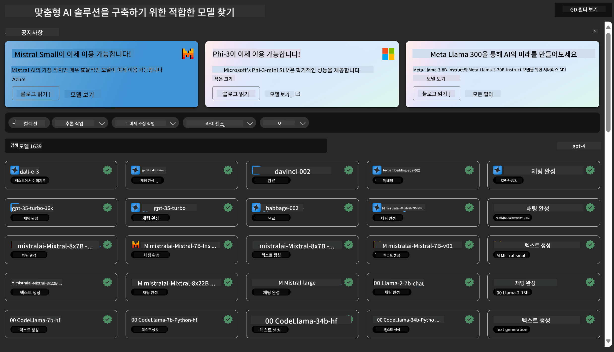
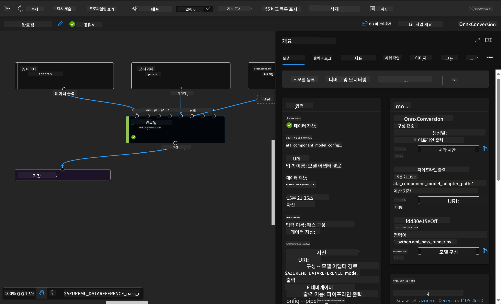

<!--
CO_OP_TRANSLATOR_METADATA:
{
  "original_hash": "315566447513c4c6215ea5a004315e4f",
  "translation_date": "2025-04-04T07:17:57+00:00",
  "source_file": "md\\03.FineTuning\\Introduce_AzureML.md",
  "language_code": "ko"
}
-->
# **Azure Machine Learning 서비스 소개**

[Azure Machine Learning](https://ml.azure.com?WT.mc_id=aiml-138114-kinfeylo)은 머신 러닝(ML) 프로젝트 라이프사이클을 가속화하고 관리하기 위한 클라우드 서비스입니다.

ML 전문가, 데이터 과학자, 엔지니어는 일상적인 워크플로에서 이를 활용하여 다음을 수행할 수 있습니다:

- 모델을 훈련하고 배포합니다.
- 머신 러닝 운영(MLOps)을 관리합니다.
- Azure Machine Learning에서 모델을 생성하거나 PyTorch, TensorFlow, scikit-learn과 같은 오픈소스 플랫폼에서 구축된 모델을 사용할 수 있습니다.
- MLOps 도구를 사용하여 모델을 모니터링하고, 재훈련하며, 재배포할 수 있습니다.

## Azure Machine Learning은 누구를 위한 서비스인가요?

**데이터 과학자와 ML 엔지니어**

일상적인 워크플로를 가속화하고 자동화할 수 있는 도구를 사용할 수 있습니다.  
Azure ML은 공정성, 설명 가능성, 추적성 및 감사 가능성을 제공하는 기능을 제공합니다.  
**응용 프로그램 개발자**  
모델을 애플리케이션이나 서비스에 원활하게 통합할 수 있습니다.

**플랫폼 개발자**

강력한 Azure Resource Manager API로 지원되는 견고한 도구 세트를 이용할 수 있습니다.  
이 도구를 사용하여 고급 ML 도구를 구축할 수 있습니다.

**기업**

Microsoft Azure 클라우드 환경에서 작업하며, 기업은 익숙한 보안 및 역할 기반 액세스 제어의 혜택을 누릴 수 있습니다.  
프로젝트를 설정하여 보호된 데이터와 특정 작업에 대한 액세스를 제어할 수 있습니다.

## 팀 모두를 위한 생산성 향상
ML 프로젝트는 종종 다양한 기술을 가진 팀이 함께 구축하고 유지 관리해야 합니다.

Azure ML은 다음을 가능하게 하는 도구를 제공합니다:
- 공유 노트북, 컴퓨팅 리소스, 서버리스 컴퓨팅, 데이터 및 환경을 통해 팀과 협업합니다.
- 공정성, 설명 가능성, 추적성 및 감사 가능성을 갖춘 모델을 개발하여 데이터 계보 및 감사 준수 요구사항을 충족합니다.
- ML 모델을 대규모로 빠르고 쉽게 배포하고, MLOps를 사용하여 효율적으로 관리하고 통제합니다.
- 내장된 거버넌스, 보안 및 준수 기능을 사용하여 어디서든 머신 러닝 워크로드를 실행합니다.

## 호환 가능한 플랫폼 도구

ML 팀의 누구든지 선호하는 도구를 사용하여 작업을 수행할 수 있습니다.  
빠른 실험 실행, 하이퍼파라미터 튜닝, 파이프라인 구축, 추론 관리 등 작업을 수행할 때 다음과 같은 익숙한 인터페이스를 사용할 수 있습니다:
- Azure Machine Learning Studio
- Python SDK (v2)
- Azure CLI (v2)
- Azure Resource Manager REST APIs

모델을 개선하고 개발 주기 동안 협업하면서, Azure Machine Learning Studio UI에서 자산, 리소스 및 메트릭을 공유하고 검색할 수 있습니다.

## **Azure ML의 LLM/SLM**

Azure ML은 LLMOps와 SLMOps를 결합하여 기업 전반의 생성형 인공지능 기술 플랫폼을 구축할 수 있는 다양한 LLM/SLM 관련 기능을 추가했습니다.

### **모델 카탈로그**

기업 사용자는 Model Catalog를 통해 다양한 비즈니스 시나리오에 따라 여러 모델을 배포하고, Model as Service로 서비스를 제공하여 기업 개발자 또는 사용자가 접근할 수 있도록 지원합니다.

Azure Machine Learning Studio의 모델 카탈로그는 생성형 AI 애플리케이션을 구축할 수 있는 다양한 모델을 발견하고 사용할 수 있는 허브입니다. 모델 카탈로그에는 Azure OpenAI 서비스, Mistral, Meta, Cohere, Nvidia, Hugging Face, Microsoft에서 훈련한 모델을 포함한 다양한 모델 제공업체의 수백 개의 모델이 포함되어 있습니다. Microsoft 이외의 제공업체의 모델은 Microsoft 제품 약관에 정의된 대로 비Microsoft 제품이며, 해당 모델과 함께 제공되는 약관을 따릅니다.

### **작업 파이프라인**

머신 러닝 파이프라인의 핵심은 전체 머신 러닝 작업을 다단계 워크플로로 나누는 것입니다. 각 단계는 개별적으로 개발, 최적화, 구성 및 자동화할 수 있는 관리 가능한 구성 요소입니다. 단계는 잘 정의된 인터페이스를 통해 연결됩니다. Azure Machine Learning 파이프라인 서비스는 파이프라인 단계 간의 모든 종속성을 자동으로 오케스트레이션합니다.

SLM/LLM을 세부 조정하는 과정에서, 우리는 Pipeline을 통해 데이터, 훈련 및 생성 프로세스를 관리할 수 있습니다.

### **프롬프트 흐름**

Azure Machine Learning 프롬프트 흐름을 사용할 때의 이점  
Azure Machine Learning 프롬프트 흐름은 아이디어 구상부터 실험, 그리고 최종적으로는 LLM 기반 애플리케이션을 프로덕션 준비 상태로 만드는 과정을 지원하는 다양한 이점을 제공합니다:

**프롬프트 엔지니어링 민첩성**

- 인터랙티브한 작성 경험: Azure Machine Learning 프롬프트 흐름은 흐름 구조를 시각적으로 표현하여 사용자가 프로젝트를 쉽게 이해하고 탐색할 수 있도록 합니다. 또한 효율적인 흐름 개발과 디버깅을 위한 노트북 스타일 코딩 경험을 제공합니다.  
- 프롬프트 튜닝을 위한 다양한 옵션: 사용자는 여러 프롬프트 변형을 생성하고 비교하여 반복적인 개선 과정을 진행할 수 있습니다.  
- 평가: 내장된 평가 흐름을 통해 사용자는 프롬프트와 흐름의 품질 및 효과를 평가할 수 있습니다.  
- 종합적인 리소스: Azure Machine Learning 프롬프트 흐름에는 개발을 위한 출발점이 되는 내장 도구, 샘플, 템플릿 라이브러리가 포함되어 있어 창의력을 자극하고 과정을 가속화합니다.

**LLM 기반 애플리케이션을 위한 기업 준비성**

- 협업: Azure Machine Learning 프롬프트 흐름은 팀 협업을 지원하여 여러 사용자가 프롬프트 엔지니어링 프로젝트에서 함께 작업하고 지식을 공유하며 버전 관리를 유지할 수 있도록 합니다.  
- 올인원 플랫폼: Azure Machine Learning 프롬프트 흐름은 개발, 평가, 배포 및 모니터링에 이르기까지 전체 프롬프트 엔지니어링 과정을 간소화합니다. 사용자는 흐름을 Azure Machine Learning 엔드포인트로 손쉽게 배포하고 실시간으로 성능을 모니터링하여 최적의 운영과 지속적인 개선을 보장할 수 있습니다.  
- Azure Machine Learning 기업 준비 솔루션: 프롬프트 흐름은 Azure Machine Learning의 강력한 기업 준비 솔루션을 활용하여 개발, 실험 및 배포를 위한 안전하고 확장 가능하며 신뢰할 수 있는 기반을 제공합니다.

Azure Machine Learning 프롬프트 흐름을 통해 사용자는 프롬프트 엔지니어링 민첩성을 극대화하고 효과적으로 협업하며, 성공적인 LLM 기반 애플리케이션 개발 및 배포를 위한 기업급 솔루션을 활용할 수 있습니다.

Azure ML의 컴퓨팅 파워, 데이터 및 다양한 구성 요소를 결합하여 기업 개발자는 손쉽게 자신만의 인공지능 애플리케이션을 구축할 수 있습니다.

**면책 조항**:  
이 문서는 AI 번역 서비스 [Co-op Translator](https://github.com/Azure/co-op-translator)를 사용하여 번역되었습니다. 최대한 정확성을 기하기 위해 노력하고 있으나, 자동 번역은 오류나 부정확한 내용이 포함될 수 있습니다. 원본 문서(원어로 작성된 문서)를 신뢰할 수 있는 권위 있는 출처로 간주해야 합니다. 중요한 정보의 경우 전문적인 인간 번역을 권장합니다. 이 번역을 사용함으로 인해 발생하는 오해나 잘못된 해석에 대해 당사는 책임을 지지 않습니다.